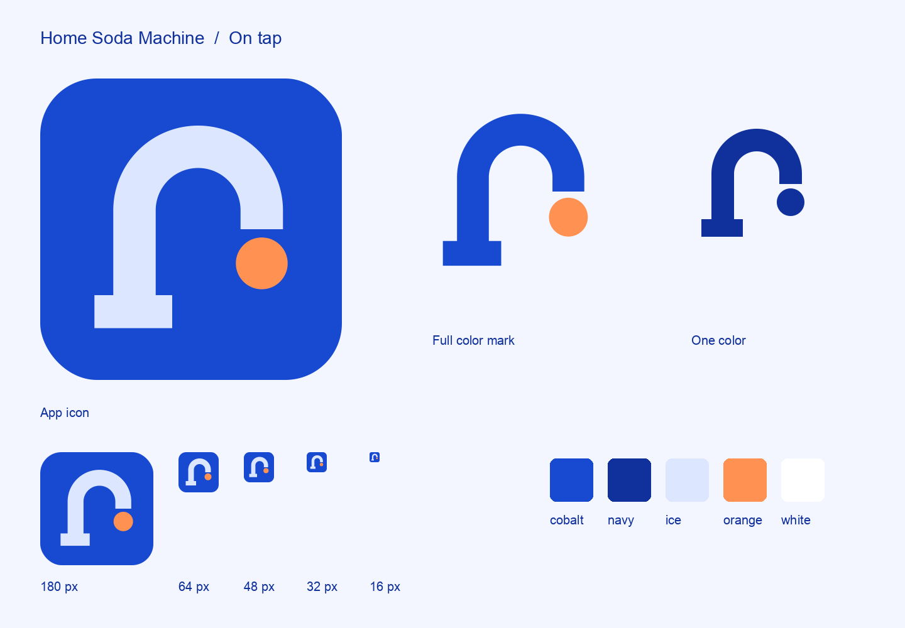

# Home Soda Machine identity

The mark is a pale-blue faucet with a semicircular gooseneck, a rectangular foot,
a square-cut outlet and a circular orange drop. The app icon places it on cobalt.



## Source and palette

[`mark.svg`](mark.svg) is the master geometry, in a 1024 × 1024 viewBox.
[`palette.json`](palette.json) holds the Big Blue colors.
[`wordmark-lettering.svg`](wordmark-lettering.svg) holds the outlined lettering.

| Color | Value | Use |
| --- | --- | --- |
| Cobalt | `#1749D1` | App icon and primary surfaces |
| Navy | `#10319C` | Text and recessed surfaces |
| Ice | `#DCE6FF` | Faucet and foreground on cobalt |
| Orange | `#FF9152` | Drop and primary action |
| White | `#FFFFFF` | Light surfaces and reverse artwork |

## Artwork

Production exports live in [`web/public/brand`](../web/public/brand/).

| File | Treatment |
| --- | --- |
| [`mark.svg`](../web/public/brand/mark.svg) | Transparent ice-blue faucet and orange drop |
| [`mark-blue.svg`](../web/public/brand/mark-blue.svg) | Cobalt faucet and orange drop for light surfaces |
| [`mark-mono.svg`](../web/public/brand/mark-mono.svg) | One color, inherited through SVG `currentColor` |
| [`mark-white.svg`](../web/public/brand/mark-white.svg) | White mark for dark surfaces |
| [`icon.svg`](../web/public/brand/icon.svg) | Rounded cobalt app icon |
| [`icon-square.svg`](../web/public/brand/icon-square.svg) | Full-bleed square icon for platform masks |
| [`wordmark.svg`](../web/public/brand/wordmark.svg) | Horizontal mark and two-line name |
| [`wordmark-stacked.svg`](../web/public/brand/wordmark-stacked.svg) | Centered mark above the name |
| [`wordmark-reverse.svg`](../web/public/brand/wordmark-reverse.svg) | Light horizontal wordmark for cobalt surfaces |

The wordmarks have outlined lettering and require no installed fonts. PNG exports
of the icon and the two color marks are 1024 px. The SVGs carry an accessible name.
The complete mark includes the foot and drop; the 1024 px canvas carries its spacing.

## Regeneration

```sh
tools/cad-venv/bin/python tools/build_brand_assets.py
tools/cad-venv/bin/python tools/gen_animation_frames.py
```

The asset generator writes iOS app and launch icons, iOS launch background,
Android launch and adaptive-icon vectors, Android launch background, PWA icons,
favicons, web artwork and the PCB's flattened source contour. Add `--preview`
on macOS to render the reference sheet above.

The iOS app icon is opaque and square; its operating system supplies the corner
mask. The launch image has transparency. Android's launcher and splash vectors
place the complete mark inside their circular safe areas. The PWA maskable icon
preserves the mark inside the central 80-percent-diameter safe circle.

The machine display's 16-frame, 360 × 360 RGB565 animation uses this geometry
on cobalt. Its orange circle gently falls over 1.6 seconds; the next bead grows
under the outlet as the falling one diminishes. The first frame is the static
mark. [Motion options](../web/public/brand/motion.html) compares the prepared
falling drop with Pulse and Float, using the display's exact frames and timing.
[`make_art.py`](../tools/make_art.py) packages those
frames into the machine display's art partition during firmware publishing.

[`logo.ts`](../hardware/pcb/pcba/logo.ts) renders the source silhouette in one-color
silkscreen strokes. Firmware and customer-assigned flavor portraits have their own
image pipeline, documented in [`firmware/README.md`](../firmware/README.md).
