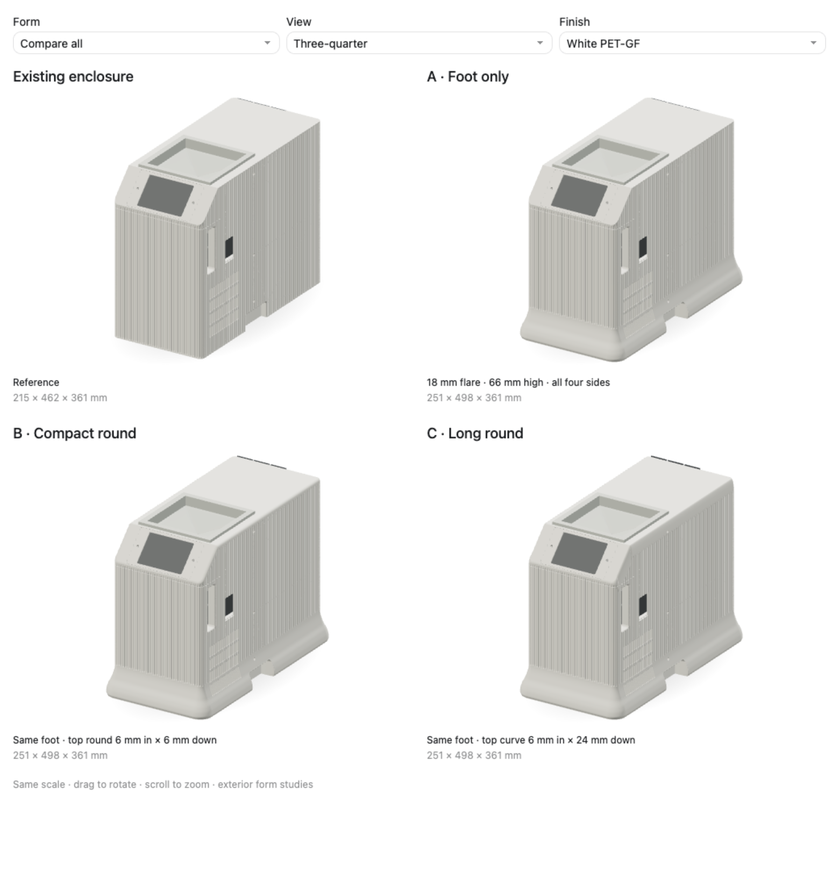

# Enclosure fascia studies

The existing enclosure and three treatments of its bottom and top edges. The display, funnel,
pump cartridge and rear fittings retain their assembly coordinates.

| Form | Shape |
| --- | --- |
| Existing enclosure | The source shell with zero displacement. |
| A · Foot only | A continuous flared foot projects up to 18 mm around all four sides, over the bottom 66 mm. Above the foot, the source shell is unchanged. |
| B · Compact round | The same foot and a 6 mm inward round on the actual roof edges. |
| C · Long round | The same foot and a top curve extending 6 mm inward and 24 mm down the side and rear walls. |



[Front foot](renders/bases.png) · [Rear foot](renders/rear-base.png) ·
[Front top edges](renders/top-front.png) · [Rear top edges](renders/top-rear.png)

The foot runs from Z −6 to Z 60, with its maximum projection at Z 0. Its profile is identical
at the front, rear and sides. Smooth interpolation joins the toe and cove to the original wall.

The top curves remove the sharp roof/wall arrises by mapping both incident faces onto a common
curve. Their XY displacement points inward everywhere. The side treatment follows the sloping
display roof. At its 135-degree meeting with the front wall, the tangent run contracts and the
curve stays compact around the display bezel. Both upper treatments use a 6 mm circular blend
across the roof/display ridge. Its roof tangency is at Y 69.357 mm; the funnel brim starts at
Y 70 mm, and its landing remains flat.

The fluted walls follow the source perimeter: 260 grooves, 5.1285 mm pitch, 4 mm width and
1.2 mm depth. Surface shading represents those grooves. They fade before the smooth foot and
top curves; A keeps the original wall treatment above the foot.

`fascia.template.html` contains the profiles, edge mappings, flute shading, lighting and
rotatable comparison. `models.b64` contains compressed meshes from the current enclosure STEP
files and assembly payload. `sources.json` identifies those source files by digest.

The foot displacement fades to zero within 2.6 mm of the nominal perimeter. The viewing meshes
contain exterior faces and opening rims; simplified hardware fills the visible cavities.
Shared triangle edges subdivide together before the skin is shaped, with finer subdivision
around the top curves. The comparison includes front, side, rear, overhead and edge-detail
views, white and black finishes, and measured shell envelopes at one common scale.

This is appearance geometry. Wall sections, joints, cartridge motion, printer envelopes and
support removal remain unqualified. The longer rear curve also needs the fitting landings
resolved in the printable construction. The production parts retain their existing geometry.

Build the comparison with the project's CadQuery environment:

```sh
tools/cad-venv/bin/python future/enclosure-fascia-studies/build_studies.py /absolute/output/directory
```

Compose the saved meshes after editing the form profiles or presentation:

```sh
tools/cad-venv/bin/python future/enclosure-fascia-studies/build_studies.py --compose /absolute/output/directory
```

The output is `enclosure-fascia.html`, an inline visualization fragment.

`browser-checks.json` records the rendered envelopes, browser errors and narrow-screen layout.
`interaction-checks.json` records synchronized rotation and zoom across the comparison.
`geometry-checks.json` records the equal four-sided flare, unchanged A geometry above the foot,
inward-only upper displacement, fixed hardware meshes and unchanged funnel landing.
