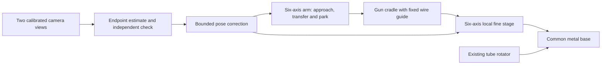

# Open robot arms and a custom welding positioner

Research checked **2026-10-04**. The proposed build is a compact, six-axis arm with
standard steppers, printed transmission parts, purchased bearings and short metal
load paths. Budget **$900–$1,300 for arm materials**. Measure the actual gun
endpoints with two calibrated close-up views and correct the pose from those
measurements. A bench-supported six-axis fine stage is the leading fallback for
holding precision at one weld orientation neighborhood; it brings the complete
concept materials budget to approximately **$3,000–$4,200**, including optics and
an independent-reference allowance. That dock supplies local, provisionally
±0.5° fine motion; broad-angle 10 µm positioning remains to be established.

**None of the six open arms below has demonstrated our loaded 0.010 mm
requirement or 0.005 mm design target.** This proposal identifies a build and a
qualification path; it does not establish that an unbuilt arm, camera system or
fine stage already achieves either number.

## Application requirements

The Rebot and Camera sessions establish the following brief. Their transcripts
are working context, not repository artifacts.

| Requirement | Consequence for the design |
|---|---|
| 0.010 mm positioning requirement at the work; 0.005 mm design target | Evaluate actual endpoints relative to the seam under load, including reversal, return, settling and held drift. A motor command or pixel count cannot certify the result. |
| Hours or days of autonomous dry-run iteration | Software must move, observe, correct, compare against independent checks, and recover from departures and camera retraction. Record failures as well as successful trials. |
| Observe the aiming dot **and actual protruding wire endpoint** | The wire-guide exit is not the endpoint. The fixed gun/guide assembly must be geometrically calibrated. No separately motorized wire guide is in the baseline. |
| Three gun rotations about a software-defined point at the dot | Six independent pose coordinates and tool-center kinematics are required. Desired grip-axis, hole-axis and vertical-yaw rotations need not coincide with individual robot joints. |
| Existing rotator supplies weld travel | The arm positions, adjusts, holds and parks the gun; it need not trace the circumference itself. The rotator angle belongs in synchronized experiment records. |
| Gun, feed and about four feet of umbilical: reported measurement **1.3118 kg** | Add the shell, flange and coupler. A provisional **0.250 kg** allowance makes **1.5618 kg**, before any carried fine stage. The allowance is unmeasured. |
| Edge mounting and loading clearance on the existing 48 × 24 inch benches | Plan joint and cable swept envelopes, gun parking and retracting optics together. Robot, rotator and measurement references need a common stiff subframe. |
| Later weld process must survive **180 psi for 30 minutes** | Motion qualification earns a welding trial. Positioning precision alone does not qualify a pressure-vessel weld. |

The recorded X1 gun proxy is 253 × 143 × 34 mm. Equipment context records
minimum active/stored fiber bend radii of 350/240 mm and no twisting. These
constrain routing rather than define arm reach. Relevant current hardware
context is [gun positioning](../../hardware/assembly/weld-position.md) and the
[physical-evidence index](../../hardware/mechanical-qualification/README.md).
There is no accepted physical record for this proposed arm or fine stage.

## Six open designs

These are six open arm projects with actual reusable-source license files,
including OS-ARM's unfinished design. Project costs have
different scopes; they are not a ranked set of current shopping carts.

| Arm | Axes and source | Published capacity / size | Performance and cost evidence | Fit for this application |
|---|---|---|---|---|
| **[reBot B601-RS](https://github.com/Seeed-Projects/reBot-DevArm)** | 6 arm axes; assembly/part STEP; CERN-OHL-W-2.0 hardware, Apache-2.0 software | 2.5 kg rated; 587.5 mm radius without stock gripper, 754.7 mm with it | Manufacturer reports ±0.1 mm returns. Six actuator manufacturer reference prices total $1,046.97; reproduction machining and wiring are additional. | Strongest complete baseline and control donor; precision and continuous cable-moment capacity remain unresolved. |
| **[Thor](https://github.com/AngelLM/Thor)** | 6; native FreeCAD, STEP/STL; CC-BY-SA-4.0 CAD | 0.75 kg including tool; 625 mm stretched **height** | Project claims hardware below €350, undated. No qualified TCP repeatability found. | Good low-cost wrist and printing ideas; stock payload is below our gun alone. |
| **[BCN3D Moveo](https://github.com/BCN3D/BCN3D-Moveo)** | **5**; SolidWorks/STL; MIT mechanics, bundled Marlin under GPL | Primary load/reach qualification not located | Unpriced mechanical/electronics BOM; no demonstrated micron result | Useful bearing/shaft/belt donor; requires a sixth axis, sensing and load redesign. |
| **[Faze4](https://github.com/Source-Robotics/Faze4-Robotic-arm)** | 6; STLs, cycloidal STEP, assembly/control files; root hardware license CERN-OHL-S-2.0 | 14–15 kg arm; about 581 mm shoulder-to-wrist geometric radius inferred from its model | Docs estimate $1,000–$1,500; README says under $1,000. Unpriced BOM; no numeric payload or instrumented repeatability found. | Best detailed printed-cycloidal donor; heavy, complex build with unobserved joint outputs. |
| **[OpenArm 2.0](https://github.com/enactic/openarm_hardware)** | 7; released STEP/BOM/wiring; CERN-OHL-S-2.0 hardware, Apache-2.0 software | 4.1 kg nominal defined as a **one-minute** full-extension hold; 606 mm shoulder-to-stock-gripper envelope | Repeatability documentation pending. $6,500 is a complete **bimanual system** claim; published BOM is unpriced. | Best telemetry/calibration architecture donor; custom metal and compliant actuators are a weak materials-budget match. |
| **[OS-ARM](https://github.com/DDeGonge/OS-ARM)** | 6; Inventor/STEP/STL, encoder/control files; MIT | Work in progress: goals of 500 mm reach and about 1 kg payload | Goal below $500. Creator reports 10 Nm and below $20 for its printed strain-wave **gearbox**, not a whole joint or tested arm. | Relevant harmonic-drive geometry; capacity, precision, lifetime and completed-arm evidence are insufficient. |

### reBot: the best complete comparison arm

The current [license](https://github.com/Seeed-Projects/reBot-DevArm/blob/main/LICENSE)
and [hardware release](https://github.com/Seeed-Projects/reBot-DevArm/tree/main/hardware/reBot_B601_RS)
permit adaptation. STEP solids are available; native parametric histories are
not supplied. Its structure mixes CNC aluminum, printed parts and integrated
actuators. The source snapshot checked is
`c247ea9cb0da29cd52c31953659cc8c47e6d1a6e`.

**Pros:** sufficient nominal mass capacity, six-axis pose control, documented
Python/CAN/ROS/kinematics and temperature/fault feedback. Borrow its modular
link/interface organization, URDF/dynamics structure and experiment telemetry.
[Control documentation](https://wiki.seeedstudio.com/rebot_arm_b601_rs_mit_control/),
[kinematics documentation](https://wiki.seeedstudio.com/rebot_arm_b601_rs_pinocchio_meshcat/).

**Cons:** the [manufacturer return test](https://www.seeedstudio.com/blog/2026/09/09/rebot-arm-b601-rs-performance-durability-tests-payload-repeatability-teleoperation-and-gravity-compensation-2/)
reports ±0.1 mm, ten times the requirement. It does not publish a full uncertainty
budget, loaded six-dimensional pose dataset or hours-long hold drift. The
Pinocchio guide limits example operation to 70% of reach and warns that prolonged
operation outside that workspace can trigger J2 stall protection and a drop.
The full geometric radius is therefore not a demonstrated continuous holding
envelope. The 5 kg demonstration is an overload, not its rating. The inexpensive
reproduction BOM explicitly differs from shipping hardware; retail performance cannot be
assigned to a more heavily printed copy. RS06/RS00 rated torques are 11/5 Nm;
their peaks are unsuitable for sizing prolonged holds. The actuator table lists
two magnetic encoders and 14-bit single-turn resolution; it does not separately
characterize each sensor's accuracy. This does not establish micron accuracy,
and power-off damping is not a holding brake. Verify output/rotor field semantics in the
[RS06 manual](https://files.seeedstudio.com/products/RobStride/Product%20Literature/RS06/RS06User%20Manual251112.pdf).

Manufacturer references of [$210 RS06](https://www.seeedstudio.com/Robostride-06-Actuator-p-6668.html)
and [$138.99 RS00](https://www.seeedstudio.com/Robostride-00-Actuator-p-6664.html)
give $1,046.97 for three of each. These are cost context, not proposed purchases.
The release BOM's priced rows total about $1,466.98 including a gripper actuator,
some tools, clamps and power items, while omitting unpriced machining, filament,
most screws, harness work and separately priced CNY nuts. Its July $1,499
assembled-kit figure is a dated vendor reference excluding the PSU, not a complete
current materials quote.

### Thor: borrow its light wrist, reinforce its load path

**Pros:** [editable FreeCAD source and license](https://github.com/AngelLM/Thor),
commodity motors, serviceable printed parts and a two-motor differential wrist
that reduces distal motor mass. The creator documents gearing and belt routing
in the [mechanism description](https://hackaday.io/project/12989-thor/details).

**Cons:** our reported gun mass alone is 1.75 times its stated 0.75 kg limit.
Stock motion is step-count control with homing, and the wrist includes a printed
bearing. Its [8–10 hour operating notes](https://hackaday.io/project/12989/logs?sort=oldest)
support cooling/maintenance lessons, not loaded repeatability, creep or lifetime.
The [original component list](https://hackaday.io/project/12989/components)
contains seven NEMA17s driving six arm axes; its wrist uses two motors for two
degrees of freedom.

Adapt the remote-drive/differential concept with purchased output bearings,
metal compression paths and output sensing. Scaling the STL uniformly is not
a capacity calculation.

### Moveo: useful inexpensive mechanical construction

**Pros:** complete mechanical files, an [assembly manual](https://github.com/BCN3D/BCN3D-Moveo/blob/master/USER%20MANUAL/User%20Manual%20BCN3D%20Moveo.pdf)
and ordinary shaft/bearing/belt construction. Borrow paired bearing support,
large shafts and accessible side plates. Its
[BOM](https://github.com/BCN3D/BCN3D-Moveo/blob/master/BOM/BCN3D%20Moveo%20BOM.pdf)
uses inexpensive printer-class controls and paired shoulder motors.

**Cons:** the manual explicitly specifies five axes. Six steppers, including
two driving one joint, do not provide general six-coordinate gun pose. No output
encoders or primary qualified payload/repeatability figures were located.
The printed/hobby wrist and legacy printer firmware require our own structure,
sixth axis and robot control. Mechanical MIT terms and bundled
[Marlin GPL headers](https://github.com/BCN3D/BCN3D-Moveo/blob/master/FIRMWARE/Marlin_BCN3D_Moveo/Marlin_main.cpp)
both matter when adapting files.

### Faze4: borrow reducer internals, avoid copying unnecessary mass

**Pros:** paired cycloidal discs, rolling pin contacts, offset belts, hollow
routing and a spherical wrist are described in its
[design decisions](https://faze4-robotic-arm-docs.readthedocs.io/en/latest/B_Design_decisions.html).
J1–J5 use printed cycloidal reduction; J6 uses a purchased planetary gearbox.
Print replaceable discs/housings and buy the pins, shafts and bearings.

**Cons:** the [2023 mechanical BOM](https://github.com/Source-Robotics/Faze4-Robotic-arm/blob/master/BOM_7_11_2023.xlsx)
counts 764 purchased and 197 printed parts, including 200 small bearings. It is
unpriced and omits the complete controller/driver/PSU cost. Most motors ride on
their joints, making moving mass significant. Its
[about page](https://faze4-robotic-arm-docs.readthedocs.io/en/latest/About_faze4.html)
provides estimates, not load or metrology qualification. The roughly 581 mm
radius comes from `320 + sqrt(73.5² + 250.7²)` in the
[source kinematic model](https://github.com/Source-Robotics/Faze4-Robotic-arm/blob/master/Faze4_Work_Envelope.m);
it is not a rated working reach. Stock sensing is homing/step counts.

Use the actual [CERN-OHL-S license](https://github.com/Source-Robotics/Faze4-Robotic-arm/blob/master/LICENSE),
not its conflicting README MIT badge; retain file-specific software notices.
The custom reducer needs independently supported structural output bearings.

### OpenArm: borrow its observability and calibration system

**Pros:** seven axes, substantial stated mass capacity, CAN integration,
simulation/data collection and temperature/torque/fault records. Released CAD
and BOM are linked through the
[hardware source index](https://github.com/enactic/openarm_hardware/blob/main/dev/google-drive-files/file-ids.tsv).
The [OpenArm Cell](https://docs.openarm.dev/hardware/openarm-cell/general/)
integrates fixed lighting, camera geometry and a physical calibration fixture.
These are useful patterns for repeatable software experiments.

**Cons:** the [payload definition](https://docs.openarm.dev/hardware/openarm-2.0/general/)
is a timed demonstration, not hours/days duty with our umbilical. Its
[motor documentation](https://docs.openarm.dev/hardware/openarm-2.0/motor/)
lists 3 Nm-rated wrist actuators, compared with our illustrative 4.53 Nm wrist
scenario. Backdrivability/compliance is intentional; it is not a micron hold
claim. Dual 14-bit encoders need protocol verification to expose separate output
measurements. The [FAQ](https://docs.openarm.dev/faq/) does not yet provide a
repeatability specification. The full bimanual price cannot be halved into a
one-arm raw-materials estimate.

### OS-ARM: the harmonic-drive experiment to adapt

**Pros:** MIT source includes a 75 mm flat strain-wave mechanism with a rigid
output gear separate from the flexible cup. That separation is a useful basis
for buying structural output bearings and testing replaceable printed cups.
[Repository](https://github.com/DDeGonge/OS-ARM),
[creator's reducer demonstration](https://www.youtube.com/watch?v=Emvo3bLT-Z4).

**Cons:** its approximately 1 kg arm goal is below our tool package. The 10 Nm /
under-$20 report is for a gearbox with its motor priced separately, not a priced
complete robot actuator or arm. It provides no recovered quantified life,
lost-motion or micron metrology dataset. It is a promising source experiment
with incomplete build documentation, not a rated replacement for a 19 Nm shoulder.

AR4 is a useful complete-arm comparator, but its
[current custom license](https://github.com/Annin-Robotics/ar4-hmi/blob/main/LICENSE.txt)
restricts design redistribution and commercial derivatives; it is excluded from
this reusable-source shortlist. PAROL6 publishes STLs and GPL software, while
its [assembly manual](https://github.com/Source-Robotics/PAROL6-Desktop-robot-arm/blob/main/Building%20instructions/Parol%20building%20instructions.pdf)
excludes editable STEP and the control board from openness. Its payload is also
below our package. Record upstream notices and required source obligations when
actual adaptations enter this public repository.

## Proposed custom arm

Build an actual **6R arm**: base yaw, shoulder pitch, elbow pitch and a
roll/pitch/roll wrist. Start with two approximately 180 mm links and a 40 mm
wrist, giving a provisional 400 mm shoulder-to-flange span. Position the base
near the existing rotator instead of purchasing reach that multiplies deflection
and cable moment. Final joint limits and reach come from gun, camera, tube and
cable clearance in CAD; 400 mm is a concept dimension. Map the desired
dot-centered angle sweeps through IK and the full physical envelope before
fixing link lengths. A roll/pitch/roll wrist is singular at middle-pitch 0°/180°;
avoid those poses in the intended experiment domain. Six axes alone do not
establish accessible, observable, collision-free coverage.

Use three 2.4 Nm-class NEMA23s on the major axes and three 0.59 Nm-class NEMA17s
for the wrist. Relocate heavy motors proximally where the belt/differential
routing permits. Use approximately 25:1 two-stage synchronous-belt reduction
as the first drive candidate, with purchased small pinions and printed large
pulleys. Purchase steel shafts, opposed/preloaded output bearings and metal
clamp hubs. Separate belt tension from bearing preload. Actual belt pitch,
width, tooth count, tension, wrap and ratings must follow the selected belt's
manufacturer guidance; [Gates' design manual](https://assets.gates.com/content/dam/gates/home/knowledge-center/resource-library/catalogs/powergripdrivedesignmanual_17195_2014.pdf)
explains why tooth deflection and elongation remain despite synchronous drive.

Print housings, pulleys, guards, assembly locators and the serviceable gun shell.
Use cut/drilled metal side plates and short backbones for bending and preload
paths, through-bolts for structural interfaces, and purchased bearings instead
of printed races. Design preload from actual loads and thermal behavior;
[NSK's guidance](https://www.nsk.com/am-en/tools-resources/knowledge-center/bearing-abcs/preload/)
explains stiffness/heat tradeoffs. Counterbalance gravity axes and provide
positive retention on power loss. Neither a stepper's holding torque nor servo
damping supplies that retention.

The cable boom supports heavy umbilical weight independently. The wire liner
approaches tangentially over a long, straight path from the opposite table edge
and has sliding/swiveling support. Bring the gun's center of gravity toward its
mount, while retaining access to the existing guide. The common rotator/robot/
reference subframe must bypass flexible table spans where possible; a bench
weight rating is not a micron-rigidity specification.

### Size from moments, not just kilograms

[Reproducible calculations](calculate.py) and [generated results](calculations.json)
use a **100 mm unmeasured tool-CG offset**, estimated upper/forearm/wrist masses
of 1.80/1.65/0.60 kg and an **unmeasured 3 Nm cable-moment scenario**. With all
links horizontal, approximate static demands are:

| Configuration | Shoulder | Elbow | Wrist pitch |
|---|---:|---:|---:|
| Arm with 1.5618 kg planned tool | 18.97 Nm | 10.65 Nm | 4.53 Nm |
| Add hypothetical lightweight 1.5 kg carried trim, CG 40 mm beyond flange | 25.45 Nm | 14.48 Nm | 5.12 Nm |
| Add hypothetical lightweight 2.5 kg carried trim, same CG assumption | 29.77 Nm | 17.03 Nm | 5.51 Nm |
| Add hypothetical 3.5 kg carried trim, same CG assumption | 34.08 Nm | 19.58 Nm | 5.91 Nm |

The budgeted [NEMA17 motor](https://www.omc-stepperonline.com/nema-17-bipolar-59ncm-84oz-in-2a-42x48mm-4-wires-w-1m-cable-connector-17hs19-2004s1)
is about 390 g. The 1.65 kg forearm allowance includes three such wrist motors;
the 0.60 kg wrist assumes those motors are routed proximally. The upper-arm
allowance accommodates an elbow drive and structure. All masses and midpoint
centers of gravity are provisional. Six fine-stage motors alone total 2.34 kg:
the 1.5/2.5 kg carried examples require a separate lighter-motor design. The
3.5 kg example is an unmeasured carried-stage scenario, not the bench stage's
weighed mass.

This omits acceleration, shock and detailed link/component mass distribution.
It explains the short arm and off-arm fine-stage motors. As an initial sizing
screen, 2.4 Nm × 25 × assumed 85% efficiency × an arbitrary 50% motor derating
gives 25.5 Nm; the wrist equivalent is 6.27 Nm. These are **not continuous output
ratings**. Obtain actual motor/current/speed/temperature behavior and design the
counterbalance before accepting the loaded joint. The assumed 250 g shell/
coupler and link masses must be replaced by actual design masses.

### Belts, cycloidal or printed harmonic drives?

| Candidate | Why consider it | What decides its use |
|---|---|---|
| Two-stage belt | Few custom precision contact surfaces, easy adjustment/service, inexpensive prints and replaceable commodity belts | Package size, loaded bidirectional return, tension-dependent compliance and held drift. Leading first prototype. |
| Printed cycloidal | Compact large ratios; paired discs and purchased rolling pins; practical Faze4 donor | Pin/disc clearance, eccentric support, output bearing stiffness, load loss and wear. Strong alternate if belts obstruct the station. |
| Printed strain-wave/harmonic | Compact coaxial form and many teeth sharing load; OS-ARM supplies openly licensed source | Flexspline fatigue/creep, loaded hysteresis, efficiency, heat and hold drift. Build one cartridge alongside the first joint; do not commit all six joints before its result. |

[James Bruton's MIT drive source](https://github.com/XRobots/CycloidalDrive)
provides additional cycloidal/strain-wave geometry. A project
[printed-drive comparison](https://howtomechatronics.com/how-it-works/harmonic-vs-cycloidal-drive-designing-3d-printing-testing/)
reports loaded movement and damage in particular printed specimens; it is a
warning to test the proposed geometry/material, not proof that all printed
reducers fail. Commercial
[Harmonic Drive documentation](https://www.harmonicdrive.net/_hd/content/documents/reducer_catalog.pdf)
separately treats torsional stiffness and hysteresis: nominal zero backlash
does not mean zero loaded deflection.

Allow **$30–$60 for a printed harmonic cartridge trial** or **$45–$100 for a
cycloidal trial**, excluding its shared motor, structural output bearing and
sensor. These are development allowances, not qualified joint quotations. Count
the belt/intermediate parts displaced to calculate a saving. Filament-only
gearbox prices hide the rest of a robot joint. Enlarge/select the flexspline from
actual load and deformation calculations; copying the 10 Nm OS-ARM example
does not clear the shoulder scenario.

## Precision and observability

At a 400 mm lever, a single joint consuming the whole 10 µm budget may rotate
only **0.001432° (5.16 arcseconds)**; for 5 µm it is 2.58 arcseconds. A direct
output encoder's ideal single-count endpoint intervals are 153.4 µm at 14 bits,
38.35 µm at 16, 9.59 µm at 18 and 2.40 µm at 20. Multiple joint errors combine;
bit count also excludes accuracy, eccentricity, thermal drift and bearing tilt.
[AS5048A manufacturer's specifications](https://www.infineon.com/part/AS5048A)
illustrate the distinction between 14-bit resolution and angular accuracy.

Put an encoder **after each reduction** for actual joint-state records, reversal
and stall detection. Budgeted AS5048A modules provide economical coarse
observability. They do not supply the micron reference. At 25:1, a 1.8° motor
full-step nominally moves a 400 mm lever 503 µm; 1/16 microstepping gives 31.4 µm.
Finer electrical commands do not establish smaller accurate loaded increments.
[Microchip's stepper-control note](https://ww1.microchip.com/downloads/en/AppNotes/AN1307-Stepper-Motor-Control-with-dsPIC-DSCs-DS00001307B.pdf).

Two FoMaKo K20UH views with Raynox DCR-250 close-up lenses are the camera
baseline recovered from the Camera session. Nominal 109 mm working distance
and an estimated 7.6 mm field across 3840 pixels imply about **2 µm/pixel**.
DCR-150 gives nominal 210 mm working distance and roughly 3.3 µm/pixel at the
same camera assumptions. These are sampling estimates, not system accuracy.
[Raynox working-distance information](https://raynox.co.jp/english/video/pdf/Panasonic_SDR_S200_S150.pdf),
[FoMaKo product documentation](https://fomako.net/product/K20UH-4K-PTZ-Camera.html).

Fix and log zoom, focus, exposure, iris and gain; disable automatic tracking and
automatic optical-setting changes. The
[FoMaKo manual](https://www.fomako.net/uploads/20250529/ce40713967c8ae0e137cabdd8a72ff1d.pdf)
documents VISCA controls/readback and the USB 4K mode's dependence on HDMI
4K configuration. Verify actual native-resolution frames rather than assuming
network previews retain the sampling. Mount lens and camera on one rigid,
separately supported carriage; do not assume the camera has a suitable filter
thread. Retract for loading, recover using fixture references and validate
again. A printed tag is a recovery aid, not a 5 µm ground truth.

Together, the views must see dot, actual wire tip, seam and rigid gun references.
A dot on a surface alone does not reveal standoff along the beam. Calibrate
distortion and tool/guide geometry; solve pose near the work and report
confidence/occlusion. Keep held-out reference motions/images and an independent
displacement reference to detect centroid bias, depth ambiguity, changing
wire protrusion and software overfitting. The existing indicator's 0.0005 inch
increments are **12.7 µm**: suitable for coarse-joint screening, inadequate to
certify 5–10 µm. The caliper and scanner do not establish this reference either.
The budget reserves $250–$500 for an independent instrument/fixture; a complete
≤2 µm uncertainty budget has not been established at that price.

Use the host for FK/IK, tool-point rotations, calibration and experiment choices.
A local controller generates synchronized bounded joint trajectories, reads
output sensors and enforces limits/watchdog/retention. The open
[6-Pack controller design](https://github.com/bdring/6-Pack_CNC_Controller) is a
pulse-interface donor, not turnkey robot IK or an encoder servo. Log commanded
and measured joint positions, images, camera settings, timestamps, endpoints,
rotator angle, temperature, settling time and faults. Reject stale frames or
incomplete views. After motion and settling, estimate error, correct, then
validate against the independent check. Freeze acceptance definitions and
held-out trials while evaluating software changes.

Dry learning uses the non-welding aiming light with welding emission inhibited.
During actual welding, replaying the specific tube's dry baseline and observing
heat-induced changes with separate probes is a distinct instrumentation task.
The inexpensive protective-window ideas and contact/eddy probes from the Camera
session are not qualified live-weld micron instruments. Camera recovery and
safe retained stops belong in dry-run automation; a software success flag does
not authorize automatic welding emission.

## Supported fine stage: a path to smaller controlled increments

First try endpoint correction on the arm itself. If loaded motion has deadband
or unstable increments, add a **bench-supported six-strut screw/flexure stage**.
The arm transfers a detachable gun cradle, verifies the dock latch, disengages
and parks. The stage then reacts loads through a short metal stand to the
rotator/reference base. For retrieval, the arm captures and verifies retention
before the dock releases. Guided capture/compliance during overlap prevents two
rigid controllers fighting. Metal contacts and spring-retained latches carry
the load; sensors report capture state. Fine correction happens after each
transfer, so coupler relocation need only fall within its capture envelope.

A **fixed dock supports one gross orientation neighborhood**, provisionally
±2 mm at the tool and ±0.5° about each axis. It preserves local six-axis
experiments there, but does not supply micron positioning throughout arbitrary
arm angles. Broad sweeps use the undocked arm, whose precision remains to be
qualified. If full-angle micron trials are required, a commanded coarse
orienting dock or a carried trim module needs a separate mass/cost/design pass.
The carried-module loads above show why that is not a free extension.

The original concept has 80/55 mm base/top radii, 70 mm plate spacing and six
approximately 87.1 mm legs. Metal plates, steel screws, purchased radial/thrust
supports, paired preloaded nuts and spring-steel flexure ends carry the load.
Provide a metal keyed/roller guide against nut co-rotation and an articulated
drive fork that follows each strut's direction, with its motor offset away from
the crowded anchors. Motor mass is supported on the stationary base side;
its moving envelope and flexure reaction loads still need a package design.
Printed parts guide assembly and guard mechanisms. A 0.5 mm screw lead,
200-step motor and 4:1 belt give **0.625 µm nominal strut travel per full step**.
The model accounts for all 64 correlated half-step rounding signs and a tool
200 mm from the plate: maximum sampled endpoint rounding is **2.10 µm**.
This is first-order quantization, before screw error, stick-slip, compliance,
metrology or drift. The 5 µm target requires tighter remaining errors and/or
finer *verified* drive increments.

Sampling neutral and 64 vertices of each provisional tool-centered pose box
gives at most 6.06 mm one-sided leg stroke and 4.64° joint-direction change.
Provide at least ±7 mm provisional leg motion. Straight strut centerlines
remain at least 19.10 mm apart in these samples; this excludes screw overhang,
nut blocks, end clamps, motors, belts, cables, gun and rotator. Motor layout
needs staggered or outward positions and a full package sweep in CAD. It is
not continuous workspace or collision proof. Flexure range, buckling, stress,
fatigue and screw/nut reversal behavior are unqualified.

Use a regulated 24 V supply for the fine-stage TMC2209 carriers. Their
[manufacturer datasheet](https://www.analog.com/media/en/technical-documentation/data-sheets/TMC2209_datasheet_rev1.09.pdf)
supports STEP/DIR, UART configuration and diagnostic readback. Six individually
readable drivers require two UART buses or multiplexing because a bus has four
addresses. The controller allowance includes sockets and those interfaces.
Set and log fixed run/hold current and chopper settings during measurements;
calibrate current against actual screw friction/preload and temperature. Do not
infer usable board current from the chip's maximum, or infer static force from
sensorless stall detection. Limit the 24 V rail's transients to the carrier's
rating. This driver class saves about $96 compared with six DM542TE units,
before integration hardware.

For the planned gun plus an assumed 350 g moving plate and a resultant moment
of any direction up to 6 Nm, sampled leg loads are bounded at about 60 N before
preload. With 60–80 N deliberate preload, initially design each path for at
least 150 N, then size across the real envelope and dynamics. The 6 Nm envelope
is a provisional combined load allowance, not a measured cable rating.
The 150 N figure is a normal application-load allowance, **not blocked-screw
capacity or overload protection**. A modest motor torque can generate far more
thrust through these screws. Qualify current/force limitation and jam response,
or size the stops and complete load paths for actual blocked thrust. The budget
includes prototype overload-limiting materials; an engineered solution remains
part of the first-strut decision.

Short support alone does not close the tolerance. Assuming **10 N/µm assembled
axial stiffness per leg**, a changed 3 Nm pitch moment deflects a tool 200 mm
away about **10.85 µm**; a 0.1 Nm change gives 0.362 µm. Neither stiffness nor
residual moment is measured. At that assumed stiffness, a 2 µm between-frame
allocation permits about 0.55 Nm uncorrected moment change. Similarly, a 400 mm
aluminum length changes about 9.2 µm per °C using an illustrative 23 ppm/°C
coefficient. Cable relief, heat management and endpoint-referenced measurement
are necessary even with a fine stage.

## Materials estimate and Prime anchors

The itemized [materials file](materials.json) separates observed prices from
engineering allowances. The [calculation output](calculations.json) sums
quantities and groups without dropping drivers, bearings, controls, retention
or transfer hardware.

| Scope | Concept materials estimate, USD |
|---|---:|
| Six-axis arm, sensing, drivers, structural stock, printing, controls and retention | **$900.91–$1,301.91** |
| Supported six-axis fine stage increment, including guides, overload provisions, automatic couplers, stand and extra controls | **$599.99–$999.99** |
| Two close-up views, rigid mounts, cable support, lighting and independent-reference allowance | **$1,459–$1,849** |
| Arm plus observation | **$2,359.91–$3,150.91** |
| Arm plus supported fine stage plus observation | **$2,959.90–$4,150.90** |

Prime-qualified price anchors observed in signed-in Chrome on 2026-10-04:

| Anchor | Price and quantity role | Purpose |
|---|---|---|
| [2.4 Nm NEMA23 + DM542T](https://www.amazon.com/dp/B0CS2TBLXP) | $50 each; three | Major joint drive class; holding torque is not a continuous rating. |
| [0.59 Nm NEMA17 five-pack](https://www.amazon.com/dp/B00QEYADRQ) | $55; one for arm, second if building fine stage | Three wrist motors; unused motors plus second pack supply six bench-stage motors. |
| [DM542TE](https://www.amazon.com/dp/B0FYDCRX28) | $20.99 each; three arm | Current-limited wrist step/direction drive. |
| [TMC2209 six-pack](https://www.amazon.com/dp/B08WZFK9KT) | $29.99; one for fine stage | Low-current fine-stage drives with UART diagnostics. |
| [AS5048A module](https://www.amazon.com/dp/B0F25W4G7L) | $14.99 each; six | Coarse output-angle records; chip identity, SPI diagnostics and accuracy require verification. |
| [FoMaKo K20UH](https://www.amazon.com/dp/B0DK1BXJWY) | $449 each; two | Software-controlled close-up observation. |
| [Raynox DCR-250](https://www.amazon.com/dp/B000A1SZ2Y) | $75.50 each; two | Close-up optics, contingent on 109 mm loading/clearance design. |

Camera/lens subtotal is **$1,049**. Deduct verified existing stock when making
an actual build BOM; ownership of these close-up optics is not assumed. Prices
can change and part fit remains to be designed. All other rows are unquoted
allowances, including the homemade fine screws/nuts, controller implementation,
base structure, safe retention and independent metrology. Taxes, shipping,
labor, existing rotator/computer/welding equipment and formal calibration
service are excluded. Live-weld protective instrumentation and a motorized
coarse orienting dock are outside these totals. These figures do not constitute
a complete compatible cart or a proven ≤2 µm measurement system.

## Build sequence and decision evidence

The customer outcome is automatic reproduction and improvement of a measured
gun-to-seam relationship. Build the following in order; these are development
activities for the build, not requests to reconstruct existing observations.

1. **One major-joint module.** Use the proposed shaft, bearing span, plates,
   pulley, tensioner and output encoder. A weighed dummy load/lever reproduces
   the illustrative 19 Nm shoulder demand, including the disturbance scenario:
   about 1 kg at 306 mm supplies its 3 Nm component. Use the existing scale
   in its capacity, rigid clamping and existing indicator. Make at least 20
   bidirectional departures/returns and 49-second holds (the rotator's
   [8 mm/s nominal lap](../../hardware/assembly/weld-rotation-rig.md)), then repeat warm. Initial screening
   limits of ≤0.5 mm return spread and ≤0.1 mm hold drift are derived from a
   proposed ±2 mm fine capture range, leaving correction margin. They qualify
   the **coarse module only** and do not replace the 10 µm system requirement.
   A 1,000-cycle pilot detects early wear/drift; it is not life certification.
   Compare the belt cartridge with a printed reducer only if packaging or these
   results make that comparison useful.
2. **Optical instrument and one fine strut.** Establish fixed-setting images,
   actual wire/dot visibility, recovery after retraction and independent
   reference uncertainty. Use known reversible translations and held-out
   images rather than self-scored calibration residuals. Load a prototype
   strut through its provisional 150 N envelope; measure reversal, commanded
   5 µm changes, accumulated full-step increments, held drift and temperature.
   A 2 µm reference cannot certify an individual 0.625 µm increment. Qualify jam
   detection/force limitation against actual blocked thrust and retained stops.
   Before making six struts, complete the CAD sweep including anti-rotation
   guides, nut blocks, screw overhang, 4:1 pulleys, flexure clamps, articulating
   motor forks, cable loops and loading paths. This decides whether the
   inexpensive screw/nut/flexure architecture is usable. A reference with
   ≤2 µm assembled uncertainty is a provisional metrology goal, not the
   existing indicator's capability.
3. **Complete the arm and bounded dry loop.** Load the actual gun, routed cables
   and coupler. Record both actual endpoints and observable pose references
   after opposite-direction approaches, parks/returns, rotator laps, thermal
   soak and camera recovery. Measure optical and actuator latency; require
   successful independent checks after correction. If rigid gun motion cannot
   bring both endpoints into tolerance at a pose, record the geometric
   constraint. Add the supported fine stage when increment/deadband/hold data
   require it; confirm transfer retention independently of command history.
4. **Acceptance over the intended envelope and hours/days.** Predefine the
   worst-case displacement criterion for each actual endpoint, including
   standoff/pose observability, bidirectional repeatability and held drift.
   Require **measured maximum error plus measurement uncertainty ≤10 µm**;
   target ≤5 µm. For an established 2 µm uncertainty, observed limits become
   8 µm and 3 µm respectively. Do not let software revisions change the
   held-out acceptance definition. Separate local docked results from broad
   undocked-angle results. Any unobservable interval or unretained fault
   interrupts a successful trial. Later welding records add process settings,
   heat-induced changes and the pressure-test outcome.

The first fabrication commitment is one loaded joint and one observable fine
strut, followed by the compact arm. This avoids spending all the material on
six elaborate reducers before discovering whether their loaded motion can
support the camera-guided experiment. Extensive printing is appropriate;
purchased bearings, metal preload paths and independent endpoint evidence
remain part of the most economical credible design.
