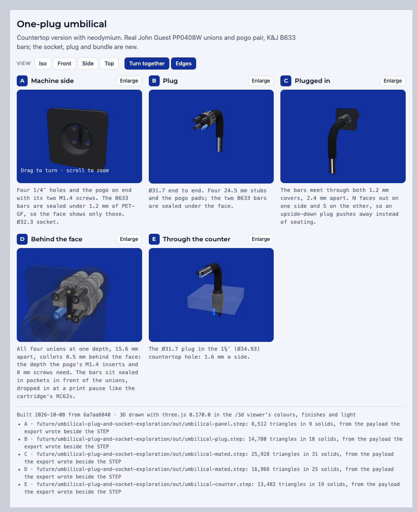

# Umbilical plug and socket exploration

One push connects the umbilical to the appliance: a plug on the umbilical's machine end carries
all four tubes and the faucet display's contacts, and a socket in the back wall receives it. This
is concept geometry. Nothing here is in the build, the BOM or the production enclosure.



[`one-plug-umbilical.html`](one-plug-umbilical.html) is the same five views to turn in 3D.

## The concept

| | |
| --- | --- |
| Plug | Ø31.74 end to end. Four 1/4″ stubs stand 24.5 mm proud of its face. |
| Countertop | The plug passes the 1-3/8″ (Ø34.93) hole the umbilical drops through ([`faucet_assembly.countertop_hole_diameter`](/hardware/faucet-layout/faucet_assembly.py)) with 1.6 mm a side. |
| Socket | Ø32.34, 15 mm deep, in a 60 mm patch of PET-GF back wall. |
| Tubes | A 15.6 mm square seen from outside: FLAVOR top left and top right, TAP bottom left, DRAIN bottom right. Face holes are the [tube collar's](/hardware/printed-parts/faucet/tube-collar/tube_collar.py) Ø6.68 bore. |
| Unions | Four John Guest [PP0408W](/hardware/reference/jg-pp0408w/) side by side at one depth, collets 8.5 mm behind the face, 0.5 mm between neighbours. |
| DRAIN | Its 4 mm tube steps up to a 1/4″ stem inside the plug ([neoFit 4 mm × 1/4″ stem reducer](https://www.freshwatersystems.com/products/neofit-acetal-black-stem-reducer-4mm-5-32-tube-x-1-4-stem)), so all four unions are the same part. |
| Pogo | The [YYFKGCP pair](/hardware/reference/yyfkgcp-pogo-4p/) stands on end between the tube columns: spring pins in the socket, pads on the plug. Each half takes two M1.4 × 4 × Ø2.3 heat-set inserts and two M1.4 × 8 socket-head screws through its ears, as on the [pump cartridge](/hardware/reference/yyfkgcp-pogo-4p/mounting-audit.md). |
| Magnets | One [K&J B633](https://www.kjmagnetics.com/b633-neodymium-block-magnet) (3/8 × 3/16 × 3/16 in, N42, magnetized through thickness) each side of each half, four per umbilical. Each is sealed at a print pause behind a continuous 1.20 mm PET-GF cover with 0.48 mm of roof air, as the cartridge's [RC62 pair](/hardware/printed-parts/enclosure/enclosure/magnet-retention/README.md) is. N faces out on one side and S on the other, so an inverted plug repels. |

## What sets the sizes

- **Plug diameter** is held under the countertop hole. That leaves no room on the face for an
  RC62: Ø19.05 with 1.5 mm webs puts the tube holes 14.37 mm out and the face at 38.4 mm or more.
- **Tube pitch** is the union's Ø15.1 collet rings side by side plus 0.5 mm.
- **Face depth.** The pogo's ear screws sit 10.22 mm from centre, between the union rings, so the
  rings start behind the screw tips: 8.5 mm of PET-GF in front of the collets.
- **Magnet size.** Each gap between a tube pair is 5.9 mm tall inside 1.5 mm webs. B633 is K&J's
  thickest 3/8 × 3/16 bar; B631 and B632 are the 1/16″ and 1/8″ ones.

The narrowest clearances in [`scene.py`](scene.py)'s own check: unions 0.5 mm apart, inserts
0.2 mm behind the pogo's ear plate, screws 1.24 mm from the unions.

## Not designed

- Releasing the collets when the plug is pulled. A push-to-connect collet holds its tube until
  the release sleeve is pressed.
- Guiding the 24.5 mm stubs into the face holes before the plug body enters the socket.
- The plug's internal routing from the four stubs to the sleeved bundle.
- How the carrier behind the face holds the unions.
- The magnets' pull through two 1.2 mm covers, 2.4 mm apart, and the covers' capacity. K&J's
  4.11 lb figure is pull to a steel plate at contact.

## Rebuild

```sh
tools/cad-venv/bin/python future/umbilical-plug-and-socket-exploration/scene.py
python3 tools/viz/build.py future/umbilical-plug-and-socket-exploration/viz-spec.json --out future/umbilical-plug-and-socket-exploration/one-plug-umbilical.html
```

`scene.py` writes four scene STEPs and their viewer payloads to `out/`, which git ignores, and
prints its clearance check. [`tools/viz/build.py`](/tools/viz/build.py) turns them into the page.
