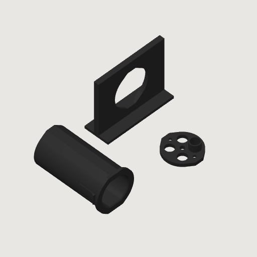
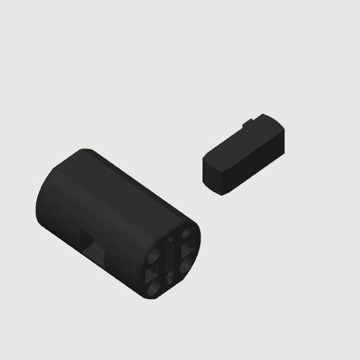

# Umbilical plug and socket exploration

One push connects the umbilical to the appliance: a plug on the umbilical's machine end carries
all four tubes and the faucet display's contacts, and a socket snapped into back-top's rear wall
receives it. The guided boot combines a packed insulated entry, gradual tube paths and a
straight mating nose. Saved prints cover the separate coupling trial.
Nothing here is in the build, the BOM or the production enclosure.

**Color layout:** the boot/plug body and tube key are entirely Fiberon PET-GF15
Blue, matching the blue socket. The enclosure receiver/wall and rear union
retainer are PET-GF Black. The machine-side color layout uses those two filaments;
the socket remains a separate part that snaps into the black wall receiver.
The scene reads the blue from the shared [filament catalog](../../hardware/printed-parts/enclosure/y-wall-of-back-top/_y_wall_dimensions.py).
Purchased hardware, tubes, cable and insulation retain their own material colors.
The coupling print projects are single-color geometry trials without the guided boot.
The [guided boot trial](guided-boot-trial/README.md) is blue; neither encodes the complete
machine-side two-color layout.

**Current assessment:** this is an exploratory mechanism, not a qualified connector.
The [engineering review](assessment/README.md) keeps the separate connections for shipping.
The [tube-protection candidate](assessment/protection.md) adds four integral Ø34 mm
open fences, with no extra part, moving mechanism or wet joint. Rounded wings leave
0.519 mm nominal clearance ahead of the tubes against a broad flat surface, while
narrow corners can enter the gaps. The proposed socket is 2.4 mm wider; the complete
rigid approach envelope is 126.3 mm before braid or hand clearance. This candidate
is CAD only and is not in the saved print projects.
The [coupling tactile trial](tactile-trial/README.md) and
[guided boot trial](guided-boot-trial/README.md) assess their stated plastic-fit and bundle
questions; both have filled magnet pockets, no guard and no pauses. Missing magnets
or a 4 mm union need not be purchased for those limited questions. The original
functional print projects below remain provisional: magnet fit, complete seating,
tube-end protection, bundle transition and retention require correction or evidence.


[`one-plug-umbilical.html`](one-plug-umbilical.html) includes the assembly, boot cutaway
and three guarded-candidate panels to turn in 3D, with both saved print plates.

## Machine side

The dimensions below describe the saved unguarded coupling. The open-guard candidate
has a matching wider socket/receiver and is documented in the
[protection review](assessment/protection.md).

**The socket sits flush in back-top.** Its [47.0](UMB_FACE_W) × [44.6](UMB_FACE_H) mm face fills
a stepped hole: the face's own section for [3](UMB_FLANGE_T) mm, then the body's, so a
[2.5](UMB_LEDGE) mm ledge each side takes the push. Two snap leaves, one each side, ramp through
the hole and catch the wall's inner face by [1.45](UMB_HOOK_OVERLAP) mm. The hole is all back-top
needs: its roofs close on the same 36-degree planes as its other horizontal holes, and it has no
pause. Behind the wall the socket and its retainer reach [81](UMB_SOCKET_DEPTH) mm into the
machine.

**The cup is [34](UMB_CUP_DEPTH) mm deep** with [0.25](UMB_CUP_CLR) mm a side around the plug, so
the plug is [7.7](UMB_CUP_LEAD) mm in and running straight before a stub reaches its hole.

**The floor** carries three Ø[6.6](UMB_HOLE_Q) holes for the 1/4″ tubes and a Ø[4.3](UMB_HOLE_D)
hole for DRAIN's 4 mm tube on a [16.15](UMB_PITCH) mm square, the
[YYFKGCP pogo](/hardware/reference/yyfkgcp-pogo-4p/mounting-audit.md) spring-pin half on end
between the columns with its two M1.4 inserts and screws, and a
[K&J SB443-IN](https://www.kjmagnetics.com/sb443-in-neodymium-stepped-block-magnet) bar each side,
[9.0](UMB_MAG_X) mm out, pole face flush and bare, its grooves on printed rails. Each bar keeps
[1.5](UMB_WEB) mm of PET-GF to the tube holes. The pogo halves stand
[0.246](UMB_POGO_GAP) mm apart when the faces meet, as on the pump cartridge.

**The unions float.** Three John Guest [PP0408W](/hardware/reference/jg-pp0408w/) and a neoFit
[AUC44M](https://www.freshwatersystems.com/products/neofit-acetal-black-union-connector-4mm-5-32-tube-x-4mm-5-32-tube)
for DRAIN slide in from the back, [1.05](UMB_CLR_UNION) mm apart, and a retainer screwed over them
(two M3 × 8 into RX-M3x5.7 inserts) stops them [0.5](UMB_NOSE_AIR) mm behind the floor's back face.
Pushing the plug in drives them against the retainer. Pulling it drags each union forward until
its collet sleeve lands on that face, [9.8](UMB_RELEASE) mm behind the floor; the face holds the
sleeve while the body keeps coming, which opens the collet, and the stub slides out. Each union
has [1.83](UMB_FLOAT) mm of travel for it. That is the pump cartridge's fixed release plate
([`internal-plumbing.md`](/hardware/assembly/internal-plumbing.md) §4), turned to face the plug.
Pressure and bundle loads must be carried through the plug, unions, retainer and snapped-in
socket. Stable union position and installed retention under those loads are unestablished.
Shutdown and depressurization are required before unplugging.

**The plug goes in one way up.** DRAIN's own 4 mm union is the key: a 1/4″ stub cannot enter its
Ø4.3 hole. The bars' polarity and the pogo's own magnets agree with it.

## Plug side

**The blue boot is [98](UMB_PLUG_L) mm long:** a 15 mm fabric cuff, a 45 mm curved tube
transition and a 38 mm straight nose. Its simple round rear body is Ø[34](UMB_BOOT_D) mm.
The nose uses the mating profile, Ø[32.44](UMB_PLUG_D) across its round sides and
[30.00](UMB_PLUG_H) mm between flats. The largest rigid section has
[0.46](UMB_COUNTER_SIDE) mm nominal radial clearance through the existing 1-3/8″ counter hole.

**The shoulder marks the seated depth.** A 4 mm chamfer joins the round rear body to the
nose profile at 34.3 mm behind the mating face. At the face stop, the cup encloses 34 mm
of nose and 64 mm of boot remains outside. The shoulder sits 0.3 mm clear of the socket's
mouth; the mating faces define the insertion stop. The extra length provides the tube
transition without enlarging the port or counter hole.

**The tubes are the umbilical's own.** Each enters at the packed bundle positions, follows
a smooth guide and becomes parallel at the straight nose. The quintic paths have zero
lateral slope and curvature at both ends. The round channels taper from Ø6.85/4.50 mm to
Ø6.65/4.20 mm, then keep the final positions through the 38 mm nose, with a 12 mm opening
for the tube key. The final diameters match the
[accepted organizer L](../../hardware/printed-parts/faucet/umbilical-organizer/physical-acceptance.json);
that acceptance covers its 10 mm article, not the longer boot's friction or retention.
The nominal internal minimum bend radii are recorded in [boot-packing.json](boot-packing.json).

The tubes stand proud of the face, the 1/4″ tubes [26.3](UMB_STUB_Q) mm and DRAIN
[24.1](UMB_STUB_D) mm. The quarter-inch projection reaches the modeled fitting stop.
The drain projection is provisional; a functional assembly must achieve full insertion
into each real fitting. The
[review](assessment/README.md#the-main-engineering-problem-is-consistent-seating-and-release)
describes the tolerance stack and the drain's dimensional uncertainty.
One printed key across the plug between the tube rows bites [0.15](UMB_KEY_BITE) mm into all
four, its lug reaching down to the thinner DRAIN tube. It goes in from the DRAIN side, the only
way it fits.

**Foam has its own curved corridor.** The insulated soda tube enters low in the round cuff;
the flavor tubes enter above it and the drain enters to its right. Foam continues through
the cuff and the first 22.5 mm of the soda guide's 45 mm transition. Its intended outer radius
tapers from 8.2 mm to 6.65 mm, leaving 5.025 mm to 3.475 mm of insulation around the soda tube.
The cavity adds 0.15 mm clearance to that envelope. Foam terminates before the final square
formation rather than being crushed into a corner beside a straight tube.

The purchased [Alex Tech 1-inch black/blue PET braid](../../hardware/ledger/purchases.md)
encloses the four tubes, insulation and display ribbon and tucks 15 mm into a shallow tapered
cuff. Its Ø27.8 mm mouth narrows to Ø27.3 mm, with 3.1 mm of plastic at the mouth.
Compressed braid thickness is provisionally 0.50 mm.
The ribbon continues through its top channel to the pogo pad half. The cutaway follows
the curved soda tube so the insulation and fabric inside the body are visible. The braid is drawn as
a smooth material envelope; the inline preview's weave is schematic.

**Compression and grip remain physical questions.** The foam solids describe an intended
compressed shape, not a deformation prediction. The purchased nominal 9.525 mm foam wall
would be compressed by about 47% at entry and 64% at its termination. Tube friction,
foam recovery and thermal performance, cable protection, mouth strength and fabric pull-out
retention are unestablished. The [native geometry record](boot-packing.json) checks solid
validity, bend radii and material separation; it does not qualify those physical properties.

The purchased foam is [reported to be quite compressible](../../hardware/reference/cargen-pipe-insulation/physical-observations.json).
The [engineering assessment](assessment/README.md#foam-compression-belongs-in-the-boot-design)
describes the guided layout and the scope of a tactile trial. The loose fabric/foam outline
also needs compression during passage through the 34.93 mm counter hole; the shown rigid-boot
clearance alone does not establish complete bundle passage.

## Printing

The [guided boot-and-key trial](guided-boot-trial/README.md) uses blue PET-GF on Mark2,
with the nose on the bed, 0.20/0.24 mm layers and accessible supports at the key window
and front cable pocket. It is an unpowered tactile article with filled magnet pockets.

| Job | Parts | Pause | Print |
| --- | --- | --- | --- |
| [`machine-side`](print/machine-side-mark2.3mf) · [sliced](print/machine-side-mark2.gcode.3mf) | Socket, retainer, wall coupon | Before Z [25.88](UMB_PAUSE_SOCKET): two bars into the cup floor | [2 h 39 min](UMB_TIME_SOCKET), [87](UMB_G_SOCKET) g |
| [`plug-side`](print/plug-side-mark2.3mf) · [sliced](print/plug-side-mark2.gcode.3mf) | Plug, tube key | Before Z [18.68](UMB_PAUSE_PLUG): two bars into the face | [58 min](UMB_TIME_PLUG), [28](UMB_G_PLUG) g |

These saved jobs omit the guided boot and fabric/foam tuck. They use black PET-GF on
[Mark2](UMB_PRINTER)'s left 0.4 mm nozzle with the
[shared profile](/hardware/printed-parts/petgf.3mf), [+0.04](UMB_TRIM) mm trim, supports off,
four walls and 25 % infill. Every overhang closes on a 36-degree plane or lies over a bar, so
neither job has supports. The socket stands on its flats with the cup on its side, the plug lies
upside down on its top flat, and the coupon stands roof-down on its foot as back-top does.

At each pause, slide a bar down each slot, grooves on the rails and pole face flush with the
mating face. Looking at the mating face, the left bar shows N and the right bar S, on both parts;
mark each bar's N face with a compass first. The first layer after the pause bridges over the bars
with [0.165](UMB_AIR_SOCKET) and [0.265](UMB_AIR_PLUG) mm of air. Each job's
[`print.json`](print/machine-side-mark2.print.json) records where the slicer put the pause and what
it laid over the bars either side of it.

The wall coupon is 84 × 68 mm of the 6 mm wall with the hole back-top would take, so the snap can
be tried without a back-top.

 

## Hardware for one pair

| Part | Each pair |
| --- | --- |
| [K&J SB443-IN](https://www.kjmagnetics.com/sb443-in-neodymium-stepped-block-magnet) | 4 |
| John Guest [PP0408W](/hardware/reference/jg-pp0408w/) union | 3 |
| neoFit [AUC44M](https://www.freshwatersystems.com/products/neofit-acetal-black-union-connector-4mm-5-32-tube-x-4mm-5-32-tube) 4 mm union | 1 |
| [YYFKGCP pogo pair](/hardware/reference/yyfkgcp-pogo-4p/mounting-audit.md) with four M1.4 × 4 × Ø2.3 inserts and four M1.4 × 8 screws | 1 |
| [ruthex RX-M3x5.7](https://www.amazon.com/dp/B08BCRZZS3) insert and M3 × 8 socket-head screw | 2 |

## Assembly

1. Set the M1.4 inserts in both pogo seats, their tops 2 mm behind the ear plate's step, as on the
   [cartridge](/hardware/reference/yyfkgcp-pogo-4p/mounting-audit.md), and the two M3 inserts in the
   socket's back face.
2. Socket: solder four leads to the spring-pin half, feed them back through the floor's centre
   channel and screw the half down, marked end up. Slide the unions in from the back, the AUC44M
   at DRAIN's corner, and screw the retainer on. Push the socket into the wall from outside until
   both leaves click. The machine's tubes push into the unions' rear collets through the retainer.
3. Plug: feed the four bare tubes through their curved guides from the rear, keeping their
   identities, and set their projections. Feed the ribbon through its upper channel to the
   pogo seat, solder it to the pad half and screw the half down, marked end up. Fit the key
   from the DRAIN side. Compress the soda foam into its curved corridor and tuck the gathered
   braid 15 mm into the cuff. The [tactile procedure](guided-boot-trial/README.md) assesses
   this assembly before any pressure or electrical operation.

## Not established

- Every fit here is geometry: the plug in the cup, the bars on their rails, the leaves in the
  wall, the key's grip. None has been printed.
- The AUC44M's modeled release geometry is unconfirmed. Its back stop assumes a sleeve at
  least 1.0 mm proud; its 13.0 mm insertion comes from John Guest's different PM0404E
  ([DS-PM04](https://docs.rs-online.com/0f8c/0900766b800bd8c0.pdf)). These dimensions need the
  exact fitting or its complete manufacturer drawing before a functional revision.
- The force to push four collets on at once, the key's hold on the tubes, and the bars' installed
  pull. K&J rates the SB443-IN at 3.42 lb to steel at contact.
- What the first layer printed over each N42 bar does to it.

## Rebuild

```sh
tools/cad-venv/bin/python future/umbilical-plug-and-socket-exploration/scene.py
tools/cad-venv/bin/python future/umbilical-plug-and-socket-exploration/assessment/review_guided_boot.py
tools/cad-venv/bin/python future/umbilical-plug-and-socket-exploration/assessment/prepare_guided_boot_trial.py
tools/cad-venv/bin/python future/umbilical-plug-and-socket-exploration/prepare_prints.py
python3 tools/viz/build.py future/umbilical-plug-and-socket-exploration/viz-spec.json --out future/umbilical-plug-and-socket-exploration/one-plug-umbilical.html
```

[`umbilical.py`](umbilical.py) draws the saved print parts; [`boot_concept.py`](boot_concept.py)
draws the guided boot, key, tube paths and soft-material envelopes. `scene.py` writes the scene STEPs and viewer
payloads to `out/`, which git ignores, and prints its clearance check.
`prepare_prints.py` writes the two projects from the shared profile, slices them with the
installed Bambu Studio, checks the pause in the emitted G-code and sends nothing to a printer;
`--printer H2C` writes the same jobs with H2C's trim.

## Sources
[value](NAME) texts are updated by:
- `/future/umbilical-plug-and-socket-exploration/prepare_prints.py`
- `/future/umbilical-plug-and-socket-exploration/scene.py`
