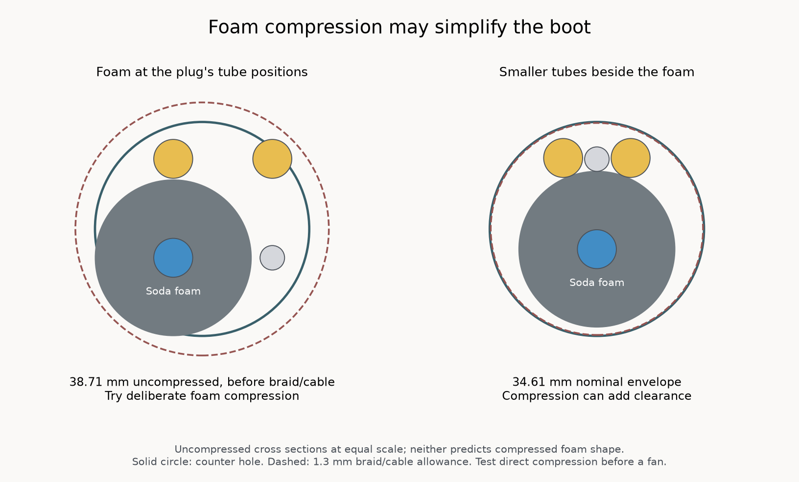

# Umbilical connector engineering assessment

Reviewed 2026-10-09. **Recommendation: keep the separate connections for shipping and
give the unified connector one optional tactile trial before buying its missing hardware.**
The concept is credible, but the present model does not establish a reliable finished
connector. Its useful next result is whether the guided plug and real bundle are pleasant
enough to justify further development. [Prepared tactile trial](../tactile-trial/README.md).

The operating requirement is shutdown and depressurization before unplugging. This design
uses ordinary open unions; removing the plug leaves their ports open. A shutdown/depressurization
procedure belongs to the eventual customer experience.

## Customer outcome and evidence

The intended benefit is one obvious, correctly oriented connection for four fluid lines and
the display, with comfortable insertion, an unmistakable fully connected state, and intentional
removal. It must retain that state when the umbilical hangs, bends or is handled. The boot must
hold the tube projections, protect the cable and transfer bundle loads without damaging tubes.
The complete machine end must pass through the existing 34.93 mm countertop hole.

The main benefit belongs to installation and machine removal. The current
[user operations](../../../hardware/README.md#user-facing-surfaces) do not require unplugging
this bundle to dispense or refill flavor. That makes it reasonable to protect the shipping
design while assessing this improvement independently.

[CPC's Multi-Mount](https://www.cpcworldwide.com/General-Purpose/Products/Multiline/Multi-Mount)
demonstrates a commercial three-to-five-line connection with a keyed interface and a thumb
latch. That establishes the product idea's feasibility. It does not qualify this mechanism,
which reconnects ordinary tube ends to four independent push-fit unions. Commercial connectors
are a useful engineering reference; no purchase or substitution is selected here.

| Design element | Supporting evidence | Present limit |
| --- | --- | --- |
| Fixed plate releases a moving union | [Owned tee observations](../../../hardware/reference/tee-connector/README.md) support holding the collet continuously while withdrawing the tube. | Different fittings, four simultaneous connections and the complete boot have not been tried together. |
| Pogo seat and compression | [Accepted contact coupon](../../../hardware/reference/yyfkgcp-pogo-4p/physical-observations.json) establishes its reported fit and mating. | This plug's alignment, continuity and retention are separate properties. |
| Snap-in frame and receiver | Two leaves, flange bearing and a stepped 6 mm wall coupon are modeled; the native tactile slice emits no supports. | No physical snap result or integrated back-top receiver exists. Supports being disabled alone does not prove a successful roof print. |
| Four-line seating, grip and retention | Their geometry is drawn. | Forces, full seating, tube slip, installed magnetic retention and repeated operation are unestablished. |

Accepted results keep the scopes in the [mechanical evidence register](../../../hardware/mechanical-qualification/README.md).

## The main engineering problem is consistent seating and release

The socket guides the plug before its protruding tube ends reach the release plate. On insertion,
the tubes push each floating union back against the retainer. On removal, each union moves
forward until the plate holds its collet; its body then moves enough to release its tube.
This is a reasonable mechanism to investigate.

The axial stack combines tube projection, fitting insertion depth, collet projection and stroke,
union float, retainer position, plug stop and pogo compression. Every line must seal before
the assembly feels seated. A tube key must preserve all four projections while the unions
resist insertion. The machine-side tubes need enough compliance for the unions' release travel.
Drawing clearance between solids does not establish those behaviors.

There is a concrete seating correction to make. The current 1/4-inch stubs are deliberately
0.5 mm short of their modeled tube stops. [John Guest's instructions](https://www.johnguest.com/sites/default/files/files/how-to-connect-jg-od-fittings.pdf)
require clean, square tube ends, insertion to the stop, a security check and installed pressure
testing; grip can occur before sealing. A functional revision needs full insertion on every
line across its actual dimensional variation, not a convincing plastic-to-plastic stop alone.
The modeled 1/4-inch full-stop projection is nominally 26.3 mm, rather than 25.8 mm. Changing
the cut length alone does not qualify the four-line tolerance stack.

The missing 4 mm union leaves its insertion depth, collet diameter, projection and release stroke
unconfirmed. Those values determine whether its retainer boss locates it properly and whether
the same release plate operates it. The [current neoFit listing](https://www.freshwatersystems.com/products/neofit-acetal-black-union-connector-4mm-5-32-tube-x-4mm-5-32-tube)
does not supply that complete release geometry. Dimensions from John Guest's different 4 mm
part are provisional reference values. In the illustrative scene the drain collar is 1.8 mm
proud; that scene's stub is actually 1.3 mm short of the assumed stop. It is not an assembly
specification. No additional founder measurement is requested without the part.

The key's nominal 0.5 mm intrusion into each tube deserves attention: the modeled 1/4-inch
wall is about 1.02 mm and the drain wall is 0.75 mm. Tube ovality, creep, scoring and axial slip
are possible consequences. The printed key provides no separate jacket capture. A finished
boot needs a deliberate path for braid and cable loads, alongside preserved tube grip.

Orientation currently relies on a 1/4-inch stub failing to enter the drain's 4.3 mm hole,
plus the intended magnet/pogo orientation. The plastic profiles themselves are symmetric.
For a finished consumer connector, an obvious key that guides orientation early and a clear
fully seated indication are desirable. Their need can be assessed during the tactile trial.

Depressurization does not empty the tubes. Residual liquid and condensation need a managed
path because the fluid ends and exposed display contacts share the mating area. Open ports
also need a practical handling/storage procedure. These are part of the complete connector's UX.

## Magnetic retention needs a corrected fit and an actual load basis

The [SB443-IN drawing](https://www.kjmagnetics.com/resources/pdfs/SB443-IN.pdf) specifies a
0.063 +/- 0.010 inch groove height: nominally 1.600 mm, with a permitted minimum of 1.346 mm.
The modeled rail is 1.500 mm high. It cannot fit every permitted groove even before print
variation. Groove-position tolerances also matter. A functional revision must accommodate the
complete supplier envelope or an explicitly controlled part lot; nominal clearance is insufficient.

[K&J's 3.42 lb rating](https://www.kjmagnetics.com/sb443-in-neodymium-stepped-block-magnet)
is attraction to steel, not an established retention force for this installed pair. Its published
maximum operating temperature is 80 C. Printing over a magnet does not establish its temperature
or retained performance.

The actual load path is bundle to boot/key, tubes and plug, unions/release plate, retainer,
socket and enclosure wall. Magnetic retention must tolerate the relevant pressure and bundle
loads while remaining comfortable to remove after depressurization. The claim that opposing
tube forces automatically keep the floating unions stationary is not an adequate design basis.
Installed force versus separation, tube/bundle routing and pressure state must be considered
together. A nominal steel pull number cannot establish that margin.

## Foam compression belongs in the boot design



At its nominal uncompressed 25.4 mm diameter, soda foam directly behind the current plug
bore with straight tubes needs at least **38.71 mm** across the foam and diagonal flavor
tube, before braid or cable. The hole is **34.93 mm**. This is a rigid-outline calculation,
not a conclusion that the real bundle cannot pass.

The founder [reports that the purchased foam is quite compressible](../../../hardware/reference/cargen-pipe-insulation/physical-observations.json)
and intends the boot to compress it. That is relevant physical evidence. Deliberate compression
may allow a simpler direct transition with insulation against the plug. The first tactile
candidate is therefore direct packing and compression. A clamp or sleeve would ultimately
need to hold that compressed shape and the jacket securely without deforming the tubes or
pinching the cable. The [boot packing study](../README.md#plug-side) shows foam and braid
tucked into a plain rear pocket. With the straight square tube layout it leaves only
0.275 mm of foam space at the soda tube's outer diagonal corner, even with a 1 mm model
mouth wall and assumed 0.35 mm braid thickness. That is a visible packing constraint,
not evidence that such compression or wall stock is appropriate. The study provides no
qualified braid retention or cable strain relief; the saved tactile article has no pocket.

A candidate rearranges the other three tubes along one side of the soda foam. It has a
32.01 mm bare enclosing circle. With the existing modeling allowance of 1.3 mm radially
for braid/cable, its nominal envelope is **34.61 mm**, leaving **0.16 mm** radial clearance.
This is an alternative arrangement to handle physically; modest foam compression can add
clearance. Braid thickness, cable position and foam deformation remain real-bundle questions.

The candidate keeps the soda line straight and fans the other tubes over **65 mm** behind
the 52 mm plug before the foam begins. Its smooth nominal paths have minimum centerline
bend radii of 130.7 mm and 70.0 mm for the flavors and 36.6 mm for the drain, above the
[neoFlo sheet's](https://assets.freshwatersystems.com/image/upload/s--N9disqrx--/gjtidjfc0tlprqbhb4ka.pdf)
25.4 mm imperial and 25 mm 4 mm-tube values. These numbers describe proposed paths, not
the curves an unconstrained bundle will take.

In this alternative, foam beginning 117 mm behind the plug face increases exposed soda tubing relative to the
current 75 mm tail. Final insulation coverage and the boot's mechanical capture remain design
work. There is no finished molded or printed strain-relief enclosure around this proposed fan.
The tactile procedure compares direct compressed packing with this alternative, using a
removable braid attachment solely to explore size and handling. It does not assume a fan is needed.

## Machine placement of the 81 mm inward reach

The socket and retainer reach 81.36 mm inward from the rear wall's inner face. The
[native placement record](geometry-review.json) intersects their actual solids with the
current exported machine, excluding enclosure geometry to be redesigned and connections
this connector would replace.

| Provisional wall center, machine X/Z | Result |
| --- | --- |
| -59.39 / 302.62 mm, centered on the existing connection field | Intersects the drain vent tube and 1.42 mm3 of the neighboring water-port ring. No other retained body intersects in this placement. Rerouting the drain and resolving the ring overlap appear feasible. |
| -59.39 / 326.50 mm, higher in the same lane | Intersects the backflow assembly, water bulkhead, flow sensor, water-port ring and carbonated-water tubing. It is unsuitable with those parts in their current positions. |

This makes the depth a manageable integration question rather than an unexplored obstacle.
It is not an exhaustive location search. Internal tube routes, wire routes, assembly sequence
and structural enclosure stock still require design. The coupon's support-free receiver intent
and snap geometry do not qualify the complete back-top. Production enclosure geometry is
unchanged by this exploration.

## Simplest geometry

The main guided profile earns its shape from the counter hole, flat print bearing and sloped
receiver roofs. The flange, two snap leaves, union-retaining plate and tube key have named jobs.
These are a sensible starting structure, with no decorative geometry needed.

The retainer prints on its face and does not need the socket's sloped roof profile. A plain
round perimeter can reduce its outer outline from eight edges to one. Preserving all existing
blank stock takes about 44.68 mm diameter, increasing width about 3.68 mm and height 1.08 mm.
That is a modest simplification candidate, not a solution to the connector's functional risks.
The tactile plate retains the current retainer so it tests the drawn assembly.

The larger simplification opportunity is a reliable, toleranced seating/release mechanism and
a single clear bundle load path. Extra detail added to compensate for uncertain fitting geometry
would make this harder to manufacture and use. The current design cannot yet be called complete
or the fewest-edge design that meets every requirement.

## Decision after handling it

The [tactile trial](../tactile-trial/README.md) can answer whether the grip, cup guidance,
snap frame and real bundle transition are worth pursuing with no missing-hardware purchase.
It intentionally does not reproduce magnetic retention or qualify complete four-line operation.

If the size or transition is awkward, keeping the separate connectors is a justified product
choice. If the experience is attractive, the next bounded development step is an exact-hardware
functional prototype: correct the magnet fit, establish full seating and release across actual
fitting variation, provide jacket/cable strain relief and resolve the provisional machine location.
Subsequent operating evidence must cover the machine's actual pressure/temperature range,
handling and repeated connections, including leaks, tube movement and electrical continuity.
The acceptance target is consistent complete engagement and intentional release without
individual-line adjustment. A lifetime or retention-load claim needs application-specific
evidence; no arbitrary cycle count or force threshold is assigned here.

These future checks are conditional development work. Nothing in this assessment adds a
machine-build check, hook or recurring verification requirement.

## Reproduce this review

Run only when revisiting the questions answered here:

```sh
tools/cad-venv/bin/python future/umbilical-plug-and-socket-exploration/assessment/geometry_review.py
tools/cad-venv/bin/python future/umbilical-plug-and-socket-exploration/assessment/draw_bundle.py
tools/cad-venv/bin/python future/umbilical-plug-and-socket-exploration/assessment/prepare_tactile_trial.py
```

The placement record binds the current native machine and source hashes. The tactile print
record binds its source meshes, editable project and freshly emitted archive. No job is submitted.
