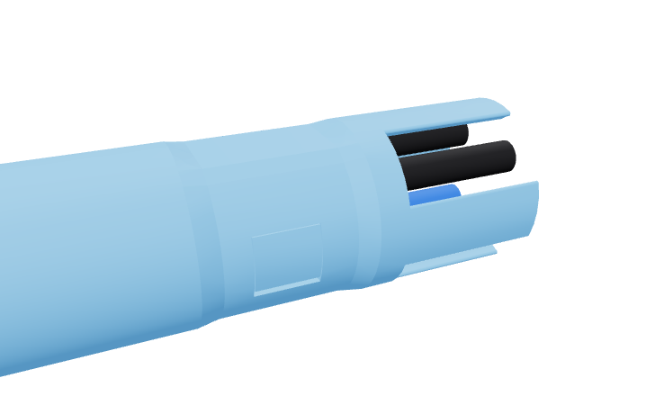

# Tube protection and confined-space review

Reviewed 2026-10-09. The assembled, protected machine end must pass through the
existing Ø34.93 mm counter hole. A larger guard attached after passage is outside
the accepted installation requirements. Shutdown and depressurization precede removal.

**The unguarded boot is a bundle-packing article, not a complete consumer connector.**
Its four short tube projections are alignment-critical and exposed during handling.
The closest geometric correction is an integral open cage. It preserves the fluid
connections and counter-hole envelope, but its open corners and modest clearance
prevent a claim of complete side protection or proven durability.

The recommendation is one bounded guard/handling investigation, with the separate
connections retained for shipping. No missing fitting or magnet purchase is needed
to decide whether this candidate deserves further development.

## What fits, and what does not

The current face has 16.15 mm square tube pitch. The quarter-inch union rings are
Ø15.10 mm; two quarter-inch unions occupy opposite corners. Their enclosing span is
`2 × 8.075 × √2 + 15.10 = 37.94 mm`, before a guard wall or clearance. A closed shell
which remains around those bodies during mating cannot pass the Ø34.93 mm hole.
Changing only the shell outline or thinning its wall cannot remove that conflict.

Simply repacking coplanar unions has another bound: even the three quarter-inch
rings alone need `15.10 × (1 + 2/√3) = 32.54 mm`. Adding 0.25 mm clearance and a
1 mm shell wall on each side takes 35.04 mm, before the fourth union. This is a
lower bound for those coplanar bodies, not proof against every possible connector.

Axial staggering is not a small free correction. Each PP0408W has two 12.08 mm-long
full rings separated by a 12.16 mm waist. Placing one ring in another fitting's waist
has only 0.08 mm nominal axial slack, against 1.835 mm independent release travel.
A robust stagger needs a separate arrangement of both ring bands and trades against
the confined-space depth requirement.

Center posts can limit some inward tube movement. They do not put a protective
structure outside the tubes, so a wall can still touch a tube first. Available space
between adjacent quarter-inch rings is only 1.05 mm; diagonal pockets are larger.
That dimension alone does not rule out every internal brace.

## Integral open-cage candidate



The [3D assembly](../one-plug-umbilical.html) includes the guarded plug, mating
clearances and counter passage alongside the unguarded bundle-packing model.

[`protection_candidate.py`](protection_candidate.py) draws four perimeter fences from
one Ø34 mm annulus with Ø28.8 mm inside diameter. Three Ø15.6 mm and one Ø13.7 mm
union keepouts cut the annulus into four panels. The cuts clear the full ring envelopes
along the complete projection, including union release motion. Eight outer wing edges
have R0.5 mm rounding. A 6 mm round root collar and a 4 mm transition attach the
panels to the guided boot while preserving its tube, key, magnet and contact cavities.

| Property | Native candidate |
| --- | --- |
| Complete rigid plug diameter | Ø34 mm; 0.465 mm nominal radial counter clearance |
| Guard projection from mating face | 28.3 mm; 2 mm beyond the longest tube |
| Central radial panel stock | 2.6 mm; thinner toward the rounded wings |
| Worst lateral lead over tube envelope | 0.519 mm for a broad flat surface |
| Additional separate parts / mechanisms / wet joints | 0 / 0 / 0 |
| Additional printed volume | About 3.74 cm³ |
| Socket flange width | 49.4 mm; 2.4 mm wider than the saved socket |
| Cup-to-snap-clearance stock at the side axis | 1.55 mm |
| Guard tip relief beyond full mating-face seating | 1 mm |

The rounded fences' convex hull lies outside all four nominal tube circles for every
lateral surface direction. Their front ends also stand beyond the tube tips. A broad
flat object therefore touches the nominal rigid cage first. This is useful protection
against being laid or held against a flat wall.

**The small margin matters.** Sharp mathematical wing tips yield 1.105 mm lead;
rounding them reduces it to 0.519 mm. The rounded result is the candidate's value.
Tube movement in its guide, print variation, finishing and fence flex consume that
clearance. It does not establish an allowable bump force. Corner slots admit narrow
protrusions and cabinet corners. This is not a closed side enclosure.

The nominal Ø6.65 mm guides around Ø6.35 mm tubes allow 0.15 mm radial play.
A straight tube leaning across a full 38 mm guide could displace its tip by
`0.15 + 26.3 × (0.30/38) ≈ 0.36 mm`. That clearance case leaves only about
0.16 mm of the cage's nominal lead before print variation or fence flex. The key
may restrict this movement, but its actual retention and alignment are unqualified.

The load path must run from the touched fence into its continuous root and boot.
Using the tubes as fence braces would put the bending load back into the fluid
connections. [John Guest's catalog](https://www.johnguest.com/sites/default/files/files/John-Guest-Fluid-System-Catalog-2025.pdf),
page 75, requires support against excessive side loading and says fittings are not
support brackets. It gives no load rating for this printed guard.

The [source-bound native record](protection-candidate.json) establishes valid single
solids for the guarded boot and socket, no overlap with tubes, guides, key or installed
hardware, no overlap with the unions at the checked release positions, and no plug/socket
collision at seven insertion positions. It also checks the rigid counter envelope and
preservation of the original collet-bearing lands. These are geometry results.
The exact drain fitting is still provisional.

The matching socket has four guard channels and a larger roofed cup. Its two snap
leaves remain the wall retention mechanism. The matching receiver retains 36° roof
planes. Support-free printing, leaf fit and strength are not established for this
candidate; the baseline coupon and saved slices do not qualify its changed geometry.
The guard channels extend 1 mm beyond the tips at face seating so the guard does
not intentionally create a competing insertion stop. This is separate from their
0.25 mm radial running clearance.

## The confined-space envelope

| Axial quantity, measured from the outer enclosure face | Unguarded boot | Guarded candidate |
| --- | ---: | ---: |
| Boot body length | 98 mm | 98 mm |
| Seated boot body outside enclosure | 64 mm | 64 mm |
| Motion until the leading end clears the cup mouth | 60.3 mm | 62.3 mm |
| Total rigid straight approach envelope | 124.3 mm | 126.3 mm |

The approach envelope excludes braid bending, the user's hand and surrounding objects.
It does not mean every installed machine needs a permanent 126 mm rear gap: access
before final placement may suffice. That assembly/removal route is not yet designed.
The socket still reaches 81.36 mm inside the inner enclosure wall.

A shallower cup alone does not reduce the total. With boot length `L`, cup depth `D`
and leading projection `T`, seated overhang is `L-D` and approach stroke is `D+T`;
their sum remains `L+T`. Reducing the body or projection, or providing accessible
connection before final machine placement, addresses the actual burden.

The present fan can shorten only modestly while keeping its paths. At 45 mm, soda/drain
minimum bend radii are 39.306/33.106 mm. A 40 mm fan gives 31.339/26.472 mm and saves
5 mm. A 39 mm fan leaves the drain at 25.236 mm, barely above its published 25 mm
minimum. [neoFlo's tubing sheet](https://assets.freshwatersystems.com/image/upload/s--N9disqrx--/gjtidjfc0tlprqbhb4ka.pdf)
gives 25.4 mm for quarter-inch tubing and 25 mm for 4 mm tubing.
The fixed key, shoulder and cable positions also mean the 38 mm straight nose cannot
be shortened by changing its length constant alone. No physical retention result
establishes a required guide length for this boot.

## A bounded search from the working product

The existing separate connections are the starting point. Compare each proposed
change with the same requirements: protected handling, assembled counter passage,
easy confined-space engagement and consistent full seating/release.

| Nearby change | What it changes | Decision |
| --- | --- | --- |
| Removable compact cap | Covers bare tubes during shipment/feed/storage | Useful limited protection; removal exposes the tubes during connection. Attachment still needs to fit the hole. |
| Fixed closed shell | Encloses the union bodies while mated | Fails the present counter envelope; a post-feed shell is outside the accepted installation requirements. |
| Integral open cage | Adds protective perimeter panels and matching socket channels | Closest geometrically viable candidate; investigate its small printed margin and exposed corners before purchases. |
| Full-length internal stiffeners | Supports tubes internally without larger outer geometry | No dimensioned compatible set is established; inserts must span the projection into boot support and preserve fluid function. |
| Retracting guard / rigid-spigot connector | Adds a motion mechanism or different fluid terminations | Separate architecture; pursue only if the simple guard cannot satisfy handling and space needs. |

The owned Siptenk quarter-inch stiffener is documented at the faucet's compression
joint. Its dimensions and push-fit use do not establish protection of these 26.3 mm
projections. John Guest's TSI250S-US is for ¼-inch **ID**, 5/16-inch OD tubing, so it
does not fit this ¼-inch OD, 4.32 mm ID line. The same
[catalog](https://www.johnguest.com/sites/default/files/files/John-Guest-Fluid-System-Catalog-2025.pdf),
pages 10, 46 and 75, recommends inserts for soft/thin-wall tubing and specifies
Superseal fittings for stainless or polished rigid tubing. A stainless-stub substitution
into PP0408W is not an established shortcut.

Commercial multiline connectors establish that the product idea is feasible, but
catalog hardware still needs pressure, fluid and installation compatibility. The
examined [CPC four-station Multi-Mount](https://www.cpcworldwide.com/Portals/0/Downloadable-Content/COR/Literature/Spec-Sheets/CPC-Multi-Mount-Spec-Sheet.pdf)
plate is 85.09 mm long, with four-station ratings of 60 psi in acetal or 125 psi in brass.
It is a different installation architecture rather than a countertop-fit substitution.
No alternate hardware is selected or requested for purchase.

## Useful next evidence

The guarded candidate is CAD only. The saved blue
[guided-boot trial](../guided-boot-trial/README.md) has no guard and only answers packing,
feed, grip and fabric-tuck questions. It cannot accept this protection design.

Before preparing a guarded handling print, inspect the emitted fence edges and
roots, cup roof and accessible supports. Cuff-first is a useful print pose to inspect:
the fences then grow from the body rather than forming separate tall feet below the
mating face. Its cuff ceiling, key window and cable pocket need their own support review.
The 4 mm root transition limits outward growth to 0.5 mm per axial millimetre.

The initial handling screen uses owned quarter-inch tubes/unions, foam, braid and
cable, plus projection marks, a ruler or calipers and a broad straight surface. Its
decision is whether the modest cage is practical enough to justify exact-hardware
development. Roll the assembled plug against the surface and check that the guard
touches first; feed the whole end through the counter gauge; bend and handle the
real bundle; then check three-line seating/release. Reject guard-to-tube contact,
cracked or permanently bent fences, visible tube damage, projection slip, or individual
tube adjustment to engage those three unions. Missing drain hardware limits the result.

This is an initial handling/fit screen, not an impact, pressure or lifetime qualification.
No arbitrary drop height, cycle count, force threshold or measurement-tool purchase
is assigned. If it cannot retain useful clearance during ordinary handling, change
the protection architecture or keep the separate connections; cosmetic edge reduction
does not resolve that result.

## Reproduce the native review

Run when asking the protection/clearance question, not on every change:

```sh
HSM_NO_BUILD_LOCK=1 tools/cad-venv/bin/python future/umbilical-plug-and-socket-exploration/assessment/protection_candidate.py
```

`--export-dir PATH` also writes the open cage, guarded plug, socket and matching coupon
as native STEP solids. The command slices or launches nothing.

The existing `scene.py` and visualization build also regenerate the three guarded
assembly panels; use the [exploration rebuild commands](../README.md#rebuild).
