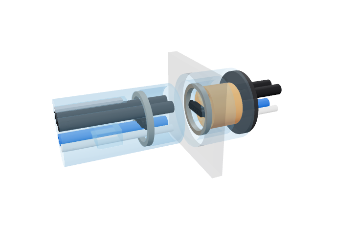
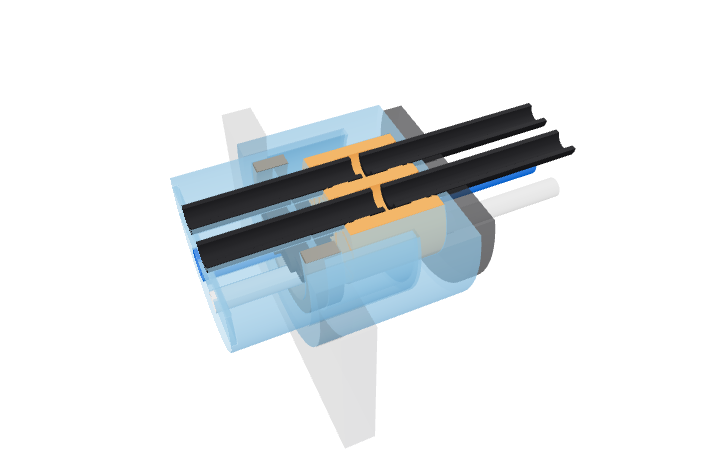

# Compliant umbilical receiver concept

Four actual LLDPE tube ends on the umbilical enter one thick TPU or cast-silicone
puck. Each tube has its own passage. The elastomer's bore interference supplies
the radial seal; magnets between the rigid bodies supply axial retention. A blue
PET-GF carrier supports the puck, and a blue sleeve integral to the plug surrounds
the protruding tube ends. This is an architecture visual, with illustrative
dimensions and magnet shapes. It is not a printable or qualified pressure connector.



The four fixed machine tubes enter the puck from the rear. Each front/rear pair
shares one isolated wet passage, with a 2 mm gap between tube ends. The drawn
3 mm sealing lands contact the tube outside diameters. The bores show their
inserted shape; their unloaded diameters and interference are unspecified.
The fluid path remains inside the tubes and the elastomer passage.



| Illustrative dimension | mm |
| --- | ---: |
| Rigid protected plug diameter | 34 |
| Tube centers, horizontal / vertical pitch | 9.5 / 12.5 |
| Puck diameter / thickness | 25 / 18 |
| Tube projection from the mating face | 14 |
| Protective sleeve projection | 16 |
| Sleeve inside diameter | 31 |
| Blue port outside diameter | 42 |

The complete rigid plug, including its protective sleeve and key, has a Ø34 mm
envelope. That leaves 0.465 mm nominal radial clearance in the Ø34.93 mm counter
hole before manufacturing tolerances. The sleeve projects 2 mm beyond the tube
tips. These dimensions establish the drawn envelope, not resistance to impact,
kinking or handling loads. The round sleeve centers the bodies; angular indexing
is not designed here.

The blue boot retains the 98 mm guided-boot envelope, foam corridor and 15 mm
fabric tuck, with tube paths ending at the tighter receiver positions. Foam and
fabric represent intended compressed envelopes. The electrical contact reference
is included between the tube rows; its mounting and ribbon termination are not a
production layout. The black wall patch and rear retainer show material layout;
they do not define a snap-in receiver or a support-free enclosure opening.

The annular magnets are Ø30/25 × 3 mm geometric placeholders. No magnet has been
selected or force established. Seal interference, material suitability, insertion
and extraction forces, tube grip, rear tube retention, angular guidance, pressure
capacity and service life remain unqualified. Shutdown and depressurization are
required before unplugging.

[`compliant_receiver.py`](compliant_receiver.py) produces the native assembly and
the cropped section. [`concept.json`](concept.json) records parameters, source
hashes and valid single-solid bodies. A read-only geometry review found no
unintended overlap among the plug, carrier, puck, tubes, foam, ribbon and key.
Those results do not qualify sealing or retention. No printer job, purchase,
production BOM or production enclosure change is included.

Rebuild this concept explicitly:

```sh
HSM_NO_BUILD_LOCK=1 tools/cad-venv/bin/python future/umbilical-plug-and-socket-exploration/compliant-receiver-concept/compliant_receiver.py
```

The ignored `out/assembly.step` and `out/section.step` files carry native geometry;
their adjacent `.mesh` files support the interactive view. The section cuts through
the two flavor-tube axes and crops the rear boot to focus on the mating interface.
