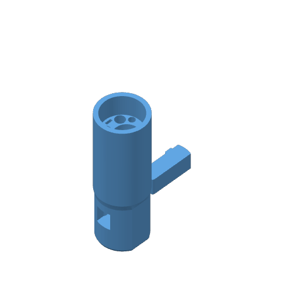

# Guided boot tactile trial

Prepared for **Mark2, left 0.4 mm nozzle, Fiberon PET-GF15 Blue, +0.04 mm user trim**.
The two parts are the 98 mm guided boot and its matching tube key. The boot has filled
magnet pockets and needs no magnets or pauses. This is an unpowered, unpressurized
handling trial. Nothing has been submitted to a printer.

| File | Purpose |
| --- | --- |
| [Editable project](guided-boot-mark2-z004.3mf) | Two centered blue parts, saved settings and placement |
| [Native sliced archive](guided-boot-mark2-z004.gcode.3mf) | About 2 h 22 min; 63.54 g at the saved profile density |
| [Print record](guided-boot-mark2-z004.print.json) | Source meshes, settings, hashes and full-bead bed margin |
| [Native review](native-review.json) | First-layer and chamfer overlap, wall counts and effective settings |
| [Support audit](support-audit.json) | Both support bodies, including their contact locations and removal access |
| [Printable meshes](parts/) | Boot and matching key |



## Geometry and printing

The round Ø34 mm rear body contains a 15 mm tapered fabric cuff and 45 mm gradual tube
guides. A 38 mm straight nose holds the final tube formation, with a 12 mm window for
the key. A chamfered shoulder marks the 34 mm inserted portion; 64 mm remains outside
the port at the mating-face stop. The shoulder is 0.3 mm clear of the socket mouth.
The existing Ø34.93 mm counter hole leaves 0.465 mm nominal radial clearance around
the largest rigid section. Complete real-bundle passage awaits handling.

The boot prints with its mating face on the bed and rear cuff upward. Its nose lead-in
changes 0.8 mm over 1.6 mm of rise. The shoulder changes at most 2 mm over 4 mm of rise.
Both use the 0.5 mm outward-per-millimetre print geometry. The shared PET-GF profile
supplies speeds and temperatures; this trial uses 0.20 mm first layer, 0.24 mm normal
layers, six walls, 25% grid infill, wall-first inner/outer order and 15% infill/wall overlap.
Elephant-foot compensation is zero because the nose includes its bed-facing lead-in.
Textured-PEI G-code clears trim and emits `G29.1 Z0.02` for the requested +0.04 mm user trim.

The emitted first/second layers and both chamfer bands have supported outer-wall centerlines;
the sampled minimum outer-wall footprint overlap is 87.3%. Six emitted perimeter crossings
are present at the reviewed clear shoulder section. The complete model/support/brim bead
envelope is at least 111.72 mm inside the usable bed boundary.

Two bed-rooted support bodies reach the key-window ceiling and front cable-drop pocket.
Remove the former through the open side window before fitting the key, and the latter
through the open mating-face pogo pocket before fitting contacts. No support body reaches
the curved guides or insertion shoulder. Printed support-removal effort and surface quality
remain unobserved.

Use the [coupling trial's](../tactile-trial/README.md) socket, wall coupon and counter ring
as the mating fixtures. Its 52 mm plug and key are separate articles. The socket/coupon
geometry and 34 mm insertion depth match this boot.

## Handling procedure and decision

Use three roughly 300 mm quarter-inch offcuts from existing tubing, soda-tube foam,
black/blue braid, the display ribbon, a marker and a ruler. Include the already ordered
4 mm drain tube when available; an empty drain lane limits the packing and key test.
Existing pogo halves are optional. No missing fitting or magnet is needed for these steps.

1. Remove both supports and loose strings. Check that the key window, tube entrances and
   cable pocket are open. Keep the mating face, guides and cuff intact; forcing a fused
   guide or sanding it to an unknown diameter would not test the drawn fit.
2. Hold the bare boot in one hand and feed each tube from the rear with the other, with
   the key removed. The two flavor entrances sit above the insulated soda entrance; the
   drain enters to its right. Try both hand pushing and pulling. A tube should follow its
   channel and emerge straight without buckling, kinking, visible flattening or an abusive
   feeding force. Difficulty feeding a tube is a reason to revise its guide.
3. Set the quarter-inch tube projections to 26.3 mm from the mating face. Use 24.1 mm for
   the drain only as a tactile mockup dimension, not a sealing specification. Fit the key
   from the drain side by hand and mark the tube positions. The key should seat without
   visible tube damage and keep the projections during the following handling.
4. Feed the ribbon through its upper channel without pulling on connector tails. Compress
   the soda foam into its dedicated corridor: it extends through the cuff and halfway
   into the curved transition, about 38 mm inside the boot. Gather the whole bundle into
   the braid and tuck the braid 15 mm into the tapered cuff. It should seat without
   flattening a tube, pinching the cable or requiring an improvised external clamp.
5. Mark TOP on the boot and socket to make orientation explicit. Seat the boot in the
   coupon-mounted socket. Its mating face should reach the stop, with the shoulder just
   outside the socket mouth. Assess whether the 64 mm exposed portion gives comfortable
   insertion/removal and whether the 98 mm total body is practical in the intended space.
6. Pass the boot and complete gathered bundle through the counter ring by hand, allowing
   foam/braid compression. Then bend and handle the bundle as during installation and let
   it hang under its own weight. The tubes should remain straight at their outlets; their
   projection marks and the tucked braid should remain seated. Inspect for tube damage,
   cable pinch, foam displacement and persistent foam damage after removal.

This trial decides whether the tube paths, grip length, insulation packing, fabric tuck
and exposed handle are worth developing. A pleasant result does not qualify magnetic
retention, exact four-union seating/release, leaks, electrical operation, thermal performance
or lifetime. The [engineering assessment](../assessment/README.md) describes those limits.
A description of what catches, moves or feels awkward is sufficient for the next iteration;
no measurement-tool purchase is requested.

## Reproduce

Run these only when preparing or reviewing this particular test:

```sh
tools/cad-venv/bin/python future/umbilical-plug-and-socket-exploration/assessment/prepare_guided_boot_trial.py
tools/cad-venv/bin/python future/umbilical-plug-and-socket-exploration/assessment/review_guided_boot_print.py
```

Neither command launches a printer or joins a recurring build/commit check.
