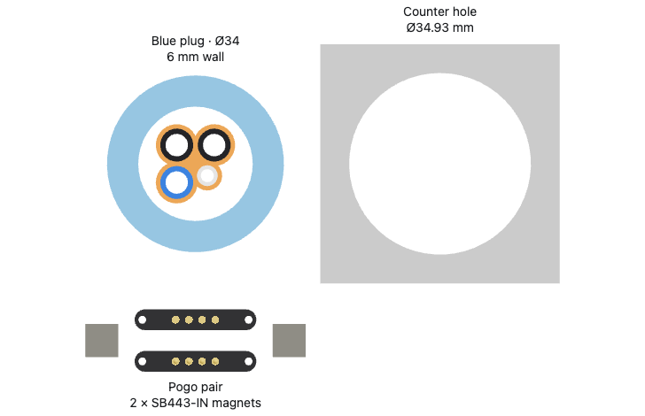
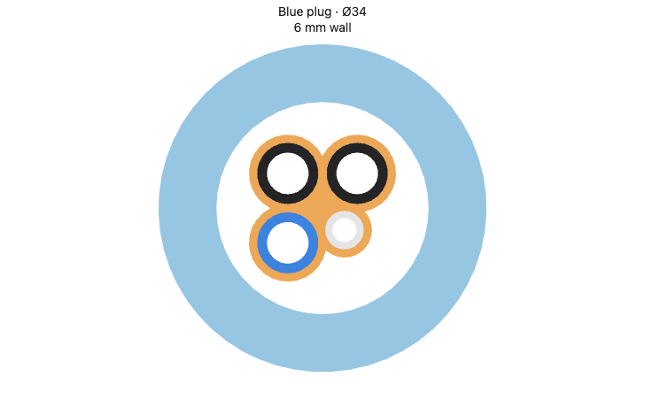
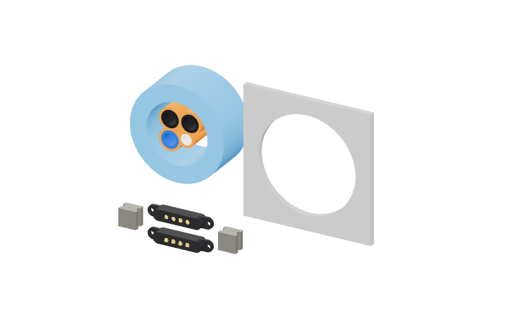

# Minimal tube bundle

This packing study contains four actual tube sizes, their conforming TPU profile,
and a thick blue PET-GF plug guard. The selected pogo pair, two SB443-IN magnets
and the countertop hole sit separately beside the bundle at the same scale.

Three tubes are Ø6.35 mm and the drain is Ø4 mm. Each neighboring pair has
0.85 mm between its tube surfaces. The drain center moves diagonally inward
to achieve that gap with both adjacent large tubes.

The TPU's exposed outline is the union of each tube's circular outline expanded
outward by 0.85 mm. The central interstice is filled; the only bores are the four
tube passages. This gives a scalloped 15.25 × 15.25 mm profile, with 0.85 mm of
material at each closest neighboring gap and on exposed outer edges.
The profile depicts inserted tubes; it does not specify an unloaded sealing bore.

The blue guard is Ø34 mm outside and Ø22 mm inside, giving a 6 mm wall. It is
16 mm long and extends 2 mm beyond the tube tips. The TPU profile and tube
sections are 12 mm long, recessed 2 mm from each end of the guard. This depicts
the protected cross-section without a rear boot or receiver assembly.
The reference hole is Ø34.93 mm. Its thin surrounding patch only identifies
the opening; its thickness does not specify a countertop.

The separate hardware is the existing
[YYFKGCP screw-ear pogo pair](../../../hardware/reference/yyfkgcp-pogo-4p/README.md)
and two [K&J SB443-IN grooved blocks](https://www.kjmagnetics.com/sb443-in-neodymium-stepped-block-magnet).
No hardware mounting, wire, rear boot transition or enclosure receiver is part
of this study. No purchase or print job is prepared.

[`minimal_bundle.py`](minimal_bundle.py) exports the native assembly to
`out/minimal-bundle.step` and its tessellation sidecar.
[`geometry.json`](geometry.json) records the dimensions and one-off geometric
checks: eleven valid single-solid bodies, four equal neighboring gaps and no
core overlap with the guard. These checks establish the depicted packing only.
