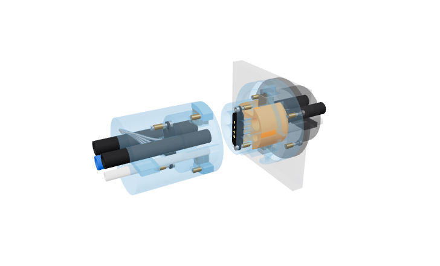
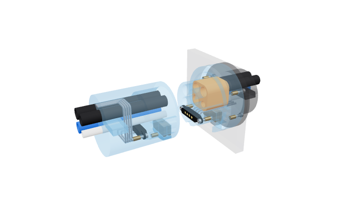
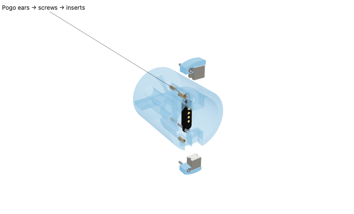
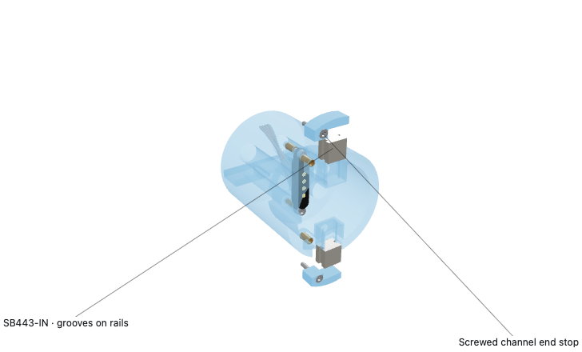
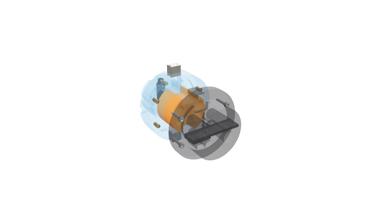

# Retained-hardware umbilical interfaces

Two interface layouts use the selected YYFKGCP four-contact pair and four
SB443-IN grooved block magnets. Four actual LLDPE tube ends enter a supported
TPU or cast-silicone puck. The blue PET-GF plug includes a continuous protective
sleeve ahead of its tube tips. These are native CAD studies, with the boot cropped
24 mm behind the contact plane. Neither is a qualified pressure connector or a
prepared printer job.

**The thicker sleeve is the recommended mechanical layout.** Its central contact
row and lead passages avoid routing conductors around the tube cluster. The closer
tube layout demonstrates the packaging tradeoff: a tighter square formation needs
ear clearances in the sleeve, individual leads around the tubes and less stock
outside the magnet pockets and end-stop screw recess.





| Nominal geometry | Thicker sleeve | Closer tubes |
| --- | ---: | ---: |
| Fully assembled rigid plug envelope | Ø34 mm | Ø34 mm |
| Main protective sleeve wall | 3.5 mm | 3.0 mm |
| Tube pitch, horizontal × vertical | 13.1 × 7.2 mm | 8.15 × 8.15 mm |
| Plastic outside magnet-pocket outer corner | 2.29 mm | 1.67 mm |
| Plastic outside pogo-ear relief | No relief | 1.72 mm |
| Plastic outside end-stop screw counterbore | 1.24 mm | 0.75 mm |
| Web between neighboring large tube guides | 0.55 mm | 1.50 mm |
| Sleeve / tube projection from contact plane | 16 / 14 mm | 16 / 14 mm |
| Elastomer puck front / back | 8 / 24 mm | 8 / 24 mm |
| Machine port flange | Ø42 mm | Ø42 mm |

The main wall figure is not a minimum for every feature. The counterbore figure
describes radial stock outside the local screw recess; the recess is 1.4 mm deep,
with a 3.6 mm bearing thickness under it. The closer layout's through-hole is only
0.125 mm from the end-stop edge at its narrowest location. That detail and its
0.75 mm outer counterbore stock make it a weaker candidate for handling abuse.
The table does not establish printed strength. The Ø34 envelope leaves 0.465 mm
nominal radial clearance in the Ø34.93 counter hole before manufacturing error.

## Hardware and retention

The [YYFKGCP four-pin pair](https://www.amazon.com/dp/B0GCBNTBT8?th=1) is the
existing selected connector, with a delivered reference and accepted fit/mating
observation in the [mounting audit](../../../hardware/reference/yyfkgcp-pogo-4p/mounting-audit.md).
Each half's ear plate seats on a printed shoulder. Two M1.4 × 8 screws clamp it
to two Ø2.3 × 4 mm inserts. The front opening admits the complete ear plate,
and the drawing includes the screw heads, hex sockets, insert entries and pilots.
The contact housings retain the reference's nominal 0.246 mm face separation.
Their allowable spring compression still depends on the installed dimensions.



The [SB443-IN manufacturer drawing](https://www.kjmagnetics.com/resources/pdfs/SB443-IN.pdf)
defines a 6.35 × 6.35 × 4.7625 mm block with two side grooves. Printed rails
engage those grooves and carry axial retention load into the PET-GF bodies.
The rails are 0.60 mm thick, between 1.95 and 2.55 mm behind the pole face;
the common groove interval allowed by the drawing's band and groove tolerances
is 1.8542–2.6924 mm. Print error is additional. Pole faces meet at the sleeve
rim, 16 mm ahead of the contacts. There are no annular magnet placeholders.

The plug magnets slide into open channels from the rim's top and bottom in the
thicker layout, or both from the bottom in the closer layout. Screwed end stops
close those loading paths. The thicker layout uses two stops and two additional
M1.4 screw/insert sets; the closer layout uses one stop and one set. The pogo is
mounted and wired before these magnets and stops are installed. Two driver
openings through the thicker layout's empty channel floors provide access to
the pogo mounting screws at that stage.



Machine-side magnets slide into matching radial channels with the rear retaining
plate removed. Two extensions integral to that plate close their outer ends.
The seal puck also installs through the open rear cavity. A shaped backing on
the plate contacts the puck's back at Y24; four M1.4 screws/inserts secure the
plate to the blue carrier. These magnets require no print pause. No new
connector, magnet or fastener type is selected.



## Mating and wiring

The rigid receiver nose nests inside the protective sleeve. A single rib and
matching groove index rotation before the tubes reach the seal passages. The
nose locates the sleeved plug before its tube ends reach their bores. At the modeled seated
position, each front/rear tube pair shares an isolated passage with a 2 mm tip
gap. Two 3 mm seal lands surround each tube outside diameter. Bores show their
inserted shape, with unloaded interference unspecified; magnets hold axially,
while the elastomer supplies radial sealing.

The thicker layout keeps four leads in a central dry passage between its tube
columns. The closer layout splits the ribbon into four individual leads around
the outside of the tube cluster and routes the fixed leads below its seal puck.
The visual's Ø0.8 mm insulated leads are routing representations, not measured
wire dimensions; printed passages are Ø1.3 mm. Solder-joint insulation and lead
strain relief need detailing with the delivered cable. Transverse keys show
nominal tube capture on both sides, with no measured holding force.

The established foam and fabric tuck belong to the
[guided boot](../compliant-receiver-concept/README.md). They are outside this
cropped scene. Their transition into either new tube formation needs integration.
The black wall patch is enclosure context, with an opening for the blue flange.
It does not specify a snap-in mount, support-free print orientation or clearance
against the complete machine.

## Evidence and scope

[`geometry.json`](geometry.json) binds the native CAD to its source hashes.
It records valid solids, nominal body/puck/tube clearances, lead separation from
tubes, keys and fasteners, end-stop clearance and pogo-head access before the
plug magnets are installed. These are checks requested for this design study,
run by its explicit generator; no check is added to a build or commit hook.

The existing contact coupon's qualitative acceptance applies to that coupon.
The accepted organizer's 10 mm grip applies to that organizer. Neither proves
the longer guides, keys, magnet rails, small end stops or puck in this study.
Seal material, interference, leak-tightness, insertion/extraction force,
installed magnetic force, handling strength and service life remain unqualified.
Shutdown and depressurization are required before unplugging. No production BOM,
enclosure, order or printer submission is changed.

Rebuild explicitly:

```sh
HSM_NO_BUILD_LOCK=1 tools/cad-venv/bin/python future/umbilical-plug-and-socket-exploration/retained-options/retained_options.py
```

Native STEP assemblies and their mesh payloads are written to ignored `out/`.
