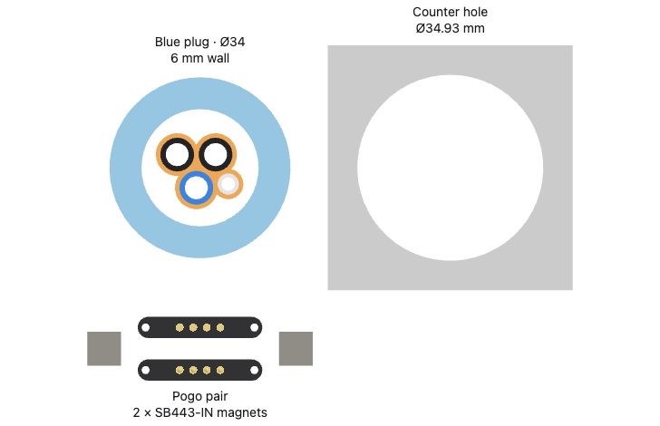
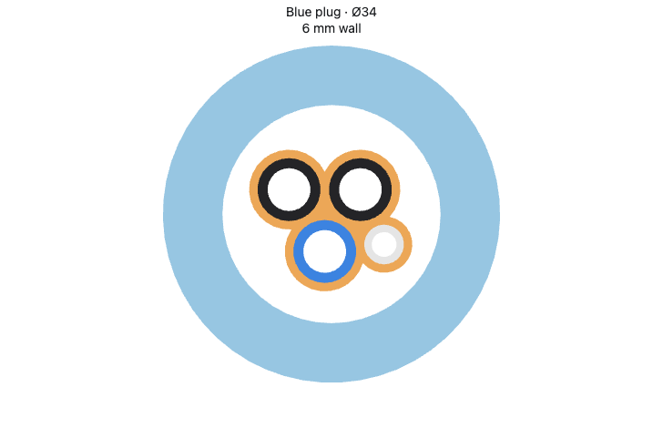
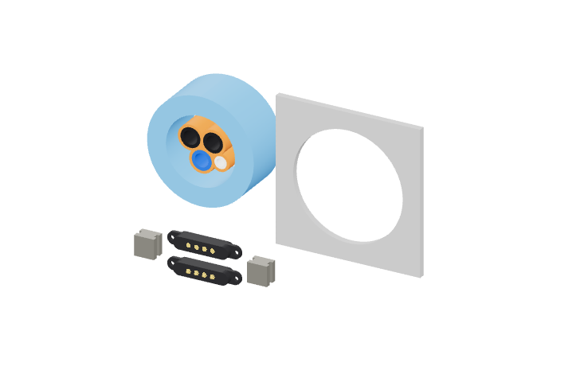

# Triangular tube bundle

Three Ø6.35 mm tubes form an equilateral triangle on 7.20 mm centers, leaving
0.85 mm between every pair. The Ø4 mm drain tube sits outside one edge,
0.85 mm from both adjacent large tubes. Its position follows their actual
diameters.

The conforming TPU profile expands each tube outline outward by 0.85 mm and
fills the central interstice. The four tube passages are its only bores.
Its bounding dimensions are 16.46 × 14.29 mm; its smallest enclosing circle
is Ø17.94 mm. That circle is centered inside the blue protective guard.

The guard is Ø34 mm outside and Ø22 mm inside, with a 6 mm thick wall and
16 mm length. The 12 mm tube and TPU sections are recessed 2 mm from each
end. The selected YYFKGCP pogo pair and two SB443-IN grooved magnets remain
separate size references, alongside the Ø34.93 mm counter hole.

This is an inserted-profile packing illustration. Unloaded sealing bores,
hardware mounting, wiring, rear boot and enclosure receiver are outside its
scope. No purchase or print job is prepared.

[`triangle_bundle.py`](triangle_bundle.py) uses the shared geometry in
[`minimal_bundle.py`](../minimal-bundle/minimal_bundle.py) and exports
`out/triangle-bundle.step` with its tessellation sidecar.
[`geometry.json`](geometry.json) records eleven valid single-solid bodies,
five equal neighboring gaps, a centered enclosing circle and no overlap
between the core and the protective wall.
