# Weld positioning — an exploration

A collection of developed possibilities for positioning, aiming, carrying and
observing the X1 Pro gun at the recessed inside corner of the carbonator, on the
existing rotator. It was produced on 2026-09-28 by one coordinator and eight
continuing explorers, each seeing the whole problem a different way. They worked
through five waves: explore; exchange rough ideas with a partner from another
view; revise and take a new direction; a second exchange plus combinations; a
final pass. The brief is [`swarm-prompt.md`](swarm-prompt.md).

Nothing here is ranked or selected. Families are grouped by how they assign the
work, and the order within a family is only the order the relationships read
best. Large unresolved problems sit beside the idea they belong to.

**Conventions.** All geometry is on the orientation scene's proxy gun at Derek's
opening pose: grip 45°, hole dial 30°, vertical −15°. In
[`pose.js`](../../web/public/js/weld-position/pose.js) terms that is
`posePoint(p, 45, 30 − 35, −15)`. Gun mass, centre of mass, umbilical pull and
trigger force are assumed everywhere, because none has been measured. Nothing
was built, bought or operated. Prices and stock were observed in Derek's
signed-in Chrome on 2026-09-28, Amazon listings only when Prime-confirmed on the
product page.

## Pictures

Ten 3D pages cover about seventy arrangements. Each page shows lettered panels
from one shared camera, and turning one panel turns them all. Every panel draws
the real rotator assembly, the tube and the endcap, with the scene's proxy gun at
the opening pose. The mechanisms are drawn as simple candidate solids at the
sizes the idea files give.

**Amber marks what sets the dot's position.** On the geometry page, amber marks
the thing being taught instead.

| Page | What it shows |
|---|---|
| [Shared weld geometry](https://claude.ai/artifact/4ppixsfxaJFSCgSysSTEUE) | Derek's three axes, grip roll, plan angle as a tangent slide, the escape direction, the umbilical's apex |
| [Suspension and its branches](https://claude.ai/artifact/6RRjdZ5bYpq1LwgfbRHx3f) | Derek's suspension as stated; wire-located suspension, cable robot, knob-wired suspension, place-soft-lock-stiff, work-hung suspension |
| [Arms that carry](https://claude.ai/artifact/DEtqPuAwMvcxdsZ6QyxobF) | Derek's monitor arm as proposed; rider, isocentric rider, dock, session docked and parked, film-grip carrier, escape-rail handover |
| [Table opening family](https://claude.ai/artifact/EGA8dJnRqXpDhwrhaqT6KG) | Derek's table opening as described; edge of table, drop-in collar, collar centre, loading, motorised station, split mount |
| [Carried, then docked](https://claude.ai/artifact/2f9xd1G3ruusba3isFX91c) | Float and dock, watch first, recipe cartridges, countertop sled, gauge-set, switch-locked skate, carrier and seat |
| [The work holds the dot](https://claude.ai/artifact/RLHX2kHoMvaH54HZsmDjhL) | Cup and tail, nose and tail, endcap compass, paddle compass, between centres, lidded mouth, guided hand |
| [Riding the tube](https://claude.ai/artifact/NBJbrJkuidg9nybLG7VKcH) | Rim carriage, rim saddle, plate-face tripod, lip collar, a stylus that senses without carrying, cold-lap map and replay |
| [Gun still, work moves](https://claude.ai/artifact/PfQM7adLtJULmNo43C8mZn) | Still gun over a cross-slide, loading, fixed gun over a moving shelf, portal, still gun over a moving tube, cart station, plate head |
| [Pivots on the dot](https://claude.ai/artifact/QZtuMcwzTMjS5KykXZJWe6) | Isocentric couch, C-arm, protractor and stub, RCM carriage, nodal head, hand-steered isocentre, hexapod, flexure trim head |
| [Tilt, hand, instruments](https://claude.ai/artifact/LuyHHMMmxaHpiwKN2FEdvG) | Tilt cradle at 0° and 32.5°, gravity in the gun plane, teach-record-replay, observation layer, wire instruments, engraver gantry |

## Where things are

| Path | What it holds |
|---|---|
| `explorers/<name>/summary.md` | Each explorer's account of every arrangement it holds: loads, reference, break/repair history, parts and sourcing, open problems, provenance |
| `explorers/<name>/ideas/` | The developed idea files, each opening with a "Picture it" paragraph, with originals and branches kept distinct |
| `explorers/<name>/sketches/` | SVG sketches, mostly generated from a copy of the scene's pose math |
| `explorers/<name>/notebook.md` | Running logs, calculations and questions |
| `exchange/` | The critic-on-originator files from the two exchange waves |
| `sourcing/` | Per-explorer part observations and the compiled [overview](sourcing/README.md) |
| `context/` | What the explorers started from: [shared context](context/shared-context.md), [working method](context/working-method.md), [Derek's examples](context/examples-and-history.md), [first-pass digest](context/digest-wave1.md) |

## The eight views

| Explorer | Way of seeing the whole problem | Started with Derek's examples |
|---|---|---|
| [carry-and-locate](explorers/carry-and-locate/summary.md) | Carrying and locating are different jobs | yes |
| [workspace-as-structure](explorers/workspace-as-structure/summary.md) | The workspace is the first positioning stage | yes |
| [who-moves-what](explorers/who-moves-what/summary.md) | Any body can realise any motion; choose which, and when | yes |
| [borrowed-ecosystems](explorers/borrowed-ecosystems/summary.md) | Somebody already mass-produces most of this, for another purpose | yes |
| [work-as-datum](explorers/work-as-datum/summary.md) | The pose that matters is gun-to-corner, and the corner moves | no |
| [one-knob-one-parameter](explorers/one-knob-one-parameter/summary.md) | The station is an apparatus for controlled experiments | no |
| [sequence-of-use](explorers/sequence-of-use/summary.md) | The procedure is the machine | no |
| [machine-that-learns](explorers/machine-that-learns/summary.md) | The first stage of a station software can move and observe | no |

## A map

Rows: how the gun is held and moved. Columns: what the dot's position is
referenced to. Cells list arrangements; ◆ marks those that grew from one of
Derek's three examples. Many arrangements span cells; each sits where it reads
most naturally.

| | **The room** (bench, stand, cart, frame) | **The work brought to a fixed reference** | **The work itself** (plate face, ports, rim) |
|---|---|---|---|
| **Suspended on lines** | ◆ Suspension as stated · wire-located suspension · ◆ knob-wired suspension · ◆ cable robot · ◆ place-soft-lock-stiff | | ◆ Work-hung suspension · ◆ gravity in the gun plane |
| **Carried, then docked or locked** | Float and dock · ◆ carrier and seat · watch first · ◆ toolchanger dock · recipe cartridges · lid carrier · countertop sled · gauge-set lock-held · switch-locked skate · ◆ monitor-arm session · film-grip carrier | | Cup and tail (E-RA) · nose and tail |
| **Rotations that pivot on the dot** | C-arm · protractor and stub · RCM gun carriage · nodal head · hand-steered isocentre · hexapod · flexure trim head | Isocentric couch and gantry (translations under the work) | Split mount (tilt about a roller line through the dot) |
| **Gantries and stages over the work** | ◆ Table-opening gantry · ◆ motorised table station · engraver gantry | ◆ Table gantry with collar centre (T-W1) | |
| **Gun still, work moves** | Still gun, moving work · fixed gun, moving shelf · gun stays, work travels · still gun, moving tube · cart station and branch M · tilt cradle and escape rail | Between centres · stand-hung plate head · cold-lap map and replay | |
| **Riding or seated on the work** | | | Endcap and paddle compass · ◆ arm carries, tube locates · rim carriage · rim-riding saddle · tube carries the reference · lip collar track · lidded mouth L1 |
| **The hand stays in the loop** | ◆ Monitor arm as proposed · teach, record, replay · hand-steered isocentre | | Guided hand · hand-held saddle C-h |
| **Layers any arrangement can use** | Observation layer · wire and interlock instruments · session kit · drop-in collar · calibration puck | | |

## What the swarm came to understand

These findings changed several arrangements at once. Where more than one
explorer found a result independently, that is noted.

1. **A slide along the tangent is the vertical-axis turn.** The joint is a circle.
   Moving the gun or the work along the tangent by *s* turns the approach by *s/R*
   (0.93° per mm) and leaves the joint by only *s²/2R*: 0.008 mm at 1 mm. A −15°
   plan angle is a 16.1 mm slide plus 2.1 mm inward. Consequences:
   - No carrier needs a vertical-axis bearing.
   - Any drawer or slide play along Y is an angle error the dot camera cannot see.
   - It is the forgiving axis for suspension swing, retracts and breakaways.

   Four explorers found this independently.
2. **Tube length is the largest per-tube error, and the plate is the reference
   that removes it.** OnlineMetals' cut tolerance is ±3.2 mm. At the opening pose,
   1 mm of corner height moves the dot about 0.64 mm across and 0.75 mm along the
   seam, and focus about 1 mm. Anything referenced to the room needs a per-tube
   height taken from the plate: a plunger into a port-seat countersink, a rim
   flag, a camera, or a hanger riding the plate.
3. **Carrying and locating separate cleanly.**
   - A soft carrier (balancer, float, film arm) disturbs a stiff locator very
     little.
   - A soft carrier alone cannot hold a dot through a weld, even with a camera and
     motors driving it: machine-that-learns' model gives a 17 mm transient from a
     2 N weld-start push.
   - Locks that only press contacts already touching shift about 3 µm; locks that
     close a gap shift hundredths to tenths of a millimetre.
   - Seat by internal preload, not by carried weight.
   - A lock away from the work-referenced point may fix only what that point
     doesn't.
4. **Rotations that pivot on the dot turn drive slack into angle error, not dot
   error.** Stages upstream of the remote centre still move the dot. Gravity about
   any axis through the dot is a pure sine, so springs or counterweights can cancel
   it at every angle.
5. **The wire sets the geometry of getting out.**
   - The wire tip sits in the corner 6.35 mm below the rim, so a tube cannot slide
     out under a fixed gun without a drop or a retract, and only from the station
     side.
   - A lift that frees the wire must go up and inward: a hinge behind the station
     parallel to the tangent (sequence-of-use), or a straight escape rail
     (who-moves-what).
   - Stickout is part of the sequence.
   - In the rig's direction a stuck wire goes into tension. The rotator can pull
     about 140 N, enough to silently drag a belt-driven axis.
6. **Trigger force must close inside the shell.** Use a Bowden lever, a servo on
   the dock post, or a presser, or it pushes the aim chain. A hand on the trigger
   makes 1.2–3.5 N·m about the tube axis, against a loose tube that lifts in its
   nest at about 0.9–2.5 N·m.
7. **Cable rules.**
   - Rolling about Derek's grip axis twists the fiber (about 0.87× the roll, since
     the proxy's cable leaves along the grip rake, 30–35° off that axis).
   - Rings around the cable must open. Closed rings can't be threaded without
     unplugging the QBH, and a ring around the grip axis must clear about 145 mm of
     gun.
   - Park the gun by rotating about an axis through the cable exit, square to the
     cable's bending plane.
   - Put the saddle at the cable's natural apex, about 420–450 mm above the bench,
     rather than forcing a bend near the 350 mm emitting minimum radius.
8. **Motion on the work side keeps the most things still.** The cable shape, the
   wire path, the feeder and the joint camera all stay put. Six explorers reached a
   version of this independently.
9. **Observation.**
   - The red reference beam plus one camera on the free +Y side is a triangulation
     rangefinder: about 3 px per 0.1 mm of standoff with the ELP already owned.
   - During the weld the dot is blind in the glare, so weld-time following comes
     from a stylus or fiducials.
   - A dry run reproduces the weld's load state except the wire's push and heat.
10. **The geometry at the true opening pose.**
    - The barrel is about 45° above horizontal.
    - The grip base is about 233 mm off the tube axis on the tangent side, 372 mm
      above the bench.
    - The nozzle clears the rim by about 5 mm.
    - The column above the tube axis is open for hole dials up to about 40, which
      allows plungers and quills down the axis.

## Arrangements that grew from Derek's examples

### Suspension

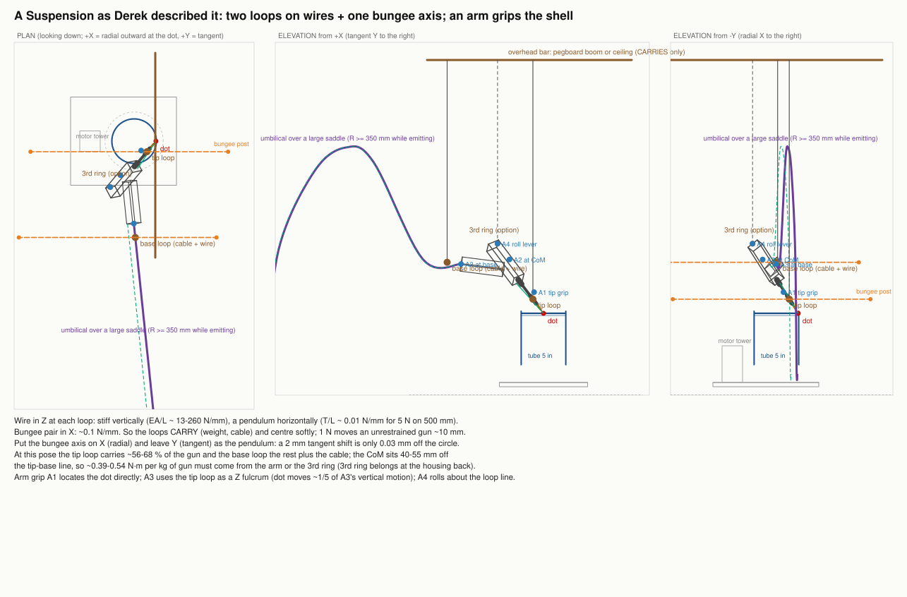

- **Suspension as stated** (carry-and-locate A). Two openable loops on wires,
  bungees in one horizontal axis, an arm gripping the printed shell, a third ring.
  - Placed on the real pose, the bungees belong on the radial axis, with the
    tangent left as the free swing.
  - The tip loop carries 56–68% of the gun.
  - The two loops' free roll lies 9.4° off Derek's grip axis; a shell trunnion
    makes it exactly the grip-axis roll.
  - The third ring belongs high at the housing back.
  - The bare float moves 10–100 mm under 1–5 N, so every usable form has something
    stiff that locates.
  - Branches: float plus arm; the bungee pressing a V-shoe on a rod that a magnet
    locks (A-r4d); "place soft, clamp at the loops, learn the clamp's shift"
    (machine-that-learns, A-r4c).
- **Wire-located suspension** (carry-and-locate B). Three stainless wires whose
  lines meet at the dot make a virtual ball joint there; three more set the angles.
  - Turning the gun about the dot moves the dot only 0.02–0.05 mm per 2°.
  - Lift-off is free, and lowering returns the pose.
  - machine-that-learns drove it as a **cable robot**: plan angle must be a tangent
    slide, and a keep-out is needed for the camera.
  - The six wires outperform the printer-leg hexapod on joint play, heat and
    lift-off.
- **Knob-wired suspension** (one-knob-one-parameter). With three wires pinning the
  dot, a wire lying in the plane of the other two axes changes only its own angle.
  - The base loop's vertical wire is the hole angle; a ring in the radial plane is
    roll.
  - The dot is set by slides under the rotator. Wires only pull, so there is no
    backlash.
  - Its thin tension margin was repaired by who-moves-what: letting the sixth wire
    attach anywhere in its plane gives about 6× the layouts and an 18.5 N margin,
    or the vertical angle can move to a couch slide.
- **Work-hung suspension** (work-as-datum). The tip loop's anchor moves from the
  ceiling to the plate being welded, via a plate hanger on the port seat, while
  Derek's arrangement stays whole as the park state.
  - carry-and-locate showed the gravity-seated V-loop is at its limit (~4 N), and
    added a sprung jaw (D1-p).
  - Branch D4 replaces the loop with a cup centred on the dot, so the room lines no
    longer reach the dot at all.
- **Gravity in the gun plane** (who-moves-what). Tilt the station about 32.5° about
  the tangent through the dot, and the gun's centre of mass falls in its grip-axis
  plane. Then one loaded support and two positioning supports suffice:
  - the cup on the plate holds the dot;
  - one vertical wire sets the hole angle;
  - a pin in a slot sets yaw;
  - Derek's rings with a light lock set roll.

  It is also a weld-process change; see the tilt cradle below.

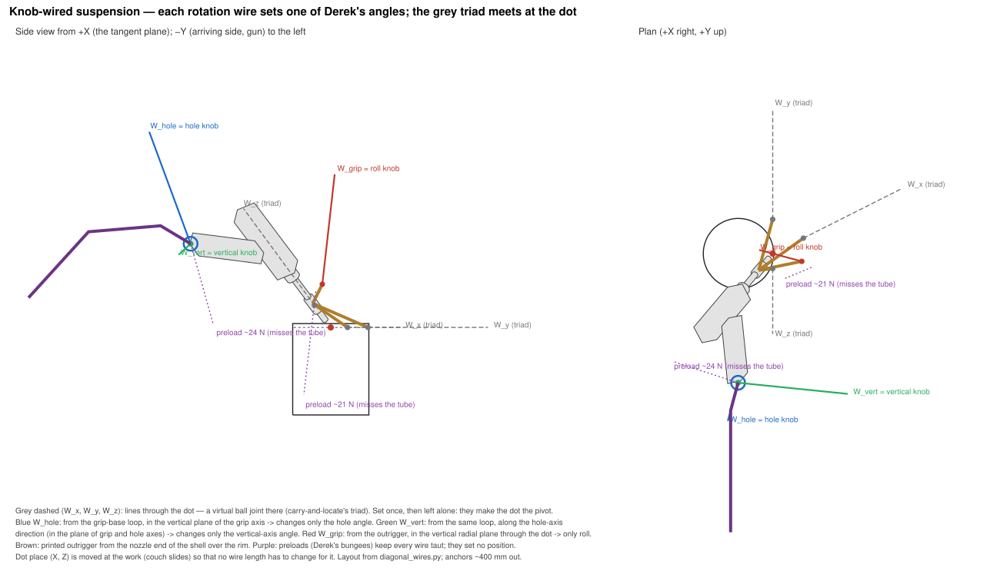

### Monitor arm

- **As proposed** (borrowed-ecosystems A0). A $36 gas-spring arm with 16k ratings,
  rated 2–9 kg.
  - It floats in every direction: zero-rate spring, friction swivels, creeping up
    under light loads.
  - It cannot hold the dot through a 48.6 s lap.
  - Its real roles are carrying the weight while Derek aims by hand, and parking.
- **The arm carries, the tube locates** (borrowed-ecosystems A1). A printed rider
  holds the tube's working end from outside:
  - wheels on the outside diameter at ±30° below the dot;
  - V-wheels on the rim;
  - a tether with a breakaway.

  The weight hangs on the arm through the centre of mass. Worst following error is
  0.017 mm at the procedure's runout limit. one-knob-one-parameter showed that
  angle wedges pivot about their seat, not the dot, moving the dot 9–17 mm per 5°.
  Their repair (A1-G) puts an XYZ stage and an arc about the dot on the rider; a
  $299 optics goniometer can be that arc.
- **The arm docks** (borrowed-ecosystems A2, who-moves-what's carrier-and-seat):
  a toolchanger ball-and-vee coupling on a post, or on the rotator base.
- **Monitor-arm session** (sequence-of-use E). The arm carries in three states and
  never locates:
  - park, in a cradle with a nozzle cap and stickout gauge;
  - hand, weightless on a bail at the centre of mass, so hand tacks stay possible;
  - dock, in latched vees with the recipe stack and a Bowden trigger.

  borrowed-ecosystems contributed the order "balance, then drag, then a little
  friction", and a load-leveller screw on the bail. The saddle belongs at the
  cable's natural apex.
- **Film-grip carrier** (borrowed-ecosystems E), a neighbour. A Steadicam-type
  spring arm on a stainless C-stand ($209–448 arm, $185 stand, hundreds to
  thousands of ratings). It has bearing hinges, so it has none of the monitor arm's
  friction creep.
  - sequence-of-use found the lifted gun's attitude is set by the umbilical, not
    gravity.
  - Their carry pins lock the gimbal until the rider lands, and LAND/WELD stops set
    the approach.

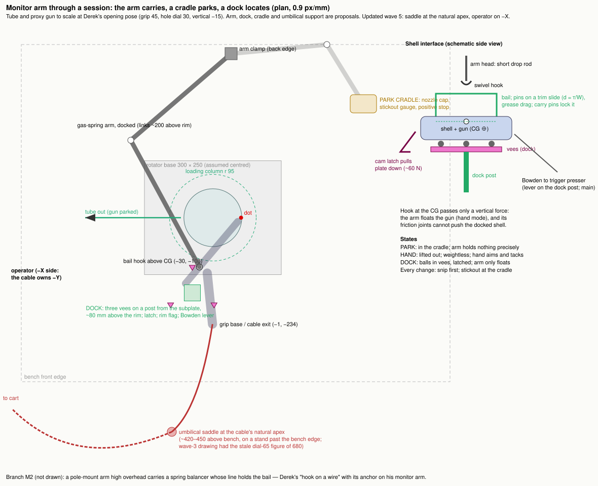

### Table opening

- **As Derek described it** (workspace-as-structure).
  - The rotator hangs on a four-post shelf under a Ø150–160 opening, rim flush with
    the top.
  - A countertop gantry runs beside the hole, not over it. The gun body sits over
    solid table on the −Y side, and only the barrel crosses the mouth.
  - A tube change is a ~70 mm shelf drop and a slide out the open face; the gun
    and cables never move.
  - Derek's edge-of-table alternative is kept as a branch.
- **Its repairs.**
  - **Drop-in collar:** one cut plate carrying rails above and posts below takes
    the wood top out of the structural loop.
  - **Collar centre (T-W1, from work-as-datum):** the shelf crank repeated the
    nest, not the corner. A spring plunger from the collar into a countersink on
    the plate's port seat makes per-tube height "crank to zero on the dial". That
    can be motorised with a NEMA 17 and a $24 RS232 dial.
- **Motorised table station** (machine-that-learns E). Derek's five motors are the
  five that matter; his Y rails already give the plan angle.
  - Z is motorised first, as LOAD/WELD buttons, because tube length dominates.
  - X/Y is a low gantry under the gun body, which cuts stage moments 3–5×.
  - A stylus in the gap between tube and opening follows the wall during the weld.
  - A PTZ camera across the bore and one at +Y; printed tags on the collar register
    their frames.
  - workspace-as-structure added a breakaway detent for the stuck-wire case, and a
    first hard umbilical clamp at least 700 mm away.
- **Split mount** (workspace-as-structure, combining work-as-datum,
  machine-that-learns, carry-and-locate and one-knob-one-parameter). Each contact
  of a 3-2-1 mount goes to the side that owns its freedom:
  - a hub pin on the port seat sets x and y;
  - two plate rollers on a line through the dot set height;
  - a foot on the collar sets tilt, and lifting it tilts the gun exactly about the
    dot (4.9 mm per degree);
  - a fence sets azimuth.

  RC62 magnets hold it down with no net force on the tube. It trades plan-angle
  range (−4.6…+2.3°) for exactness.

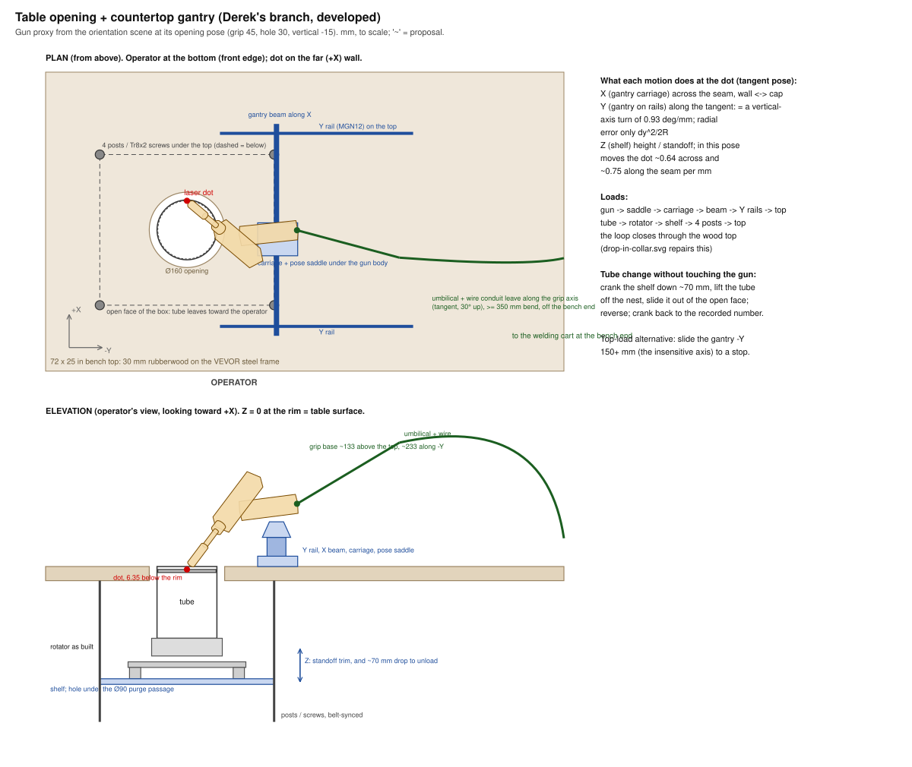
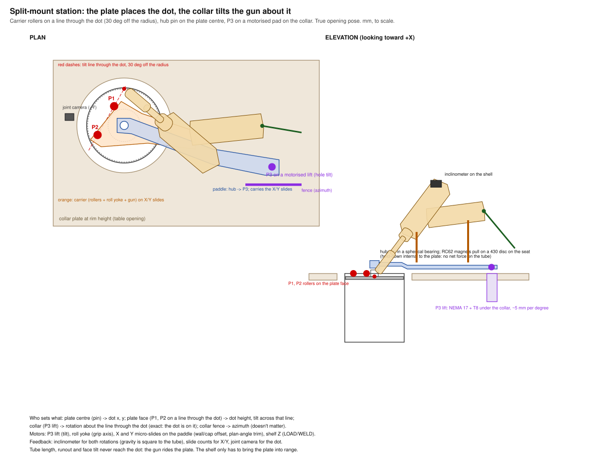

## Arrangements beyond the examples

### Carried, then docked or locked

Seven explorers produced a soft carrier docking into a stiff seat. They differ in
where the seat is, what it references, and how the lock behaves.

- **Float and dock** (carry-and-locate C). A balancer and cable saddle carry; a
  metal tongue ends in three balls in hardened-rod vees on an adjustment stack,
  pulled home by a switchable magnet. A hand on the trigger unseats it (about 5 N
  at the trigger against 40 N of preload), so a presser on the shell is required.
- **Watch first** (machine-that-learns D). No new motors: a magnet-preloaded seat
  under a bench bridge, two hand-wheel ball-screw stages with counters, and a
  camera showing dot against corner. It measures runout at the dot, reseat
  scatter, trigger push and drift — the numbers that decide how much motion to
  build.
- **Recipe cartridges** (one-knob-one-parameter). Hole and roll are frozen in
  printed pose blocks on kinematic seats; the block is the record, and hardened
  angle blocks or a sine bar set the angle.
- **Lid carrier** (sequence-of-use A). The gun rides a lid hinged behind the
  station, parallel to the tangent, 200 mm out and 60 mm above the rim. A sweep of
  80 hinge lines found this family is the only one that lifts the wire tip out of
  the corner without touching the lip. Closed, it sits on three balls in vees with
  the hinge pins in slots. Open, it goes over-centre at 71.5°. Unlatching dips the
  tip by 3.6× the slot clearance, so the latch releases from the lifting handle.
- **Countertop sled** (workspace-as-structure). The shell stands on three ball feet
  on a rim-height plate against a fence and stop: lift it off, set it back. A
  "rotator grows a deck" branch needs no bench cutting.
- **Gauge-set, lock-held** (sequence-of-use D). A printed rim gauge sets the pose
  and a holder keeps it. who-moves-what split the pose by how often each quantity
  changes and added a measuring foot that records a runout map.
- **Switch-locked skate** (carry-and-locate E). A MagJig shoe on three balls skates
  on a steel plate beside the tube; one twist locks it about 3 µm off, and magnetic
  stops remember the pose. work-as-datum showed the room plate becomes the dot's
  reference, amplifying debris 2.2×. Their repair **cup and tail (E-RA)** puts a
  cup centred on the dot on the plate hanger, and the skate at the tail holding only
  angles. Debris becomes 0.01°, and tube length becomes a 0.66° angle change.
- **Nose and tail** (carry-and-locate F, combining work-as-datum,
  workspace-as-structure and machine-that-learns).
  - The nose is held on the work by the sprung V-loop.
  - The tail is on ball transfers on a steel table beside the rotator. Its height
    screw is the hole angle (0.23°/mm) and its cross-tilt screw is roll.
  - The plan angle is on a magnet-braked link, and a float carries.
  - Rolling tail contacts plus one lockable link give exactly six constraints, so
    the nose and tail never fight.
  - E-RA and this are the same idea reached from two sides in the same wave. A
    merged form (E-RA's cup with this screw table) is not yet written.

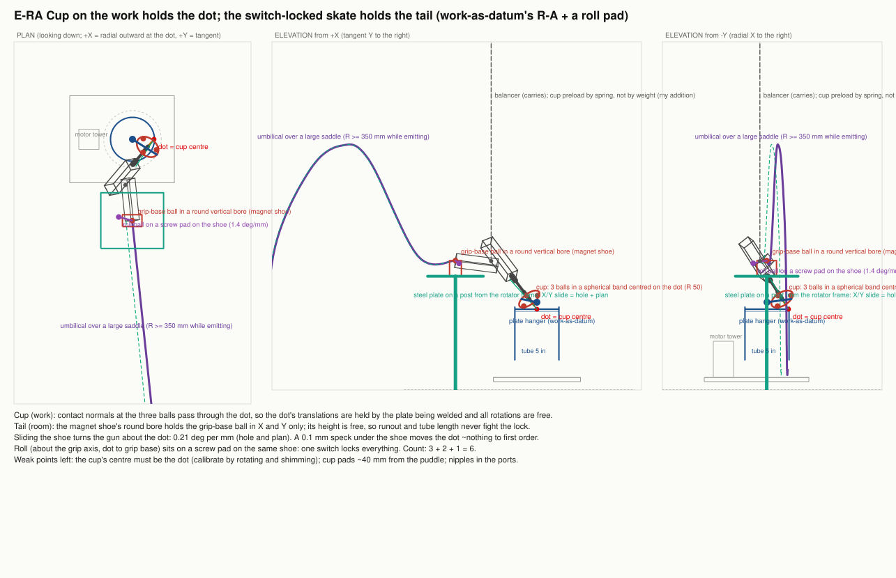

### The gun stays still; the work moves

Six explorers reached this. After setup the gun, umbilical, wire and camera never
move. Cross-slides, drawers and Z beds under the rotator do the per-tube work, and
some follow runout by moving the work.

- **Still gun, moving work** (who-moves-what). A cross-slide, a drawer and three
  fine screws under the rotator, with printed recipe blocks for the angles. After
  exchange with sequence-of-use:
  - the drawer climbs ramps into kinematic seats, which fixes drawer play (an
    invisible yaw) and supplies the drop the wire needs;
  - the plate hangs from a **stand-hung plate head**, which catches plugs in its
    ports and pulls it against pads at the dot's height. That takes tube length out
    of the corner height and makes the eight tacks fixture operations.
- **Gun stays, work travels** (sequence-of-use B); **fixed gun, moving shelf**
  (workspace-as-structure); **still gun, moving tube** (machine-that-learns A, with
  a radial X stage as the first motor and a stylus on the portal).
- **Cart station** (workspace-as-structure). The station is built on the Weldpro
  cart that already carries the welder and argon:
  - a module plate carries the rotator and gun support;
  - a rear mast gives the umbilical one fixed R 375 bend, so the cable force is a
    constant measured once;
  - the joint is at about 1 m with no bench cut.

  machine-that-learns added branch M (an X stage under the rotator on the cart) and
  a thermal treatment for the unit's heat below the module. One disagreement stays
  open: whether a gun-side motor ruins the constant cable shape, or whether a
  cable force that repeats with pose is good enough.
- **Between centres** (work-as-datum B). The gun stays rigid and the work is forced
  onto it: a spring quill down the open tube axis presses a live centre into the
  port seat, clamping the loose tube and forcing its plate centre onto a fixed
  line. It can live in the table collar (B3).

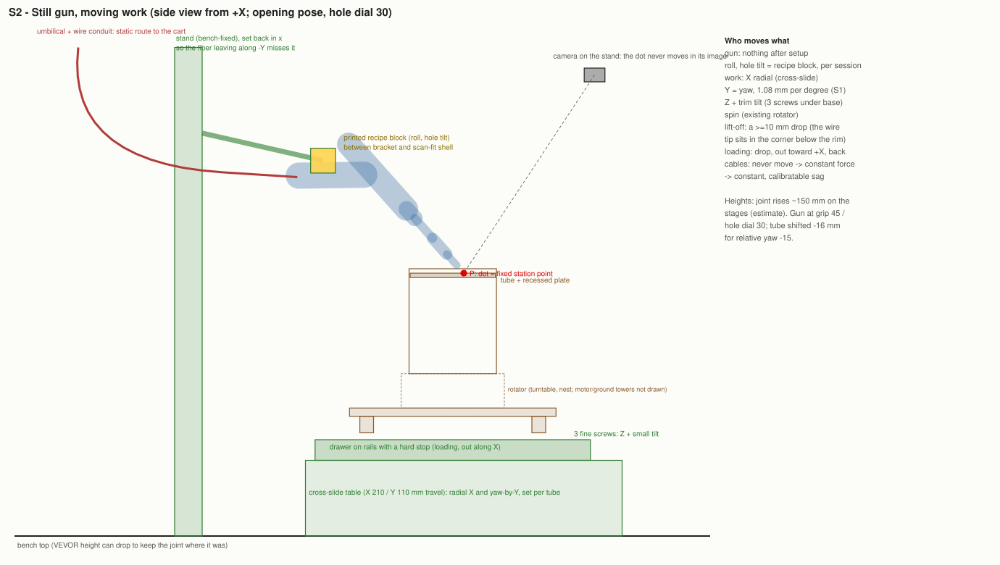

### Rotations that pivot on the dot

Every rotation axis passes through the dot, so turning an angle cannot move it.
Four explorers built this four ways.

- **Isocentric couch and gantry** (one-knob-one-parameter). Knobs that keep the
  puddle's relation to gravity go under the work; tilting knobs stay on the gun.
  borrowed-ecosystems showed:
  - the Y drawer is a yaw knob, so it needs a kinematic end or becomes the yaw knob
    and makes the couch table optional;
  - the 80 mm roll bearing can't pass the gun, so hinged clamshell rings with a
    gravity-loaded micrometer lever replace it;
  - the hole angle can rest on gauge blocks under a sine arm, the stack being the
    record.

  The **C-arm** variant loses its overhead yaw table and converges with this one.
- **Protractor and stub** (who-moves-what). The hole tilt rides a dot-centred
  arc; roll is a short shaft on the grip axis behind the butt, with the fiber off
  to one side.
- **RCM gun carriage** (machine-that-learns B). X/Y/Z stages, a hole-axis arc and a
  grip-axis yoke, every axis a hand knob before it is a motor. carry-and-locate
  showed the Y carriage 536 mm upstream still moves the dot. Repairs: a biased 90%
  balancer and an open C-ring roll bearing; branch B-t became the table station.
- **Nodal head** (borrowed-ecosystems B). Camera panorama parts or a machinist
  rotary table placed so both rolls pivot on the dot, with a cast-iron cross-slide
  under the tube.
- **Hand-steered isocentre** (borrowed-ecosystems F, combining
  one-knob-one-parameter, who-moves-what, sequence-of-use and machine-that-learns).
  Hole and roll joints through the dot are each made weightless at every angle by a
  sine-cancelling spring, damped with lens grease, locked by a bicycle disc brake,
  and read by an encoder. Derek steers them by hand while the camera shows the dot
  staying put.
- **Hexapod** (machine-that-learns C). Six printer lead-screw legs with the pivot
  in software. carry-and-locate's gas-spring preload keeps every leg in tension,
  with self-locking Tr8×2 screws. Kept beside the six-wire robot as the compact
  option.
- **Flexure trim head** (one-knob-one-parameter). Printed parallelogram and
  remote-centre flexures, driven by micrometers on 5:1 flexure levers: no backlash,
  stick-slip or lock shift. A flexure pivot's centre wanders in proportion to its
  distance from the dot, so pivots belong within about 100 mm of it.

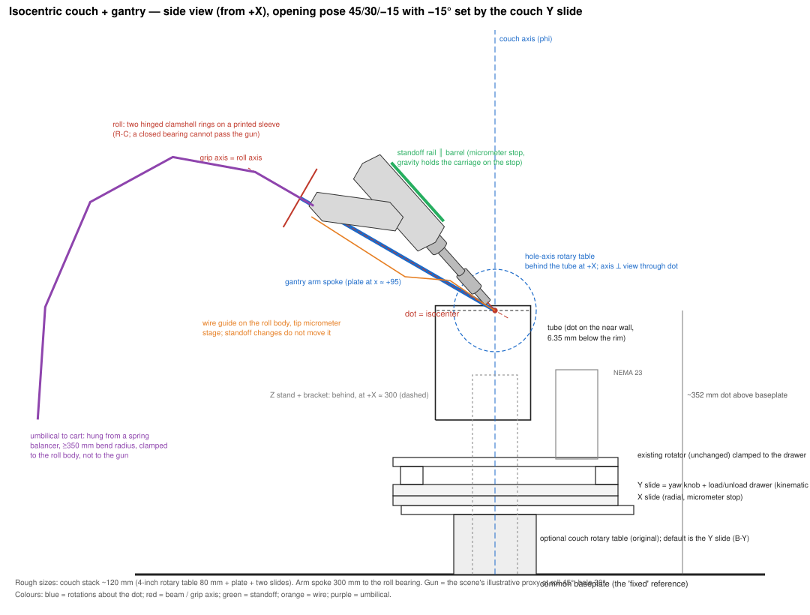
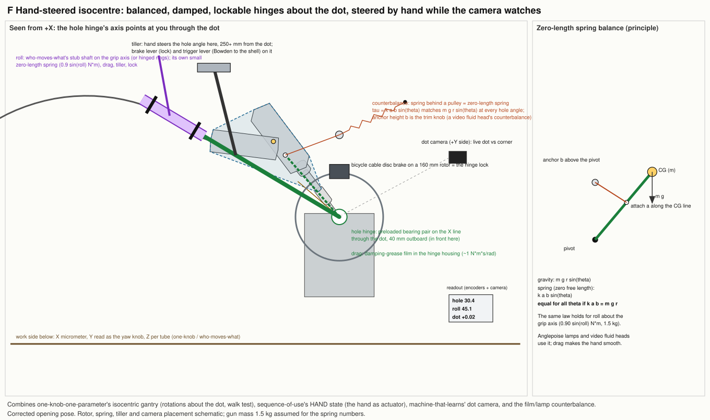

### Riding or seated on the work

- **Endcap compass and paddle compass** (work-as-datum A, with
  workspace-as-structure). Two 316 hex nipples in the plate's tapped ports and a
  seat bar give the frame the plate's own centre. Rolling contacts on the plate
  face give height and tilt. Tube length, runout, reseating and inversion drop out
  of the pose.
  - The all-plate seat can't resist a hand on the trigger.
  - The paddle moves the tilt foot to a room plane under the grip. The foot's height
    becomes the hole dial.
- **Rim and tube riders** (borrowed-ecosystems A1; carry-and-locate D with its
  stylus branch D-s; sequence-of-use C with the hand-held C-h; who-moves-what 3a;
  work-as-datum C). They differ in contact conditions:
  - pinch pairs on the lip (0.42× ovality leakage at ±30°);
  - outside-diameter wheels below the rim;
  - skids on the plate face;
  - a band-clamp collar as a clean track.

  Shared lessons:
  - A 6–8 N radial push lifts the tube, so pinch, don't push.
  - A follower 25° ahead leaves 43% of runout and 85% of ovality.
  - "Map on a cold lap at the dot's azimuth, replay by moving the work, sense live
    only for heat drift" repairs that (who-moves-what 3b,
    workspace-as-structure).
  - "Sense, don't carry" (machine-that-learns): a 0.5–1 N stylus reading a $48
    caliper scale gives a weld-time radial reference.
  - At the true pose the barrel descends through the arriving side (−9° to
    −80°), so contacts on the plate face there collide by 7–14 mm
    (who-moves-what). Rim-top and outside-diameter contacts clear.
- **Lidded mouth → L1** (workspace-as-structure's seed, work-as-datum's branch). A
  lid carrying camera and gas rides the plate 3 mm above the rim whatever the tube
  length, and parks on the collar when the shelf drops.
- **Guided hand** (work-as-datum). A router template for a turning corner:
  - a cup centred on the dot holds the dot's position;
  - a tail ball in a round bore holds two angles;
  - the hand holds only roll (1° of roll turns the beam 0.42° and leaves the dot).

  Sprung pads close the preload inside the cup, so the hand never pushes the loose
  tube. An IMU logs roll.

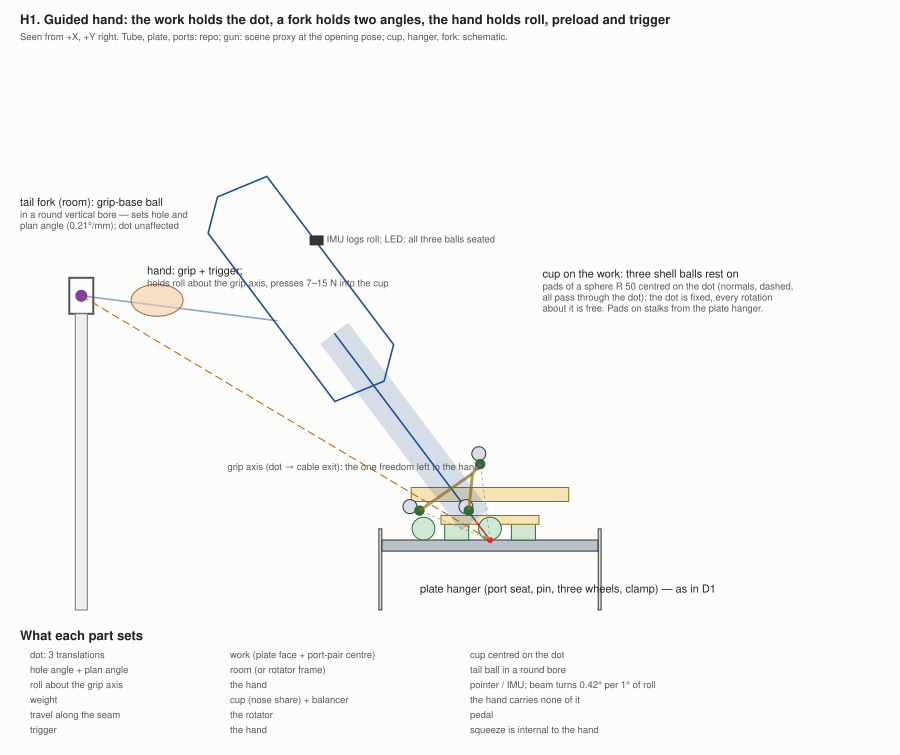

### Changing the work's orientation

- **Tilt cradle and escape rail** (who-moves-what). The whole station — gun,
  rotator, plate head — tilts on pillow-block trunnions about the tangent through
  the dot. Tilt then changes only gravity, with zero tilt being today's process.
  - At 32.5° the fillet is nearly flat and a straight escape rail becomes vertical,
    so the gun's own weight seats it.
  - Tilt about the tangent is mostly grip roll; tilt about the radial line is
    mostly hole angle.
  - It is a weld-process change: argon stops pooling in the recess beyond about 3°.
  - one-knob-one-parameter found the rail stop sets two quantities; their repair
    adds two stages chosen by what they change. Their T-g branch makes angle
    versus gravity a two-factor experiment.
  - The first-closure tube tips about its rim at about 30°, before the gravity-held
    turntable lifts at 30–40°. A band clamp and a preloaded catch answer both.

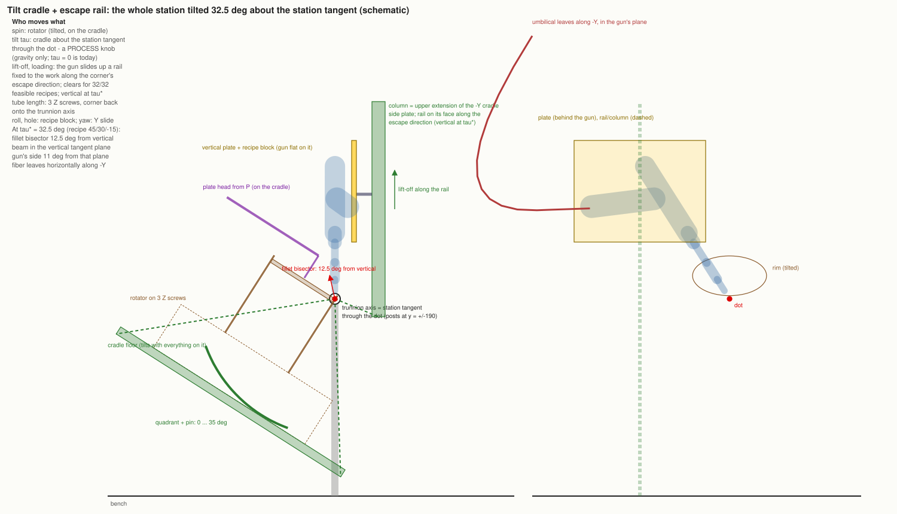

### Layers any arrangement can use

- **Session kit and stand-hung plate head** (sequence-of-use). A session-states
  chart covers 13 phases against each element's state, alongside:
  - plate hangers;
  - a stickout gauge and a 1 mm-short rule;
  - a pointer for judging the overlap;
  - a clear side for the cutters;
  - an umbilical routing rule;
  - what to record.

  The plate head fixes tacking for every stored-pose arrangement.
- **Teach, record, replay** (sequence-of-use F). The hand finds the pose on a
  weightless carrier. One clock records shell tags and IMU, the joint camera,
  console degrees and the trigger; the recipe becomes a file plus a printed block.
  Replay means dials and a dock, a guided hand with live error bars, locks, or
  motors. The cheapest first step is **F0**: record today's hand practice with a tag
  plate and an IMU, before any fixture.
- **Observation layer** (machine-that-learns). Camera placement, red-beam
  triangulation, a printed index ring for absolute table angle, a dry-run
  experiment list, a Klipper stack, and the rule that software never fires the
  laser.
- **Wire and interlock instruments** (machine-that-learns F).
  - A fixed feeder behind the gun, with the conduit in a one-bend trough: feed force
    1.2–1.5× the tip force, against 4–11× hanging.
  - A straightener and an endoscope camera on the wire tip.
  - A button-pusher on the feeder's own buttons.
  - Optical touch-off by slow stage motion.

  Nothing connects to the welder's circuits.
- **Calibration puck** (work-as-datum). A short ring of the same tube with a spare
  plate at its recess. Any plate-referenced frame can park on it, so dot
  calibration and AI dry runs can happen off the rotator.
- **Engraver gantry** (borrowed-ecosystems C). An open-frame diode-engraver gantry
  with its laser removed, on legs over the rotator. Its Y is really an angle, so the
  vertical angle becomes a G2 arc about the tube axis fitted by camera.

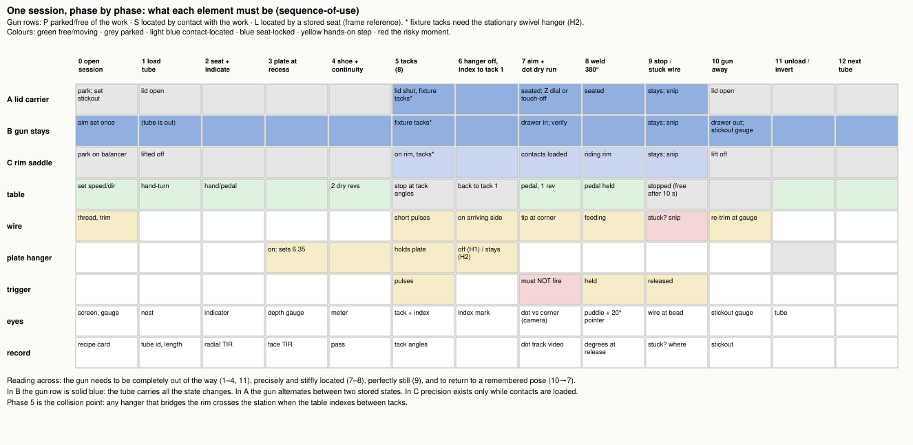

## Connections

**What combined into what**

| Combination | Built from |
|---|---|
| Split mount | work-as-datum's port seat and compass · machine-that-learns' motor order and observation · carry-and-locate's open C-ring · one-knob-one-parameter's tilts on the gun · workspace-as-structure's collar and sled |
| Nose and tail | work-as-datum's hung nose and paddle · workspace-as-structure's paddle · machine-that-learns' camera · carry-and-locate's float and lock classes |
| Cup and tail (E-RA) | carry-and-locate's switch-locked skate · work-as-datum's dot-centred cup |
| Hand-steered isocentre | one-knob-one-parameter's isocentre and walk test · who-moves-what's stub shaft · sequence-of-use's hand state · machine-that-learns' camera |
| Gravity in the gun plane | who-moves-what's tilt · work-as-datum's cup and hanger · one-knob-one-parameter's plane rule and hole wire · Derek's rings |
| Motorised table station | Derek's table and vision · workspace-as-structure's gantry and collar · work-as-datum's plunger · carry-and-locate's float and open ring · machine-that-learns' stylus and cameras |
| Monitor-arm session | Derek's monitor arm · borrowed-ecosystems' A0, film arm and bail trim · sequence-of-use's states |
| Still gun + ramps + plate head | who-moves-what's still gun · sequence-of-use's ramps into vees and plate head |
| Isocentric rider (A1-G) | borrowed-ecosystems' rider · one-knob-one-parameter's arc about the dot |
| Cable robot · place-soft-lock-stiff | carry-and-locate's wires and suspension · machine-that-learns' motors and camera |

**Pieces that transfer.**
- The port seat: two nipples, a seat bar, and a countersink at the port-pair
  midpoint.
- The plate hanger.
- The dot-centred cup.
- The stand-hung plate head, with the rim flag.
- Ramps into vees.
- The open C-ring roll bearing.
- A float biased just under 100% and hooked off the centre of mass, so every drive
  stays loaded one way.
- The switchable-magnet shoe.
- Carry pins on a carrier's gimbal.
- Bicycle disc brakes as locks; lens grease as drag.
- Gauge blocks and angle blocks as recipe records.
- Optics goniometers as bought arcs about a remote centre.
- The breakaway detent wired as an endstop.
- The stylus on a caliper scale.
- The calibration puck.
- The escape rail.
- Flexure trim stages.
- Bowden or dock-gated servo triggers.

**The same idea, reached independently.**
- The tangent slide as plan angle: four explorers.
- Still gun, moving work: six.
- Soft carrier into a seat: seven.
- Rotations about the dot: four.
- Cup and tail and nose and tail: two, in the same wave.

**Still open between explorers.**
- Whether a gun-side motor ruins a constant cable shape (workspace-as-structure vs
  machine-that-learns).
- Whether the RCM carriage's roll load changes sign. It hinges on the real centre
  of mass (carry-and-locate vs machine-that-learns).
- Carry pins vs bail trim for docking a gun hung at its centre of mass
  (sequence-of-use vs borrowed-ecosystems).
- The roll joint around the cable: hinged rings, a stub shaft with the fiber off
  axis, or unplugging the QBH once. Only the scan settles it.
- Whether the quill must lift before the shelf drops (work-as-datum vs
  workspace-as-structure).

**Connections noticed but not yet worked through.**
- E-RA's dot-centred cup combined with nose-and-tail's screw table.
- The dot-centred cup in place of nose-and-tail's V-loop, which would stop its tail
  screws moving the dot.
- Checking every dock's final approach against who-moves-what's escape direction.
- The flexure pivots and escape rail in place of the isocentric station's drawer,
  retract lever and roll rings.
- The rider's outside-diameter wheels as the X stop in the isocentric stations.

## What came from beyond Derek's examples

The four explorers who started without the examples originated:
- the endcap and paddle compasses, the port seat, plate hanger, dot-centred cup and
  calibration puck;
- between centres, the lip collar, the guided hand;
- the isocentric couch and gantry, the C-arm, recipe cartridges, flexure trim
  stages;
- the lid carrier, the session-states chart, the stand-hung plate head, the
  wire-escape rule, teach-record-replay;
- still gun moving tube, the RCM carriage, the hexapod, watch-first, the observation
  layer, and the wire and interlock instruments.

The four who started with the examples went beyond them too:
- the wire-located suspension and cable robot, float and dock, rim carriage,
  switch-locked skate and the lock-shift classes;
- the drop-in collar, countertop sled, lidded mouth, cart station and split mount;
- the protractor and stub, the tilt cradle and escape rail, gravity in the gun
  plane;
- the nodal head, engraver gantry, film-grip carrier and hand-steered isocentre.

The reframings in "What the swarm came to understand" are mostly theirs jointly.

## Sourcing

171 representative parts were observed, each with price, stock or delivery
signal, and evidence for volume or interchangeability. They are compiled in
[`sourcing/README.md`](sourcing/README.md), with the per-explorer files beside it.

Strong practical routes (Prime, in stock, high volume or standard sizes):
- spring balancers;
- cast-iron cross-slides;
- SFU1605 ball-screw stages;
- MGN12 rails and Tr8 lead screws;
- gas-spring monitor arms;
- C-stands;
- stainless wire rope and turnbuckles;
- switchable magnets;
- V-groove bearings;
- 316 hex nipples and NPT plugs;
- IMUs and magnetic encoders;
- bicycle cable and disc-brake kits;
- USB and PTZ cameras;
- SendCutSend plate, which states cut tolerance and short production times.

Thin evidence, noted where it matters: low stock or few ratings on specific
listings of stainless ball transfers, 4 in rotary tables, the optics goniometer,
hand-wheel stages and closed-loop stepper boards. Most are standard sizes with
substitutes.

## Questions only Derek's observation can answer

Grouped. Each unlocks several arrangements at once.

**The gun and its cables**
- Gun mass and centre of mass, alone and in a shell. A kitchen-scale hang test
  answers this and the next together.
- The umbilical's pull at the grip butt, its real exit direction, and its clearance
  from the grip axis; the wire conduit's pull.
- Trigger force and travel.
- When a gun scan will exist. Every clearance here is on the proxy.

**The process**
- The real nozzle standoff.
- Whether the idle red beam coincides with the process beam and sweeps with the
  wobble motor.
- Which part of the gun carries the interlock contact during a wire-fed weld, and
  whether the unit shows gun-to-work contact with the trigger released. Check with
  the key off first.
- How hot the region 10–50 mm above the rim gets during a lap.
- How much roll or angle wander changes the bead. Logged experiments answer this.

**The work**
- Tube length spread and end squareness.
- Whether runout is eccentric or oval, at the rim versus at the plate.
- How the plate is held at its recess before the first tack.
- Whether 316 nipples or NPT plugs may sit in the ports while welding, and the port
  chamfer size.

**The shop**
- Where the rotator's motor and ground towers sit, and where Derek stands.
- The VEVOR top's crossbars, and whether cutting a top is acceptable.
- Ceiling and pegboard positions.
- The Weldpro's tray heights.
- The X1 unit's cooling-air path and idle draw.
- The feeder's size, buttons and pullback setting.

**Decisions only Derek can make**
- A breakaway contact in the pedal loop.
- A trigger actuator that works only when docked.
- Disconnecting the QBH once to fit a closed bearing.
- Steering an angle mid-bead as an experiment, or only setting and locking.

**Cheap observations that would move many ideas at once**
- The hang test.
- One ELP frame of the real corner and dot on brushed 316L.
- Recording one session of hand practice with a tag plate and IMU (F0).

## Blind spots

- **Conventional robot arms.** Nobody looked at buying one: used industrial or
  collaborative arms, or the low-cost desktop six-axis arms. Every arrangement here
  is built up from parts. The brief's "does not require a conventional six-motor
  arm" was read as a reason to look elsewhere, not as excluding one.
- **Orbiting the gun.** Moving the gun around a still tube was set aside early
  because the fiber would twist about 380° per lap. Limited-arc or back-and-forth
  variants were not developed.
- **The gun itself.** Every clearance, cable direction and mass-dependent margin
  rests on the proxy. Several arrangements could look different once the gun is
  scanned and weighed.
- **The weld process.** The process window is unmeasured, so how much precision any
  support must provide stayed an open question throughout. The tilt family changes
  the process itself.
- **Physical effects no one modelled.** Heat near the rim, spatter on rolling
  contacts, and thermal drift were estimated, not modelled.

## How this was run, and what it used

**Structure.**
- One coordinator (the main session) and eight explorer subagents.
- Each explorer was continued between waves by message, so it kept its own context
  from first pass to final pass.
- All eight started from a fresh context holding only their brief and the repo's
  standing instructions.
- The four without examples were told not to open the prompt, the examples file or
  other explorers' files until the exchange. Two of them reported seeing other
  explorers' Chrome tab titles and scratchpad file names in passing, without
  opening them.
- After the first pass everything was shared, and pairs were always drawn across
  the two starting groups.

**Corrections during the run.**
- In the second wave, five explorers were found to have passed the hole dial
  straight into `posePoint`, missing the scene's 35° offset. All recomputed at the
  true opening pose. Results at dial 65 are kept where they appear, labelled.
- The harness did not let subagents write report files. The coordinator saved each
  `summary.md` from the text the explorer returned.
- Claude in Chrome was disconnected for the first minutes of the run. All sourcing
  happened after it reconnected, in Derek's signed-in session.

**Usage, as the runtime reported it.**
- The runtime's per-explorer token figures, taking the last value each reported,
  total 5.81 M. The runtime does not say whether the figure is cumulative processing
  or context size.

  | Explorer | Tokens | Tool calls |
  |---|---:|---:|
  | carry-and-locate | 702 k | 220 |
  | workspace-as-structure | 670 k | 188 |
  | who-moves-what | 904 k | 689 |
  | borrowed-ecosystems | 753 k | 269 |
  | work-as-datum | 710 k | 196 |
  | one-knob-one-parameter | 751 k | 210 |
  | sequence-of-use | 648 k | 170 |
  | machine-that-learns | 667 k | 175 |

- In all, 2,117 tool calls over about 13.5 agent-hours of explorer runtime.
- At the end the coordinator session's context held about 574 k tokens.
- The account's plan meters read 38% of the 5-hour window and 54% of the weekly
  limit. Their values before the run weren't captured, so the run's share isn't
  known.
