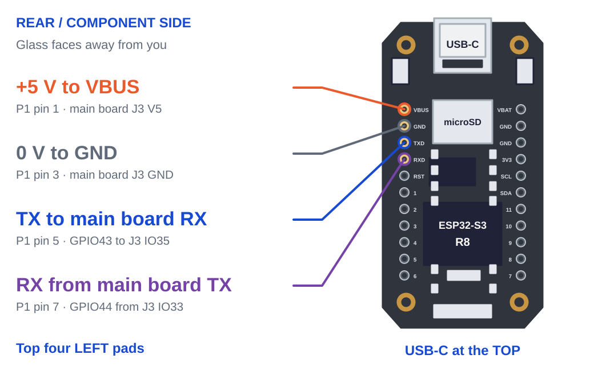
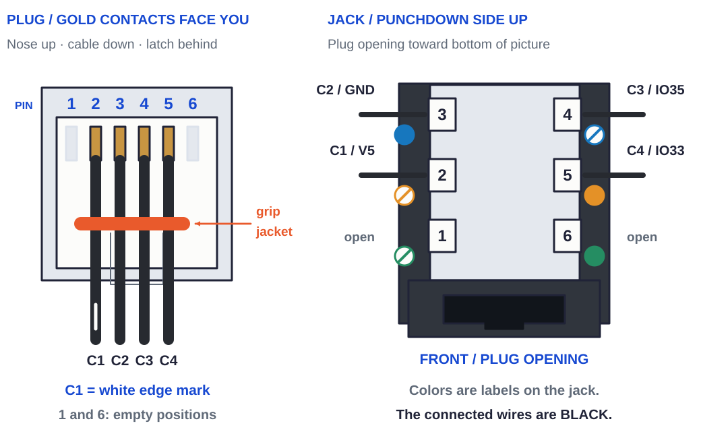

# Faucet and Umbilical

[Illustrated faucet assembly guide](../faucet-assembly-guide/README.md):
18 Letter bench pages, with the [rear display wiring on page 2](https://homesodamachine.com/read/faucet-assembly-guide/faucet-assembly-guide.pdf#page=2).

The production procedure for the above-counter fixture stack and the 4-tube umbilical that connects it to the +Y wall of back-top — the visible half of the appliance from the user's perspective. The faucet and the umbilical ship as **one permanently-attached unit**: the retained donor washer and nut are factory-preloaded on the bare shank before the carbonated-water LLDPE tube is clamped into the Westbrass's upstream compression port, and that tube is never separated again. The two flavor LLDPE tubes route through the faucet-shell's pill slot up into the printed gooseneck's dispense channel where they terminate at the printed tip — black end to end on a Black faucet; on a White faucet white through the faucet, each joined to its black run in the umbilical by a John Guest union inside the braid's top. The customer (or their installer) drills the 1-3/8" countertop hole, drops the complete faucet+umbilical through it from above and pushes it back until the rear tube bundle reaches the hole's wall — the faucet seats itself, nothing is measured, and the gasket still covers the hole behind by [5.132 mm](GASKET_COVER) there — **slides the under-counter plate laterally into the captive mount stack from below** so the shank and tubes enter through the plate's open-edge channels and seat in their terminal pockets, then hand-tightens the same retained nut. At the far end, the three beverage tube tails push into the PP1208E bulkheads and the 4 mm OVER tail enters its ABU44M-E bulkhead on the appliance's +Y wall of back-top and the signal ribbon's plug clicks into the keystone jack beside them.

This bench runs in parallel with the main appliance chain. Its inputs are upstream of [`pressure-vessel.md`](/hardware/assembly/pressure-vessel.md) and its output ships in the carton alongside the finished enclosure produced by [`finish-pack-ship.md`](/hardware/assembly/finish-pack-ship.md). Design intent for the user-facing surface lives in [`/hardware/README.md`](/hardware/README.md) "User-facing surfaces"; the gooseneck carries one 3/8" soda faucet tube and two 1/4" flavor tubes out over the glass — see [`/hardware/printed-parts/faucet/faucet-shell/`](/hardware/printed-parts/faucet/faucet-shell/) and that part's [`MATERIAL.md`](/hardware/printed-parts/faucet/faucet-shell/MATERIAL.md).

The drain ends square with local mouth clearance in the tip. Its round Ø4 mm
underside hole is a visible fault-drip indicator over the bowl. Continuous close-fitting
passages carry the tubes and conductors; incidental leakage into
the housing is accepted during this major fault. Aim the faucet into the bowl
and keep the hole exposed after tightening the mounting nut.

## Scope

In: the separate PET-GF15 faucet shell pieces, display cover and above-counter plate; the printed lever; a bare harvested Westbrass with its washer and shank nut; the display and assembly fasteners; the printed TPU thimble and above-counter gasket. These are assembled around the tubes and ribbon at this bench following [`faucet shell assembly`](/hardware/printed-parts/faucet/faucet-shell/ASSEMBLY.md). Also required: one SendCutSend 0.060" SS under-counter plate (ships loose in the install bag — slides onto the umbilical at install through its open-edge channels); 3× 1/4" OD LLDPE umbilical tubes cut to length (1× blue carbonated-water + 2× black flavor), and on a White faucet 2× white 1/4" OD LLDPE flavor runs for the faucet and 2× John Guest PP0408W unions joining them to the black; one 3/8" OD LLDPE soda faucet tube for the gooseneck, in the faucet's finish; one white 4 mm OD LLDPE OVER tube; one Siptenk 1/4" OD brass tube stiffener for the carbonated-water tube end that lands in the Westbrass's upstream compression port; CARGEN nitrile foam pipe-insulation segments; PET braid sleeve segments; one PET-GF umbilical organizer; four printed tube collars; one unterminated BNTECHGO 28 AWG 4-conductor signal cable carrying the faucet display link (SIG-6: TX / RX / 5 V / GND) through the countertop, plus one loose RJ11 6P4C modular plug for its wall end.

Out: a complete above-counter fixture stack permanently attached to its umbilical — Westbrass captured in the faucet shell; retained donor washer and nut captive on the shank; blue carbonated-water supply connected at the Westbrass's lower upstream compression port; 3/8" soda faucet tube sealed into the top port and routed through the gooseneck; two flavor LLDPE tubes routed through the shell's pill slot and gooseneck to the printed tip, on a White faucet white to their unions inside the braid's top and black from there; four sleeved umbilical tubes terminated bare and push-to-connect-ready at the +Y wall of back-top, each wearing its own printed collar on the bare stretch below the braid; foam insulation only on the cold blue tube; factory-fitted SIG-6 ribbon + tube bundle co-sleeved below the countertop, with one organizer below the mounting workspace. Bagged with the one loose part the countertop mount needs, the SS under-counter plate (the TPU gasket and donor mount hardware are already captive on the faucet), drop-shipped inside the appliance carton.

Not in scope: countertop drilling itself; the customer-side install steps — drop-through from above, slide the under-counter plate laterally above the captive washer, hand-tighten the same retained nut, push-into-PP1208E at the +Y wall of back-top — covered in the install guide that ships with the appliance ([`/hardware/install-guide/`](/hardware/install-guide/README.md); packing and content contract: [`/marketing/unboxing-and-installation.md`](/marketing/unboxing-and-installation.md)). The J3 loom that lands SIG-6 on the main board inside the cabinet is `wiring.md`; no signal conductor is cut, crimped or stripped in the field — the customer's whole share of SIG-6 is pushing one plug into one jack.

## Inputs per appliance

Per-unit BOM lives in [`/hardware/ledger/bom.md`](/hardware/ledger/bom.md) §9 (Dispensing — Westbrass, under-counter plate, foam insulation) and §8 (Flavor subsystem — Siptenk stiffener for the carbonated-water tube end at the Westbrass upstream port). The table below is the procedure-level summary; bom.md is the source of truth for per-unit allocation and cost.

The blue 1/4" carbonated-water supply compression-connects to the bottom of the Westbrass with a Siptenk stiffener under the brass ferrule. Water rises through the Westbrass and leaves its top port in a separate 3/8" LLDPE soda faucet tube. That soda faucet tube and the two 1/4" flavor tubes share the printed gooseneck and exit at the tip; only the flavor pair enters through the shell's pill slot.

| Item | Source | Notes |
|---|---|---|
| PET-GF umbilical organizer × 1 | [`umbilical-organizer`](../printed-parts/faucet/umbilical-organizer/README.md), BOM §7 | Ø32 × 10 mm; three Ø[6.65 mm](ORGANIZER_TUBE_BORE) beverage bores from the accepted A fit, a Ø[4.40 mm](ORGANIZER_DRAIN_BORE) drain bore and a loose Ø5 mm signal passage. Thread it before the flavor unions, blue-tube compression connection and signal plug. |
| Separate faucet shell pieces, display cover, above-counter plate, display and bare Westbrass | Parts and hardware listed in [`faucet shell assembly`](/hardware/printed-parts/faucet/faucet-shell/ASSEMBLY.md) | PET-GF15 prints, M3 heat-set inserts and screws, harvested donor body and retained lever. Keep the donor washer and shank nut separate until the gasket is fitted. Assemble around the soda tube, flavor pair and unterminated ribbon during step 2. |
| Siptenk 1/4" OD brass tube stiffener × 1 | B0FM77LLM1 (100-pk) | Inside the carbonated-water LLDPE tube end that lands in the Westbrass's upstream compression port, so the soft tube doesn't crush under the brass ferrule. Only one stiffener per build — the two flavor tubes do not enter any compression port and need no stiffener. |
| TPU above-counter gasket (printed) | [`/hardware/printed-parts/faucet/above-counter-gasket/`](/hardware/printed-parts/faucet/above-counter-gasket/) | Sits between the above-counter plate's underside and the countertop top surface. **Installed at this bench**, threaded over the flavor tails, unterminated ribbon and shank during step 2 before the retained mount hardware and blue-tube connection go on. Stays permanently on the shank from this point forward. Customer never touches it. |
| TPU O-ring (printed) | [`/hardware/printed-parts/faucet/tpu-o-ring/`](/hardware/printed-parts/faucet/tpu-o-ring/) | TPU 90A **thimble** (closed bottom with a Ø [6.5 mm](CAP_HOLE_D) centered hole, open top) that seats in the harvested Westbrass's Ø [10 mm](WESTBRASS_PORT_D) top water port. Outer Ø [10.44 mm](ORING_OUTER_D) ([0.22 mm](WESTBRASS_SQUEEZE) radial squeeze against the port wall), cylinder ID Ø [9.2 mm](ORING_INNER_D) ([0.1625 mm](LLDPE_INTERFERENCE) interference grip on the 3/8" LLDPE OD), [15.6 mm](TOTAL_H) total height ([2.1 mm](ORING_CAP_T) cap + [13.5 mm](CYL_L) cylindrical sealing band). Two seals in series: radial compression along the cylinder + face seal where the LLDPE's bottom end presses against the cap; cap hole sized between LLDPE ID ([6.35 mm](LLDPE_ID)) and OD ([9.525 mm](LLDPE_OD)) so the tube bottoms out positively and water flows through the cap hole into the LLDPE bore. Install order: thimble cap-down into the port first, then push the 3/8" LLDPE down through the open top until it bottoms on the cap. Consumable — expect to use a fresh thimble on any future re-assembly. |
| 3/8" OD LLDPE (soda faucet tube), in the faucet's finish | Black: FWS 25 ft stock, purchase `WEBFWS100673540` ([`purchases.md`](/hardware/ledger/purchases.md)). White: neoFlo LLDPE6-WHITE ([`bom.md`](/hardware/ledger/bom.md) §9) | Cut to [330](SODA_FAUCET_CUT) mm. Internal to the faucet: sealed into the Westbrass's top water port by the TPU thimble, then routed through the center gooseneck channel to the printed tip. It is not an umbilical tail. |
| SendCutSend 0.060" 316 SS under-counter plate | `under-counter-plate.dxf` ([`/hardware/cut-parts/faucet/under-counter-plate/`](/hardware/cut-parts/faucet/under-counter-plate/)) | Purchased S4177511 profile: single-piece Ø [54.45 mm](PLATE_D) disc, Ø [12.6 mm](SHANK_HOLE_D) shank pocket and [13.4 mm](PILL_L) × [7.05 mm](PILL_W) rear pocket. The [12.6 mm](SHANK_HOLE_D) shank channel and [7.05 mm](PILL_W) rear channel open in DXF −Y (world +X), with R [1.5 mm](FILLET_R) channel-mouth fillets. F1/D/F2 and the flat ribbon share the rear channel toward its open side. The printed mounting stack and routing fit this fixed steel profile. Order qty 1 per appliance. |
| 1/4" OD LLDPE, blue (carbonated water) | FWS neoFlo blue spool ([`/hardware/ledger/bom.md`](/hardware/ledger/bom.md) §3) — one of the four the machine is plumbed in, per [`/hardware/printed-parts/enclosure/y-wall-of-back-top/README.md`](/hardware/printed-parts/enclosure/y-wall-of-back-top/README.md) "Umbilical port — tube identification" | Cut to length once; color-coded blue to match the blue-ringed PP1208E bulkhead on the +Y wall of back-top, and the same blue as the riser inboard of it |
| 1/4" OD LLDPE, black (flavor lines) × 2 | FWS bulk spool ([`/hardware/ledger/bom.md`](/hardware/ledger/bom.md) §3) | Cut to length once each: the whole flavor tube on a Black faucet, the umbilical's run from its union on a White one. Bare black at the wall, matches the two unmarked PP1208E bulkheads on the +Y wall of back-top |
| 1/4" OD LLDPE, white (White faucet flavor runs) × 2 | neoFlo LLDPE4-WHITE, the §3 tap-water spool ([`/hardware/ledger/bom.md`](/hardware/ledger/bom.md) §9) | White faucet only. Printed tip to its union, through the faucet |
| John Guest PP0408W 1/4" union × 2 | FWS PP0408W ([`/hardware/ledger/bom.md`](/hardware/ledger/bom.md) §9) | White faucet only. Joins each white flavor run to its black run, end to end inside the braid's top — [`/hardware/reference/jg-pp0408w/`](/hardware/reference/jg-pp0408w/) |
| CARGEN nitrile foam pipe insulation, 1/4" ID × 3/8" wall, 1-ft segments | B0D2XFK337 ([`/hardware/ledger/bom.md`](/hardware/ledger/bom.md) §9) | **Cold tube only.** Foam ships as 1-ft segments and is installed segment-at-a-time. Five segments per umbilical, covering [1284](FOAM_LENGTH) mm of the blue tube |
| Cable sleeve — Alex Tech 1" PET expandable braid, five 1-ft segments | B075VRDS53 ([`bom.md`](/hardware/ledger/bom.md) §11 "Umbilical sleeve") | Over all four tubes + the signal cable, one segment to each foam segment, on the foam's own run. 1" nominal expanding 50%; the pack opens it to Ø[33.08 mm](SLEEVE_BORE). ~5 ft per build |
| Printed tube collar × 4 | [`/hardware/printed-parts/faucet/tube-collar/`](/hardware/printed-parts/faucet/tube-collar/README.md) | `tube-collar-carb` on the blue tail, `tube-collar-flavor-a` and `-flavor-b` on the two black. The +Y wall of back-top's own chip bored for the tube and run [30 mm](COLLAR_LENGTH) along it — same word, same spool, threaded on end-first up to the braid's own end. `tube-collar-drain` identifies the white 4 mm drain. The other two stations' collars go onto the customer's tap-water run and CO2 tether at [`finish-pack-ship.md`](/hardware/assembly/finish-pack-ship.md) §6 |
| Umbilical signal cable (BNTECHGO 28 AWG 4-conductor ribbon) | B07PNPHWMG ([`/hardware/ledger/bom.md`](/hardware/ledger/bom.md) §9) | Single run from the gooseneck faucet display down to the wall, carrying SIG-6 (faucet display: TX / RX / 5 V / GND). Stated section [1.3 × 4.1 mm](RIBBON_SECTION) ± 0.1. |
| RJ11 6P4C modular plug, 3-prong × 1 | B0DK4V733Q ([`/hardware/ledger/bom.md`](/hardware/ledger/bom.md) §11) | Crimped onto the ribbon's wall end at step 2. Mates the RiteAV keystone jack on the +Y wall of back-top ([`../printed-parts/enclosure/y-wall-of-back-top/README.md`](/hardware/printed-parts/enclosure/y-wall-of-back-top/README.md) station 7). 3-prong contacts for stranded. |
| 2× low-capacitance ESD TVS (ESD9B3.3-class / PESD3V3-class, SOD-923) — **optional** | onsemi ESD9B3.3ST5G or Nexperia PESD3V3L1BA (≤ 15 pF, 3.3 V, bidirectional) | **Optional** faucet-end ESD clamp (defense-in-depth only). The primary faucet-UART clamp is now on the main board (D10/D11 at U1), so a cable-end TVS is **not required** — fit only if a builder wants a second clamp at the user-touch source (see the ESD note below). |

Tooling (per-build-amortized only; single-asset tools live in [`/hardware/ledger/purchases.md`](/hardware/ledger/purchases.md), not here): Mudder PEX/PE tube cutter (the cold kit's own, [`/hardware/ledger/bom.md`](/hardware/ledger/bom.md) §14 — one SKU at the bench and in the kit).

### Faucet-display ESD protection (on the main board — no build step here)

The faucet display is the one user-touched surface on the appliance, at the far end of a ~1 m
umbilical — so its two TTL UART lines are the most ESD-exposed nets on the main board. The **primary**
clamp is now **on the main board, at the ESP32**: each TTL line is clamped by a low-cap TVS shunting
the U1-side of its series resistor to the GND plane — **D10 on IO33 (TX), D11 on IO35 (RX)**, onsemi
**ESD9B3.3ST5G** (SOD-923, 3.3 V, bidirectional, ~15 pF), each with a via-in-pad straight to the
plane (shortest loop). A strike up the ribbon is current-limited by the 220 Ω series resistor (R26/
R27) and clamped to ~3.3 V at the ESP32 pin. **This means no ESD build step is required at the faucet
end.**

- **Optional (defense-in-depth only):** a builder may still fit **2× low-cap ESD TVS** at the
  faucet-display connector — one from each TTL line to the faucet-side GND — for a second clamp at the
  user-touch source. Same part class (**ESD9B3.3 / PESD3V3, ≤ 15 pF, SOD-923**, e.g. onsemi
  ESD9B3.3ST5G or Nexperia PESD3V3L1BA), mounted on the last ~10 mm of ribbon (the connector's
  carrier/adapter PCB or a small flex/dead-bug tab, since the stock **Waveshare
  ESP32-S3-Touch-LCD-1.47** module carries no spare pad), GND stub **< 5 mm**. This is not required —
  the main board already clamps the ESP32 pin.
- The 5 V and GND conductors are not clamped (rail + return); only the two TTL signals.

Full spec and part rationale: [`/hardware/assembly/cable-assemblies.md`](/hardware/assembly/cable-assemblies.md)
"Faucet-display ESD protection (SIG-6)", with the main board placement in
[`/hardware/pcb/pcba/jlcpcb-parts.md`](/hardware/pcb/pcba/jlcpcb-parts.md) (D10/D11) and
[`/hardware/pcb/pcba/pcba.tsx`](/hardware/pcb/pcba/pcba.tsx) (FAUCET block).

## Procedure

### 1. Cut the LLDPE tubes to length

Cut **1× blue carbonated-water at [1540](BLUE_CUT) mm**, the flavor pair in the faucet's finish, and **1× 3/8" soda faucet tube at [330](SODA_FAUCET_CUT) mm** from the finish's own 3/8" stock. Use the Mudder cutter for square ends without burrs.

- **Black faucet: 2× black flavor at [1963](FLAVOR_CUT) mm.**
- **White faucet: white flavor-a at [534](WHITE_A_CUT) mm and flavor-b at [492](WHITE_B_CUT) mm, black flavor-a at [1420](BLACK_A_CUT) mm and flavor-b at [1462](BLACK_B_CUT) mm.** Each white run reaches from the printed tip to its union's tube stop and each black run from the other stop to the tail, with [9.8 mm](UNION_GAP) of union between the two ends, so the tails land where a Black faucet's do. Flavor-b's union stands one union length above flavor-a's (step 2), so its white run is the shorter and its black run the longer.

The flavor pair follows [370.4](FAUCET_FLAVOR_RUN) mm of centreline above the shell foot, then passes through the plate, gasket and countertop and down past the unions' stations into the pack. The blue tube starts at the donor shank's lower compression port. The factory cut difference of [423](CUT_DIFFERENCE) mm comes from those complete CAD routes, including both lower return steps, the gathers and the splayed tails. The resulting tails land within [0.34](TAIL_OFFSET) mm of one plane before trimming the outlets flush. These lengths preserve the blue tube's installed reach.

The design length sums a measured half and an assumed half:

| Term | mm | Basis |
|---|---:|---|
| Drop, countertop underside → appliance top plane | 418 | 34.5" carcass − 4" toe kick − 3/4" deck = 755.7 mm interior clear, less the enclosure height |
| Down the rear face to the flavor-bulkhead axis | 42 | CAD |
| Turn-in at the wall — lead + 90° at R12 + collet | [60](TURN_IN) | CAD |
| Horizontal inside the cabinet, faucet hole → drop line | 380 | 36" sink base: faucet on the sink centreline, appliance at one end |
| Service loop — the appliance comes forward to reach its own +Y wall of back-top | 300 | pull-forward to put the +Y wall of back-top at the cabinet face |
| **Below-counter subtotal** | **1200** | |
| Countertop slab | 30 | 3 cm stone; routing allowance extends to 38 mm, with donor clamp engagement assessed separately |
| TPU gasket + above-counter plate | [6](PLATE_GASKET) | CAD |
| Gooseneck centreline, shell foot → printed tip | [370.4](FAUCET_FLAVOR_RUN) | CAD |
| **Flavor tube, nominal installed** | **[1606](FLAVOR_NOMINAL)** | |
| **Blue tube, nominal installed** | **[1186](BLUE_NOMINAL)** | CAD: compression port below the countertop underside |

**Reach beyond nominal: 350 mm per tube**, held separately from the sum — 8 mm of countertop routing allowance, 25 mm for cabinet-height variance, 300 mm for an appliance at the far end of the sink base rather than the near end, 20 mm for two square cuts should the run ever be trimmed. The rounded factory cuts include this allowance and the small gather-path correction. The routing allowance does not establish the donor clamp's maximum countertop thickness; [faucet shell assembly](/hardware/printed-parts/faucet/faucet-shell/ASSEMBLY.md) records its thread budget.

The umbilical installs at this length, uncut: a nominal kitchen loops the reach in the cabinet, and that loop is the service loop that brings the +Y wall of back-top to the cabinet face ([`/marketing/install-envelope.md`](/marketing/install-envelope.md)). A second cut, taking the wall end down to the cabinet's own length, belongs to the cold kit's guide and not to the install — so do not cut tight here.

Cut one continuous white neoFlo LLDPE4M-WHITE 4 mm drain run to [1872](DRAIN_CUT) mm, including the supplied cabinet and service reach. Feed it between the flavors through the rear plate/gasket passage and shell, with the ribbon flat behind the bundle. The lower bundle sits toward the steel channel's open side and eases back to the centered neck arrangement inside the base. Below the counter use R25 bends around the two flavor unions and gather it against the opposite side of the cold-line foam under the common braid. With the tip separate, set the square drain end at its terminal datum, leaving the 3 mm mouth clearance empty; keep its bore clear of other tubes. Keep the supplied run long enough for the cabinet service reach and R25 bends. [ASSE drain assembly](/hardware/assembly/asse-drain.md) gives the fitting and routing sequence.

### 2. Assemble the faucet; preload the mount hardware

Start with the separate prints, bare donor, tubes and unterminated SIG-6 ribbon. Complete the base, neck and display steps in [`faucet shell assembly`](/hardware/printed-parts/faucet/faucet-shell/ASSEMBLY.md): seat the donor with the soda tube absent, lower the lever aft of its working position and slide it forward around the valve cylinder, then install the fresh TPU thimble and soda tube. The installed soda tube blocks the lever's aft disengagement. Feed the continuous drink tubes and flat insulated ribbon through the tip's smooth shared passage. Set the square-cut D end at its terminal datum with the 3 mm mouth clearance empty and the tube bore clear. Close the curved joint and plate, then connect and enclose the display. Set only the three beverage outlets flush with their symmetric face and verify lever travel and flavor flow. Leave the donor washer and nut off and the ribbon's wall end unterminated until the gasket is fitted. Drinking flow stays inside the LLDPE tubes and donor valve; fault discharge enters the common passage clearance and its Ø4 mm bottom hole.

- **Above-counter gasket.** Thread both flavor tails, the 4 mm drain tail and the ribbon's unterminated wall end through the gasket's matching passage, then pass the still-bare shank through its centre hole. Slide the gasket up until it sits flat against the above-counter plate. It stays there permanently.
- **Umbilical organizer.** Thread the unjoined flavor tails and drain through their corresponding bores, the unterminated signal ribbon through the loose Ø5 mm passage, and the bare blue tube through the soda bore. Hold the puck and adjust each tube with the other hand. Its upper face is [50.48 mm](ORGANIZER_PLATE_GAP) below the nominal steel plate at faucet Z=[-88 mm](ORGANIZER_TOP_Z), with [10 mm](ORGANIZER_LENGTH) of thickness. Keep it below the washer/nut working area, with straight parallel tube sections through it. The puck floats with the bundle and stays inside the top braid. The beverage bores are the [accepted L fit](../printed-parts/faucet/umbilical-organizer/physical-acceptance.json). The drain bore is 0.10 mm larger than L's, because the received 4 mm drain tube tests a bit too tight in L's Ø4.20 mm bore.
- **Flavor unions (White faucet).** Push each white flavor tail into the top port of a PP0408W union until it bottoms on the tube stop, [16 mm](UNION_INSERTION) in, then push that flavor's black run into the bottom port the same way. The cuts hang flavor-b's union [67 mm](UNION_B_BELOW_PLATE) below the nominal under-counter plate once installed, with flavor-a's union end to end below it. Reserve straight F1/D/F2 and ribbon through the steel below a [38 mm](COUNTERTOP_MAX_THICKNESS) routing-envelope slab. Flavor-b's R30 return and the drain's R25 return begin below that plane; flavor-a and the ribbon begin their R30 return [8 mm](FLAVOR_A_STEP_DELAY) farther down. This keeps the drain clear between the two lines as it moves forward around the unions. Keep these factory positions so the lower return bends clear the hardware throughout the routing envelope. A Black faucet's flavor tubes are one length each and nothing is joined.
- **Retained countertop hardware first.** Slide the donor washer onto the bare threaded shank, then thread the donor nut on loosely. Leave the clear gap above them that receives the countertop and the open under-counter plate at field install. From this point forward the washer and nut remain captive; they are never loose customer parts.
- **Carbonated water (blue tube).** Insert a Siptenk 1/4" brass stiffener fully into the blue LLDPE tube end that will land in the Westbrass. Push that stiffened end into the Westbrass's upstream compression port (the supply side that takes carbonated water *in*). The Westbrass's factory ferrule + nut clamp the LLDPE around the stiffener; hand-snug + 1/4 turn with a wrench.
- **SIG-6 plug.** With the plug's gold contacts facing you, nose up, cable down and latch behind, insert the four black ribbon wires **C1-C4 left to right into positions 2-5**; positions 1 and 6 are empty. C1 is the edge you mark white at both free ends before separating the ribbon. C1/VBUS goes to pin 2, C2/GND to pin 3, C3/TXD to pin 4 and C4/RXD to pin 5. The [connector picture below](#display-wiring-sig-6) shows the plug and exact jack terminations. The plug's own strain-relief bar closes on the ribbon's jacket, so the four IDC blades carry no tension. The ribbon is [1.3 mm](RIBBON_T) thick where the plug's slot is cut for flat cord nearer 1.9 — shim the last 15 mm with a wrap of tape or heat-shrink so the bar bottoms on something. Take a **3-prong** 6P4C plug: the ribbon is 16 strands of 0.08 mm and the two-tine contact is the solid-conductor geometry.

#### Display wiring (SIG-6)

In the installed faucet, **USB-C points toward the dispense face**; the opposite
end points up the gooseneck. The side-section inset below shows this orientation.

The display is the **Waveshare ESP32-S3-Touch-LCD-1.47**. Look directly at its
rear PCB, glass facing away, with **USB-C at the top**. The top four pads down
the **left** are VBUS, GND, TXD and RXD. P1's odd pin numbers run down that side.

All four ribbon wires are **black**. Add a white index mark to one edge at both
free ends **before separating the conductors**. That is C1; count C1-C4 across
the ribbon from it. Preserve these identities while feeding the printed guide passages.

| Ribbon wire | Display pad / P1 pin | RJ11 plug and jack pin | Jack's printed USOC label | Main board J3 pin / net |
| --- | --- | ---: | --- | --- |
| C1, marked edge | VBUS / P1-1, +5 V | 2 | White/orange | 3 / V5 |
| C2 | GND / P1-3, 0 V | 3 | Blue | 4 / GND |
| C3 | TXD / P1-5, GPIO43 display TX | 4 | White/blue | 2 / IO35, main RX |
| C4 | RXD / P1-7, GPIO44 display RX | 5 | Orange | 1 / IO33, main TX |

At the **RiteAV CAT3 USOC jack**, punch down the black 22 AWG inboard leads:
**J3 3/V5 → jack 2 (white/orange), J3 4/GND → jack 3 (blue), J3 2/IO35 →
jack 4 (white/blue), J3 1/IO33 → jack 5 (orange)**. Those colors identify the
jack's printed terminal labels. Leave 1 and 6 open. Keep insulation on the
leads for the 110 IDC termination; trim outward and refit the dust cover.
With the main PCB's component side up and J3 at its lower edge, the silk reads
**GND, V5, IO35, IO33** from left to right, physical pins **4, 3, 2, 1**.

TX/RX use **3.3 V TTL, 921600 baud, 8N1**. Leave all other display pads open.
With J3 and USB disconnected, solder the four leads directly at these PCB
pads **after the conductors are routed through the tip**. The conductors remain continuously
insulated through the neck; stripping and soldering happen only at their dry
PCB ends. Leave enough free lead for the display/cover slide and lowering motion,
and keep it clear of the metal feet, components, retaining lips and USB socket.

With the main-board end unplugged, check continuity against the four specified
connections above, and check for adjacent-conductor and power-to-ground shorts.
After the unpowered check, power through J3 and
confirm boot, main-board flavor synchronization and bright-screen touch response.
The [guide's page 3](https://homesodamachine.com/read/faucet-assembly-guide/faucet-assembly-guide.pdf#page=3)
shows the joint/check; page 12 shows display fitting.

Pad order and P1 numbers come from [Waveshare's rear layout](https://docs.waveshare.com/ESP32-S3-Touch-LCD-1.47)
and [schematic](https://files.waveshare.com/wiki/ESP32-S3-Touch-LCD-1.47/ESP32-S3-Touch-LCD-1.47-Schematic.pdf).
GPIO direction and baud match [`base_link.cpp`](../../firmware/src_faucet/base_link.cpp)
and [`pins.h`](../../firmware/src_appliance/pins.h).
Physical J3 numbers include the wafer rotation in [`parts.tsx`](../pcb/pcba/parts.tsx).
Jack labels follow the [RiteAV CAT3 USOC body legend](https://www.riteav.com/products/riteav-rj11-phone-black-punchdown-type-keystone-jack-10-pack)
and [six-contact USOC terminal colors](https://leviton.com/content/dam/leviton/network-solutions/product_documents/instruction_sheet/Leviton-IST-41106-41108-Voice-Grade-Jacks.pdf).

At the wall end of all four tubes: **leave them bare and square-cut.** The installer pushes the white 4 mm OVER into its ABU44M-E socket and the three beverage tubes into their matching PP1208E sockets at field install; PP1208E's internal grab-ring + EPDM O-ring make the seal around the tube OD (same seal mechanism already in use on the reservoir-cap bulkhead per [`/hardware/printed-parts/cold-core/reservoir/reservoir.py`](/hardware/printed-parts/cold-core/reservoir/reservoir.py)).

### 3. Insulate and sleeve the run, a segment at a time

Per [`/hardware/printed-parts/enclosure/y-wall-of-back-top/README.md`](/hardware/printed-parts/enclosure/y-wall-of-back-top/README.md) "Umbilical bundle construction": **foam goes on the blue tube only.** The carbonated-water tube is the temperature-critical run.

First lay the umbilical signal cable alongside the four tubes, so it is inside every braid segment that follows. It is the BNTECHGO 28 AWG 4-conductor ribbon and carries the SIG-6 faucet-display link (TX / RX / 5 V / GND) through the countertop, per [`/hardware/wiring/ac-wiring-schedule.md`](/hardware/wiring/ac-wiring-schedule.md). It rides in the lane the braid leaves between itself and the tubes.

Then work up the run from the bare wall end, **one foam segment and one braid segment at a time**:

1. Slide a CARGEN foam segment up the blue tube to butt the one above it. The segments are a snug interference fit over 1/4" OD LLDPE; lubricate with a wipe of water if friction is high (no solvents — nitrile is solvent-sensitive). No gap at the butt.
2. Gather the two flavor tubes against the insulated blue tube and put D against the opposite side of the foam. Keep the signal cable inside the same braid, then slide the segment up to butt the braid above it.

The top braid segment covers the organizer and both White-faucet unions as well as its foam segment. Expand it over those parts before seating it. Subsequent segments cross bare tube and their own foam. A segment cut to cover one foam segment when it is opened over the bundle is longer than the foam segment: braid shortens as it expands, and how much is a bench measurement on the first build.

**Five of each** for the standard build, the foam covering [1284](FOAM_LENGTH) mm of the blue tube's [1540](BLUE_CUT) mm — bare [181 mm](FOAM_BARE_TOP) at the compression end, down past the unions' stations, and the last [75 mm](COLLAR_SLEEVE_TAIL) at the wall, where the installer separates the four tails for their identified push-connect ports. **The top braid segment runs on up past its foam**, [143 mm](SLEEVE_ABOVE_FOAM) further, over both unions on a White faucet and over the same stretch of the flavor tubes on a Black one, to the organizer’s upper face. A cold-kit trim takes whole segments off with it, foam and braid together, which is what the 1-ft granularity buys.

The braid opens to Ø[33.08 mm](SLEEVE_BORE) over the insulated pack, [103.9 mm](SLEEVE_GIRTH) of girth, and to Ø[31.31 mm](UNION_SLEEVE_BORE) over the unions, and lies on the tubes rather than standing off them in a circle. Over the Ø32 mm organizer, the modeled braid envelope is Ø34 mm. That leaves 0.465 mm nominal radial clearance in the Ø[34.93 mm](COUNTERTOP_HOLE_D) countertop hole; braid weave and folds are not represented in that clearance. The complete sleeved bundle is fed through the hole from above during installation; the foam-covered blue run sits below the counter when seated. The foam starts below the lower union, since a union beside it would be [40.5 mm](UNION_BESIDE_FOAM) across; at each union the bundle is one Ø[15.1](UNION_RING_D) union beside two 1/4" tubes.

What the blue (foamed) tube carries is identification, not orientation — it goes into the blue-ringed union, which is the east end of the row.

### 4. Thread a collar onto each tail

Slide one printed collar down each tube from its bare +Y wall end: `carb` on the blue, `flavor-a` and `flavor-b` on the two black, and `drain` on the white 4 mm tube. The beverage collars have 6.68 mm CAD bores on Ø[6.35](COLLAR_TUBE_OD) LLDPE; the drain collar has a 4.25 mm CAD bore. The [collar calibration](../printed-parts/faucet/tube-collar/README.md#the-bore) is scoped to its measured PETG article. Confirm that each finished PET-GF collar threads by hand down the whole [30 mm](COLLAR_LENGTH), without scoring the stretch of tube that must seal in its fitting.

Run each collar up the tube until it butts the braid's own end — [75 mm](COLLAR_SLEEVE_TAIL) short of the tail — and turn its flag outward, away from the bundle's axis, so no two face each other. All four come out level. Each stays where it is put on the bend the tube came off the spool with: the tube is never straight through [30 mm](COLLAR_LENGTH) of bore, so it stands against the wall at both ends of one. Preserve the supplied OVER length, including during any cold-kit modification.

The organizer, the bundle, the sleeve over it and four collars on the bare tails are drawn in [`/hardware/faucet-layout/faucet_assembly.py`](/hardware/faucet-layout/faucet_assembly.py), which carries the terminated end at full size and the metre and a half of straight between it and the faucet as a figure rather than a length.

### 5. Bag the sub-assembly with the under-counter plate

Lay the bundled umbilical down with the faucet at one end and the four bare tube tails + lower signal-cable end at the other. Coil the umbilical loosely (8–12" loop diameter).

The TPU gasket is already on the shank from step 2 and is not in the bag. Into the bag with the umbilical goes the one part the countertop mount still needs:

- **One SendCutSend 0.060" 316 SS under-counter plate** — the single-piece plate that slides laterally onto the dangling umbilical from below at install.

The other two stations on that wall take the customer's own runs — the tap-water run to their tee and the tether to their cylinder's regulator. Those ship made up in the install kit, each wearing its collar, `TAP` and `CO2`, from [`finish-pack-ship.md`](/hardware/assembly/finish-pack-ship.md) §6.

The customer-facing install instructions are the bound install guide in the kit ([`/hardware/install-guide/`](/hardware/install-guide/README.md)), which draws these actions and covers the opening, the cylinder, the cord and the first pour. Its packing and content contract is [`/marketing/unboxing-and-installation.md`](/marketing/unboxing-and-installation.md).

Bag, seal, label with build number and the part identifier `FAUCET-UMBILICAL-SUBASSEMBLY`, set aside for [`finish-pack-ship.md`](/hardware/assembly/finish-pack-ship.md) (TBD).

## Output condition

A bagged sub-assembly that is:

- One above-counter fixture stack with the four umbilical tubes installed
- The umbilical is **permanently attached** to the faucet assembly — the blue carbonated-water tube is connected at the Westbrass's lower upstream compression port; a separate 3/8" soda faucet tube leaves the top port through the gooseneck; the two flavor tubes and the white 4 mm D between them pass through the mounting slot, with the flat SIG-6 ribbon behind them. The separate D ends inside the common passage and drains through its round Ø4 mm underside hole. Below the counter, the four umbilical tubes share one sleeve with foam on the cold blue tube only and the fitted SIG-6 ribbon alongside.
- Three tubes terminated bare and square-cut at the +Y wall of back-top, ready for push-into-PP1208E at install
- One printed collar on each tail, below the sleeve's end — `SODA` on the blue, `FLAVOR` on each black and `OVER` on the white 4 mm run, each matched to its socket.
- On a White faucet, each flavor tube white from the printed tip to its PP0408W union inside the braid's top and black from there to the wall; the soda faucet tube white
- SIG-6 ribbon assembled and fitted at the faucet, its wall end crimped into an RJ11 6P4C plug and lying with the four bare tube tails. The plug mates the keystone jack on the +Y wall of back-top at field install. No signal conductor is cut or terminated in the field.
- TPU above-counter gasket already in place on the shank between the above-counter plate's underside and where the countertop top surface will be (installed at this bench, not in the install kit; customer never touches it)
- Retained donor washer and shank nut captive on the bare shank above the permanent blue-tube connection; the same nut is hand-tightened at field install
- **One SS under-counter plate** loose in the bag
- Labeled, sealed, ready to drop into the appliance carton at [`finish-pack-ship.md`](/hardware/assembly/finish-pack-ship.md)

## Sources
[value](NAME) texts are updated by:
- `/.cache/printer-control/update-organizer-docs-and-viewers.py`
- `/hardware/assembly/_faucet_and_umbilical_sync.py`
- `/hardware/cut-parts/faucet/under-counter-plate/under_counter_plate.py`
