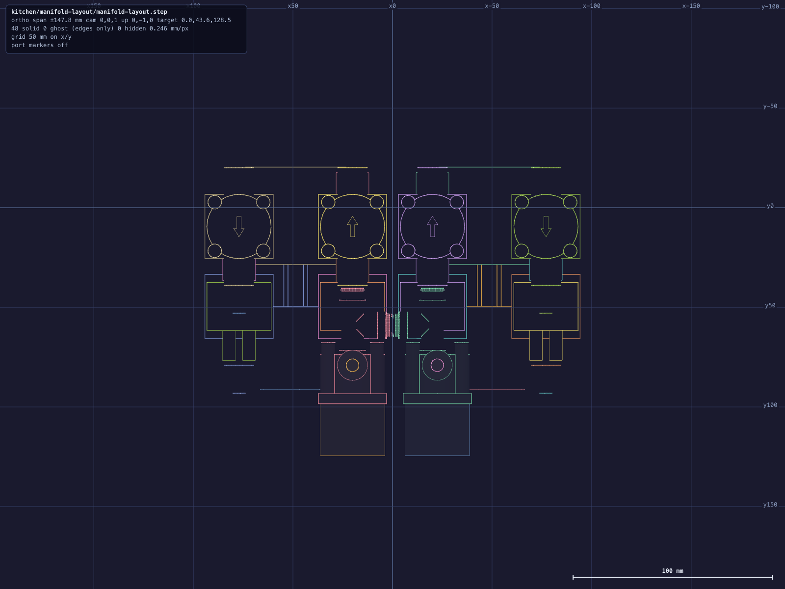
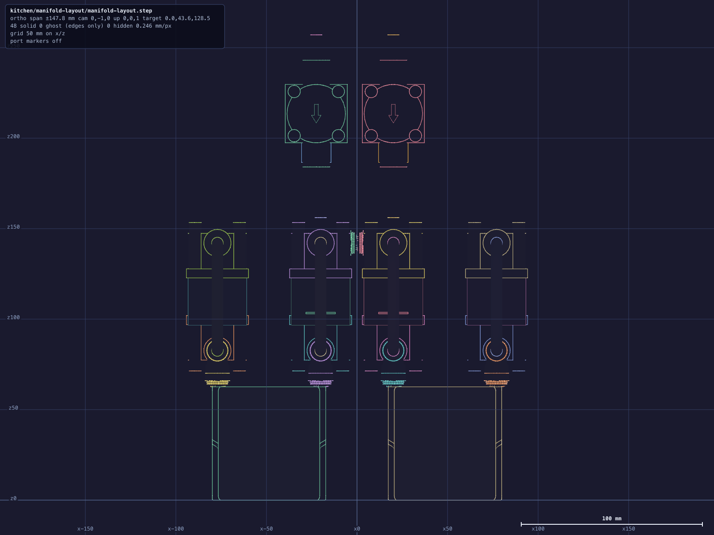
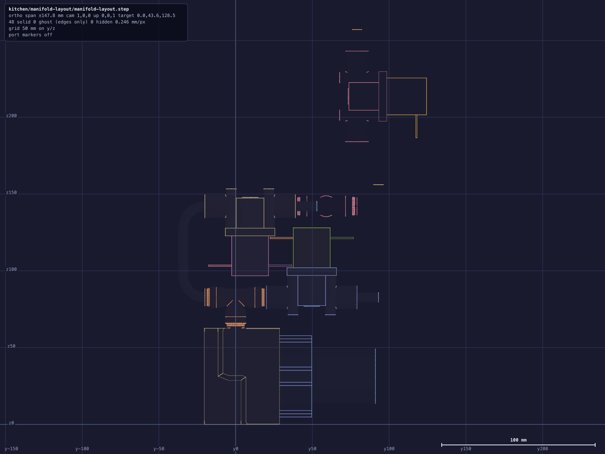
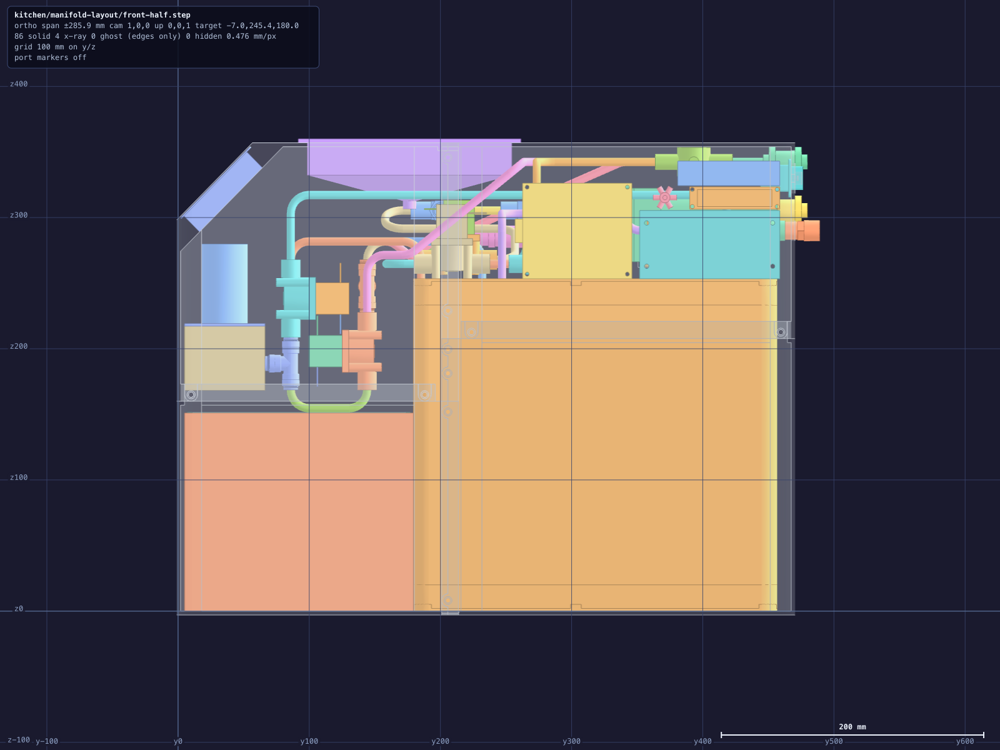

# Manifold layout

The ten flavor valves, both KPHM400 pumps and the [6](TEE_COUNT) junctions between them, placed
with nothing else in the box — no enclosure, no tray, no reservoir, no nozzle, no hopper, no
carbonator. The connections are
[`topology/fluid-topology.md`](/hardware/topology/fluid-topology.md)'s, with one difference:
each reservoir carries TWO MOUTHS of its own — the draw on the bulkhead at the bottom of its
wet V, the fill on a bore in its own cap — so each pair's two valves reach one directly and
neither channel has a reservoir junction. Segments 15 and 25 do not exist; 14 and 24 are the
fills, 16 and 26 the draws. Free here: where every body stands, how it is turned, and which of a junction's
three ports takes its run.

Built by [`manifold_layout.py`](manifold_layout.py) → `manifold-layout.step`, and the three
elevations beside it. Two decks of valves over the pumps, the upper one folded onto the lower
about the hinge the four barb tees' front collets stand on.



## The bodies, and the figures that set the packing

| | |
|---|---|
| 10 × valve | Beduan 12 V NC solenoid ([`reference/beduan-solenoid`](/hardware/reference/beduan-solenoid/README.md)) — [59](VALVE_LEN) mm collet face to collet face, straight through, port axis [11.3](VALVE_PORT_Z) mm over its own mounting plane. Two of them pack no closer than [34.25](VALVE_PITCH) mm. |
| 2 × pump | Kamoer KPHM400 ([`reference/kamoer-kphm400`](/hardware/reference/kamoer-kphm400/)) — two barbs [57](BARB_PITCH) mm apart on one face, both facing the same way, [20.38](BARB_INSET) mm back from the head's front face. |
| [6](TEE_COUNT2) × tee | John Guest PP0208E ([`reference/tee-connector`](/hardware/reference/tee-connector/README.md)) — run collets [20.07](TEE_RUN) mm either side of the body centre, [40.14](TEE_SPAN) mm end to end, branch reaching the same distance. |
| 0 × Y-divider | Its two outlets stand [14.7](DIVIDER_PITCH) mm apart ([`reference/y-divider`](/hardware/reference/y-divider/README.md)). |
| [0](TUBE_COUNT2) × tube | 1/4" OD LLDPE, both straight. |

## Frame

X is width, mirrored about x = 0 — channel A (pump B) west, channel B (pump A) east. Y is
depth; the two nozzle mouths leave out the back (+Y) and the other four are turned onto +Z. Z is
height, 0 at the pumps' own floor; the valves stand on two decks above them, at z
[82.68](DECK_Z) and [142.08](UPPER_Z).

## Four limbs, folded in two

A tee dropped on a pump barb by its BRANCH puts its RUN across the head's face, so each pump
hands out two parallel lanes [57](BARB_PITCH2) mm apart, one branch reach off its own skin.
Every valve is straight through and every junction's run takes two valve ports, so a lane is
one line of valves and tees butted collet to collet, front to back. `LIMB_PITCH` is that
spacing and it is a knob: `HSM_LIMB_PITCH=<mm>` steps both tees toward the pump's axis and
draws the leaning tube each barb then needs to reach its tee.

```
                          `|` = the hinge; everything left of it is folded up and over
    A2   x [-77.07](LIMB_OUT_XW)          V-G | Y-D · V-F
    A1   x [-20.07](LIMB_IN_XW)    V-A · Y-A · V-C | Y-C · V-E
    ─────────────────────────────────────────────────────────  mirror plane
    B1   x [+20.07](LIMB_IN_XE)    V-B · Y-B · V-D | Y-F · V-H
    B2   x [+77.07](LIMB_OUT_XE)          V-J | Y-G · V-I
                            ↓
                          back   (every mouth)
```

The lower deck's port axes sit at z [82.68](DECK_Z2), [8.77](DECK_GAP) mm over the pump heads'
crowns; the folded deck's at z [142.08](UPPER_Z2). The two inner limbs leave
[5.89](INNER_GAP) mm between their valve bodies across the mirror plane.

## The fold

The four connections crossing the hinge — fluid-9, 17, 19 and 27 — each become one 180° turn:
a quarter-turn of R[14](SPINE_R), [31.40](SPINE_STRAIGHT) mm of straight, and a quarter-turn
back, [75.38](SPINE_LEN) mm of tube. Both ends meet their collet on its own axis, so the turn
carries no straight at either END — the straight is in the middle.

**The radius and the deck separation are two different numbers.** Any 180° that ends on both
collet axes will join them, and that family is one parameter wide: the semicircle is only the
member with no straight in it, and it is the worst to pick, because what the pack pays for a
turn is how far it reaches past the hinge — and that reach is the RADIUS. So the radius sits on
the stock's floor, R[14](MIN_BEND2), and the straight takes up whatever the decks leave.

The decks stand [59.4](DECK_SEP) mm apart, and that IS chosen. What stands over what is a
folded valve's underside against the SPADE TERMINALS of the valve beneath it — two 0.8 mm tabs
reaching 15 mm past a coil face, in a band 1.4 mm wide — and every bounding box that contains
those tabs also contains the coil crown 6 mm above them, so a box solve asks for 91.6 where the
metal needs 58.4. `HSM_DECK_SEP=` builds another: at 58.0 the clash check goes red at 15 mm³ a
corner, at 59.4 it is clean. `HSM_SPINE_R=` moves the radius on its own.

## The quarter turns

Six more of the butts open into a 90° of R[14](QUARTER_R), [21.99](QUARTER_LEN) mm of tube
each, and all [2](QUARTER_COUNT) stand on one plane — y [79.07](BEND_Y), the far collet of the
valve that ends a limb. Each joint's fixed collet opens +Y there, the tube turns onto +Z, and
whatever was butted to it comes round with the turn. The axis runs along X, so the six share one
transform per deck and a mirrored pair still faces itself.

| | |
|---|---|
| fluid-3, fluid-5 | V-A and V-B off Y-A and Y-B, up on the folded deck — the two source valves come off the deck's own plane and lie along +Z, then STEP once more (below) |

### The source valves' step

Once they are round, V-A and V-B go [28](STEP_TRAVEL) mm further along their run and
[14](STEP_JOG) mm across it, toward the foam shell's crown, without changing direction. Two arcs
of one radius with a straight between them do that, and the two distances fix the pair:

    travel = 2R·sinθ + s·cosθ        jog = 2R(1 − cosθ) + s·sinθ

which solve to `(2R − jog)·cosθ + travel·sinθ = 2R`, and at R[14](QUARTER_R) that is
θ = [36.870](STEP_ANGLE)° either side of s = [14.00](STEP_STRAIGHT) mm —
[32.02](STEP_LEN) mm of tube.

**A 90° pair is the member of that family with no straight in it, and it puts the jog EQUAL to
the travel**, because each quarter spends R on both axes. So 90° turns step 28 across as well as
28 along, and 28 across lands the valve's mounting plane inside the core's crown.

**Y-C, Y-D, Y-F and Y-G** sit on the four barbs, branch down, at the hinge. **Y-A and Y-B** stand on the
inner limbs' own axes, one valve forward of the selects they feed, with their branches meeting
face to face across the mirror plane — [0.00](CROSSBAR) mm of tube between them. **NEITHER
RESERVOIR HAS A JUNCTION**: each carries two mouths of its own, so every one of the four gate
collets is a mouth of this study and leaves on its own axis, and every junction left in the pack
joins two VALVES rather than a valve and a vessel.

Mirror-checked: [9](TWIN_COUNT) twinned pairs, worst off by [0.0000](MIRROR_OFF) mm.

## How each connection is made

[13](BUTT_COUNT) of the [17](SEGMENT_COUNT) segments the topology names between these bodies
are collet butted to collet: tube in both quick-connects, none between them, no solid drawn.
[0](TUBE_COUNT) are the straight reservoir crossings, [4](SPINE_COUNT) are the fold's 180°
turns and [2](QUARTER_COUNT2) are the quarter turns above. Every corner in the manifold —
[14](CORNER_COUNT) of them — sits on the stock's own floor of [14](MIN_BEND) mm.

The [8](MOUTH_COUNT) mouths that leave this study are drawn one bend radius long and stop, and
the fold turns all of them to face the back: V-A-I (tap), V-B-I (hopper), V-G-O (nozzle A) and
V-J-O (nozzle B) on the upper deck; and the four reservoir gates — V-F-O and V-E-I for A,
V-I-O and V-H-I for B — on the lower.

## Envelope

[188](ENV_X) × [162](ENV_Y) × [243](ENV_Z) mm — [7.40](ENV_L) L of bounding box over the
bodies and the tube between them, with [0](CLASHES) pairs of placed solids sharing volume.
Add one [14](STUB_LEN) mm mouth stub on each of the six and it is
[188](REACH_X) × [162](REACH_Y) × [257](REACH_Z).

Two figures in [`manifold_layout.py`](manifold_layout.py) are the study's own rather than any
part's. `BUTT` is the tube left outside a pair of butted quick-connects, and it is 0.
`BARB_STANDOFF` is the climb given to a barb over and above what `LIMB_PITCH` demands, and it
is 0 as well; a barb is not a quick-connect, so that one is a modelling convenience, and z
[82.68](DECK_Z2) rides on it one millimetre for one.





## Standing it on the refrigeration stratum

[`front_half.py`](front_half.py) → `front-half.step` mates its bodies with nothing between
them: the compressor's own +X tangent to the condenser's intake face, the condenser's aft face
to the cold core's front wall, and the crown of the pair to this pack's spine hairpins. The
compressor does not reach that wall — the condenser is the deeper of the two and both are struck
on the same centre before the pair is yawed, so the compressor's plate stands inset from it by
half the difference at each end.

The gaps are 0 by intent, and the refrigerant loop is what they are for. The compressor is an
oblong can whose stubs stand on its own tangent lines, the condenser is an envelope whose headers are
re-dressed to whichever face suits, and the core's front wall has a lane on each side of it
carrying one of the evaporator's coppers — so two of the loop's legs cross a plane two of these
bodies already share, both stations of each are one point read twice, and no copper is drawn
between them. The third is the compressor's suction, which stands off that wall and reaches the
evaporator's outlet as cut and brazed copper `_lines` draws like any other run.
`refrigerant_joints` reads all three at every build — a mating on its two stations, a tube on
both its mouths — and `check_refrigerant_joints` writes the card red for any leg standing open
and for any with no pair of placed stations to measure.



## Regenerate

```
tools/cad-venv/bin/python hardware/manifold-layout/manifold_layout.py
```

Prints the limbs, every connection and how it is made, the mouths, the envelope, the mirror
check and the clash check, and writes the figures above back into this file.

## Sources
[value](NAME) texts are updated by:
- `/hardware/manifold-layout/manifold_layout.py`
