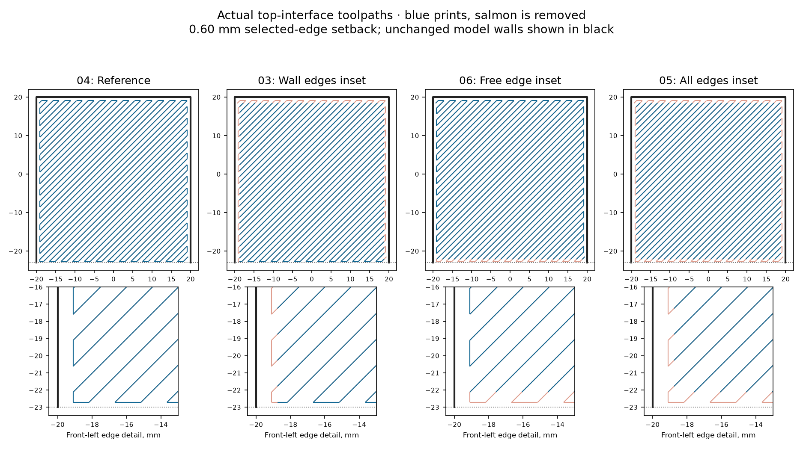

# PET-GF interface-edge experiment

Sixteen numbered ceiling specimens on Mark2 compare **Z separation**, **setback
at the three wall edges**, and **setback at the free front edge**. Each of the
eight combinations has two copies, distributed across front and rear bed regions.
The reference specimens are **04 and 11**. The estimate is **12 h 52 min**, at most
337 g of PET-GF, using the left 0.4 mm nozzle and +0.04 mm Z offset.

The working hypothesis is localized adhesion at the boundary of the support
interface. The current interface uses connected zigzags with runs along its
edges. Pulling those edges inward tests boundary contact separately from vertical
separation. A wall-only change distinguishes wall junctions from the free edge.
These interventions also remove some zigzag turnarounds; they do not isolate
sidewall fusion from turnaround-bead behavior by themselves.

## Examine the print

1. Keep the numbered specimens intact and note how each tree separates.
2. Peel any retained interface. Record the three wall junctions, free front edge
   and center separately. A center that releases while an edge stays bonded is
   a different result from adhesion across the whole underside.
3. Compare underside cleanliness and roof thickness, not removal effort alone.
   The roof is **3.84 mm thick**. Measure along its flat front strip, clear of
   the raised number and sidewalls. The shallow V marks meet the underside plane.
   Record residue, droop and damage to the actual roof separately.
4. Compare both copies of a setting. Prefer clean release with preserved geometry;
   an easily removed interface that leaves a sagging ceiling is not a fit solution.

[observations.csv](observations.csv) provides a blank result sheet. Numbered
underside photographs are sufficient for review.

## Specimens

All dimensions below are millimeters. Setback is **additional retreat from the
native interface path envelope**, not the total wall-to-support air gap.

| ID | Actual planned Z gap | Wall-edge setback | Free-edge setback |
|---|---:|---:|---:|
| 01 | 0.48 | 0.60 | 0.60 |
| 02 | 0.48 | 0.60 | 0.00 |
| 03 | 0.24 | 0.60 | 0.00 |
| 04 | 0.24 | 0.00 | 0.00 |
| 05 | 0.24 | 0.60 | 0.60 |
| 06 | 0.24 | 0.00 | 0.60 |
| 07 | 0.48 | 0.00 | 0.00 |
| 08 | 0.48 | 0.00 | 0.60 |
| 09 | 0.48 | 0.00 | 0.60 |
| 10 | 0.48 | 0.00 | 0.00 |
| 11 | 0.24 | 0.00 | 0.00 |
| 12 | 0.48 | 0.60 | 0.60 |
| 13 | 0.24 | 0.00 | 0.60 |
| 14 | 0.24 | 0.60 | 0.60 |
| 15 | 0.24 | 0.60 | 0.00 |
| 16 | 0.48 | 0.60 | 0.00 |

IDs run left to right, front to back. The requested slicer Z values are 0.30 and
0.45 mm; this organic-support slice produces actual planned gaps of 0.24 and
0.48 mm. The actual gap subtracts the deposited ceiling layer height from the
ceiling nozzle Z before measuring separation from the last interface extrusion.
It does not account for real strand sag.

Each specimen is 46 × 46 mm, with 3 mm walls and its ceiling at Z24.20 mm.
The two interface layers, 0.50 mm interface spacing, 0.62 mm support line width,
organic trees, speeds, cooling and temperatures are common. Only the three listed
factors vary. Three walls anchor every roof. The maximum edge setback is 0.60 mm;
more than 90% of each interface path and every tree path remain present. No specimen intentionally
omits its ceiling support.

## Machine file and verification

The editable [support-interface.3mf](support-interface.3mf) carries the geometry
and per-object Z settings. **Edge treatments are applied after slicing** by
`setback.py`; simply re-slicing this project does not reproduce the experiment.
The final print file is
`.cache/prints/2026-09-15-interface-edges-mark2/petgf-interface-edges-mark2.gcode.3mf`.

`setback.py` measures both interface layers independently and clips only positive
Support interface extrusion at the selected edges. Removed portions become
non-extruding moves on the same XYZ route. Temperatures, feed rates, retractions,
model commands and tree commands are retained. The package G-code checksum is
updated. The slicer's duration and material estimates are retained as upper bounds.
The source PET-GF profile is copied, with only the external-spool assignment adjusted
for Mark2. The textured-plate trim is G29.1 Z0.02: stock −0.02 plus the requested +0.04.

`verification.json` records source and final hashes, nozzle and profile checks,
all 16 measured Z gaps, both measured interface envelopes, and an independent
comparison of central interface, tree and ceiling paths against the native slice.
`print-job.json` records printer acceptance; physical results remain separate.

Generate with `tools/cad-venv/bin/python hardware/print-tests/petgf-interface-edges/prepare.py`.
Slice the generated input with Bambu Studio 02.08.02.61 using `--arrange 0 --orient 0
--slice 0 --min-save`, exporting `native.gcode.3mf` into the input directory.
Run `setback.py --input <native.gcode.3mf> --output <petgf-interface-edges-mark2.gcode.3mf>`,
then `python3 hardware/print-tests/petgf-interface-edges/verify.py` before sending.

The installed slicer's default tree style selects organic support. That path
uses whole-layer top-gap rounding. Its local overhang clearance can differ from
the general support XY setting; a virtual 0.40/0.80 mm XY comparison produced
identical interface envelopes for these specimens, recorded in
`xy-pattern-probe.json`.
[Bambu style selection](https://github.com/bambulab/BambuStudio/blob/v02.08.02.61/src/libslic3r/Support/SupportParameters.hpp#L143),
[Bambu organic clearance and rounding](https://github.com/bambulab/BambuStudio/blob/v02.08.02.61/src/libslic3r/Support/TreeSupportCommon.hpp).
