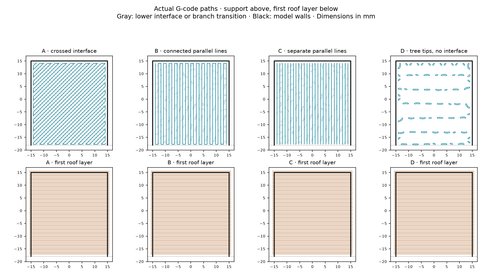

# PET-GF interface-pattern test

Four 36 × 36 mm ceiling specimens on Mark2 compare interface construction.
The sliced estimate is **1 h 38 min**, **39.0 g**, 70 layers. The profile is
`hardware/printed-parts/petgf.3mf`, with the left 0.4 mm nozzle, external PET-GF
spool and +0.04 mm Z offset. Every specimen has three 3 mm walls, a 3.84 mm roof
and the same planned 0.24 mm separation from its highest support extrusion.

| Specimen | Support immediately below the roof |
|---|---|
| **A** | Reference: two crossed interface layers, automatic pattern |
| **B** | One dense layer of parallel lines, joined at their ends |
| **C** | The same parallel lines with their end-joining extrusion removed |
| **D** | Tree tips with zero interface layers |

The main roof strands run left–right. B and C's interface strands run front–back,
perpendicular to them. C has **27 independent straight contact lines**, with
**26 end connections** removed. D has no extrusion tagged Support interface;
its highest supports are the tree-tip paths shown below. B and C also have
branch-tip paths one layer below their dense contact sheet; those remain intact.

## Physical results

Derek reports little discernible difference between B and C. D releases some
horizontal strips including their ends, but most remain. Horizontal strands
remain on the roof underside in all four specimens. [results.json](results.json)
separates these observations from toolpath identity and the dimensional hypothesis.

The **support interface** is the contact mat on top of the trees: crossed in A,
front–back lines in B and C, absent in D. The continuous left–right strands match
the **model bridge layer**, the first layer of the roof itself. The final G-code
labels those identical paths `Bridge` in every specimen. Their ends extend into
the walls; C's removed connections belong to the support lines below them.

The user's observation that peeling reaches the designed dimensions remains
unquantified. Sagging or partly detached model strands can protrude below the
intended surface. Removing one correctly positioned 0.24 mm model layer from
the ideal 3.84 mm roof would leave 3.60 mm, so removal of an undistorted layer
alone does not explain a return to nominal dimensions. Remaining roof thickness
and the vertical position of the peeled material are not yet measured.

## Inspect

1. Let the specimens cool. Keep each removed support beside its lettered roof.
2. Note whether material stays at the three wall junctions, the free front edge,
   or the center. Compare B with C for the effect of joining the line ends.
3. Identify the removed material by its pattern. A's interface is crosshatched;
   B and C's contact lines run front–back. The first roof layer runs left–right.
   D has no interface sheet, so a continuous roof skin retained there is not an
   interface layer. Individual tree-tip remnants can still adhere.
4. Measure the flat front strip of the roof, away from the raised letter and
   sidewalls. The designed thickness is **3.84 mm**. The V-mark tips indicate the
   underside plane. Retained support and model sag increase apparent thickness;
   removing part of the roof reduces it. Record which surface is present before
   interpreting a difficult-to-peel layer as unwanted support.

[observations.csv](observations.csv) has one row per specimen. Numbered/lettered
underside photographs and the removed supports also preserve the comparison.
The [preceding results](../petgf-interface-edges/results.json) report retained
edges on every specimen; their layer identity has not been established.

## Files

`prepare.py` builds the labeled specimens and editable `interface-patterns.3mf`.
A, B and D use native slicer settings. C additionally uses `finish.py` after
slicing: it removes only E extrusion words from the 26 end connections in its
upper contact layer. XYZ motions, speeds, retractions, lower branch transitions
and all other commands remain identical to the native slice. The package G-code
checksum is updated. Re-slicing the editable project alone does not apply C's edit.

`verification.json` records the inherited profile, nozzle and Z trim, source and
final hashes, measured support/roof directions, all four actual gaps and the
exact changed-line list. `print-job.json` records printer acceptance.

The final machine file is
`.cache/prints/2026-09-15-interface-patterns-mark2/petgf-interface-patterns-mark2.gcode.3mf`.
Generate with `tools/cad-venv/bin/python hardware/print-tests/petgf-interface-patterns/prepare.py`.
Slice its input with Bambu Studio 02.08.02.61, using `--arrange 0 --orient 0
--slice 0 --min-save`, exporting `native.gcode.3mf` into that input directory.
Run `python3 hardware/print-tests/petgf-interface-patterns/finish.py`, then
`python3 hardware/print-tests/petgf-interface-patterns/verify.py` before sending.
The actual gap is 0.24 mm for the requested 0.30 mm organic-support setting.
The textured-plate trim is G29.1 Z0.02: stock −0.02 plus the requested +0.04.
