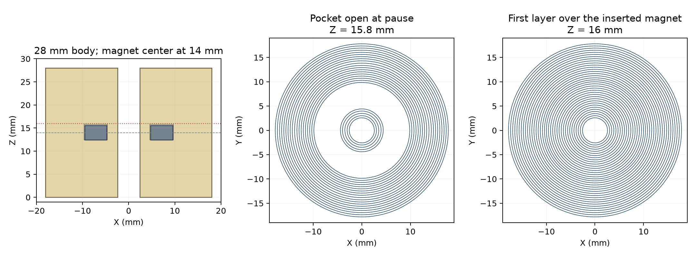
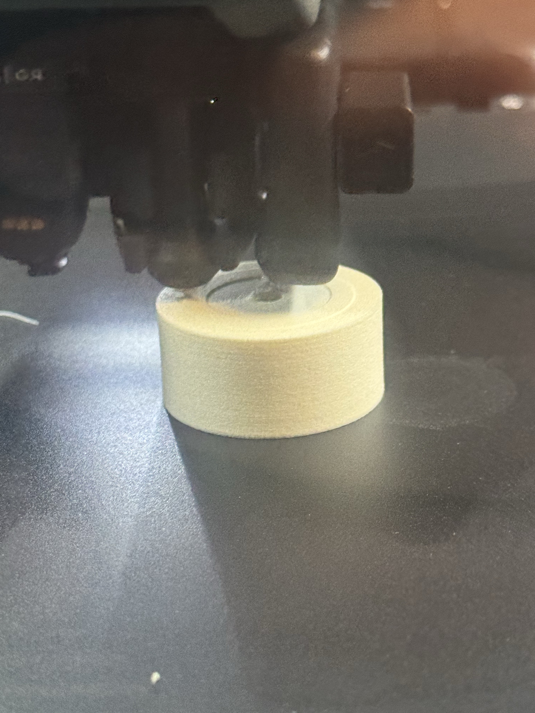

# All-ASA Aero magnetic float

One connected ASA Aero body encloses an RC62 ring magnet at its axial midplane.
This is a guided bench float for the existing 3.175 mm rod and reed setup.
Its [physical observations](physical-observations.json) record the reported magnet
grip, small hotend attraction, and successful paused insertion followed by initial
overprinting on Mark2.

[Assembly](/3d?file=printed-parts/cold-core/magnetic-float/all-aero/assembly.step) ·
[Section](/3d?file=printed-parts/cold-core/magnetic-float/all-aero/section.step) ·
[Insertion view](/3d?file=printed-parts/cold-core/magnetic-float/all-aero/insertion.step) ·
[CAD source](all_aero_float.py) · [Calculations](design.json) ·
[Native project](all-aero-float.3mf) · [Slice review](mark2-print/v1/float-preflight.json)

## Geometry and lift

| Feature | Nominal dimension |
| --- | --- |
| Body diameter × height | 36 × 28 mm |
| Through guide bore | 4.8 mm |
| Magnet center above bottom | 14 mm |
| RC62 OD × ID × thickness | 19.05 × 9.525 × 3.175 mm |
| Pocket OD × ID × depth | 19.35 × 9.225 × 3.4 mm |
| Collar between pocket and guide bore | 2.2125 mm |
| Outer radial band beside pocket | 8.325 mm |
| Foam below magnet / above pocket | 12.4125 / 12.1875 mm |

The height comes from displacement and assembled mass. For the 36 mm diameter
and open 4.8 mm bore, the annular area is 999.780 mm². The enclosed magnet pocket
occupies 0.773 cm³; the ASA body occupies 27.221 cm³. With cold-water density
0.9997 g/cm³, full immersion displaces 27.985 g. The magnet contributes 5.09 g.

The sizing target is **at least 5 g of spare lift at an assumed foam density of
0.65 g/cm³**. That gives 27.423 mm minimum height, rounded upward to 28 mm.
The reserve is a provisional margin for density and mass gain in a bench trial,
not an established service allowance. ASA Aero density has not been measured
on these prints. Bambu's [ASA Aero data](https://bambulab-us.myshopify.com/products/asa-aero)
show that nozzle temperature, flow, speed and geometry affect foaming; its
0.46 g/cm³ specimen at 270 °C used 0.45 flow, rather than this recipe's 0.52.

| Assumed foam density, g/cm³ | Assembled mass, g | Spare lift, g | Guided upright freeboard, mm |
| --- | --- | --- | --- |
| 0.46 | 17.61 | 10.37 | 10.38 |
| 0.53 | 19.52 | 8.47 | 8.47 |
| 0.55 | 20.06 | 7.92 | 7.93 |
| 0.60 | 21.42 | 6.56 | 6.57 |
| 0.65 | 22.78 | 5.20 | 5.20 |
| 0.70 | 24.14 | 3.84 | 3.84 |

These values assume the enclosed pocket stays dry and the body holds its
external volume. They describe upright displacement on the guide. Water uptake,
compression, foam density and finished buoyancy remain unmeasured.

## Paused print

Mark2 uses the glued Engineering plate, +0.04 mm user trim, the fixed right
hardened standard-flow 0.4 mm nozzle and ASA Aero White GFB02 fed from the
Polymaker drybox through external right slot 255. The prepared archive has one
object, 140 layers at 0.20 mm, 300 wall loops, no top/bottom skin or sparse
infill, and no skirt, brim or supports. Settings are 270 °C nozzle, 90 °C bed,
60 °C chamber and 0.52 flow. The 12-pass corner priming strip precedes the body.
Adaptive leveling covers both the strip and body, X110–291 / Y14–168.

The native slice completes **layer 79 at Z15.8**, then issues one `M400 U1`
pause before layer 80 at Z16.0 closes the pocket. At the pause:

1. Place one RC62 ring fully onto the pocket floor, keeping the guide bore open.
2. Check that the ring sits below both pocket rims and the body remains attached
   to the plate. Clear loose strings without moving the float.
3. Resume with the ring seated. The first covering roads print over its face;
   the continuous inner collar and outer band anchor the closure.

The printed seat top is Z12.4, giving a nominal ring center of **13.9875 mm**.
CAD centers it exactly at 14 mm; physical centering depends on the 0.20 mm
layer grid, actual magnet thickness and printed fit. The nominal magnet is
0.225 mm below the printed rim. At the RC62's maximum specified thickness it
remains 0.125 mm below the rim, with 0.325 mm clearance to the first-cover
nozzle height. This small recess allows clearance; whether the first roads
settle onto the metal face is a physical observation, not a slicing result.

The slice retains 0.05 mm outer contour expansion and 0.05 mm hole reduction.
Nominal radial magnet clearance is 0.10 mm after compensation, and at least
0.05 mm at the specified ±0.10 mm magnet dimensional tolerance. Actual ASA
expansion can change that fit. Nested walls still contain seam moves,
retraction wipes and short transitions; this is not a zero-travel program.

The native estimate is **88 minutes**, excluding time spent paused. Preview
and idealized road coverage confirm the open pocket before the pause, full
ring coverage after it, and a through-open guide bore. They do not establish
physical roof adhesion or magnet retention.

The [launch receipt](mark2-print/v1/float-mark2-launch.json) records one accepted
Send on 2026-10-03 at 15:01:48 CDT, Mark2 task **1306080180**, after the reported
clear bed. The dialog verified `Ext ASA-AERO R`; archive, G-code and source
hashes match the slice review. The existing monitor remains paused by the user.



## Insertion result and next trial

For Mark2 task **1306080180**, the operator reports that paused magnet insertion
and overprinting worked. The first covering layer was a bit too tight on the
magnet; the second deposited beautifully. The [report and photo binding](physical-observations.json)
belong to the frozen v1 geometry and native archive. This result covers insertion
and the initial covering layers; final roof integrity and finished float behavior
are unreported.



The next trial candidate adds **0.20 mm of upper pocket clearance**, one native
layer, with the magnet seat at Z12.4125 and its CAD center at Z14.0. The target
pocket depth is 3.60 mm and roof is Z16.0125. The expected first covering layer
is Z16.2, with insertion before layer 81; a separate native slice review must
verify that sequence. Assessment concerns smooth initial covering deposition
and a ring that remains seated through closure. This candidate is specified in
the physical record and has no prepared or submitted archive.

## Material trial route

The bench candidate uses ASA Aero throughout, with the inserted RC62. Pressure
endurance and exposure to the actual flavoring are properties to establish on
this article. Relevant results include water uptake, permanent dimensional
change, retained lift and surface softening.

Bambu's [ASA Aero TDS](https://store.bblcdn.com/2bb7c6814cdc42d19ffc62570cfc1fb2.pdf)
lists water insolubility and broad acid/alkali resistance, alongside vulnerability
to some organic solvents. These are general material descriptors; the sheet
supplies no result for this foamed print in pressurized water or the actual flavor
mixture. Its humidity-conditioned moisture value is not a submerged sealing
measurement.

A sealed skin could limit liquid entry, and a structural shell could carry
external pressure if its geometry and material support that load. Those benefits
require an intact barrier and adequate stiffness. In [Prusa's underwater trials](https://blog.prusa3d.com/watertight-3d-printing-part-2_53638/),
untreated PETG leaked at seams and perimeter/infill junctions. That result concerns
their parts and settings; it supplies no pressure rating for this float. A
protective skin remains a response to an identified ingress or compatibility
problem, rather than a prerequisite for this bench trial.

## Trial scope

The [RC62](https://www.kjmagnetics.com/rc62-neodymium-ring-magnet) is N42 with an
80 °C continuous operating limit. The chamber setting is 60 °C, while fresh
plastic is deposited at 270 °C. No magnet temperature or retained field after
this insertion process has been measured; nozzle temperature is not magnet
temperature. The relevant observation after printing is whether the same ring
still gives the expected signal in the existing bench reed setup.

This is an unqualified bench prototype. Exposed ASA Aero, water uptake,
external pressure endurance and wetted material acceptance have no recorded
qualification. The [queue](mark2-print/v1/queue.json) records the accepted trial;
its physical completion is unreported. The native pause requires a fully
seated RC62 before manual resume. Completion alone does not clear the bed or
authorize another print.

To reproduce the CAD and preparation:

```sh
tools/cad-venv/bin/python hardware/printed-parts/cold-core/magnetic-float/all-aero/all_aero_float.py
tools/cad-venv/bin/python hardware/printed-parts/cold-core/magnetic-float/all-aero/prepare_print.py
```
