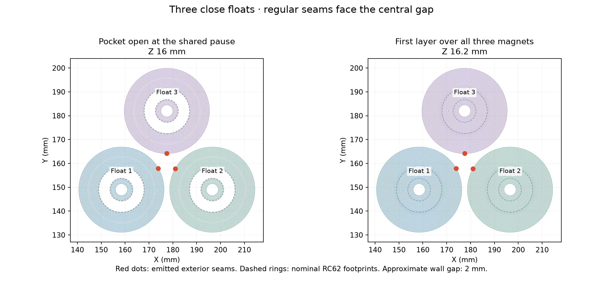

# Three close ASA Aero floats on Mark2

Three copies of the current 36 × 28 mm float share a compact triangular plate.
The emitted wall gap is at least 1.998 mm. Regular exterior seams face the
central gap at approximately 30°, 150° and 270° from positive X. Scarfing is
disabled. The native review verifies every exterior start and stop on all
140 layers of each float.

The single programmed `M400 U1` pause occurs before layer 81 at Z16.2 mm,
after all three open pockets have completed Z16.0 mm. Insert one K&J RC62
ring into each pocket, seated fully below both rims. Keep each guide bore
open and clear the toolhead before resuming. The slice estimates **136 minutes
from start to this pause**, **93 minutes after it**, and **229 minutes total**.
Manual insertion time is additional; actual startup and printing can shift
these estimates.

Accepted Mark2 job **1321804313** started at **7:45 pm CDT on October 8,
2026**. Its insertion forecast is **10:00–10:01 pm CDT**, with an arrival
target of **9:55 pm** for all three rings. The acceptance and forecast are
recorded in [the launch receipt](launch.json).

The current 3.6 mm deep pocket retains the recorded upper-clearance revision.
The native printed seat is Z12.4 mm. With a maximum 3.275 mm thick ring, the
ideal recess below the completed rims is 0.325 mm and the first covering
nozzle plane clears the ring by 0.525 mm.

Mark2 uses white Bambu ASA Aero through right external slot 255 and the
standard hardened 0.4 mm right nozzle on a glued Engineering Plate. The
established float recipe uses 270 °C nozzle, 90 °C bed, 60 °C chamber,
0.52 flow ratio, 12 mm³/s maximum volumetric speed, 0.20 mm layers and
300 requested nested walls with no sparse infill, supports or brim. Mark2's
requested and emitted Engineering Plate Z trim is +0.04 mm. Probing-based
nozzle clump detection is disabled. Launch options and acceptance belong
in `launch-plan.json`, `preflight.json` and `launch.json`.

Explicit same-layer transfers between floats range from 28.4 to 40.0 mm,
with a 34.7 mm median, including wipes and positioning for inner wall loops.
The close arrangement and inward seams support the requested trial of
smaller defects that can be repaired locally. Their actual size and
repairability require the physical print; this slice establishes geometry,
commanded paths and timing.

- [Prepared project](2026-10-08-three-floats-close-asa-aero-right04-engineering-mark2.3mf)
- [Native print archive](2026-10-08-three-floats-close-asa-aero-right04-engineering-mark2.gcode.3mf)
- [Native review](native-review.json)
- [Pause forecast](pause-forecast.json)
- [Frozen geometry and source hashes](source-snapshot/manifest.json)

Preparation records retain their preparation-only scope. A separate launch
receipt identifies the authorized transaction and actual accepted job.
