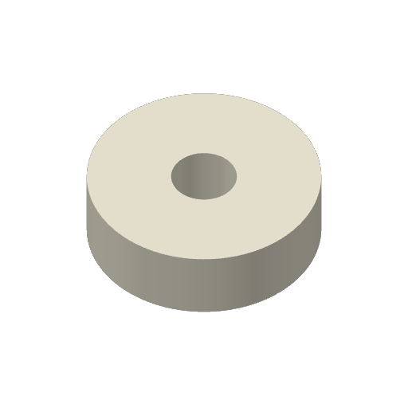

# First magnetic-float ASA Aero print

One core and one insert use Bambu ASA Aero White 46100 on Mark2's right
standard-flow hardened 0.4 mm nozzle. The material is loaded from AMS HT unit
128, tray 0; Bambu Connect resolves it as **HT - A ASA-AERO R**. The user
reported both beds clear and selected the installed **Textured PEI plate**
for this material trial.

The core job is **Mark2 task 1303907771**,
`magnetic-float-core-mark2-aero-v2.gcode.3mf`. The user reports: **"I stopped it."**
Mark2 reports `FAILED` at 03:44 UTC on 2026-10-03, with error code 0 and no HMS.
This is a manual stop; it does not establish a printer fault or a physical
acceptance result.

One Send received `project_file SUCCESS`. The first printing observation at 03:34 UTC on
2026-10-03 reports the matching task and archive in `RUNNING`, layer 13 of 220,
with no printer errors or HMS. Bambu Connect corroborates the right nozzle at
270 °C, bed at 90 °C and chamber at 60 °C. This records printer progress beyond
the first layer; first-layer appearance and physical acceptance are unreported.

The insert is sliced and reviewed for the same printer and remains queued.
Further printing awaits the user's instructions and clearance of the stopped
core. A new start request confirms bed clearance. These are separate,
single-object jobs, following the
[float recipe](../../README.md) and the
[manufacturer's Aero printing guide](https://wiki.bambulab.com/en/filament-acc/filament/asa-aero-printing-guide).

## Plate trial and recipe

The manufacturer's guide prefers Engineering or smooth PEI because foamed
Aero can grip the texture strongly and tear during release. This trial uses
the user's Textured PEI choice. Adhesive application has not been reported.
Let each part and plate cool to **35 °C or below** before releasing it; avoid
pulling a warm foam part from the texture.

| Setting | Selected value |
| --- | --- |
| Nozzle | Right hardened 0.4 mm, standard flow |
| Material | Stock Bambu ASA Aero, GFB02, white |
| Nozzle / bed / chamber | 270 / 90 / 60 °C |
| Flow ratio | 0.52 |
| First / subsequent layers | 0.20 / 0.20 mm |
| Nominal line width | 0.48 mm |
| Ordinary outer / inner wall speed | 80 / 80 mm/s |
| Infill | 100% zigzag |
| Walls / top / bottom layers | 3 / 5 / 5 |
| Part fan / auxiliary fan | Stock 30–50%, first three layers off / off |
| Brim width / gap | 3 / 0.2 mm |
| Elephant-foot compensation | 0 mm |
| XY contour / hole compensation | +0.05 / −0.05 mm |
| Requested Mark2 Z trim | +0.04 mm |
| Emitted textured-plate correction | `G29.1 Z0.02` after reset to 0 |
| Supports / insertion pauses | None / none |
| Send options | Timelapse On, bed leveling On, flow calibration Auto, nozzle offset calibration Auto |

The stock textured-plate correction is −0.02 mm; the requested +0.04 mm trim
produces the recorded +0.02 mm command. The native process settings and
filament preset are captured in the preflight records.

## Review and trace

This is physical trial **v1** and native archive revision **v2**. The geometry
and print orientations are bound to export commit
`f3cefbe360b7a8019741d177868d1e6c6770b93f`. Embedded mesh vertices agree with
the frozen STLs to less than 0.000001 mm. The source snapshot hashes are
verified against that commit.

| Job | Frozen STL SHA256 | Native estimate | Layers | Minimum second-layer bead overlap |
| --- | --- | --- | --- | --- |
| Core | `63d12cbb501b629997a2462822df42a1f4f6bf20ee2806f2f6f310c1f7e72771` | 1 h 37 min | 220 | 56.81% |
| Insert | `c69cdc552c1dec84dd0bd84972ed601667df8327b0388236eec63ea7d672b8c6` | 37 min | 50 | 56.75% |

Native previews were inspected, with no native slice warnings, support paths
or insertion pauses. Bead overlap is calculated from emitted paths and nominal
line widths. The core's magnet pocket has at least 0.029 mm nominal emitted-path
clearance against the RC62's maximum size; printed fit remains unreported.
Mass and density, release from the textured plate, and assembly fit are physical
results and are not established by these slice checks.

- [Core preflight and frozen archive/G-code hashes](core-preflight.json)
- [Insert preflight and frozen archive/G-code hashes](insert-preflight.json)
- [Core launch and printer acceptance](core-mark2-launch.json)
- [Queue and removal gate](queue.json)
- [Preparation and emitted-path checks](prepare.py)

