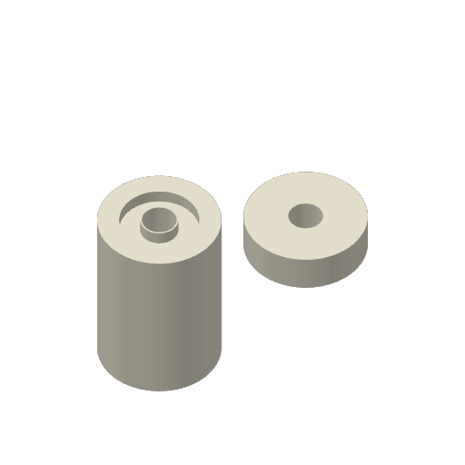

# Magnetic-float core and insert on one plate

One frozen ASA Aero core and one insert share Mark2's Textured PEI plate,
printing by layer on the right standard-flow hardened 0.4 mm nozzle. The user
requested **0.00 mm user Z trim**, **no skirt**, and **both pieces on the same
plate**, and confirmed: **"(mark2 bed is clear)"**.

The combined job is accepted as **Mark2 task 1303972802**,
`magnetic-float-pair-mark2-aero-v3.gcode.3mf`. One Send received
`project_file SUCCESS`; the printer reported the matching new task and archive
in `RUNNING`, layer 0 of 220. This records startup, not first-layer appearance
or physical acceptance. The native estimate is **1 h 56 min**, with **18.05 g**
reported by the slicer and **18.03 g** integrated from model extrusion paths.

At 2026-10-03 04:12 UTC, the matching task reported layer **5 of 220** with
no printer error or HMS fault. Background Bambu Connect reported layer 6 and
observed **270 °C right nozzle, 90 °C bed and 60 °C chamber**. This establishes
printer progress beyond the first layer; visual first-layer acceptance, printed
density and physical fit remain unreported.

## Selected recipe

| Setting | Value |
| --- | --- |
| Material and source | Bambu ASA Aero White 46100, GFB02; AMS HT unit 128 tray 0 |
| Actual Send mapping | HT - A ASA-AERO R, under Right Nozzle |
| Nozzle / bed / chamber | 270 / 90 / 60 °C |
| Flow ratio | 0.52 |
| First / normal layer height | 0.20 / 0.20 mm |
| Nominal line width | 0.48 mm |
| Ordinary wall / infill speeds | 80 mm/s |
| First-layer wall / infill speed settings | 50 / 105 mm/s, with acceleration and cooling limits |
| Walls / top / bottom layers | 3 / 5 / 5 |
| Infill | 100% zigzag |
| Requested user Z trim | 0.00 mm |
| Emitted textured-plate correction | `G29.1 Z-0.02` after reset to 0 |
| Skirt / brim / supports / pauses | None / none / none / none |
| Elephant-foot compensation | 0 mm |
| XY contour / hole compensation | +0.05 / −0.05 mm |
| Print order | Both objects by layer, on one plate |
| Send options | Timelapse On, bed leveling On, flow calibration Auto, nozzle offset calibration Auto |

The factory −0.02 mm Textured PEI correction is retained. Zero user trim adds
no additional gap. The stock Aero temperature, flow and cooling values are
retained. Adhesive application is unreported. Cool each part and plate to
**35 °C or below** before release.

## Geometry and emitted paths

This is physical trial **v2**, using native archive revision **v3**. Geometry
and orientation are bound to export commit
`f3cefbe360b7a8019741d177868d1e6c6770b93f`; frozen STL hashes are retained in
the [preflight](pair-preflight.json). Both meshes remain byte-identical in the
native input, and embedded vertices agree with the frozen STLs to less than
0.000001 mm. Their centres are (125,145) and (175,145) mm, with the original
print bases at Z=0.

Native review verifies two objects on one plate, one ASA Aero material on the
right nozzle, no support/skirt/brim/prime-tower paths, no insertion pauses and
no native warnings. Each object's minimum second-layer nominal bead overlap
exceeds 56%. The core has 220 layers and the insert has 50. The native preview
was inspected. Printed dimensions, density and fit remain unreported.

- [Preflight and frozen archive/G-code hashes](pair-preflight.json)
- [Launch, one-Send guard and printer acceptance](pair-mark2-launch.json)
- [Queue](queue.json)
- [Preparation and per-object emitted-path review](prepare.py)
- [First trial's physical adhesion and release report](../v1/physical-observations.json)
- [Material recipe and density assumptions](../../asa-aero-research.md)

