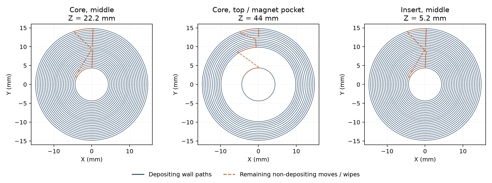

# Magnetic-float ASA Aero nested-wall trial

One core and one insert are prepared as separate single-object Mark2 jobs, with
**300 wall loops** and no top/bottom skin or infill passes. Native G-code contains
only **inner and outer wall** deposition paths. Each object fills its available
cross-section with nested walls; 300 is the requested upper limit on wall count.
This is physical trial **v7**, native archive **v8**, with **zero Send attempts**.

| Part | Native estimate | Object extrusion mass, calculated | Preflight |
| --- | --- | --- | --- |
| Insert, first | About 35 min | 3.36 g | [Insert](insert-preflight.json) |
| Core | About 1 h 30 min | 14.43 g | [Core](core-preflight.json) |

The insert is queued first to inspect the path change in the shorter print.
Estimates include the retained corner priming strip; actual heating, calibration
and probing times vary. Calculated masses are filament-feed accounting, not
measured foam densities.

The current local float print is being allowed to finish, as recorded in
[operator observations](../v6/operator-print.json). A following clear-bed report
or start request after removal supplies the next launch condition. Neither
prepared job starts automatically on completion of the current print.

## Recipe and source

The glued Engineering plate, **+0.04 mm user trim** (`G29.1 Z0.04` after reset),
**270 / 90 / 60 °C nozzle / bed / chamber**, **0.52 flow**, 0.20 mm layers and
0.48 mm nominal lines are retained. The wall generator is Arachne. The
top-surface one-wall limit and first-layer one-wall limit are disabled, with
top/bottom skin layers and infill density set to zero. There is no skirt, brim,
support or insertion pause. All executed startup printing commands match the
reviewed Engineering archive, including the 12-pass corner priming strip.

The requested material source is **ASA Aero from the Polymaker drybox**, reported
by the user as working better than AMS HT, feeding Mark2's right standard-flow
hardened 0.4 mm nozzle. The actual external source and ASA Aero identity must be
verified in the Send dialog before a guarded single-attempt submission. Normal
options remain Timelapse On, bed leveling On, flow dynamic calibration Auto and
nozzle offset calibration Auto. Any start or resume preserves the 180-second
spacing across Mark2 and H2C. The conservative cooling threshold is 35 °C for
both bed and chamber before release.

Frozen core and insert STL hashes are `63d12cbb…` and `c69cdc55…`. Geometry source
hashes are verified against export commit
`f3cefbe360b7a8019741d177868d1e6c6770b93f`. The input retains the selected mesh
bytes and print orientation, centred at X150 / Y145 with bed Z0. Native export
preserves triangle connectivity, with coordinate serialization differences
below 0.000001 mm. Full source, project, archive and G-code hashes are in each
preflight. Geometry is not regenerated.

## Path review and limits

Sampled first, second, middle and final layers cover **98.0–99.9%** of the
compensated frozen STL cross-sections using idealized native bead footprints.
This verifies the intended filled wall layout at those sections, including
the final faces; it does not model actual foaming or establish physical density,
fit, load capacity or buoyancy.

One-object plates eliminate between-part trips, and wall paths eliminate
zigzag infill. **Travel is still present.** Seam positioning, retraction wipes,
ring transitions and layer changes remain. The core's magnet pocket separates
its top into an inner stem and an outer rim, which require a non-depositing
crossing. Maximum explicit within-layer XY moves are about **8.45 mm** on each
job. Initial transfer from the priming strip is recorded separately in the
travel totals. The orange paths below include remaining moves and retraction
wipes, not just moves across open air.

The intended physical outcome is usable foam pieces with fewer carried bits
from travel. Completion, surface debris, adhesion, fit, density and buoyancy
remain unreported for these prepared jobs. The user's current flaking and
travel-ooze observations are in the operator record; they do not establish the
cause of flaking. Bambu identifies ASA Aero as
[heat-sensitive self-foaming material](https://bambulab-us.myshopify.com/products/asa-aero),
with expansion and density varying with temperature, flow ratio and speed.
The material recipe is held constant for this path-layout trial.

- [Queue and launch conditions](queue.json)
- [Native preparation and path verifier](prepare.py)
- [Core native preview](core-preview.png)
- [Insert native preview](insert-preview.png)
