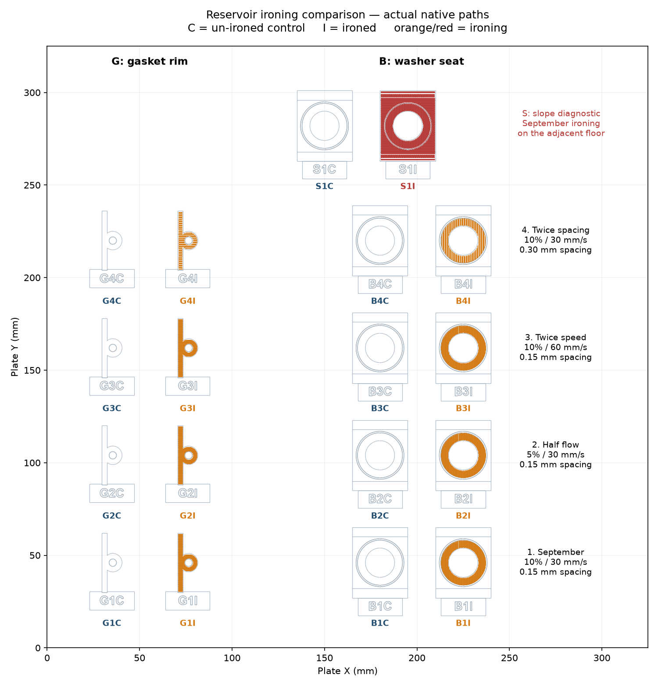

# Reservoir ironing comparison

[ironing-study.3mf](ironing-study.3mf) contains **18 labelled specimens on one
plate**, cut from the current left reservoir's sealing features. Use Bambu PETG
Translucent Clear, the **left 0.8 mm Standard-flow nozzle** and textured PEI.
Bambu Studio 02.08.02.61 estimates **84.85 g** including supports and
**4 h 48 min** total; about **7 min 18 sec** is ironing.

The customer outcome is a sealing face that lets its rubber seal sit evenly
without raised lines, edge beads or loose PETG. This comparison assesses whether
ironing improves those faces and whether it damages the adjacent sloped floor.
Physical observations are pending.

## Specimens and settings

**G** copies 32 mm of the body's upper gasket rim around one blind insert boss.
It retains the complete 7 mm blind insert pocket and prints mouth up. Its lower
body is cropped; the coupon is 10.03 mm tall. Removing 698 complete 0.24 mm
layers retains the full body's layer phase at the gasket face.

**B** copies the complete wet bulkhead washer seat and a **30 × 38 mm** patch of
the floor around it. The 24.3 mm counterbore, 15.8 mm through bore, dry underside
recess and local floor thickness come directly from the current STEP. The patch
includes 5 mm of the real **6.43° slope** on each side of the flat trough.
Ironing is restricted to the flat annular washer seat.

Each condition has adjacent **C** (un-ironed control) and **I** (ironed) copies of
both features. Low identification tabs sit outside the contact surfaces and
outside the ironing masks.

| Condition | Ironing flow | Speed | Spacing | Labels |
| --- | ---: | ---: | ---: | --- |
| 1 — September | 10% | 30 mm/s | 0.15 mm | G1C/G1I, B1C/B1I |
| 2 — Half flow | 5% | 30 mm/s | 0.15 mm | G2C/G2I, B2C/B2I |
| 3 — Twice speed | 10% | 60 mm/s | 0.15 mm | G3C/G3I, B3C/B3I |
| 4 — Twice spacing | 10% | 30 mm/s | 0.30 mm | G4C/G4I, B4C/B4I |

**S1C/S1I** is an additional floor pair. S1I applies September ironing to the
washer seat, trough, raised lip and adjacent slopes. It shows the broad ironing
behavior for comparison. The native slice emits horizontal passes at Z = 4.62,
5.82, 6.06 and 6.30 mm; these follow layer terraces rather than the CAD slope.

All specimens use the September recipe's 0.30 mm first layer / 0.24 mm normal
layers, 255 °C nozzle, 70 °C bed, 0.97 flow, 6 mm³/s ceiling, six requested
Arachne walls, 100% fill, scarf seams and cooling/support settings. Global ironing
is off; saved modifiers enable it on the named test faces. The tests retain the
recipe's 0.31 mm ironing inset and zig-zag pattern. Twice the spacing produces
about half the path length while retaining nearly the same total ironing
extrusion; the slicer increases extrusion per pass.

The saved machine profile carries Mark2's accepted +0.04 mm trim. Preserve the
destination printer's own calibrated trim when assigning the job, following
[printer profiles](../../../../../tools/bambu-printers.md).



## Read the physical comparison

1. Let the plate cool and keep each labelled pair together. Remove the small
   supports from the underside of the bulkhead bores. Leave the sealing faces
   as printed for the first inspection.
2. Photograph each pair together under light coming from the side. Inspect the
   contact face and its inner/outer edges for grooves, dragged plastic, lifted
   ridges, blobs and loose strands. Compare those features with its C control;
   gloss alone is not the selection criterion.
3. Place the existing silicone bulkhead washer in each B seat. Apply the same
   gentle finger pressure around the washer and inspect for rocking, a lifted
   edge or debris. Lay the existing reservoir gasket across each G rim section
   and check whether raised lines or edge beads interfere with even seating.
   These are contact/finish observations, not a clamped leak test.
4. Compare S1C with S1I under the same side lighting. Record any additional
   ridges, smeared steps or loose plastic on either sloped strip, and whether
   the transition onto the flat trough is better or worse.
5. Record the labels, photographs and observed differences beside this study.
   A useful ironing candidate must improve the contact face relative to its
   control without adding raised edges, loose material or seating interference.

The paired coupons preserve local shape, orientation and layer phase. Cropping
changes layer time and thermal history, and this plate does not reproduce the
full body's height. A finish improvement does not establish water holding,
long-term gasket sealing or insert strength. The full reservoir's official
process is the [September 0.24 mm recipe](../README.md#next-print).

## Verification and reproduction

[study.json](study.json) records source hashes, crop coordinates, labels,
placement and settings. [slice-review.json](slice-review.json) records the native
G-code hash and measurements: all nine controls have zero ironing extrusion;
all G/B test passes remain on the specified flat faces; 60 mm/s, half flow and
wider spacing are verified in the emitted paths. S1I includes about 1.47 m of
ironing over the adjacent sloped strips. The slice contains ten bed-rooted bore
support bodies, all without explicit interface labels; their contact buildup
and removal finish are unmeasured.

From the repository root:

```sh
tools/cad-venv/bin/python hardware/printed-parts/cold-core/reservoir/ironing-study/prepare_print.py
mkdir -p .cache/reservoir-ironing-study/slice
/Applications/BambuStudio.app/Contents/MacOS/BambuStudio \
  --arrange 0 --orient 0 --slice 0 --export-3mf ironing-study-review.3mf \
  --outputdir "$PWD/.cache/reservoir-ironing-study/slice" \
  "$PWD/hardware/printed-parts/cold-core/reservoir/ironing-study/ironing-study.3mf"
tools/cad-venv/bin/python hardware/printed-parts/cold-core/reservoir/ironing-study/review_slice.py
```

The editable study project is the only 3MF in this directory. Derived sliced
archives and meshes live in ignored `.cache/reservoir-ironing-study/`.

## Guidance supporting the comparison

Prusa's [watertight printing guide, part 2](https://blog.prusa3d.com/watertight-3d-printing-part-2_53638/)
recommends smooth rubber-seal contact surfaces and gives ironing as one way to
achieve them. Its [ironing documentation](https://help.prusa3d.com/article/ironing_177488)
describes ironing of flat top surfaces, limited benefit on slopes, and the risk
of PETG collecting on the nozzle or material accumulating at edges. Those
mechanisms support a comparison of local sealing faces and a separate slope
diagnostic; they do not establish that this reservoir benefits from ironing.
