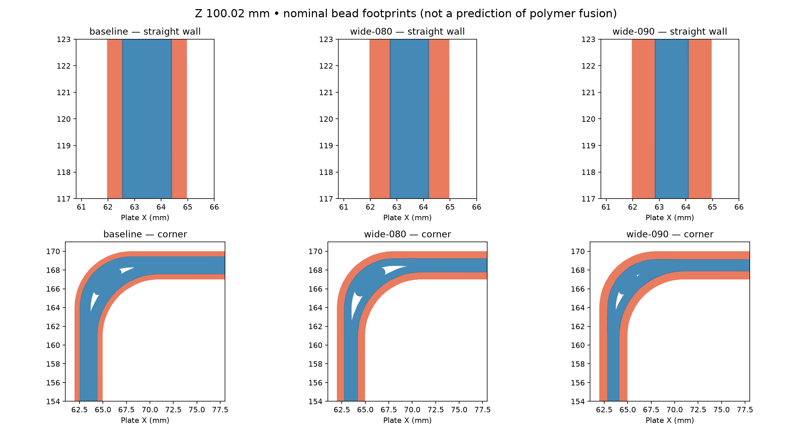

# Reservoir PETG seal trial

[Print project: reservoir-08-seal-trial.3mf](reservoir-08-seal-trial.3mf)

One current left reservoir body, mouth up, for the **H2C with a 0.8 mm nozzle and
PETG Translucent**. The project contains the mesh, editable settings and sliced G-code.
Bambu Studio 02.08.02.61 estimates **22 h 27 min, 360.76 g, 984 layers**.
Physical print and water-test results are pending.

## Settings

| Setting | Value |
|---|---|
| Layer / first layer | 0.18 / 0.30 mm |
| Outer and inner wall width | 0.80 mm, Arachne |
| Wall loops requested | 6 |
| Solid fill, sparse fill, top and first-layer width | 0.90 mm |
| Wall and fill speed requested | 30 mm/s |
| Nozzle temperature, including first layer | 255 °C |
| Filament flow ratio | 0.97 |
| Maximum volumetric speed | 6 mm³/s |
| Normal part cooling | 20%, off for first three layers; auxiliary fan off |
| Overhang cooling | 90% override retained |
| Seam | Aligned scarf, inner walls included, conditional scarf disabled, gap 0% |
| Top / bottom shells | 12 layers and 2 mm thickness each |
| Infill | 100% |
| Single wall on top surfaces | Disabled |
| Ironing | Top surfaces |
| Supports | Tree auto, bed only, 30° threshold, 0.18 mm top gap, two interface layers |

The generated G-code includes short outer-wall segments up to 40 mm/s despite the
30 mm/s requested wall speed. The flow cap is 6 mm³/s. Normal wall cooling is 20%;
overhang cooling remains a separate override.

## Toolpath inspection

The comparison uses the same current body and 0.18 mm layers. The baseline carries
the settings from `reservoir.3mf`; the 0.8 mm nozzle candidates share the trial's
thermal, flow and seam settings. At plate Z 100.02 mm, a cut across a straight 3 mm
wall reads:

| Nozzle / requested wall width | Actual bead widths across wall, mm |
|---|---|
| 0.6 / 0.60 | 0.60 / 0.60 / 0.757 / 0.60 / 0.60 |
| 0.8 / 0.75 | 0.75 / 0.809 / 0.809 / 0.75 |
| 0.8 / 0.80 — print candidate | 0.80 / 0.759 / 0.759 / 0.80 |
| 0.8 / 0.90 | 0.90 / 1.28 / 0.90 |

Widths are G-code annotations, with centerline positions read from extrusion moves.
The 0.80 mm candidate has four comparatively uniform tracks with overlapping nominal
footprints across the straight section. Curved corners contain small internal spaces
between nominal footprints in every candidate, including the baseline. This inspection
does not establish that the trial has less physical porosity.

Orange is the outer-wall feature (both wet and dry surfaces); blue is inner-wall
material. These are projected bead widths, including scarf ramps, rather than a
simulation of deposited polymer. The comparison plates precede the final project's
75 mm X / 60 mm Y placement shift.

Extrusion paths were inspected at plate Z 0.30, 2.10, 5.16, 10.02, 20.10, 50.16,
100.02, 170.04 and 176.16 mm: floor, bulkhead region, floor-to-wall transition,
straight and curved walls, and insert bosses. Both inner and outer wall G-code
contain scarf Z ramps. The floor underside is flat on the bed. Small support paths
occupy the dry bulkhead recess; there are no paths labelled `Support interface`.
The support audit therefore does not provide a contact-island count for that recess.

The mesh has 8,926 triangles and passes the mesh watertightness check. Final slicing
returns success with an empty plate-warning field. The embedded G-code checksum
matches its 3MF checksum entry. [Inspection readings](seal-trial.json) identify the
mesh and G-code by SHA-256.

## Print reading

Use dried PETG Translucent and the 0.8 mm nozzle. Check the dry bulkhead recess after
support removal and the wet washer seat for raised ridges. Fill the assembled body
to its operating depth over a dry absorbent pad; record the first wet spot's location
and elapsed time, or the dry result at 24 hours. Repeat at operating temperature.
The existing filled reservoir remains the physical reference. A successful trial
establishes this profile's result; repeated prints establish its repeatability.
