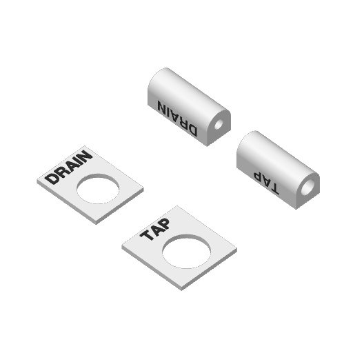
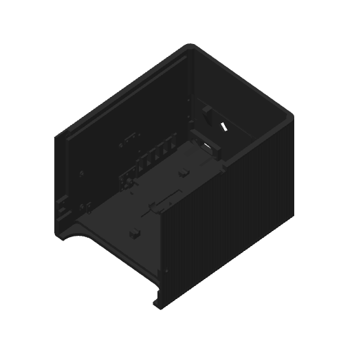

# DRAIN print set

This set supplies the three-row rear enclosure wall, six rectangular identification
chips and six matching tube collars. The black 4 mm DRAIN bulkhead receives the
white drain return. The separate [faucet print set](../faucet/vent-print-readiness/README.md)
contains the shell, counter stack, vent seals and insertion tool.
The [assembly instructions](../../assembly/asse-drain.md) list every drain plumbing
part with its Fresh Water Systems link.

The delivered editable projects are in [projects](projects/) and their sliced
archives are in [ready](ready/). The [manifest](manifest.json) binds all five cabinet
plates and the five finalized faucet plates to their source geometry and reviews.
The generators use `.cache/prints/2026-10-07-drain/`
as their local working directory. Reproduce them with:

```sh
tools/cad-venv/bin/python hardware/printed-parts/drain-readiness/prepare.py
tools/cad-venv/bin/python hardware/printed-parts/drain-readiness/review_native.py
tools/cad-venv/bin/python hardware/printed-parts/drain-readiness/review_show_support.py
tools/cad-venv/bin/python hardware/printed-parts/drain-readiness/review_dense_regions.py
tools/cad-venv/bin/python hardware/printed-parts/drain-readiness/review_insert_backing.py --native-stock
tools/cad-venv/bin/python hardware/printed-parts/drain-readiness/review_insert_backing.py
tools/cad-venv/bin/python hardware/printed-parts/drain-readiness/finalize_prints.py
```

The scripts use the installed Bambu Studio and submit no printer jobs. The checks
read emitted roads and bind the native archives to their source meshes by hash.

## Identification plates

The four Mark2 plates contain both the chips and collars. Each chip has one
rectangular flange-height bottom edge and lettering space above the fitting.
DRAIN's collar has a 4.25 mm bore; TAP retains its larger supply-tube bore.

| Project | Parts | Filament 1 / left 0.4 mm | Filament 2 / right 0.4 mm | Native archive under `ready/` |
| --- | --- | --- | --- | --- |
| [White](projects/labels-white-z004-mark2.3mf) | TAP and DRAIN | White PET-GF | Black PET-GF | [Native archive](ready/labels-white-z004-mark2.gcode.3mf) |
| [Blue](projects/labels-blue-z004-mark2.3mf) | SODA | White PET-GF | Blue PET-GF | [Native archive](ready/labels-blue-z004-mark2.gcode.3mf) |
| [Red](projects/labels-red-z004-mark2.3mf) | CO2 | White PET-GF | Red PET-GF | [Native archive](ready/labels-red-z004-mark2.gcode.3mf) |
| [Black](projects/labels-black-z004-mark2.3mf) | Two FLAVOR chips and two collars | White PET-GF | Black PET-GF | [Native archive](ready/labels-black-z004-mark2.gcode.3mf) |

The body and lettering keep their separate materials. Chips print face-up;
collars print flat-face-down. The saved recipe uses a 0.20 mm first layer, 0.24 mm
normal layers, a 0.12 mm closing band and no supports or brim. The accepted Mark2
nozzle registration is `0x0`, `0.5x-0.7`. Requested +0.04 mm user trim emits
`G29.1 Z0.02` on Textured PEI.

[Native label evidence](reviews/labels.json) records archive CRC, embedded G-code
MD5, source placements and an 88.945 mm minimum margin for the complete emitted
bead footprint, including the purge tower. It establishes commanded print
geometry. Actual lettering appearance, chip fit and collar grip remain
observations on the finished pieces.



## Rear wall

[Editable rear-wall project](projects/back-top-black-z004-mark2.3mf) and
[ready native archive](ready/back-top-black-z004-mark2.gcode.3mf) contain the
current rear wall on the Mark2's fixed left 0.4 mm nozzle with black PET-GF. Its roof-down orientation
preserves the additive exterior transition, with six walls through the first
9.4 mm and a 0.20 mm bed layer followed by 0.24 mm layers. Normal supports remain
on internal functional features and stay clear of the protected exterior faces.

Ordinary stock uses two walls. Each of the 23 complete insert-host and seam-root
modifiers uses ten walls and 100% zig-zag infill. The
[emitted dense-region review](reviews/dense-region-review.json) passes every
sampled region, with a minimum 99.048% nominal own-width bead coverage.
[Native archive review](reviews/back-top-native.json) verifies ZIP CRC, embedded
G-code MD5, source meshes, layer bands and a 21.904 mm full model/support/brim
bead margin. The saved time estimate is 26 h 55 min.

[Exterior support review](reviews/show-support-clearance-summary.json) checks
all 143,044 support/interface/transition roads against nine protected native
roof, chamfer, corner and sidewall faces. No nominal bead contacts those faces;
the minimum geometric clearance is 0.133 mm. Functional contacts on the rear
port field remain in [their separate record](reviews/rear-port-support-contacts.json).
Release the 39 support bodies through the empty forebay, interior and rear
openings; cut sacrificial connections into removable fragments and clear every
pilot, pocket and tie passage before installing fittings, boards, loom or insulation.
Physical release effort remains unmeasured.

The [native insert-stock review](reviews/insert-stock.json) passes all 19 complete
supplier envelopes. The separate [strict radial pore/bore diagnostic](reviews/insert-radial-backing.json)
retains finite gaps in commanded deposition: 678 of 680 sampled rays retain at
least 1.6 mm of uninterrupted nominal backing; the two remaining rays contain
0.000288 and 0.000407 mm interval gaps near the insert entry. No gap-closing
tolerance is applied. The maximum commanded bore contour extends 0.0557 mm
past the nominal brass knurl radius at a sampled location. These readings do
not measure actual bead fusion, installed brass contact or retention, and do
not supersede the separate complete-stock and regional-deposition checks.

[Identification geometry lint](reviews/identification-lint.json) records each
intentional lettering-pocket step and glyph face in the saved print frame.



Existing [physical acceptance records](../enclosure/print-readiness.md#physical-evidence)
retain their original scope. These files prepare the next physical assembly;
they do not establish vent capacity, installed hose behavior, pullout strength
or product lifetime.
