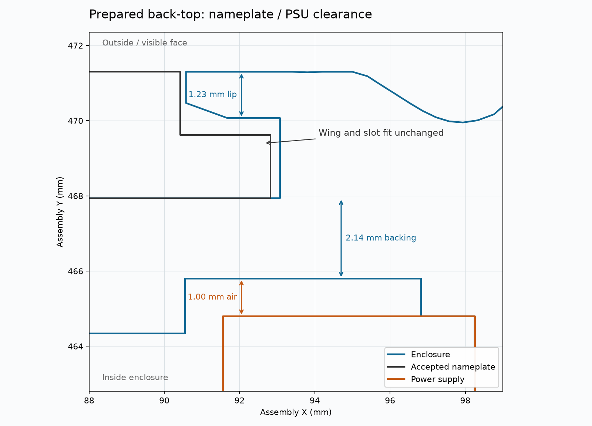

# Accepted cover interfaces in the upper enclosure

**Printing is on hold at Derek's request.** The front-top job was stopped before
printing; back-top has not been sent. These prepared files do not include the
work underway in the Funnel chat. The Grips chat owns the bottom-half additions.
Integrate those changes and recheck the affected native slices before another
enclosure print. No stored launch approval carries past this hold.

The production front-top contains the physically accepted display-cover wing
pockets. The cover itself is identical to the accepted specimen. Its deeper
display inset has a 23.84 mm PCB cavity, 1 mm behind the complete module, with
the 3 mm supporting rib retained. The wing-pocket support exits reach the empty
display storey. The tee-carrier region and the front-top below that storey are
unchanged.

The prepared back-top contains the accepted nameplate mouth and wing slots.
The flat plate, raised artwork, pocket floor, clearances and retaining faces
match the accepted coupon pair. Smooth exterior lands preserve the full
1.23 mm retaining lips through the fluted surface.

## Local power-supply clearance

The full-shell candidate has 2.14 mm of backing beside the PSU terminal corner
and 3.60 mm elsewhere. That local hidden relief gives 1.00 mm clearance to the
placed PSU. It removes 410 mm³ and keeps the tested nameplate mating faces.
This backing adjustment remains a proposal to review before printing.

[Geometry checks](geometry-check.json) establish zero interference at the seated
positions and permitted individual-axis clearances, display-module and funnel
clearance, the pump-plug withdrawal path, and PSU clearance. The
[printed-surface sampling](fluted-receiver-stock.json) checks 40 positions on the
retaining lips; the minimum is 1.230 mm. Combined translation extremes and
physical full-enclosure fitting are not claimed by these checks.

## Print preparation

Both halves use the shared PET-GF profile: 0.20 mm first layer, ordinary 0.24 mm
layers, saved speeds and wall order, 15% infill/wall overlap, and tree supports
with 0.40 mm XY, 0.45 mm upper Z and 0.30 mm lower Z clearance. Black PET-GF uses
the fixed left hardened 0.4 mm nozzle. Startup options remain the usual Auto for
flow dynamics and nozzle offset, with leveling and timelapse enabled.

- Front-top: H2C, mouth down, +0.18 mm requested trim, 0.08 mm through the complete
  inward roof-round band at print Z187–195 mm. Native estimate: 21 h 52 min.
- Back-top: Mark2, roof down, +0.04 mm requested trim, six walls through the
  expanding chamfer/taper at print Z0–9.4 mm, two walls above. The model retains
  a 15 mm plate border; the complete sacrificial support footprint is checked
  separately for at least 10 mm. Its native review is linked below when complete.

The exterior roof transitions exclude supports. Internal functional seats and
retaining bearings use accessible trees. Printed support removal and complete
enclosure fit remain physical checks. The three-minute shared-circuit startup
interval still applies to any later authorized starts or resumes.

## Reproduction and evidence

`prepare_geometry.py` materializes only front-top and back-top from the declared
assembly dimensions. Publish generated artifacts using `tools/publish_now.py`
before running geometry lint. `verify_geometry.py` checks the accepted mating
parts and neighboring hardware. `generation.json` and `source-bindings.json`
identify the source snapshot; `published-artifacts.json` verifies the live bytes.

`prepare_prints.py` creates an immutable native Bambu Studio project for either
half. `verify_prints.py` checks its emitted settings, layer bands, bounds and all
support bodies, including unlabeled contacts. `verify_early_layers.py` checks
first/second-layer bead overlap and the actual scoped wall count.

The [front-top native review](../../tee-readiness/full-enclosure-print/native-slice-reviews/2026-10-01-enclosure-front-top-flat-wings-h2c-v15/manifest.json)
records the sent archive and its stopped job. The hold status is recorded in
[`print-hold.json`](print-hold.json).
