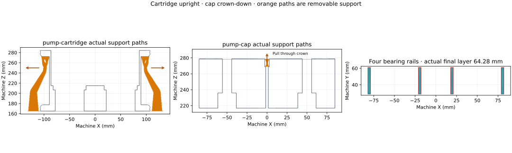

# Cartridge and cap: prepared bench-fit plate

The native two-part plate uses the current cartridge upright and the current cap
crown-down. It contains 496 layers and 177,630 source triangles, with no native
geometry warning. The saved profile estimates **9 h 43 min and 413.1 g**. Its actual
support/brim toolpaths retain 16.68 mm to the common printable-area boundary and
28.25 mm between the two objects.

The four cap rails finish print-up. Sixteen interior-layer readings retain a
minimum **3.000 mm road width** and **95.959 mm² of each 96 mm² bearing footprint**.
No support interface touches a new bearing rail. The recorded temperatures are
265°C nozzle / 80°C bed on the first layer and 280°C / 80°C thereafter. The requested
+0.04 mm user trim produces `G29.1 Z0.02` with this textured-plate compensation.

| Piece / support | Contact region | Root | Build-up | Removal lane before hardware installation |
| --- | --- | --- | --- | --- |
| Cartridge left | Flat roof of left pull pocket | Bed | 105.84 mm | Straight outward through the open −X pocket mouth |
| Cartridge right | Flat roof of right pull pocket | Bed | 105.84 mm | Straight outward through the open +X pocket mouth |
| Cap aft screw | Flat screw-head seat | Bed | 9.12 mm | Through its counterbore toward the crown, the bed-facing mouth |
| Cap fore screw | Flat screw-head seat | Bed | 9.12 mm | Through its counterbore toward the crown, the bed-facing mouth |

The pull roofs remain flat hand-contact surfaces; the screw seats remain flat
annuli. Those working faces are carried by supports. Each tree and interface is
located in the named native opening in
[`pump-toolpath-review.json`](pump-toolpath-review.json), which also identifies the
exact G-code. The counts and build-up describe the slice; physical removal effort
and contact finish remain unmeasured.

The retained archive is
`.cache/prints/2026-09-20-pump-cartridge-scan-corrected-black-z004-mark2-v1/ready/pump-cartridge-scan-corrected-black-z004-mark2-v1.gcode.3mf`.
Its SHA-256 is `2d8fe33341bc5e998a0baee25e2ef92ca8939a21e06b4b2cf0be84129fe952cf`;
the G-code SHA-256 is
`00f9df1f571acd996e92cd7da71f8430da5f4add4ecaa2c2683ec6c088f11ad1`.
[`pump-print-readiness.json`](pump-print-readiness.json) carries all profile,
geometry, archive and audit identities.

This is a **pump-seat and cap bench-fit print**. Physical fit is pending;
`assembly_current` and `production_enclosure_released` remain false. The complete
collet/carrier mechanism, remaining tee datums and complete enclosure retain their
own qualification requirements. Live printer spool mapping and an empty plate
must be checked at submission; these scripts do not contact a printer.
