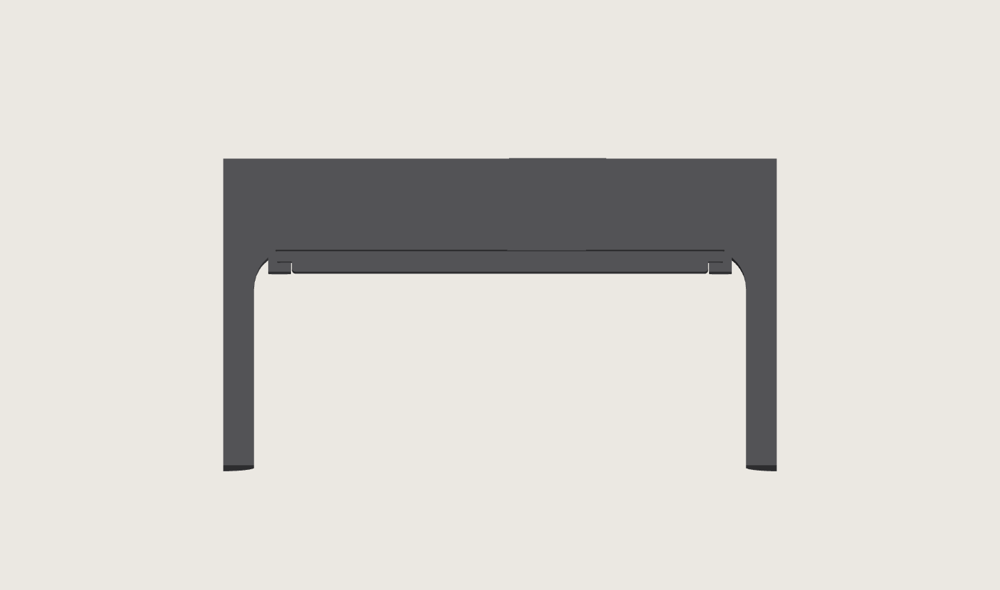

# Bottom grip snap covers

Two identical black PET-GF strips cover the flat, supported lifting ceilings of
the enclosure's bottom handholds. Each strip crosses the connected front/back
seam. Its two flat end wings fit short slots in receiver lips on the bottom
halves. The strip has a smooth finger face, R0.6 touch edges, and a flat back.

This is a **geometry and fit candidate**. Its receiver additions require matching
bottom halves. The full-size front and back grip coupons carry the actual
enclosure joint and provide a small print for assessing the pair. The production
enclosure generator and upper halves retain their own geometry.



## Geometry

| Feature | Dimension |
|---|---:|
| Cover body | 67.7 × 7.7 × 3.36 mm |
| Overall length including wings | 72.5 mm |
| Each end wing | 2.40 mm reach × 5.00 mm span × 1.68 mm thick |
| Body end clearance | 0.15 mm each |
| Wing side clearance | 0.15 mm each |
| Wing tip clearance | 0.25 mm each |
| Wing retaining-face clearance | 0.45 mm |
| Nominal back clearance at the supported ceiling | 0.25 mm |
| Flat receiver lip section | 1.23 mm |
| Structural roof above the liner | 12.00 mm |
| Finger height at the lower retention stop | 31.19 mm |
| Finger height with the cover against the roof | 31.89 mm |

The flat-wing section and entry bevel follow the accepted nameplate pattern.
The short cover's bending recovery and these receivers' fit are unmeasured.
The insert covers the 68 × 8 mm flat roof between the R6 corner and exterior
transitions, leaving the ordinary perimeter clearance. The outer R6 roll remains
part of the enclosure.

Upward finger force seats the broad cover back against the existing roof. The
end wings retain the cover against falling out. The receiver lips stand below
the roof at the ends; the full roof section, inner wall, seam scarf and screw
region remain intact.

## Assembly and removal

Join and fasten the enclosure halves first. Tuck one wing into its slot, bow the
strip downward enough to engage the other wing, and release it into the seat.
The accessible outer long edge provides a place to pull the centre downward for
removal. Remove both covers before separating the bottom enclosure halves.
Remove the receiver supports while the halves are separate. The ceiling mat
withdraws toward the open seam end of each handhold; the lip's lower support
leaves through the open bottom.

## Print and checks

The cover prints with its back and both wings on the bed and its finger face
upward. The two receiver coupons print floor-down, in the bottom halves'
production orientation. They use the shared PET-GF tree supports. The first
layer is 0.20 mm; ordinary layers are 0.24 mm. The cover's top R0.6 uses 0.08 mm
layers. The receivers' expanding R6 transition uses six walls locally at 0.24 mm,
with the saved speeds, wall order and 15% infill/wall overlap.
Elephant-foot compensation is zero, preserving the full first-layer footprint
under the flat wings and second-layer perimeter.

[Geometry checks](geometry-check.json) read the exported solids and meshes:
each part is valid and connected, all printable meshes are closed, the complete
roof and joint are retained, the halves do not overlap, and both wings remain
captured at the limits of the designed clearance. The seated cover clears both
receivers throughout its play.

The [native print check](print-check.json) records the exact archive, sources,
cover layers, bed contact and first-to-second-layer bead overlap. The
[support audit](support-audit.json) includes the coupons' short support bodies
and maps their contacts to the CAD frame. No print has been submitted. Support
removal, insertion recovery, retention, touch finish and lifting performance
require the physical samples.

```sh
HSM_NO_BUILD_LOCK=1 tools/cad-venv/bin/python hardware/printed-parts/enclosure/grip-cover/grip_cover.py
HSM_NO_BUILD_LOCK=1 tools/cad-venv/bin/python hardware/printed-parts/enclosure/grip-cover/check_geometry.py
HSM_NO_BUILD_LOCK=1 tools/cad-venv/bin/python hardware/printed-parts/enclosure/grip-cover/prepare_print.py
HSM_NO_BUILD_LOCK=1 tools/cad-venv/bin/python hardware/printed-parts/enclosure/grip-cover/verify_print.py
```

`grip-cover.stl` is the interchangeable strip. `grip-receiver-front.stl` and
`grip-receiver-back.stl` are the full-size receiver samples. The STEP views show
the seated grip, exploded grip, section, connected bottom halves, and separate
candidate bottom halves. Candidate models are separate from the production
enclosure files.
