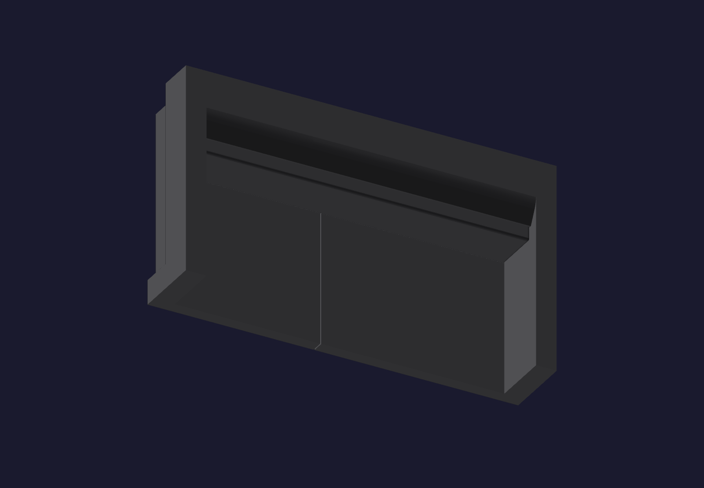

# Bottom grip snap covers

Two identical black PET-GF strips cover the flat, supported lifting ceilings of
the enclosure's bottom handholds. Each strip crosses the connected front/back
seam. Its two flat end wings fit through-slots in square 3 mm end walls. The
strip has a smooth finger face, R0.6 touch edges, and a flat back. The receiver's
roof uses one constant X–Z profile along the full 80 mm opening.

This is a **geometry and fit candidate**. The receivers are built directly into
complete matching bottom halves. The full-size front and back grip coupons carry
the actual enclosure joint and provide a small print for assessing the pair.



[Inserted 3D view](https://homesodamachine.com/3d?file=printed-parts%2Fenclosure%2Fgrip-cover%2Fgrip-seated.step#step:printed-parts%2Fenclosure%2Fgrip-cover%2Fgrip-seated.step)
· [Section through the catches](section.png)

## Geometry

| Feature | Dimension |
|---|---:|
| Cover body | 79.7 × 11.558 × 3.36 mm |
| Overall length including wings | 84.5 mm |
| East cover's X extent | 93.650–105.208 mm |
| Slot mouth planes | Y174.000 and Y254.000 mm |
| Constant roof profile | Y174.000–254.000 mm |
| Catch end-wall thickness | 3.00 mm |
| Each end wing | 2.40 mm reach × 5.00 mm span × 1.68 mm thick |
| Body end clearance | 0.15 mm each |
| Wing side clearance | 0.15 mm each |
| Wing tip exit | Open through the 3 mm end wall |
| Wing retaining-face clearance | 0.45 mm |
| Nominal back clearance at the supported ceiling | 0.25 mm |
| Structural roof above the liner | 12.00 mm |
| Finger height at the lower retention stop | 31.19 mm |
| Finger height with the cover against the roof | 31.89 mm |

The flat-wing section and entry bevel follow the accepted nameplate pattern.
The short cover's bending recovery and these receivers' fit are unmeasured.
The insert reaches the flat ceiling's outer edge at the foot of the additive
exterior transition. Its inner edge and both ends have 0.15 mm clearance; the
outer edge is free. The roof starts with a 0.5 mm outward run per millimetre of
rise, tangent to the retained R6 curve. That same X–Z section extends to both
end-wall planes. The end walls have square corners; the exterior roof curve
does not turn downward around them. The cover's R0.6 touch rounds finish the
finger face.

The receiver samples end at the inboard face of the complete 3 mm handhold wall.
The wall's square front/back ends retain that thickness through their full height.

Upward finger force seats the broad cover back against the existing roof. The
end wings retain the cover against falling out. Their slots begin on the existing
end-wall planes, without ledges projecting into the finger opening. The slots
pass through the end walls for access from either side. The 12 mm roof sections
above the cover retain the enclosure joint's running clearance. The inner wall,
square wall joint and screw region remain intact.

## Assembly and removal

Join and fasten the enclosure halves first. Tuck one wing into its slot, bow the
strip downward enough to engage the other wing, and release it into the seat.
The accessible outer long edge provides a place to pull the centre downward for
removal. Remove both covers before separating the bottom enclosure halves.
Remove the receiver supports while the halves are separate. The ceiling mat
withdraws toward the open seam end of each handhold; slot supports have a straight
run through the end walls.

## Print and checks

The cover prints with its back and both wings on the bed and its finger face
upward. The two receiver coupons print floor-down, in the bottom halves'
production orientation. They use the shared PET-GF tree supports. The first
layer is 0.20 mm; ordinary layers are 0.24 mm. The cover's top R0.6 uses 0.08 mm
layers. The receivers' expanding R6 transition uses six walls locally at 0.24 mm,
with the saved speeds, wall order and 15% infill/wall overlap.
Elephant-foot compensation is zero, preserving the full first-layer footprint
under the flat wings and second-layer perimeter.

[Geometry checks](geometry-check.json) read the exported solids and meshes:
each part is valid and connected, all printable meshes are closed, the complete
12 mm bearing roof and structural joint are retained, the cover reaches
X105.195, all four slot mouths lie on Y174/254, the halves do not overlap, and
both wings remain captured at the limits of the designed clearance. The seated
cover clears both receivers throughout its play. The checks measure the uniform
roof section through both end regions, full 3 mm catch walls and the absence of
curved returns around the opening ends. The opening is clear beneath the roof
over its full length and width.

The [native print check](print-check.json) records the exact archive, sources,
cover layers, bed contact and first-to-second-layer bead overlap. The
[support audit](support-audit.json) includes the coupons' short support bodies
and maps their contacts to the CAD frame. The current v5 receiver slice has no
physical result. Support removal, insertion recovery, retention, touch finish
and lifting performance require the physical samples. The separate
[Mark2 trial record](mark2-trial-v4/README.md) identifies its v4 geometry and archive.

```sh
HSM_NO_BUILD_LOCK=1 tools/cad-venv/bin/python hardware/printed-parts/enclosure/grip-cover/grip_cover.py
HSM_NO_BUILD_LOCK=1 tools/cad-venv/bin/python hardware/printed-parts/enclosure/grip-cover/check_geometry.py
HSM_NO_BUILD_LOCK=1 tools/cad-venv/bin/python hardware/printed-parts/enclosure/grip-cover/prepare_print.py
HSM_NO_BUILD_LOCK=1 tools/cad-venv/bin/python hardware/printed-parts/enclosure/grip-cover/verify_print.py
```

`grip-cover.stl` is the interchangeable strip. `grip-receiver-front.stl` and
`grip-receiver-back.stl` are the full-size receiver samples. The STEP views show
the seated grip, exploded grip, section, connected bottom halves, and separate
candidate bottom halves. Candidate models are separate from the production
enclosure files.
