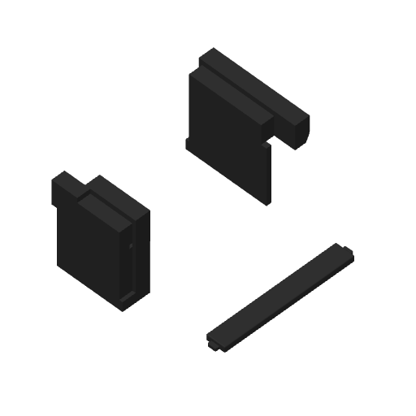

# Grip receiver and insert physical trial

Mark2's test plate contains one grip cover and the front and back receiver
samples. The samples retain the actual handhold dimensions and enclosure joint.
The cover has both wings on the bed, with its finger face upward; the receivers
stand in the bottom enclosure's production orientation.

The [launch receipt](launch.json) identifies task `1298005797` and the exact v4
archive. Its native estimate is **1 h 7 min**, 216 layers, and 31.21 g of black
PET-GF through Mark2's fixed left hardened 0.4 mm nozzle. The receiver's printed
surface is [accepted](../physical-acceptance.json). Physical fit, support removal,
bending recovery, retention and lifting results are unreported.

The first layer is 0.20 mm. Ordinary layers are 0.24 mm, with six walls only
through the receivers' expanding show transitions and 0.08 mm on the cover's
inward top rounding. The cover has no supports. Each receiver has one bed-rooted
tree body reaching its lifting ceiling. The shared PET-GF support gaps are
0.40 mm in XY, 0.45 mm above supports and 0.30 mm below them. Speeds, wall-first
order and 15% infill/wall overlap follow the shared profile.

The [preflight](preflight.json) binds the current meshes to the native archive,
checks the emitted first and second layers on all three pieces, and verifies
Mark2's +0.04 mm requested trim (+0.02 mm emitted for textured PEI). Startup uses
Timelapse On, bed leveling On, Flow Auto and Nozzle Offset Auto.

Remove the receiver supports while the halves are separate. Join the receivers,
then tuck one wing into its slot, bow the cover enough to engage the other wing,
and release it into the seat. The physical test evaluates support access,
insertion, recovery, retention and finger contact on this full-size handhold.

The companion [geometry check](geometry-check.json), [native print check](print-check.json),
[preparation](preparation.json) and [support audit](support-audit.json) are snapshots
for this exact trial. The native archive is retained at the repository-relative
cache path in the launch receipt. Its source recipe is `../prepare_print.py`.
The launch receipt governs submission status; the copied preparation checks
describe their pre-send state.

Both printers were idle before this send. The [acceptance status](acceptance-status.json)
records the Mark2 job and H2C's stopped full-shell job. The earliest other-printer
start or resume is three minutes after the recorded acceptance observation.
Full-enclosure printing remains held.
