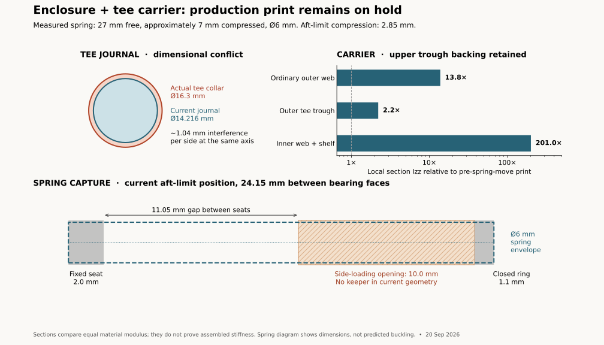

# Front-top and tee-carrier print readiness

**Production print held.** The source assembly's clearance checks do not establish fit to
hardware that is represented by a different part, spring capture under deflection, or printed
carrier stiffness. These are outstanding release conditions for `enclosure-front-top` and
`enclosure-tee-carrier-left/right`.

The H2C job `enclosure-front-top-petgf-z018-h2c.gcode.3mf` is cancelled. Printer status and
Bambu Connect confirmed cancellation at 2026-09-20 21:34 UTC; its last observed running layer
was 51/813 and both heater targets are zero. Plate removal is not yet confirmed. The exact
slice and cancellation are recorded in [print-jobs.json](enclosure/print-jobs.json).

## Existing scans and their downstream state

| Captured part | Current model and consequences | Remaining work |
|---|---|---|
| Beduan solenoid | Measured reference: 24.4 × 24.85 mm post pitch, Ø6.9 posts, 5.2 mm bearing height, 59.5 mm port span and 57.3 mm overall height. The valve sockets, trays and cold-core cradles consume these dimensions. | Fit actual posts in a production-profile socket coupon; check the other valves against the captured sample. No new full scan is indicated. |
| DIGITEN flow meter | Measured offset body and fixed mounting collars are in the reference. Its placement, collar anchors, ties and nearby tubing account for that shape. | Confirm the molded flow arrow and installed orientation on the actual part. A surface scan does not establish hydraulic direction. No new full scan is indicated. |
| John Guest PP0208E tee | Six fixed exterior patches from the five-view scan are rigidly registered at scale 1.0. Widest collar midpoints measure 16.224–16.330 mm; the sampled drafted collar envelope rounds to 16.5 mm. Production consumers still use the McMaster stand-in. | Establish the absolute extended branch-sleeve station and fixed-barrel/moving-sleeve boundary, then propagate one measured reference to all consumers. Preserve Derek's collet travel and tube-depth datums. |
| Faucet lever | The primary STEP, STL and viewer carry the accepted flat-sided shape with the 9.0 mm cylinder channel. Its printed STL is byte-identical to the successful Mark2 artifact. Derek's fit/function confirmation is linked to those exact bytes in the physical-acceptance record. | Quantitative strength and repeated-load endurance remain unmeasured. The full faucet assembly's placeholder requires an actual assembled pose before integration. |
| Touch-Flo interface | Scan archive and reference registration exist. | The complete faucet assembly still has its placeholder lever/actuator representation; that integration is separate from enclosure release. |

The measured valve and meter also affect the surrounding assembly: the inner valve/tee
layout has a 2 mm lower station, V-K follows its actual suction-chain port, the meter has
more installation room, and the crossing tube, carrier backing and cold-core plinths account
for their neighbors. These corrections must travel together into the final solids and slice.
The cancelled H2C slice's valve-tray region was 2 mm above that corrected geometry.

The tee scan is preserved at
`~/Documents/3D Scans/2026-09-19-jg-pp0208e-tee/`, with an archive manifest, the session PLY/STL,
the native merged mesh/cloud and `Merge_04.revox`. The native and session PLY hashes agree.
The PLY has 236,524 faces; the session's STL/render describe a cleaned 234,357-face surface.
Neither mesh is treated as a closed manufactured solid or an internal bore measurement.
The [registered surface evidence](../../reference/jg-pp0208e-tee/scan-registration.json)
reports held-out 95th-percentile residuals of 0.061–0.107 mm. These are scan-fit residuals,
not manufacturing tolerances. The [branch-width diagram](../../reference/jg-pp0208e-tee/branch-measurement.svg)
identifies the remaining absolute sleeve measurement.

## Tee dimensions block the enclosure

The current branch journal is `2 × (6.858 + 0.25) = 14.216 mm` in diameter. The actual
PP0208E's widest collar is approximately **16.3 mm**, supported by the archived scan and
its documented nominal dimension. At the same axis this is **1.042 mm radial interference**,
before adding any running clearance. The journal is the collar's entry and sliding path.

The stand-in also spans 40.14 mm across its run, while Derek's production tee measures
42.5 mm with extended collets and 39.2 mm with both pressed. Its branch reach, collar band,
release nose, carrier troughs, fixed plate and connecting tubes therefore need one coherent
production model. Increasing a hole alone does not reconcile the mechanism.

The bench's **1.65 mm sleeve stroke, 0.5 mm nose gap and 10 mm insertion depth from the
pressed sleeve** remain the measured operating inputs. The separate JG drawing's 15.7 mm
published insertion dimension is not substituted for Derek's observation.

## Carrier stiffness and joint

The [numerical audit](tee-carrier/readiness-audit.json) compares current printed-mesh sections
with the committed print immediately before the spring relocation (`f0cb8a5e8^`). It records
both input hashes and the resolved baseline commit. Sections are normal to X; the measured
second moment `Izz` describes local resistance to fore/aft bending at equal material modulus.
It is not a whole-carrier deflection, infill, layer adhesion or joint-slip simulation.
The calculation is reproducible with
`tools/cad-venv/bin/python hardware/scripts/audit_carrier_sections.py`.

| Section | Current / earlier local Izz |
|---|---:|
| Ordinary outer web, X=60 | 13.82× |
| Outer tee trough centre, X=79.82 | **2.21×** |
| Inner web and shelf, X=40 | 200.96× |
| Sample through grip root, X=92 | 0.89× |

The grip's location and cutouts differ, so the last sample is not a claim of an 11% reduction
in the entire grip's stiffness. Each station trough ends 0.3 mm above the current reference
tee. The shallower tube relief retains 4.108 mm backing over the upper 13.45 mm.
[Native verification](tee-carrier/upper-backing-check.json) records 271.28 mm³ added per half,
no removed material, and no addition outside the existing web insertion envelope. All four
positive retained-stock checks pass and reject a reconstructed full-height overcut.
The outer tee centre has Izz 151.865 mm⁴. Final section values still depend on integrating
the larger actual tee and its operating stations.

The 6 mm web and inner shelf improve substantial portions of the carrier, and placing spring
reaction in each grip removes the spring's direct bending load from the middle web. Hand
forces, tee release forces and unequal operation still load that web. The current evidence
does **not** qualify the requested assembled stiffness or a uniformly stronger load path.

The full-height centre lap has a broad contact face, but no geometric shear key. Its two
screws clamp the face; they contribute to its connection, but the model contains no clamping
force or slip result. Replacing them with small flexible clips on the same flat lap would
not establish a rigid connection.

A [three-piece interlocking joint coupon](tee-carrier/joint-coupon/README.md) tests broad
headed keys, their receiving shoulders and a separate snap keeper. The keys transfer
bending and shear; the keeper blocks the reverse assembly movement. Its unique Mark2
job is running in black PET-GF, with the exact source and archive hashes retained.
The nominal 0.15 mm fore/aft and 0.40 mm supported vertical clearance does not preload
the joint. Measure its play before claiming stiffness; a production screwless joint needs
a demonstrated draw-in fit. The production carrier still uses the screw-clamped lap.
The larger actual tee, full-half entry path, valve access and keeper access remain
integration requirements.

## Actual spring measurements and capture

[Derek's measurements](tee-carrier/spring-measurements.json) control the fitted stiffer set:
**Ø6 mm, 27 mm free length, approximately 7 mm fully compressed, possibly slightly less**.
The catalog product's nominal 30 mm length is not the sample's measured free length.

| Current carrier state | Bearing separation | Compression from 27 mm free | Clearance above approximately 7 mm compressed |
|---|---:|---:|---:|
| Release / squeeze | 19.50 mm | 7.50 mm | 12.50 mm |
| Connected | 21.65 mm | 5.35 mm | 14.65 mm |
| Aft limit | 24.15 mm | **2.85 mm** | 17.15 mm |

The current Ø6.57 channel gives 0.285 mm nominal radial air around Ø6. The 9.61 mm loading
space has approximately 2.61 mm margin above the measured compressed length. Loading length
and nominal preload therefore pass this dimensional reading. Actual spring rate, wire
measurement, variation between samples and mechanism force are not established by it.

**Positive capture does not pass release review.** The fixed end has a 2 mm deep seat. The
moving channel is 11.1 mm deep but its first 10 mm is open inboard for loading, leaving only
a **1.1 mm closed ring** at the back. There is no keeper over that window and no continuous
internal guide. The unsupported gap between the fixed seat mouth and the moving channel
mouth ranges from **6.40 to 11.05 mm** over travel; the side opening continues a further
10 mm into the moving channel.

Preload presses the ends against their floors but does not prove that a deflected coil
cannot leave alignment. The existing spring check sweeps a straight maximum-OD envelope;
it is a clearance test, not a bent-spring escape or retention test. Close the loading route
with a positively retained keeper and provide sufficient end/axis guidance through the
entire 4.65 mm travel. Verify the keeper's own capture and an assembly route before printing.
The source still consumes the Lee catalog spring for its drawing/force arithmetic; reconcile
that consumer with the measured pair and do not label the Lee forces as actual pair forces.

A [native access study](tee-carrier/spring-guide-access.json) supports an axial guide
installed from the fore pump bay before the cartridge. A 19 mm projection from the fixed
spring floor leaves 0.50 mm tip clearance at release and 5.95 mm moving-bore engagement
at the aft limit. The head must be flush or recessed: the installed cartridge passes only
0.250 mm ahead of the fixed wall. Spring inside diameter, positive head retention and the
loading-window keeper remain design inputs. The study's Ø3 mm pin is an example, not a
released guide size.

## Additional scans and physical checks

| Priority | Part / interface | Needed evidence |
|---|---|---|
| Targeted remaining measurement | PP0208E tee | Fixed exterior registration is complete. Measure the fully extended branch width shown in the diagram; resolve the small fixed barrel versus moving sleeve boundary at the nose. Add a targeted end view only if that seam cannot be identified directly. |
| Capture in progress for front-top | Installed Kamoer pump (BOM: KPHM600; reference name: KPHM400) | Capture the complete head, skirt, bracket, rear boss and tube exits in a common frame. The existing seats carry Derek's physical-fit work and remain established inputs. The legacy reference name does not establish a variant mismatch; the capture resolves the remaining envelope and variant evidence independently of holder-derived head/boss surfaces. Confirm both actual pumps at their seating faces. The pump-side tube joint also needs a tug test: the BOM records 6.35 mm LLDPE in a nominal 6.4 mm pump-tube bore, with its tie carrying release tension. |
| Before wider enclosure release | SEAFLO pump | Capture head/casting, switch envelope and port axes relative to its measured mounting feet. Much of this model is scaled drawing linework; the current nearby route and bulkhead gaps are only 1.001 and 1.004 mm. |
| Before back-top/gas-chain release | Actual gas adapters, coupling and check valve | Caliper made-up lengths, seat diameters and thread engagement. The assembly explicitly marks these provisional. Scan awkward external forms if calipers cannot resolve them; scan geometry does not qualify thread sealing. |
| Bench check, no scan required | Stiffer return springs | The supplied dimensions settle the basic envelope. Check both ends remain captured, including unequal grip motion and sideways deflection, in the revised printed guides. Measure force if a numerical stiffness claim is required. |
| Bench check, no new scan indicated | Machine display and keystone | Recorded hardware fit exists. The current display cover's snap skirts and housing shoulders still need a production-profile seating/retention test; a scan of the rectangular display does not test the printed latch. |
| Bench check, no new scan indicated | Measured Beduan sockets and DIGITEN anchors | Use small production-profile mating coupons with the actual parts before committing the full enclosure. Confirm meter flow-arrow orientation. |

The calipered compressor/condenser and other already fitted rectangular or cylindrical
interfaces do not automatically need scanning because a scanner is available. Scan surfaces
whose uncertainty is larger than their fit or routing allowance. Printed friction, spring
escape, tube release, leak-tight reconnection and snap retention need physical tests.

## Release sequence

1. Integrate the actual tee and verify the Kamoer interface against the existing physical-fit evidence, supplementing it with the targeted scan where needed; propagate the tee dimensions
   through manifold, carrier, plate, guides and tube stations.
2. Correct the carrier's remaining weak sections, qualify the interlocking joint and provide
   positive spring capture on both ends using the measured pair.
3. Print the small mating/retention coupons and dry-cycle the mechanism with all four actual
   tubes. Check unequal hand motion, complete sleeve release, empty return and capture at
   every stop. Compare the full-width carrier pairs under the same constraints and applied
   load; an isolated section coupon cannot establish assembled rigidity. Exercise the
   display-cover latch in its actual printed housing section.
4. Rebuild the affected enclosure, carrier and cold-core part producers, then the assembly.
   The assembly build alone does not regenerate every individual printable STL. Confirm fresh
   solid/motion/clearance checks against those exact outputs, including the lower shell seam
   and cold-core interfaces. Geometry gates must use the actual purchased-part references.
5. Slice only that frozen model with the production PET-GF profile and H2C +0.18 mm requested
   trim. Verify the source STL digest against the current model, inspect the embedded mesh
   and actual support-removal lanes, and give the replacement a unique job name. Check the
   same digests again immediately before sending.
6. Confirm the cancelled object has been removed and the plate is clear, then start H2C and
   verify the exact replacement filename on the printer.

## Verification scope

The Beduan and DIGITEN scan comparison scripts were rerun during this audit and reproduced
the retained numerical results. Beduan post walls have a 0.113 mm 95th-percentile scan/model
discrepancy; DIGITEN mounting collars have 0.155 mm. These describe agreement with the scan,
not guaranteed manufacturing tolerance or physical print fit.

The baseline source assembly build completed successfully with 107 passing checks and one
inactive gas-chain qualification warning, including 398 carrier solid/envelope checks and
zero unintended carrier overlap. At that baseline its facts matched the written card,
assembly solid and all 146 source files. The carrier's bounded backing correction has its
own regenerated solids, passing selftest and native difference checks; a fresh complete
assembly build remains required after the production references and retention are settled.
The retained support audits for front-top and both carrier halves name earlier STL hashes,
as recorded in [print-readiness.json](print-readiness.json). They also use the earlier 0.20 mm
layer and support-gap settings, rather than the current 0.24 mm layers and requested 0.45 mm
support top gap. Their support counts do not qualify a replacement slice. A green card for the stand-in tee and
catalog spring is not production approval. Repository-wide check failures also remain and
must not be described as an all-green project.
