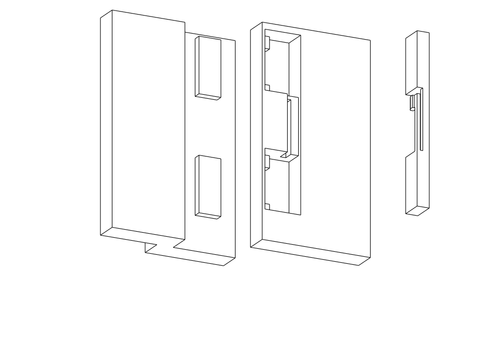
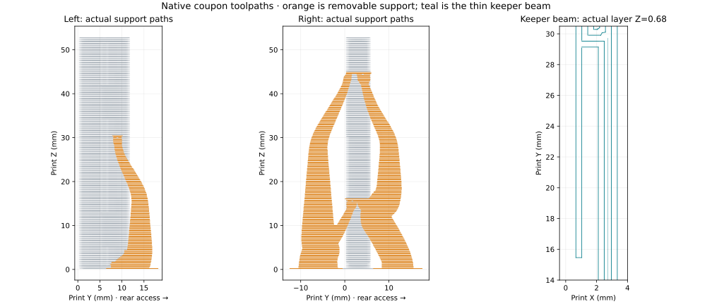

# Tee-carrier interlocking joint coupon

**A bench coupon, not a production carrier.** The current carrier source and its two
printed meshes are unchanged. This study makes the proposed screwless load path tangible
while the production tee reference, spring capture and enclosure clearances are settled.



Two broad headed keys on the left lap enter windows in the right half. The right half's
existing final **3.25 mm outward slide** engages the heads behind rigid shoulders. A
separate snap keeper fills the vacated entry windows, preventing the joint from sliding
back to its disengaged position. The headed keys and lap carry fore/aft bending and shear;
the flexible catch retains the keeper in its rear-access seat.

The coupon preserves the current **12 mm lap stack**, **52.82 mm height**, **4.17 mm tongue
root overlap** and **28.93 mm key spacing**. The two heads are 5.6 × 2.0 × 14.0 mm; each
has a 3.0 × 2.0 × 8.0 mm neck. Each keeper block is 3.1 mm wide. Broad plain side wings
provide hand and clamp surfaces for a bench check. There are no screws or inserts.

The final tee layout must leave this joint's entry windows and surrounding stock intact.
The receiver's entry window ends at X=7.20 mm; these dimensions are not an authorization
to consume a future tee, tie or valve clearance.

## Geometry evidence

Run with the project's CAD environment:

```sh
tools/cad-venv/bin/python hardware/printed-parts/enclosure/tee-carrier/joint-coupon/joint_coupon.py --export
```

[checks.json](checks.json) records three valid single solids, no assembled overlap, the
exact rectangular volumes swept by both keys through forward entry and outward seating,
positive key contact after each stated clearance is consumed, and positive keeper
retention. The hook's deflected insertion envelope and its free bending space are clear.

The keeper's 0.8 mm beam has 12.18 mm effective length and 0.45 mm tip travel. The elementary
small-deflection beam estimate gives **0.364% surface strain**. This does not establish
printed PET-GF strength, the stress at its root, required snap force or fatigue life.

The nominal fore/aft key clearance is **0.15 mm**, and supported vertical clearance is
**0.40 mm per opposing contact**. This coupon has geometric retention, not modeled
clamping preload. The printed coupon has no observed rocking or play in Derek's hand-fit test; full-width
carrier rigidity remains a separate physical comparison.

## Print and assemble

The three `coupon-only-*.stl` files are already placed on their intended print beds. The
left and right pieces print upright with +Z up, matching the carrier's layer direction.
The keeper prints on its flat rear face, so its long flexible beam bends in the layer
plane. The matching STEP files use one common installed coordinate frame.

Use the intended production PET-GF and its production profile. The key-head undersides,
receiver-pocket crowns and small keeper catch retain their square bearing faces. The
receiver's key pockets open directly aft, giving their supports a straight removal lane.
The loose keeper's catch and beam gap are also exposed; remove support before assembly.
The [native toolpath review](toolpath-review.json) records one bed-rooted support body
with two interface regions on each main piece. The right coupon's tree has fore and aft
legs; separate them at the exposed branches, then remove them from their respective open
faces. The keeper has no emitted support. Actual removal effort and bearing finish still
come from the physical coupon.

The unique offline job is **`carrier-joint-coupon-black-z004-mark2-v1.gcode.3mf`**, prepared
from the shared 0.24 mm PET-GF profile for Mark2 with the requested +0.04 mm trim. The actual
emitted compensation commands are `G29.1 Z0` and `G29.1 Z0.02`. The slicer estimates
**36 min 29 sec, 14.74 g and 220 layers**. The five keeper beam layers retain **0.80 mm**
material width and **0.65 mm** open space beside the beam in the commanded road envelopes.
[print-readiness.json](print-readiness.json) records exact source/profile/archive hashes.
Mark2 completed this exact job at the **2026-09-20 23:23:54 UTC** status reading, with
**220/220 layers, 100% progress and no printer error**; [print-status.json](print-status.json)
retains that reading. Derek reports successful tight assembly with a small amount of force
and **no rocking or play**. The keeper inserts with a tight friction fit, but its tiny catch
is flimsy and supplies essentially no observed spring tension. The
[physical fit report](physical-fit.json) accepts the interlocking fit and rejects the catch
as a meaningful positive lock. Broad compliant walls and retaining lips, patterned on the
[accepted faucet display cover](../../../faucet/faucet-display-cover/physical-acceptance.json),
are the integral latch direction: the two mating halves should lock during their normal
seating movement, with no separate keeper or fastening step. Simpler assembly is an
acceptance condition.
The left external spool is mapped as PET-CF in Bambu Connect and carries Derek's black
PET-GF. Timelapse and bed leveling are On; flow and nozzle-offset calibration are Auto.
This coupon does not release the production carrier or enclosure.



1. Leave the keeper out. Offset the right half 3.25 mm toward the left and pass it over
   both heads from the rear until the broad lap faces meet.
2. Slide the right half 3.25 mm outward. Both heads must engage together without forcing
   one end of the lap open.
3. Push the keeper into the rear entry windows until its rear face is flush and its catch
   engages. Confirm that rearward pulling does not remove it and that reversing the
   3.25 mm engagement slide is blocked.
4. Check rocking, shear play and permanent set under equal loads in both fore/aft
   directions. Record the force and the wing separation used. Do not infer whole-carrier
   stiffness from hand feel of this short coupon.

A latch which cracks, whitens, stays bent, or fails to engage rejects the coupon. Binding
or excessive play calls for a fit correction before integrating the joint. Final release
requires the complete carrier entry path, keeper access, all neighboring hardware and a
full-width comparison under equal centre and unequal hand loads.

The current rear-insert keeper does not preload the broad lap. A rigid draw-in wedge would
need to enter under the keys' fore faces along X or Z; thickening the adjacent keeper blocks
alone does not remove fore/aft lash. Derek observes a tight, play-free coupon fit and does
not accept the design's complexity. Neither half is selected for reuse. The complete carrier
assembly is under redesign for simplicity and full-width rigidity, with the faucet display
cover as the sole physically proven snap-fit example.

## Remaining carrier work

The production carrier retains backing above its tee troughs, verified in the
[native backing check](../upper-backing-check.json). Both spring ends still need positive
capture, and all dimensions must follow the actual PP0208E tee. The
delivered springs' 27 mm free length, approximately 7 mm compressed length and 6 mm OD
control their envelope. No catalog spring rate is treated as a measurement of that pair.
An internal guide remains conditional on the measured inner diameter; an external guide
must preserve the carrier's lateral insertion route and fore retaining shoulder.
