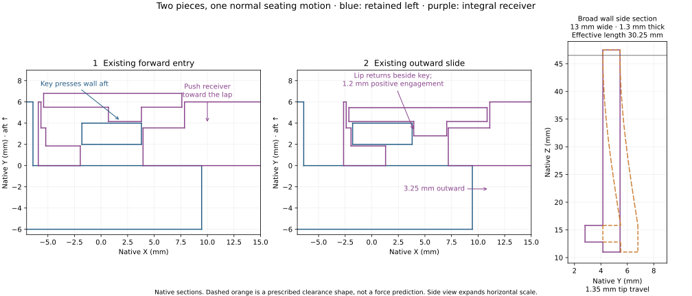
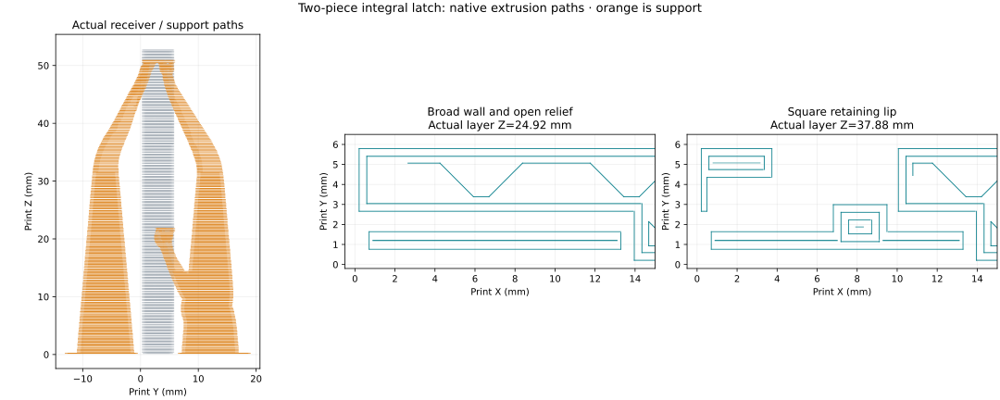

# Two-piece integral carrier latch coupon

**This study has no print release.** Neither coupon half is selected for reuse. Derek's
tight-fit observation does not establish design acceptance; the complete carrier joint
is under redesign for simpler parts and assembly. The faucet display cover is the sole
physically proven example for the preferred broad, substantial flexing walls.

The right receiver has one broad flexible wall and a square retaining lip. Forward
entry bends that wall; the existing 3.25 mm outward slide lets its lip return beside
the lower key and prevent reverse sliding. Assembly uses two pieces and no additional
fastening operation. Its mating [left coupon](../coupon-only-left.stl) carries the keys
and lap faces. Both pieces belong to this unselected study.



The wall is **13.0 mm wide, 1.3 mm thick and 30.25 mm in effective flexible length**,
with 0.45 mm root fillets. The square lip has **1.2 mm positive engagement and 3.0 mm
height**. It follows the broad-wall pattern and engagement dimensions of the
[physically accepted faucet display cover](../../../../faucet/faucet-display-cover/physical-acceptance.json).
The prescribed 1.35 mm deflection is a clearance model. It does not predict snap
force, layer strength, permanent set or fatigue. The elementary cantilever comparison
gives 0.288% surface strain and does not qualify those physical properties.

[checks.json](checks.json) verifies two valid single solids, the unchanged left body
and primary fore lap/key shoulders, complete rectangular key entry and seating
sweeps, positive lip retention, retained key bearing contacts, and free-wall clearance.
The root's shared material is the intended integral attachment. The rear access slot
is 2.8 × 3.7 mm and lies between the keys, in the open centre corridor between valves.

The modeled assembly sequence is:

1. Offset the right receiver 3.25 mm toward the left
   of its latched position and bring it toward the lap over both heads. The lower
   head should press the broad wall aft as the lap faces meet.
2. Slide the right receiver 3.25 mm outward. The wall should return by itself and
   its lip should block an inward return slide. No keeper is added.
3. Test fore/aft rocking, vertical shear and unequal hand loads using the same
   grip points as the accepted coupon. Record engagement force and any permanent set.
4. Pull the broad wall aft through the exposed rear slot, then slide the receiver
   inward and separate the halves. The 2.5 × 0.4 mm access probe establishes a clear
   approach; a practical hook/pry gesture and release force still need the physical
   trial. Release is not physically qualified by the clearance model.

Automatic engagement, meaningful positive retention and practical release must all
work without cracking, whitening or a wall that stays bent. Full-width carrier rigidity
is a separate test; this short coupon does not establish it.

## Print evidence

The offline slice contains [integral-coupon-right.stl](integral-coupon-right.stl). Its matching
[STEP](integral-coupon-right.step) uses the shared assembly coordinates; the STL is
already rotated and placed on the bed. The receiver prints **root first**, with the long
wall vertical, as the display cover's walls rise from its bedded bezel. The 0.6 mm wall
relief remains vertical. No model or support commands are edited after native slicing.

The unique offline job is **`carrier-integral-latch-right-black-z004-mark2-v2.gcode.3mf`**.
The retained PET-GF profile and +0.04 mm requested Mark2 trim produce `G29.1 Z0` and
`G29.1 Z0.02`, matching the accepted coupon. The native estimate is **21 min 46 sec,
7.54 g and 220 layers**. [print-readiness.json](print-readiness.json) identifies the
exact source, profile, archive and G-code hashes. The trial is withdrawn from the print queue.



[toolpath-review.json](toolpath-review.json) measures 1.30 mm wall material, 0.60 mm
fore clearance, 0.25 mm side clearance, a 2.80 mm release opening and 1.20 mm lip
engagement in the commanded road envelopes. The long hidden relief contains no
support sheet. Square key-pocket and lip faces keep their working geometry. Their
support branches are exposed through the key windows; separate the accessible fore
and aft branches and remove them before assembly. The rear release opening also has
a direct removal lane. Actual removal effort and contact finish come from the print.

## Production integration boundary

[production-context.json](production-context.json) reads the current native tee and
valve geometry at release, connected and full aft positions. The fully deflected wall
has **0.25 mm minimum clearance to the inner coil**, and its rear release-tool corridor
has **2.07 mm minimum clearance**. The relief ends at X=11.10 mm, before the inner
tee trough begins at X=11.32 mm, preserving its upper backing. The wall's upper region
also clears the retained carrier flange through the prescribed deflection family.

The coupon's plain lap tip reaches X=9.462 mm. The current production limit
is X=8.070 mm. At the independent left-half seating inset, that excess plain tip overlaps
the wider tee by 44.224 mm³. **Production integration must trim 1.392 mm from that
non-key tip.** The current limit clears the tee, and the original key geometry remains
inside it. These are bounded geometric findings for this study, not a production selection.

No production carrier source is changed by this study. Its complete insertion sequence,
spring capture, tie access, full-width stiffness and final support removal must be
checked on the integrated carrier. The tee's explicit unresolved axial datums also
remain unqualified. A passing coupon does not release the enclosure print.

## Reproduce

```sh
tools/cad-venv/bin/python hardware/printed-parts/enclosure/tee-carrier/joint-coupon/integral-latch-study/integral_latch_coupon.py --export
tools/cad-venv/bin/python -c "import importlib.util; p='hardware/printed-parts/enclosure/tee-carrier/joint-coupon/integral-latch-study/check_production_context.py'; s=importlib.util.spec_from_file_location('integral_context',p); m=importlib.util.module_from_spec(s); s.loader.exec_module(m); raise SystemExit(m.main())"
tools/cad-venv/bin/python hardware/printed-parts/enclosure/tee-carrier/joint-coupon/integral-latch-study/prepare_print.py
tools/cad-venv/bin/python hardware/printed-parts/enclosure/tee-carrier/joint-coupon/integral-latch-study/review_print.py
tools/cad-venv/bin/python hardware/printed-parts/enclosure/tee-carrier/joint-coupon/integral-latch-study/draw_motion.py
```

The context check uses `python -c` so read-only production imports do not acquire the
manual CAD build lock. `prepare_print.py --reuse-slice` repeats evidence extraction
only when the staged project is byte-identical to the existing native slice input.
