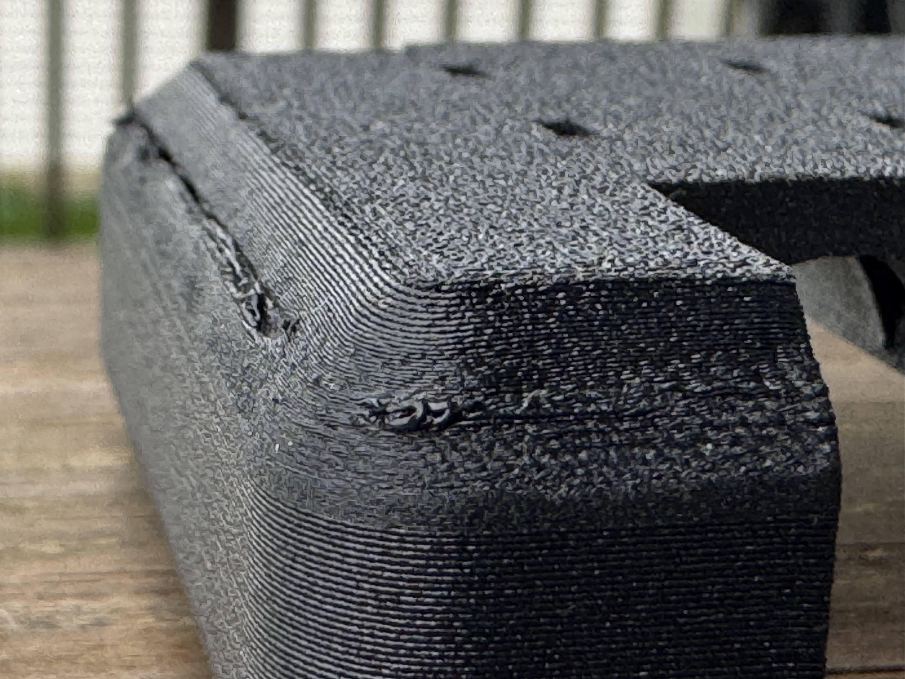
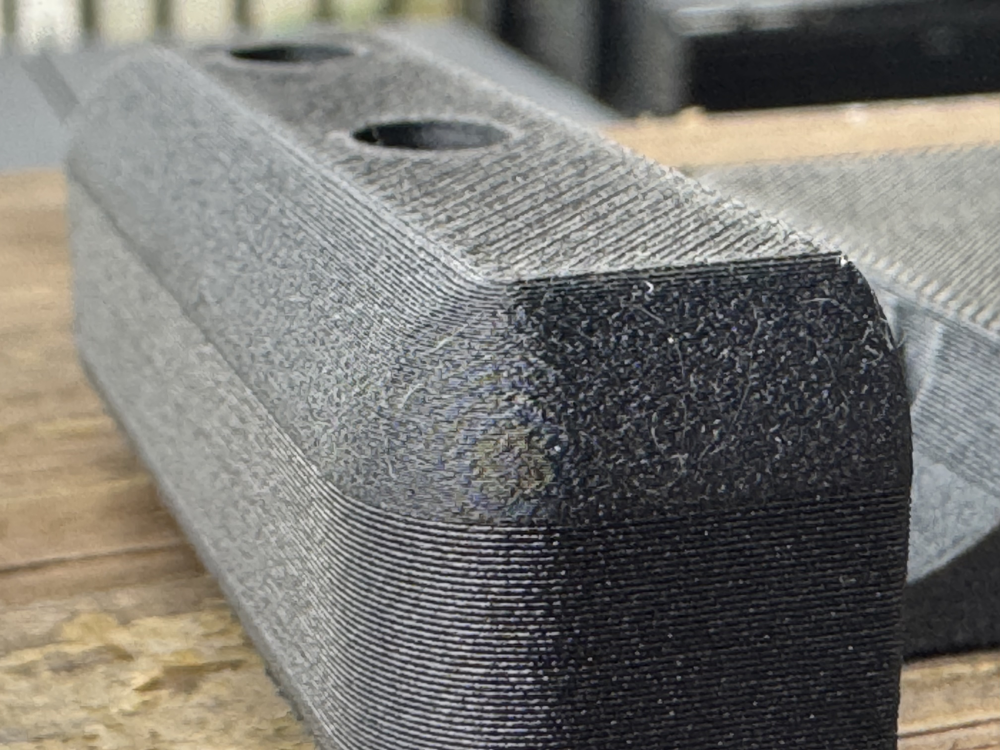

# Tee-carrier surface observation

Derek's completed Mark2 v11 print, task `1277839952`, is unsupported black PET-GF.
The full visible end rounds print at 0.08 mm and the intervening height at 0.24 mm.

Derek reports approximately 20 clean layers, followed by lifting or inward contraction
around layers 20–30. The nozzle catches the raised edge and disturbs 3–6 layers. The curve
recovers as its wall steepens, still within the 0.08 mm band. The upper curve is clean.
The photos show the finished surface; the sequence and nozzle interaction are Derek's
observation, not measurements extracted from a still image.

The v11 G-code uses 265°C on the first layer, 280°C thereafter, an 80°C bed and no active
chamber heat. Part cooling around layers 4–25 is approximately 49–55%. The v12 trial turns
part cooling off, including its overhang override, while retaining the geometry, temperatures,
layer heights and lack of supports. Differential contraction is the hypothesis under test;
the cause of the curling is unconfirmed.

[Physical record](../../physical-acceptance.json) ·
[v12 slice and launch](../../../tee-readiness/full-enclosure-print/native-slice-reviews/2026-09-24-tee-carrier-plate-mark2-v12/README.md)

## Lower curve

## Upper curve

The image pixels and orientation are unchanged. Location and other EXIF/XMP metadata are
removed from the committed copies. [Photo hashes](photos.json) identify both the retained
copies and the local originals.
