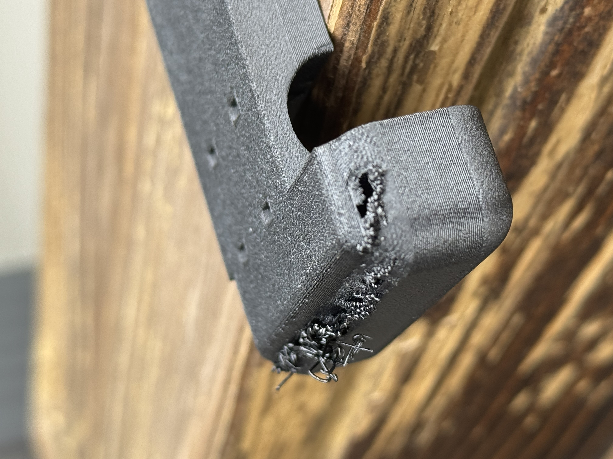
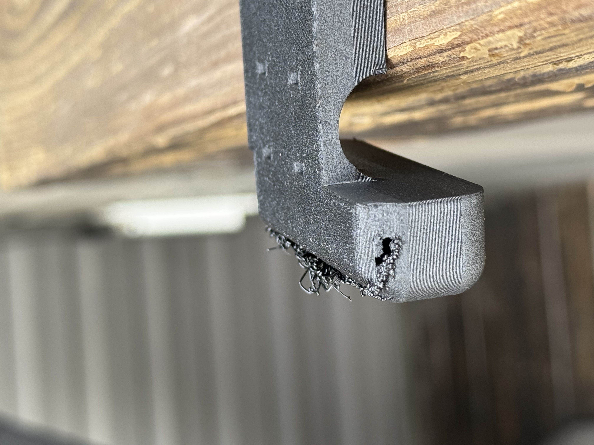
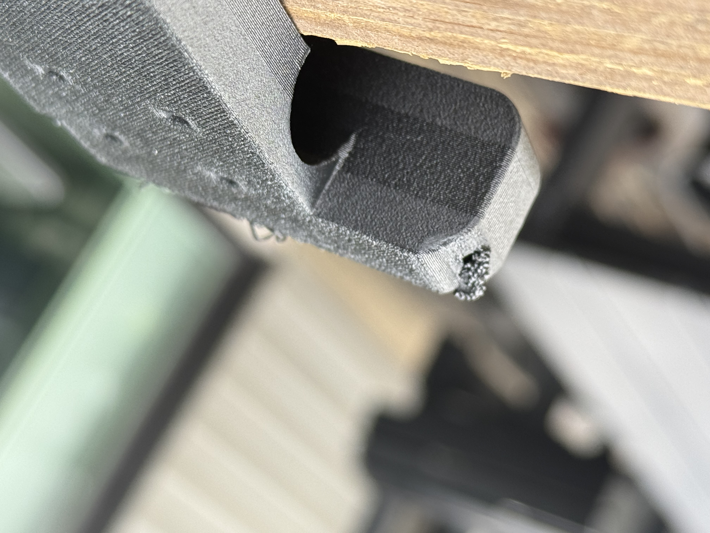

# Tee-carrier edge retreat

Mark2 v12, task `1278660260`, is the fan-off trial: one unsupported carrier, 0.08 mm
through the complete visible end rounds and 0.24 mm between them. The physical result is
rejected. [Slice and result](../../../tee-readiness/full-enclosure-print/native-slice-reviews/2026-09-24-tee-carrier-plate-mark2-v12/README.md).

Derek describes the failure sequence:

> The layers already laid down end up shrinking, pulled back, pulled back just at the edges,
> and the next layer that goes down ends up printing in air, and so you get strands of
> spaghetti all around starting at that layer 20 or 30 or whatever it is, and eventually
> the continued vertical stack recovers from the inside out, as the inner area that is not
> failing grows outward and has a chance to recover as things go more vertical and less
> corbelled.

The photos show loose strands and missing material along the rounded edge, with continuous
walls away from the damaged band. The failure sequence is local edge retreat, loss of the
landing surface for the next perimeter, and recovery from the intact interior as the curve
becomes steeper. The material's exact thermal deformation mechanism remains unconfirmed.

The better v11 reference emits `M106 S0` at the start of layer 26, print Z 2.08 mm,
and resumes approximately 47% part cooling at layer 27. That interval falls within Derek's
approximate onset band; its causal role is a hypothesis. The
[cooling reading](../../../tee-readiness/full-enclosure-print/native-slice-reviews/2026-09-24-tee-carrier-plate-mark2-v12/v11-cooling-reading.json)
binds the commands to the reference G-code. The
[v13 comparison](../../../tee-readiness/full-enclosure-print/native-slice-reviews/2026-09-24-tee-carrier-plate-mark2-v13/README.md),
accepted by Mark2 as task `1279237907`, keeps 55% part cooling on every model extrusion from
layer 4 through layer 189. Temperatures, geometry, supports and layer heights are held fixed.
The physical outcome is pending.

## Damaged edge and recovery

Image pixels and orientation are unchanged. EXIF/XMP metadata, including location, is
removed from the committed copies. [Photo hashes](photos.json) identify those copies and
the local originals.
