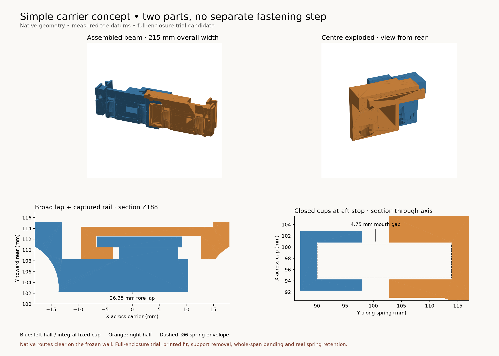
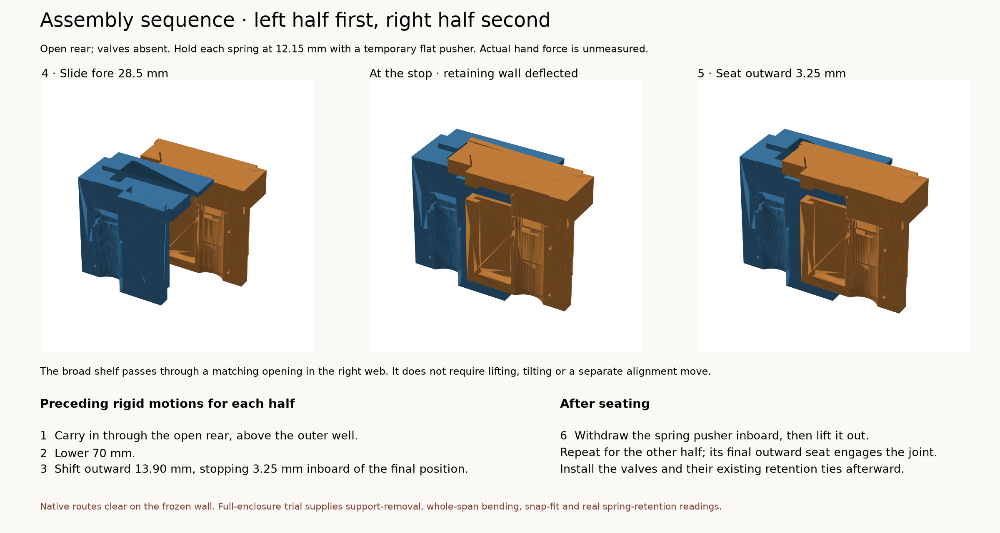

# Simple carrier integration

The complete candidate has two moving halves, a broad captured centre rail,
an overlapping upper shelf and an integral rear retaining wall. Each moving
spring cup is closed; the deeper fixed cups are integral enclosure features.
It uses the measured tee datums and corrected tie routes frozen in
[inputs/manifest.json](inputs/manifest.json).

The production source is integrated for a **complete enclosure assembly-test
print**. This directory contains the isolated native evidence and inspection
STEPs. It contains no released print or separate carrier fixture. Physical
spring capture, tension, feel and assembled rigidity are results of that full
print. The remaining production-generation and slice evidence is separate
from the frozen native checks here.



## Complete assembly

| Architecture | Retained custom parts | Assembly consequence | Load path |
| --- | --- | --- | --- |
| Two moving halves | Two; fixed cups belong to the enclosure | Five placement segments per half, followed by two temporary-pusher removal segments; the second outward seat retains the joint | Broad full-height web, rail and shelf interfaces couple the two halves |
| Continuous beam with stationary guide floor | Two; moving beam and supported guide floor | Underside rise needs an intentionally open guide and a separately installed closure; the current lower-shell closure crosses that floor | Continuous moving span; the new floor must restore every removed guide/support region |

The two-half candidate supplies a complete native path through the current
guides. Its shelf has no separate lift, twist or fastening operation. The
[one-piece route study](../spring-capture-study/telescoping-feasibility/single-carrier-route/README.md)
records the floor/side-sill/fore-shoulder barriers and closure conflict of its
frozen earlier fixture. Neither keyed coupon half is a constraint on this
candidate.



Use the loose front-top, with the four bare tees at release and the valves
absent. Preload each delivered spring axially to 12.15 mm in its moving cup
with the temporary flat pusher. Install left first, then right:

1. Carry the half through the open rear, 70 mm above the final height and
   17.15 mm inboard.
2. Lower 70 mm behind the tees at Y+33 mm.
3. Shift outward 13.90 mm, leaving 3.25 mm to the final lateral seat.
4. Slide fore 28.50 mm to the aft stop. The right shelf passes through its
   receiver opening while the broad rear wall deflects.
5. Seat outward 3.25 mm. The retaining wall returns in the final portion of
   the right half's motion.
6. Withdraw the pusher 15.435 mm inboard, then lift it 70 mm through the outer
   tee well. The spring expands into its fixed cup.

The pusher is a temporary tool, not a retained component. Its round tip is
6.3 mm diameter × 0.6 mm thick, with a 10 × 1 mm inboard handle. The declared
route uses five carrier segments and two tool-removal segments per half.
Actual compression force and hand effort are unmeasured.

Hold the joined carrier at release while the lower valves and coils rise
100 mm from underneath at a 5.45 mm fore offset, then move aft onto their
posts. The native bodies pass that complete route. Tie the tees after this
valve entry. Preserve the physically accepted 7.2 mm Beduan sockets and their
existing positive-retention ties. Fit upper valves and flexible links in the
full appliance's assembly order.

## Broad stock and rigidity evidence

- The 26.35 mm-wide, 6 mm-thick fore lap spans the 55.251 mm web height.
- The single captured rail is 15.75 mm wide and 2 mm thick. Its receiver has
  a 2.20 mm fore lip, 1.65 mm back wall and 4.85 mm end bridges. The retained
  wing overlaps 3 mm in X. The shelf entry interrupts 20.475 mm² of its
  nominal retaining face; the remaining height and stock are explicit in
  [checks.json](checks.json).
- The shelf overlaps 31.85 mm in X and 18 mm in Y: 573.3 mm² nominal face
  area. Each main ply is 6.625 mm thick, with 0.10 mm nominal face air. The
  2.5 mm upper cheek adds another broad Z bearing and ends at Y135.99.
- The 0.95 mm broad inner-web backing lies above Z182.175. It clears the
  inner coils' observed forward features by 0.25 mm during valve rise and
  stops below the shelf plies. The complete tie backing and upper tee
  backing remain positive stock requirements in the production selftest.
- The 51.75 × 9 × 3 mm rear wall retains the seated X position. Its cubic
  clearance witness reaches 2.3 mm free-tip deflection with a fixed root.
  It is excluded from structural section readings. Force, strain and
  endurance are unmeasured.

The outer-tee entry corner relief removes 853.460 mm³ per side. It preserves
the full 6 mm web connection, complete aft backing, spring floor and outer
guide faces. Remaining handhold width is 13.65 mm and minimum distance to
the round spring bore is 1.821 mm. The fixed-cup clearance notch removes
199.26 mm³ from each fore rim, retaining 16 mm of fore/aft rim through the
notch height. These are explicit stock consequences, not a strength rating.

[section-stock-checks.json](section-stock-checks.json) samples the tee axes
and joint transitions as well as the broad span. The minimum geometric Iy
is 78,591.6 mm⁴, versus 76,204.1 mm⁴ for the frozen measured-tee screwed CAD
reference. Minimum Iz is 12,251.3 versus 994.5 mm⁴. The reference is named and
hashed in [inputs/screwed-baseline-manifest.json](inputs/screwed-baseline-manifest.json);
it is neither the physical bowed coupon nor the carrier before spring
relocation.

The beam spans X. Transverse Y loading bends about Z and uses Iz; transverse
Z loading bends about Y and uses Iy. “Bowing along X” identifies the span,
not the force direction. The section readings assume that stock can transmit
load through the interfaces. Their minima do not establish assembled
stiffness or uniform local improvement. Nominal lap/rail bearing faces touch;
print tolerance, shelf clearance, interface slip and layer adhesion are
physical properties of the full enclosure trial.

## Spring capture

The fixed cup is 8 mm deep with 6.57 mm ID, 10.57 mm OD and 2 mm radial wall.
The moving cup retains its 11.1 mm blind teardrop bore with the inboard side
permanently closed. Spring axes are X±97.535, Z211.209 mm. Floor datums remain
Y90.040 and Y109.390 plus carrier travel.

| State | Floor separation | Gap between cup mouths |
| --- | ---: | ---: |
| Release | 19.35 mm | 0.25 mm |
| Connected | 21.35 mm | 2.25 mm |
| Aft stop | 23.85 mm | 4.75 mm |

The fixed cups end before the moving mouths and clear the complete lateral
seating route. The fixed extensions merge into one valid native front-top
solid. Native probes preserve the seat floors and clear the bores.

Both ends lie inside closed bores. A rigid 6 mm lateral sphere witness is
blocked at every working stop. A real helical spring can bow and deform;
these readings do not establish impossible misalignment. The complete
assembled print supplies both-end retention, uneven-hand behavior and feel.
The measured 27 mm free, approximately 7 mm solid and 6 mm OD dimensions
supply no spring ID, wire diameter, rate or permissible hand force.

## Native scope

The wall is the measured-tee front-top with SHA256
`0fbd43ae69417c0e6072827216ea8f530b5256491a54c39aeebbf46bc8ba24f6`, plus only
the declared fixed-cup extensions in memory. Its frozen provenance is in
[inputs/current-front-top/manifest.json](inputs/current-front-top/manifest.json).
The 30 frozen nearby native hardware bodies are listed in
[inputs/placed-neighbors/manifest.json](inputs/placed-neighbors/manifest.json).

- [joint-motion-checks.json](joint-motion-checks.json): five continuous
  structural half-placement sweeps and nine deflected-wall witnesses.
- [wall-checks.json](wall-checks.json): ten complete-half wall sweeps, ten
  held-spring/pusher sweeps, four pusher withdrawal/lift sweeps, the nominal
  and deflected rear wall, six working states and twelve opposed guide
  contact witnesses.
- [neighbor-checks.json](neighbor-checks.json): working native hardware
  contacts, full tee-envelope containment and forty continuous tee-entry
  sweeps. Tube shapes outside connected retain the connected path and do not
  simulate their deformation.
- [valve-entry-checks.json](valve-entry-checks.json): sixteen complete native
  lower-valve/body and coil rise/seating sweeps.
- [access-checks.json](access-checks.json): all eight declared tie heads,
  straps and slot lanes; fixed-cup clearance to all thirty native bodies.
- [spring-capture-checks.json](spring-capture-checks.json) and
  [grip-stock-checks.json](grip-stock-checks.json): closed-cup geometry,
  temporary loading tool, lateral witnesses and preserved bearing stock.
- [production-integration-checks.json](production-integration-checks.json):
  native added/missing volume comparison between the integrated source and
  this study, with exact source hashes and fixed-cup function provenance.

Planar native faces use exact translation prisms. Curved-face boxes are
conservative: zero proves clearance, while a positive box is inconclusive.
No reported passing path depends on accepting a positive envelope overlap.
Guide contact readings constrain rigid motion, not elastic deformation.

## Full enclosure trial

The coupled source build and actual production-profile slice establish the
complete trial geometry and its support evidence. Loose-half supports on the
shelf, handhold undersides and rear wall are accessible before hardware is
installed. The rail receiver contains an undercut behind the fore lip; its
slice must identify support and removal through the open fore face. Bearing
surfaces stay flat. Physical support-removal effort comes from the print.

The **full enclosure**, with its actual springs, tubing and hardware, supplies
spring capture and tension, coupled tee movement, unequal-hand operation,
whole-span bowing, snap retention and actual assembly effort. These are trial
outcomes, not a separate fixture or pre-print acceptance gate. Quantitative
force and endurance remain unmeasured.

## Reproduction

Run with `tools/cad-venv/bin/python` from the repository root:

```text
hardware/printed-parts/enclosure/tee-carrier/simple-carrier-study/build_concept.py
hardware/printed-parts/enclosure/tee-carrier/simple-carrier-study/check_joint_motion.py
hardware/printed-parts/enclosure/tee-carrier/simple-carrier-study/check_wall.py
hardware/printed-parts/enclosure/tee-carrier/simple-carrier-study/check_neighbors.py
hardware/printed-parts/enclosure/tee-carrier/simple-carrier-study/check_valve_entry.py
hardware/printed-parts/enclosure/tee-carrier/simple-carrier-study/check_spring_capture.py
hardware/printed-parts/enclosure/tee-carrier/simple-carrier-study/check_access.py
hardware/printed-parts/enclosure/tee-carrier/simple-carrier-study/check_grip_stock.py
hardware/printed-parts/enclosure/tee-carrier/simple-carrier-study/check_sections.py
hardware/printed-parts/enclosure/tee-carrier/simple-carrier-study/check_production_integration.py
hardware/printed-parts/enclosure/tee-carrier/simple-carrier-study/render_concept.py
hardware/printed-parts/enclosure/tee-carrier/simple-carrier-study/render_assembly.py
```

The frozen inputs reproduce the study without rebuilding a production pack.
`freeze_inputs.py` is the explicit capture helper. The artifact manifest
records scripts, evidence, native exports and figures by digest. STEP files
here are inspection artifacts, not slicer or printer jobs.
