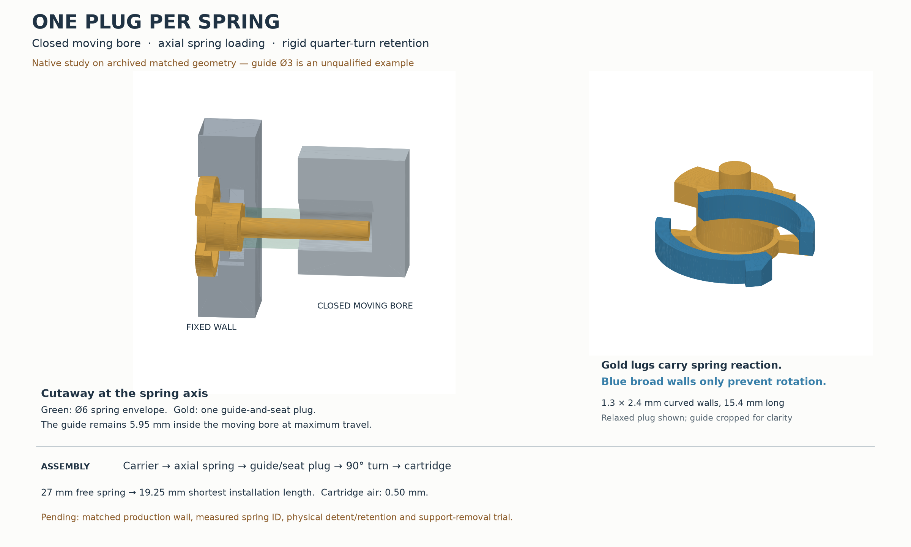

# Tee-carrier spring capture study

The preferred study closes the moving loading window permanently and uses one recessed
guide-and-seat plug for each spring. The spring enters axially from the empty pump bay.
Two rigid quarter-turn lugs carry its reaction into the fixed wall; two broad compliant
walls prevent the plug from turning back. There is no separate loading cover or head clip.

This is a native geometry study, not a production or print release. The guide diameter is
an explicit unqualified parameter. The delivered spring is **27 mm free, approximately
7 mm compressed, and 6 mm outside diameter**. Its measured ID, wire diameter, rate and
force are unknown. The solid cylinders used for clearance represent envelopes, not spring
material, mass or stiffness.



## Native fixture and current integration

`inputs/` contains a matched, archived set of published carrier, front-top, cartridge and
pump-cap STEP files. `input-manifest.json` records their original paths and byte hashes.
Each audit rejects a changed input. No production model is imported or edited by this study.

The measured-tee production interface in `../../tee-readiness/tee-integration.json` has spring
axes at **X ±97.535, Z 211.209 mm**, a fixed floor at **Y 87.460 mm**, and a moving release
floor at **Y 106.960 mm**. The frozen study uses **Z 210.100**, fixed **Y 86.068**, and moving
**Y 105.568 mm**. Its floor-to-floor distances and travel match production, but its wall
stock and tool-access findings are **archived-fixture findings**. The new carrier must be
checked together with a matching regenerated front-top, cartridge and cap before adoption.
In particular, the new bay-wall fore face must be measured; it must not simply be assumed
to share the floor's Y shift.

## Assembly and removal

1. Remove all supports. Install and join the carrier halves, leaving the pump cartridge out.
   The moving spring bore is completely closed on its inboard side.
2. With the carrier at release, feed the spring axially through the fixed wall into the
   moving bore. Its free front end projects about 0.95 mm into the empty pump bay.
3. Introduce the plug's guide into the spring ID. Align its lugs with the fore entry slots,
   push to the stop, turn 90 degrees, and release. The two broad walls click into angular
   pockets. The rigid lug faces establish the original fixed spring-floor station.
4. Repeat with an identical plug for the other spring, check full carrier travel, then
   insert the pump cartridge.

The spring is guided while being compressed. Minimum spring length during the 0.25 mm
push-and-turn motion is **19.25 mm**, rather than the lateral-window variant's 8.5 mm loading
length. The guide still has **0.25 mm tip-to-floor clearance** at that pressed position.

For removal, first remove the cartridge. Hold the carrier at release, compress the two
broad detent walls using the accessible fore face, push the plug 0.25 mm, turn it back
90 degrees and withdraw it under control. The spring and plug then leave through the
same axial opening. The 4.6 × 1.4 × 1.0 mm tool slot in the fore face supplies turning purchase.
Insertion effort, tool comfort and repeatability require a print trial.

| Capture interface | Study dimension |
|---|---:|
| Added loose capture pieces | 1 plug per spring |
| Axial spring feed bore | Ø7.5 mm |
| Plug reaction-face outside diameter | Ø7.2 mm |
| Guide shaft | Ø3 mm **example only** |
| Guide projection from the fixed reaction face | 19 mm |
| Plug face below the pump-bay wall | 0.25 mm |
| Seated plug to cartridge | 0.50 mm |
| Rigid bayonet lug thickness | 2 mm |
| Combined rigid lug bearing area | 16.87 mm² |
| Minimum stock fore of a lug bearing under the head relief | 1.399 mm |
| Stock from the bayonet pocket to the fixed-seat mouth | 1.700 mm |
| Feed relief past the loaded reaction plane | 0.400 mm |
| Remaining original Ø6.57 fixed-seat bore | 1.600 mm long |
| Compliant wall radial stock × axial width | 1.3 × 2.4 mm |
| Compliant wall arc at mid-thickness | 15.43 mm |
| Detent radial projection / positive engagement | 0.80 / 0.65 mm |
| Relaxed wall preload at its tip | 0.20 mm |

The detents use continuous curved walls with broad roots and lips, following the construction
of the physically accepted [faucet display cover](../../../faucet/faucet-display-cover/faucet_display_cover.py)
and its [shared retention definition](../../../faucet/_display_snap.py). Their seated and
squeezed shapes are geometric fit references. A force or strain equation does not qualify
their retention. The rigid seat body and bayonet lugs carry the spring load even with the
detent walls released; the walls only prevent rotation into the withdrawal position.

| Carrier state | Spring length | Guide inside moving bore | Guide tip to moving floor |
|---|---:|---:|---:|
| Release | 19.50 mm | 10.60 mm | 0.50 mm |
| Connected | 21.65 mm | 8.45 mm | 2.65 mm |
| Aft limit | 24.15 mm | 5.95 mm | 5.15 mm |

The closed moving bore confines the spring along all 11.1 mm of its depth. The remaining
fixed bore locates the opposite end. A correctly sized guide bridges the open gap and
remains inside the moving bore throughout travel. Actual guide-to-spring clearance is
pending the spring ID; a Ø3 mm example with 0.25 mm radial running air would require a
measured ID of at least 3.5 mm. That example is not a dimension selected for production.

## Checks and support removal

Run the native audit and export with:

```sh
tools/cad-venv/bin/python hardware/printed-parts/enclosure/tee-carrier/spring-capture-study/axial_capture.py --export
```

`axial-checks.json` passes 432 native readings. It records validity, clearances, exact reaction-face area/station, positive
lug and detent engagement, preload interference, bearing stock, axial spring/plug insertion,
quarter-turn clearance, both carriers over their travel, and the cartridge's complete
100 mm vertical swept envelope. Both sides use the frozen native enclosure. A clear
18 × 28 mm fore tool corridor is checked with the cartridge absent.

The moving bore's supports leave straight through its fore mouth before carrier installation.
The new bayonet pockets need support broken into small pieces: the audit models 8-degree
sectors moving inward into the Ø7.5 feed opening, then straight fore. This is an accessible
removal route, not a claim that a complete generated support body peels out. The production
slice must expose and confirm those pieces; physical removal effort remains unqualified.
The plug's fore face is the proposed bed face. Its two lug bearings keep flat working
faces; support below them can leave radially through the open gaps between the curved walls.
The two detent pockets are directly open to the fore tool corridor.

The `axial-*.step` files are the reviewable native parts and assembled coupon. The relaxed
plug and the nominal seated plug are distinct files. No guide STL or sliced plate is
released while its diameter and the matching production fixture remain unqualified.

## Lateral-window comparison

`spring_capture.py` and `study-*.step` describe the separate-cover variant. Its native
checks pass against the same archived fixture. It uses three loose capture pieces per
spring: keyed loading cover, guide, and recessed guide-head clip. After carrier assembly,
the cover must be unlocked, pulled fore, the spring compressed to 8.5 mm and loaded laterally,
the cover closed, and the guide and head clip installed. The axial variant removes those
extra cover/clip operations and the short loading compression. The keyed cover geometry
remains a checked alternative, not the preferred assembly route.

The remaining qualification is a matched production-native audit, the actual spring ID,
a production-profile support review, and a physical full-width carrier test for unequal-hand
cycling, spring alignment, detent engagement, removal and rigidity. The enclosure print
remains held until the parent readiness audit resolves those integration items.
