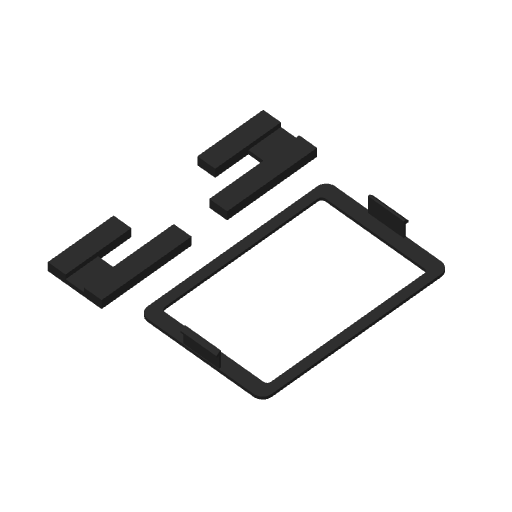

# Display cover and window covers — Mark2

Printing on Mark2 since 2026-09-25 14:34 UTC, task `1281656339`, with no startup errors.
One full machine display cover and the two window covers that slide
onto front-top's posts behind the tee carrier. The native estimate is **41 min 57 sec**,
including startup, and 19.67 g at the saved profile's density. The display cover alone is
23 min 51 sec; adding both window covers adds **18 min 6 sec**.

The display cover's complete snap skirts sit 0.3 mm inward on each side. Its original
125.5 × 83 mm perimeter, R6 corners, window and face thickness are unchanged, as are the
housing receivers. The geometric catch overlap is 1.2 mm centered and at least 0.9 mm
at the full modeled lateral float. Physical seating and retention remain to be tested.
The [physical observations](../../../../display-cover/physical-observations/2026-09-24/README.md)
include the installed bow and the easy upside-down fit with the snaps disengaged.

The window covers use their existing geometry. Both match the current generated solids
and published STEP/STL files. Their tongues clear front-top through a continuous 22 mm
vertical insertion/release stroke, with zero computed interference. Install them after
V-G and V-J and before V-F and V-I, as described in the
[assembly instructions](../../../../tee-carrier/README.md#assembly).

All three parts print with their broad outboard/visible faces on the bed, using black
PET-GF on the left 0.4 mm nozzle, the normal 0.24 mm process with a 0.20 mm first layer,
two walls, original wall order and speeds, 15% overlap and automatic brim. There are no
show curves varying through print Z on these parts; the display cover's R6 corners lie
in the bed plane. The requested Mark2 Z trim is +0.04 mm; native Textured PEI compensation
emits +0.02 mm after the initial reset.

The native slice has two bed-rooted supports, one under each display-cover catch, and
none on either window cover. Both catch supports peel outward into open space before
assembly. The support audit includes bodies without interface labels. Actual printed
path envelopes leave at least 15.3 mm between parts and stay inside the bed.

The [manifest](manifest.json) binds the native archive, source hashes,
[geometry checks](geometry-check.json), [native verification](verification.json), and
[support review](support-removal-review.json). `prepare.py` produces the unsent plate;
`verify.py` reads its actual native output. Its exact cached archive is
`.cache/prints/2026-09-24-display-cover-window-covers-mark2-v6/ready/display-cover-window-covers-black-z004-mark2-v6.gcode.3mf`.

