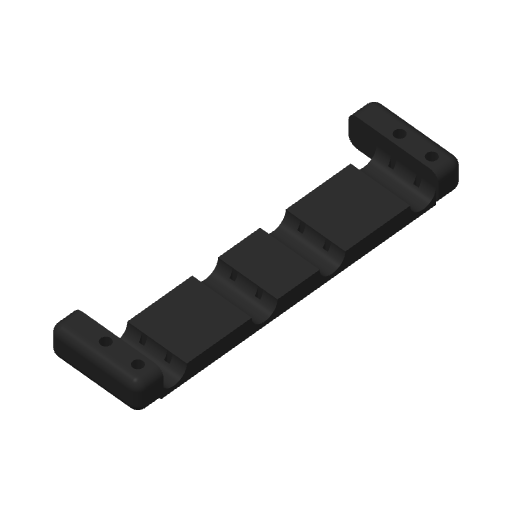

# Tee carrier: steady part cooling

Mark2 task `1279237907` prints one unsupported carrier in black PET-GF.
The [printer receipt](sender-receipt.json) verifies acceptance; the [subsequent reading](mark2-launch.json)
records the observed startup/printing state. Derek stopped the print after the edge failure
recurred. The [stop reading](stop-reading.json) reports FAILED with no print error or HMS
alert; the exact failure layer is unknown. [Physical result](physical-result.json).

Derek observes that failures lie between the infill-to-wall contacts. Where the infill
reaches the wall, the perimeter appears to be held farther outward. The physical force
mechanism is unmeasured. Steady cooling alone does not resolve the failure.

Part cooling is **55% on every model extrusion from layer 4 through layer 189**, including
bridges and overhangs. The first three layers retain zero part cooling. The auxiliary fan
remains off. This is a whole-print cooling trial after the first three layers, not a change
limited to the lower rounded edge. Native startup maintenance and hotend cooling are preserved.

The hypothesis is that steady cooling preserves the deposited edge and its overlap with
the next perimeter. Derek's [v12 observations](../../../../tee-carrier/physical-observations/2026-09-24-v12/README.md)
identify local inward edge retreat, unsupported extrusion and recovery from the intact
interior as the curve becomes steeper. The better v11 reference emits `M106 S0` at the start
of layer 26, Z 2.08 mm, within the approximate failure-onset band, and resumes cooling at
layer 27. The [G-code reading](../2026-09-24-tee-carrier-plate-mark2-v12/v11-cooling-reading.json)
establishes that interval; its causal role remains unconfirmed.

Only three settings differ from v11: `fan_min_speed = 55`, `fan_max_speed = 55` and
`enable_overhang_bridge_fan = 0`. The emitted commands and every positive model extrusion
are checked in [verification](verification.json). Nozzle temperature is 265°C on the first
layer and 280°C thereafter; the bed is 80°C, with no active chamber heat.

All 189 layer heights match v11: 76 layers at 0.08 mm to Z 6.08, 37 at 0.24 mm to Z 14.96,
and 76 at 0.08 mm to Z 21.04. The complete visible R6 rounds are covered at 0.08 mm,
including the first layer. There are zero support paths/bodies and one plate object.
Geometry and placement are identical; native toolpath order is not asserted identical.
Mark2's requested +0.04 mm trim emits +0.02 mm for Textured PEI.

Bambu Studio 02.08.02.61 reports success with no warnings, **2 h 5 m 48 s** total estimate
and **44.93 g**. A fresh import with a 20-second settling wait was accepted on the first
send attempt. Timelapse and bed leveling are On; flow and nozzle-offset calibration are Auto.

The [contour-compensation review](contour-compensation.md) addresses Derek's proposed
height-dependent allowance. This trial preserves the geometry to isolate the cooling change.

