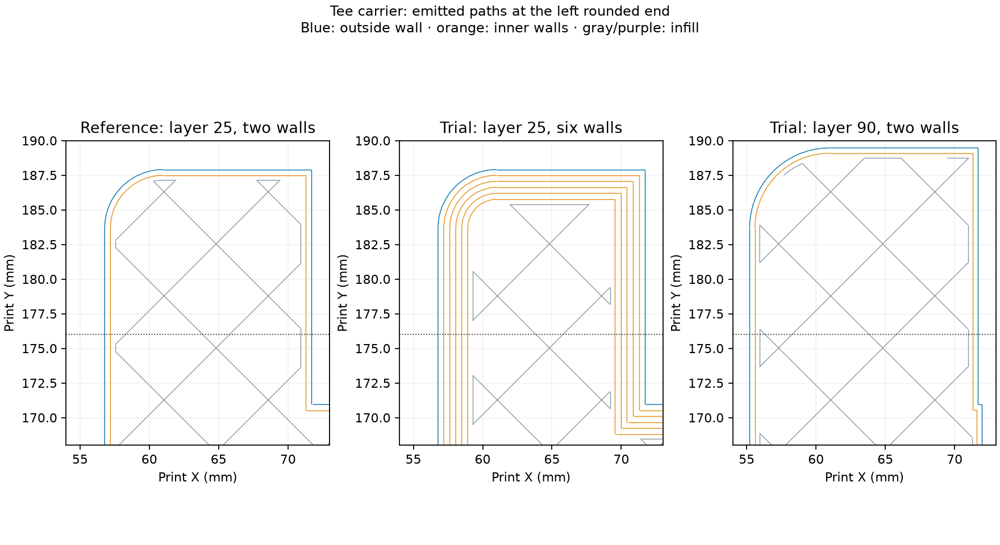

# Tee carrier: six walls with the original order

Prepared for Mark2; **not sent**. The active v14 print uses the infill-first sequence.
Derek's preferred next recipe changes only the lower rounded band's wall count relative
to the original-order, steady-cooling v13 reference.

- **Six walls at print Z 0–6.1 mm**; the two-wall base setting applies above the band.
- **Original order: inner walls, outer wall, then infill.**
- **15% infill/wall overlap**, with all original speed and acceleration settings.
- One carrier, no supports, identical geometry, placement and all 189 layer heights.
- Complete visible end rounds at 0.08 mm, including the first layer; 0.24 mm between them.
- Existing trial temperatures and cooling: 265°C first layer, 280°C thereafter, 80°C bed,
  no active chamber heat, 55% part cooling after the first three layers, auxiliary fan off.

The project settings are byte-identical to v13. The only changed archive member is the
height-range configuration, which adds `wall_loops = 6` to the existing lower 0.08 mm band.
[Preparation](preparation.json) and [native verification](verification.json) bind the settings
to the input, exported archive and G-code hashes.

The [wall-path review](wall-review.json) reads six wall crossings at the left end on layers
1–76, two on layers 77–113, and walls before infill in the observed failure band. The inherited
top-surface wall reduction remains. Native estimate: **2 h 39 m 50 s**, **54.60 g**, no warnings.

Derek provisionally considers the [v14 lower curve](../2026-09-24-tee-carrier-plate-mark2-v14/physical-result.json)
good enough: no observed spaghetti failure, with a slightly concave surface. That physical
print combines six walls and infill first. **Six walls alone remains physically untested.**
For other parts, the same wall-count override can be confined to each complete print-bottom
0.08 mm rounded band while the remaining process settings retain that job's profile.
