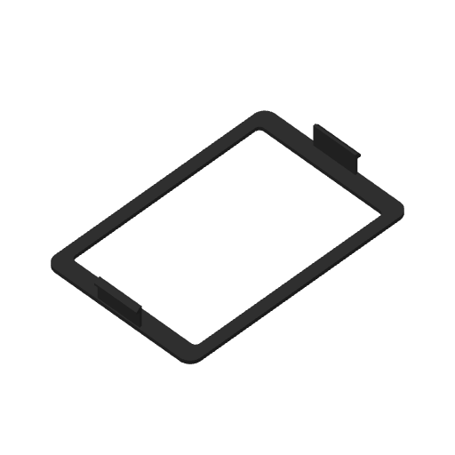

# Display-cover snap fit trial — Mark2

Prepared, not sent. One full display cover; each complete snap skirt sits **0.6 mm inward** from the fixed receiver datum. This is another 0.3 mm per side relative to the printed 0.3 mm trial. The outer perimeter, window, plate thickness, skirt shape and housing receivers are unchanged.

The native estimate is **23 min 55 sec**, including startup, and **8.64 g** at the saved profile density. Native settings exactly match the previous printed trial: black PET-GF on the left 0.4 mm nozzle, 0.24 mm layers, 0.20 mm first layer, two walls, original wall order and speeds, 15% overlap, automatic brim, and Mark2 +0.04 mm requested Z trim. No window covers are on this plate.

The [geometry check](geometry-check.json) confirms each skirt is translated exactly 0.3 mm from the previous print and the complete bezel is unchanged. Catch overlap is 0.9 mm centered and at least 0.6 mm at the full modeled lateral float. The full cover clears the fixed housing in the seated position and catches when pulled outward. Physical flatness and retention remain to be tested.

The [native verification](verification.json) checks all 56 model wall layers, the native archive and G-code hashes, source meshes, exact process settings and bed limits. The [support review](support-removal-review.json) retains two bed-rooted trees beneath the exposed square catch faces; each peels outward before assembly. There are no print-Z show rounds on this face-down bezel.

The [prior physical feedback](../2026-09-24-display-cover-window-covers-mark2-v6/physical-feedback.json) records that the 0.3 mm trial reduced bowing only slightly. The [manifest](manifest.json) binds this plate and its reviews.

