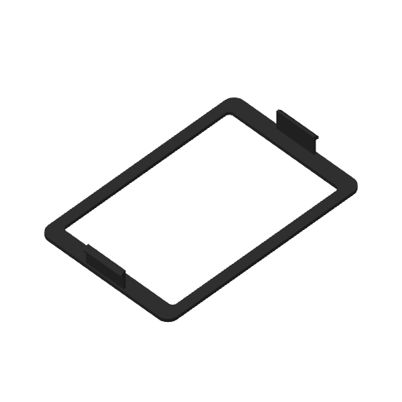

# Display-cover snap fit trial — Mark2

Printing on Mark2 since 2026-09-25 17:05 UTC, task 1282051223, with no startup errors. One complete display cover, with both retaining skirts **0.9 mm inward per side** from the original receiver datum. Each skirt is another 0.3 mm inward from the preceding 0.6 mm trial. The bezel perimeter, window and housing receivers retain their original geometry.

The native estimate is **23 min 59 sec**, including startup, and **8.64 g** at the saved profile density. Black PET-GF, left 0.4 mm nozzle, 0.24 mm layers with a 0.20 mm first layer, two walls, original wall order and speeds, 15% overlap, automatic brim, and Mark2 +0.04 mm requested Z trim.

The modeled catch overlap is 0.6 mm centered and at least 0.3 mm at the full lateral float. The glass remains clear; the full cover clears the fixed housing when seated and catches on outward pull. Physical flatness and retention remain to be evaluated.

The [geometry check](geometry-check.json) measures the exact 0.30 mm additional movement of each complete skirt and the unchanged bezel. The [actual toolpath comparison](actual-toolpath-comparison.json) verifies the same change in the extruded skirt wall paths and confirms identical native print settings.

The [native verification](verification.json) checks all 56 model wall layers, geometry hashes, G-code checksum, material mapping and plate bounds. The [support review](support-removal-review.json) covers both bed-rooted trees beneath the accessible square catches. The [manifest](manifest.json) binds the native archive and these readings.

The first native archive received an explicit invalid-3MF rejection. A fresh native export of the same staged input was accepted; [regeneration verification](native-regeneration-check.json) confirms identical G-code, settings and slice metadata. The [launch receipt](launch.json) identifies the accepted archive and new printer task.
