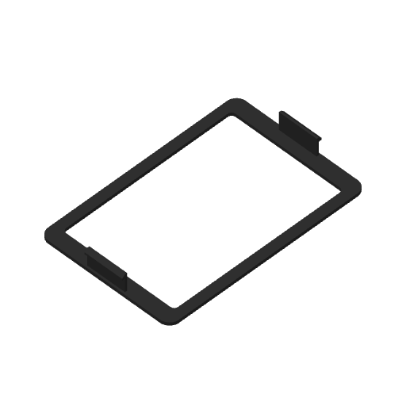

# Display-cover snap fit trial — Mark2

The [physical fit report](physical-feedback.json) records very slight remaining bowing,
acceptable for the moment, and no retention, as reported by Derek. No pull-force
measurement is available. The plate is clear and no next print is selected.

Restarted on Mark2 at 2026-09-25 18:04 UTC, task 1282199028, with no reported error. The [restart receipt](restart-1/launch.json) confirms the same archive and G-code hashes. The initial task 1282164977 stopped at layer 0 after a loading problem reported by Derek. One complete display cover with each retaining skirt **1.2 mm inward** from the original receiver datum, another 0.3 mm inward from the preceding 0.9 mm trial. The outer bezel, window, complete skirt shape and fixed housing receivers retain their geometry.

The centered CAD catch overlap is **0.3 mm per hook**. At the full 0.3 mm lateral float, one hook has zero overlap and the opposite hook has 0.6 mm. The undeformed CAD solids intersect under a straight outward pull when centered and at either lateral limit. The printed cover has no retention in Derek's report; the CAD intersections do not establish its physical performance.

Black PET-GF on the left 0.4 mm nozzle, 0.24 mm layers, 0.20 mm first layer, two walls, original wall order and speeds, 15% overlap, automatic brim, and Mark2 +0.04 mm requested Z trim.

Native estimate: **24 min 8 sec** including startup, **8.69 g** at the saved profile density.

The [geometry check](geometry-check.json) measures each skirt's exact 0.30 mm translation, verifies the unchanged bezel and fixed housing, and records each hook's catch contact at centered and full lateral positions. The [actual toolpath comparison](actual-toolpath-comparison.json) confirms the same movement in emitted wall paths and identical native print settings.

The [native verification](verification.json) covers all 56 model wall layers, source hashes, archive checksum, material mapping and bed bounds. The [support review](support-removal-review.json) covers both removable bed-rooted trees beneath the flat catch faces. The [manifest](manifest.json) binds the native archive and these readings.

The [initial launch receipt](launch.json) and [restart receipt](restart-1/launch.json) identify both printer tasks. Post-publication geometry lint reports zero open findings and six intentional faces answered at their new coordinates.

The restart initially met an invalid-file rejection and then the explicit unfinished-loading error. Bambu Connect subsequently cleared its manual purge panel and the left nozzle target returned to zero. The same reviewed archive, under a fresh filename, was then accepted. [Loading state](restart-1/loading-sequence.json), [cleared state](restart-1/loading-cleared.json).
