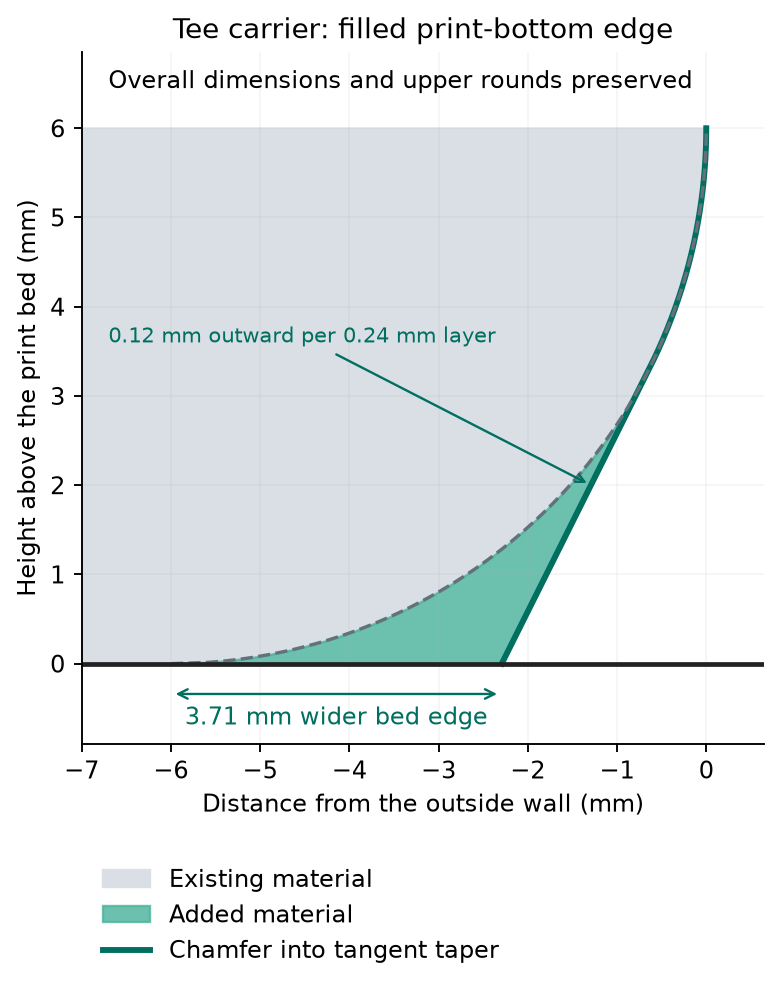

# Filled-bottom tee-carrier trial

One low-force tee carrier with an additive print-bottom chamfer tangent to the retained taper. Bed edges extend 3.708 mm, adding 365.3 cubic mm inside the existing envelope. First layer 0.20 mm; bottom and body 0.24 mm; complete top R6 0.08 mm. Six walls through print Z 6.1 mm; two above. No supports or brim. Standard wall-first order, speeds and 15% overlap. The unchanged carrier opening in the existing front-top is the fit reference; roof gap 1.25 mm, floor gap 0.25 mm.

H2C job 1292379739 is started. Native estimate: 1 hour 46 minutes, 140 layers. Black PET-GF uses the left 0.4 mm nozzle. Requested bed trim +0.18 mm; emitted textured-plate trim +0.16 mm.

Geometry is one watertight solid. The added material stays inside the receiver crossing through the full release/insertion range. Native extrusion checks cover every bottom-band transition, the first-to-second-layer overlap, the complete fine top band and emitted wall counts. No sampled outer-wall centreline falls outside the preceding layer in the bottom band. The print-bottom surface is physically accepted. Sliding fit and spring return remain unreported.

