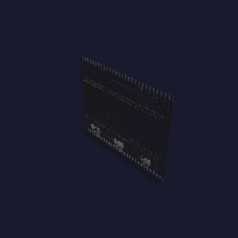

# Texture coupon, vent

A section of front-bottom's ±X flank with the condenser vents pierced down the flutes
that are already there, printed the way that piece prints: **standing**, floor on the bed,
build axis up the wall.

[143.6 mm](VENT_X) across, [120 mm](VENT_Z) tall, in a [6 mm](FLANK_T) wall —
[28](FLUTE_TOTAL) grooves of the box's own field at [5.1285 mm](FLUTE_PITCH) pitch,
[4 mm](FLUTE_WIDTH) wide and [1.2 mm](FLUTE_DEPTH) deep on a [1.1285 mm](LAND) land. The
pitch is not a figure of its own: [260](FLUTE_COUNT) grooves close on
[1333.398 mm](PLAN_PERIMETER) of the box's outer plan, and this is what that division
lands on. [6 mm](FLANK_T) is what both bottom pieces carry down their sides — the Z
lip's own skin, slab to rim — so a vent here pierces twice the box's wall.

Geometry source: [`texture_coupon_vent.py`](texture_coupon_vent.py). The flute and pierce
vocabulary is [`../../cadlib/reeding.py`](../../cadlib/reeding.py), shared with
[`../texture-corner/`](../texture-corner/) and with
[`enclosure.py`](../enclosure/enclosure.py), so the coupon and the box provably lay down
the *same* field.

## The vent is the groove, pierced

A slot narrower than the flute is cut down the flute's own floor, clean through the
section under it. Both jambs run **with** the groove and the groove carries on past both
ends of the slot at full depth.

So nothing on this coupon crosses a flute, and no `enclosure._flute_stop` treatment is
owed at any edge the opening makes. That is the box's own rule — *a rim that runs with the
flutes is not one of them* — and it is why the vent costs the skin nothing: the field the
slot is cut into is the field that was already there.

## What limits the slot

The mullion, not the section behind the groove. A slot takes its width out of the
**pitch**, and the exterior profile lays [1.74 mm](PIERCE_SHELL) of loops across whatever
mullion is left — 2 × 0.42 outer + 2 × 0.45 inner, per
[enclosure/print-log.md](../enclosure/print-log.md). At [5.1285 mm](FLUTE_PITCH) of
pitch that ceilings a slot down every groove at [3.3885 mm](PIERCE_CEILING), which is
`reeding.pierce_max`.

|  | slot | mullion | over the loops |
|---|---|---|---|
| every groove | [3.1 mm](SLOT_A) | [2.0285 mm](MULLION_A) | [0.2885 mm](SPARE_A) |
| every groove | [3.388 mm](SLOT_B) | [1.7400 mm](MULLION_B) | [0.0000 mm](SPARE_B) |
| alternate | [4 mm](SLOT_C) | [6.2569 mm](MULLION_C) | — |

For scale, the groove floor the box already ships runs on
[0.06 mm](GROOVE_FLOOR_SPARE) of that same spare.

Through-thickness is the other reading, and it is nowhere near the constraint. The jamb
of a [3.1 mm](SLOT_A) slot stands [1.55 mm](JAMB_OFFSET) off the groove's centre, where
a half-ellipse is [0.7584 mm](JAMB_DEPTH) deep — so the mullion carries
[5.2416 mm](JAMB_SECTION) at its thinnest and the full [6 mm](FLANK_T) at the land. A
wider slot reads *thicker* here, not thinner: its jamb stands further out on the ellipse,
where the groove is shallower. Section and mullion move opposite ways, which is why the
mullion is the one that governs.

## The three zones

One field the whole way across: same pitch, same profile, same depth, same fade. Only the
slot differs. [8](ZONE_FLUTES) grooves each, over [41.028 mm](ZONE_SPAN) of wall, with one
unpierced groove piering between two zones and one at each end.

**[3.1 mm](SLOT_A) EVERY** — the scheme the box takes. [8](SLOTS_A) slots,
[3.1000–3.1000 mm](MEAS_A) measured, mullions [2.0285 mm](MEAS_MULLION_A),
[24.800 mm²/mm](OPEN_A) of free area over that span — [60.4 %](OPEN_PCT_A) of the wall
open.

**[3.388 mm](SLOT_B) EVERY** — the ceiling, standing on the four loops and nothing else.
[8](SLOTS_B) slots, [3.3885–3.3885 mm](MEAS_B) measured, mullions
[1.7400 mm](MEAS_MULLION_B), [27.108 mm²/mm](OPEN_B) — [66.1 %](OPEN_PCT_B) open. What
this zone answers is whether a mullion run down to bare perimeters telegraphs through to
the show face.

**[4 mm](SLOT_C) ALTERNATE** — the full groove width, which puts each jamb on the land's
own edge and every unpierced groove in the middle of a mullion. [4](SLOTS_C) slots,
[4.0000–4.0000 mm](MEAS_C) measured, mullions [6.2569 mm](MEAS_MULLION_C),
[16.000 mm²/mm](OPEN_C) — [39.0 %](OPEN_PCT_C) open. It reads as a balustrade.

Least section through a mullion, read off the built solid: [5.2410 mm](THIN_A) ·
[5.3628 mm](THIN_B) · [4.8000 mm](THIN_C). The first two stand at the jamb, where the slot
cuts the groove's own flank; the third stands at the centre of the unpierced groove in the
middle of the alternate scheme's mullion. Note the first two run the other way from the
mullion widths: [3.388 mm](SLOT_B) has the narrower mullion and the *deeper* section
behind it.

## Details that are not decoration

**The slot terminations.** Each slot is a vertical prism drawn in XY, opening over z
[32 mm](SLOT_Z0) to [92 mm](SLOT_Z1) — a [60 mm](SLOT_BAND) band — with its ceiling and
its sill struck at [45°](RELIEF_CHAMFER) to a ridge on the groove's own centreline. The
sill only takes material away as the print climbs; the ceiling closes at exactly the angle the
box strikes every relief at. **No supports.** Both sit down inside the groove, in its own
shadow.

**The label stands proud of the inner face.** An engraved one takes its depth out of the
section the flute over it stands on, and [`../texture-corner/`](../texture-corner/)
printed that: it read through to the show face as a mark you could find with a fingertip.

**The inner foot.** [5 mm](FOOT) ramping 45° off the inside face at the base, where it
costs the show face nothing.

**The fades.** The field goes to nothing over [5 mm](FLUTE_RISE) at the bed and again at
the top arris, on `enclosure`'s own smoothstep — so the first layers go down as clean
solid wall, and no groove runs off an edge to scallop it.

## Printing

`texture-coupon-vent.stl` is one object, [143.6 mm](VENT_X) × [6 mm](FLANK_T) ×
[120 mm](VENT_Z), about [73.6 cm³](VOLUME). Drop it straight on the plate at identity
rotation — it already stands the way front-bottom stands.

Slice on the enclosure's own exterior profile — 0.4 mm High Flow nozzle, 0.24 mm layers,
PETG, textured PEI ([enclosure/print-log.md](../enclosure/print-log.md)). Set `fuzzy_skin`
to `none`; the texture is in the geometry. **No supports.** **Keep the brim** — the
footprint is a ribbon.

The one thing to watch is the picket band: between z [32 mm](SLOT_Z0) and
[92 mm](SLOT_Z1) every mullion is its own island, and in the [3.388 mm](SLOT_B) zone that
island is [1.7400 mm](MULLION_B) across — the four loops and nothing between them. Check
the sliced preview lays four walls there and no gap fill.

That band is [60 mm](SLOT_BAND) tall. A picket's height is its own question — an island
this slender is a cantilever under the nozzle for the whole band — and what this coupon
stands for is [60 mm](SLOT_BAND) of it. A taller vent is a taller coupon.

On the H2C, check the filament grouping before printing — with one filament on a
two-nozzle machine the Auto grouping may hand it to the right extruder.

## Sources
[value](NAME) texts are updated by:
- `/hardware/printed-parts/enclosure/texture-coupon-vent/texture_coupon_vent.py`
