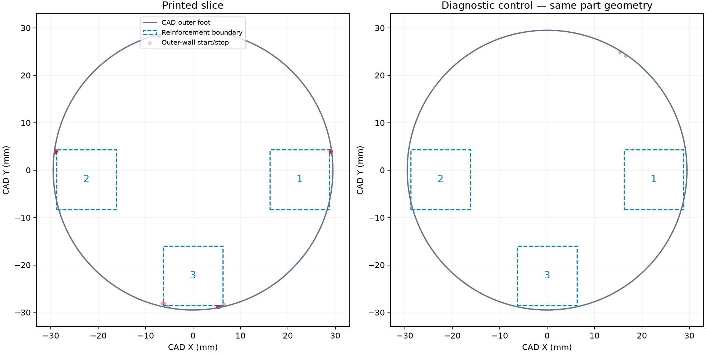

# Complete faucet at 0.08 mm: time estimate and screw-point tracks

The native estimate is **13 hours 28 minutes 49 seconds** for all five rigid
parts on one Mark2 plate: base, tip, display cover, counter plate and accepted
lever. Every part uses 0.08 mm normal layers and the usual 0.20 mm first bed
layer. The source shoulder-band plate estimates 6 hours 13 minutes 4 seconds;
the all-fine estimate adds 7 hours 15 minutes 45 seconds.

[Time estimate](time-estimate.json) binds the exact five-part source project,
unchanged meshes and placement, the single global setting change, native
archive/G-code hashes and emitted wall layers on every part. Only the global
layer height changes to 0.08 mm; the base's two height-range declarations are
removed. PET-GF, left 0.4 mm nozzle, Textured PEI, Mark2's normal +0.04 mm
requested/+0.02 mm emitted trim, temperatures, supports, seam settings and
three six-wall solid insert-host modifiers are retained. Native result is one
plate, five objects, 685,068 triangles, 2,747 layers and no slicer warning.
The unsent native archive and prepared estimate project remain in the private
local print cache. No launch is authorized by this time-estimate request.

## Physical result

The [identified shoulder-band print](../2026-10-09-two-shoulders008-with-lever-mark2/physical-result/physical-result.json)
has beautiful 0.08 mm layers by the user's direct inspection. Supports removed
from its few supported thin layers. Lines/defects appear outside the base beside
each screw point. Those observations apply to that article and its fine bands;
an entirely fine-layer faucet has no physical result.

## Native screw-point reading

The [native comparison](native-screw-track-assessment.json) counts outer-wall
starts and stops near the three rectangular reinforcement boundaries. The
diagnostic control omits only those modifiers, retaining all five part meshes,
poses, other settings and the shoulder-layer bands.

| Insert-host region | Printed slice boundary endpoints | Same-geometry control | All-0.08 estimate |
| --- | ---: | ---: | ---: |
| 1 | 184 | 0 | 288 |
| 2 | 184 | 0 | 288 |
| 3 | 290 | 0 | 290 |

The repeated exterior starts and stops line up with the reinforcement-region
edges. Their disappearance in the control supports a modifier-boundary cause
for the reported tracks. The all-fine estimate retains these path breaks.
The control supplies no physical finish result and is not a print candidate:
it omits the local insert reinforcement.

Dashed boxes locate the original reinforcement footprints on both panels for
comparison. The right-hand control does not apply those modifiers. Red points
are starts and stops of open outer-wall runs on the cylindrical foot, read in
the CAD frame; its two plots use the same geometry and scale.
