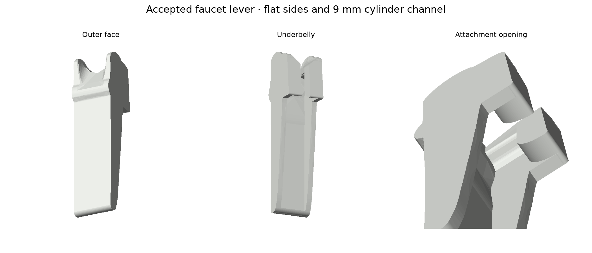
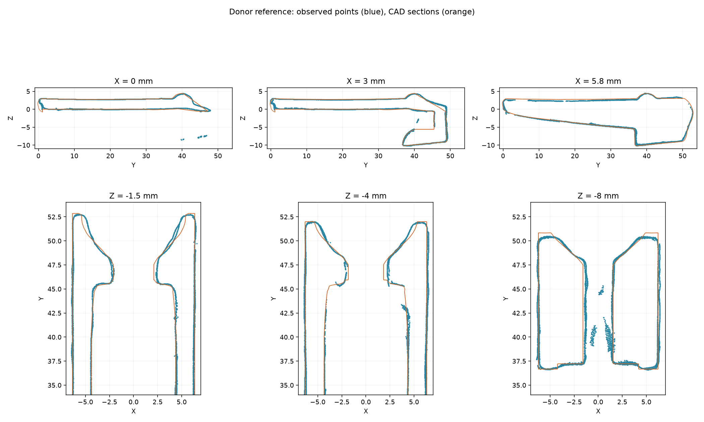

# Faucet lever comparison replica

A scan-derived, editable close-copy prototype of the donor lever for comparing
PET-GF fit and strength with Faucet's replacement design. The part is one
closed solid. Its attachment, operating travel and strength require a physical
print reading. It is separate from the production faucet assembly.



## Files

| File | Use |
|---|---|
| [lever_replica.py](lever_replica.py) | Editable CadQuery construction and fit-trial parameters |
| [lever-replica.step](lever-replica.step) | Analytic solid in the local part frame |
| [lever-replica.stl](lever-replica.stl) | Closed printable mesh in that same frame |
| [lever-replica-side-down.stl](lever-replica-side-down.stl) | Right side on the print bed |
| [lever-replica-petgf.3mf](lever-replica-petgf.3mf) | One lever using the shared PET-GF settings and +0.18 mm Z trim |
| [lever-replica-petgf-white.3mf](lever-replica-petgf-white.3mf) | The same lever at +0.04 mm Z trim, for Mark2 |
| [lever-black-petgf-z018-h2c.gcode.3mf](lever-black-petgf-z018-h2c.gcode.3mf) | Exact native sliced archive submitted to H2C |
| [lever-white-petgf-z004-mark2.gcode.3mf](lever-white-petgf-z004-mark2.gcode.3mf) | The same, submitted to Mark2 |
| [print-jobs.json](print-jobs.json) | Printer acceptance, physical material/nozzle and job hashes |
| [scan-fit.json](scan-fit.json) | Observed-point/CAD distances, normals and mesh validity |
| [contact-datums.json](contact-datums.json) | Partial metal-cylinder fit and its scan-frame transform |
| [evidence/datums.json](evidence/datums.json) | Rigid transform from lever scan coordinates to CAD |
| [evidence/sources.json](evidence/sources.json) | Source hashes, point counts and coordinate frames |

The STEP, STL and viewer payload are generated by the part's own source. The
compressed evidence arrays retain all 369,385 fused lever points, 1,702 selected
interior points, and 202,391 Touch-Flo contact points, with their normals. Each
NPZ contains `points` and `normals` arrays in millimetres. Lever arrays are in
the local CAD frame; the Touch-Flo array is in its independent scan frame.
The scans are observations with missing surfaces, not printable closed solids.

## Frame and dimensions

X is lateral. +Y runs from the paddle tip toward the attachment, which is aft
when installed. +Z points toward the broad outer face. Z=0 is fitted to the
inner paddle plane. The Y origin is the measured forward-tip tangent and X=0
is between the fitted side planes. Matrices use homogeneous column vectors:
`local = T @ [scan_x, scan_y, scan_z, 1]`. Normals use only the rotation.

| Feature | Observation | Replica construction |
|---|---|---|
| Overall envelope | About 53 × 13 × 15 mm | 53.03 × 12.85 × 14.66 mm mesh bounds |
| Paddle floor thickness | Approximately 2.75–2.95 mm | Measured outer profile over the inner Z=0 plane |
| Outside width | Drafted: 12.77 mm at Z=0, 12.64 mm at the cylinder's seat, 12.55 mm at the ledge | `OUTER_HALF_AT_Z0` and `OUTER_DRAFT`, 1.11° per side |
| Main inner channel | Drafted: 8.86 mm at Z=0, 8.69 mm at the cylinder's seat, 8.56 mm at the ledge | `CHANNEL_HALF_AT_Z0` and `CHANNEL_DRAFT`, 1.53° per side. The printable body departs here: parallel `CHANNEL_PRINTED_WIDTH` |
| Side wall | 1.95 mm at Z=0, 1.99 mm at the ledge | A consequence of the two drafts, not an imposed figure |
| Channel convergence | Straight to Y≈40, then in to 8.06 mm by Y=44.75; reaches the cylinder's 8.5 mm span at Y=42.3 | Measured `CHANNEL_CONVERGENCE` offsets |
| Selected rear-stop patches | Two observed curved walls near Y=45.4 mm, X≈±3.3 mm | Editable mirrored `STOP_TAIL` |
| Lower central slot | Narrower than the upper pocket; widens with Z | 2.9–4.4 mm across the loft stations |
| Ledge's forward lip | Observed curved surface near Y=37–40.5 mm | Three-point arc |
| Ledge's rear upper face | Occluded behind the forward lip | Inferred `LEDGE_TOP = -5.55` mm |
| Transverse metal cylinder | Partial coated surface, robust fit Ø≈4.59 mm | Evidence datum only; no fixed hinge introduced |

Bilateral symmetry, sharp side-perimeter edges and the transitions between
measured relief sections are deliberate simplifications. Both drafts are read
from the scan's pooled left and right surfaces over the straight run and are
applied symmetrically; the left and right draft angles differ by about half a
degree in the scan, which is not reproduced. The channel's convergence is read
at the cylinder's seat height and applied at every height, though the scan shows
it is stronger low in the channel than high. `LEDGE_TOP`, the stop tail and the
relief stations remain exposed for fit adjustments.

The cylinder fit accepts 6,099 of 7,151 candidate points after residual trimming;
its accepted radial residual is about 0.14 mm at the 95th percentile. It does not
measure the cylinder's end-to-end span. Its frame origin is on the fitted axis
at an inspection-plane station, **not a measured lateral midpoint**. The central
protrusion is not represented by that cylinder primitive; retain the complete
Touch-Flo cloud when checking clearance.

## Agreement with the scans

The selected critical patches have a median point-to-CAD distance of 0.079 mm,
95th percentile 0.224 mm and maximum 0.787 mm. 98.0% of their nearest CAD normals
agree within the dot-product threshold 0.7. A deterministic 24,000-point sample
of the complete observed lever has a median distance of 0.085 mm and 95th
percentile 0.362 mm. These are one-sided surface distances: they cannot validate
the inferred ledge surface or other geometry absent from the scan.



The selected patches were independently captured twice: their aligned nearest
point distances have 95th percentiles 0.097 and 0.094 mm. This is repeat consistency,
not absolute scanner calibration. The coating thickness is unmeasured. Original
Revo projects, unfilled scan meshes, all passes and processing records remain in
`~/Documents/3D Scans/2026-09-19-faucet-lever/` and
`~/Documents/3D Scans/2026-09-19-touch-flo-interface/`. Registration and repeatability
records are also retained in [evidence/](evidence/).

## Attachment and operating constraint

Derek's observed assembly sequence is the mechanism authority:

1. Remove the tube. Place the lever aft of its final position and lower it in Z.
2. Slide the lever forward around the metal cylinder until the light snap seats.
   Without the tube it should resist shaking loose but remain easy to remove.
3. Insert the tube. The tube prevents aft disengagement and retains the operating
   pivot/contact arrangement. With the tube absent, pressing the lever makes it
   slide aft off the metal cylinder.

The two separately scanned parts do **not** establish an assembled rigid pose,
the tube-contact location, plunger stroke or force. `assembled_lever_transform`
is explicitly null. The production model's nominal pivot and 18° animation are
not measurement datums for this replica. Inserting the production nominal pose
would conceal this uncertainty. Faucet can use the local solid, retained surfaces
and transforms for its next placement/fit check.

## PET-GF comparison print

The project takes its process and filament settings directly from the shared
[`petgf.3mf`](../../petgf.3mf), with Derek's +0.18 mm Z trim. Its H2C left
0.4 mm profile uses 265 °C first layer / 280 °C later, 80 °C Textured PEI,
0.24 mm layers, a 0.20 mm first layer, two walls, 15% grid infill and 0.9555
flow ratio. The physical setup is black PET-GF and a 0.4 mm diamond PCD nozzle.
The single external spool uses the saved PET-CF mapping for PET-GF. The trim
adds to the stock Textured PEI compensation, producing `G29.1 Z0.16` in the
submitted G-code.

The right side is on the bed. The broad outer face is vertical and has no labelled
support-interface contact. The offline slice has one bed-rooted support body
and three labelled contact islands, in the channel/head/rear relief. Remove these
through the open channel and attachment mouths with the tube absent. Physical
support removal and mating-surface finish remain print checks.

Bambu Studio's native slice estimates **16 min 38 s and 4.04 g**, including the
saved startup sequence and supports; grams use its saved density. Printer acceptance
does not establish successful printing, fit or strength. The exact project/STL
hashes and slice are recorded in [the print report](lever-replica-petgf.print.json),
[readiness record](lever-replica-petgf.readiness.json),
[support audit](lever-replica-petgf.support-audit.json) and
[print job record](print-jobs.json).

Two prints preceded this geometry. The first, at a modelled parallel 8.60 mm
channel, measured 8.4 mm and the cylinder would not enter. The second widened the
channel but narrowed the outside to 12.40 mm on a mistaken reading of the donor,
and is 0.4 mm narrow with 1.70 mm walls. Neither is a width comparison; the
second is still a usable check of whether the cylinder enters at all.

A caliper across this part reads a different number at every height on the
outside. Compare a width to the table above at the height it was taken, not to a
single figure.

## What goes to the printer has no draft on either lateral face

The part prints on its side: local X is the print's Z. So the two side faces are
the bed contact and the top surface, and the channel between them is a bridged
gap. A slope survives on none of the three.

- On the channel, the draft closed the gap to 8.47 mm against a cylinder of
  8.42, and it would not enter. A parallel 9.00 mm comes off at 8.8 and does.
- On the outside, a 1.11° draft rests the part on a line rather than a face.
  Derek, on the print it produced: it "makes it unprintable, for all practical
  purposes".

`lever-replica-side-down.stl` is therefore built flat at `PRINTED_OUTSIDE_WIDTH`
and `CHANNEL_PRINTED_WIDTH` — the two widths of the 2026-09-20 channel-fix
print, which printed well and works on the valve. The STEP, the viewer payload
and any assembled pose keep the donor's drafted faces, which is what the scan
reads. Change either printed width only against a print, not against the solid.

For the first complete-part comparison, check the aft/down/forward insertion with
the tube absent, the light retention, the tube's ability to seat, free operating
travel and valve return, and the rising rear arm's shell clearance. Do not infer
strength equivalence from equal shape. Compare both candidate
levers under the same dispensing and repeated-load conditions. An interference
reading should identify the contact face before changing a fit parameter.
Record the tube-installed rest and fully pressed poses relative to the donor's
top-port axis and mounting datum, and identify the bearing surfaces on both the
tube and cylinder. Keep those readings distinct from any apparent hinge axis.
Preserve this close-copy and the intact donor as the comparison controls; fit
adjustments belong to named contact parameters rather than a global scan scale.

## Rebuild

```sh
tools/cad-venv/bin/python hardware/printed-parts/faucet/lever-replica/lever_replica.py
tools/cad-venv/bin/python hardware/printed-parts/faucet/lever-replica/check_replica.py
tools/cad-venv/bin/python hardware/printed-parts/faucet/lever-replica/prepare_print.py
```

`prepare_print.py --slice-output /tmp/lever-comparison-slice` also runs an offline
Bambu Studio slice into an empty directory and writes the submittable archive beside
the project. `--variant` picks the machine: `black-h2c` takes Derek's +0.18 mm Z trim,
`white-mark2` takes +0.04 mm. Both take their process and filament settings from the
shared `petgf.3mf`; the filament colour is physical, on the spool. Neither connects to
a printer — submission goes through Bambu Connect, driven by `tools/bambu-ax`, and is
recorded in `print-jobs.json`.
