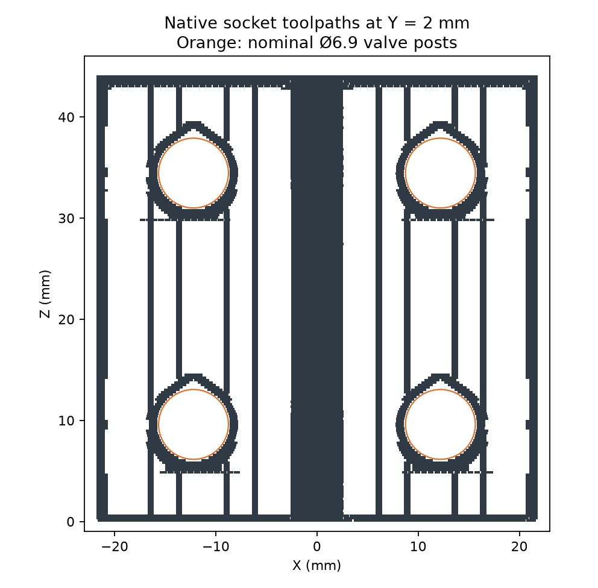

# Beduan valve socket fit coupon

This small panel reproduces the enclosure's four horizontal socket bores, body bearing
face and open port channel. It tests the actual valve against the current production
profile before the large enclosure print.

Derek reports that the existing printed sockets fit pretty well. That is the physical
baseline; the exact prior printed artifact has not been identified. The
[source comparison](physical-baseline.json) records Ø7.1 mm sockets on a 24.4 × 24.4 mm
pattern in the pre-scan source. The coupon uses the measured reference: Ø7.2 mm sockets
on a 24.4 × 24.85 mm pattern, with a 5.2 mm body bearing height and 6.2 mm socket depth.
The [printed coupon is physically accepted](physical-acceptance.json): Derek reports
easy insertion, a perfect fit when used with zip ties, and some retention even when held
upside down with loose shaking. Keep this socket profile. The sockets locate the valve;
zip ties provide positive retention.

The panel is 43.6 × 44.05 × 9.2 mm and prints with enclosure +Z upward. Its socket crowns
use the production teardrop roof. The native slice contains no supports. Five sampled
native valve insertion positions are clear; these samples do not establish continuous
motion or printed retention. [geometry-check.json](geometry-check.json) binds the native
geometry to its source functions and exported artifacts.

The exact job is `valve-socket-fit-black-z004-mark2-v1.gcode.3mf`: approximately
20 minutes, 8.17 g and 184 layers on Mark2, using black PET-GF from the left external spool
(the printer labels it PET-CF). The requested +0.04 mm trim emits `G29.1 Z0` and
`G29.1 Z0.02` with the Textured PEI profile. [print-readiness.json](print-readiness.json)
records the archive, profile and STL hashes. [print-status.json](print-status.json) records
submission and the observed printer state.

The [toolpath review](toolpath-review.json) measures 7.192–7.200 mm openings at the four
socket centers. Post-publication geometry lint reports zero findings on the printed mesh.

The complete valve trays still need a physical check that each tie can be threaded and
tightened without disturbing the valve seating. The number of valves tested and a
separate rocking assessment were not reported. No friction retention force was measured.

This coupon qualifies only the socket and bearing fit. It does not release the cartridge,
tube routes or complete enclosure.
