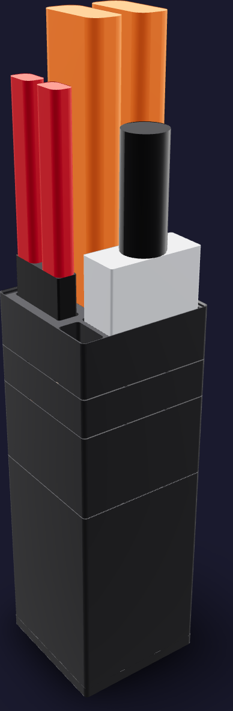
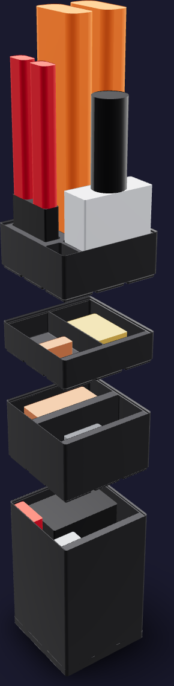
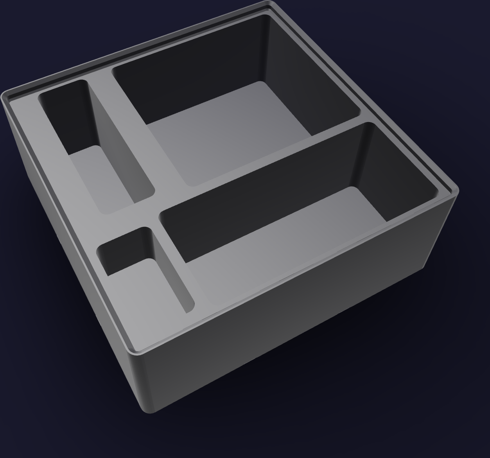

# Copper job kit



A job stack, because the copper is worked in campaigns — one carbonator's coil per
build — so the storeys come off the dock onto the tube bench for the run and go back
when the wind is done. The footprint is [126 mm x 126 mm](FOOTPRINT): one 3 x 3 Gridfinity
module. The printed stack reaches [355.8 mm](PRINTED_HEIGHT), and the Klein bender's
handles set the populated height at [583.0 mm](POPULATED_HEIGHT).

Nothing on this bench lies down. The shortest of the seven pieces is longer than a
storey's clear cavity is wide, so the kit sorts them by how far they reach: the three
that reach past a rack stand head-down in one, and the four that do not stand inside a
quiver the next storey closes over.

The job lives in four storeys, bottom to top:

1. **`copper-quiver`**, [189 mm](QUIVER_HEIGHT) tall and [182 mm](QUIVER_DEPTH) deep, one
   open cell. The Wisscool straightener and the Knipex pliers wrench stand along its
   back, the RIDGID 345's yoke and bar along its front. It is the heaviest storey and
   it carries the stack.
2. **`copper-service`**, [77 mm](SERVICE_HEIGHT) tall, split front to back. The Supco
   D111 filter-drier lies in the back compartment, the BPV31 bullet-piercing valve
   stands in the front one.
3. **`copper-fittings`**, [35 mm](FITTINGS_HEIGHT) tall, split left to right: the
   flare nuts on the operator's left, the slip couplings on the right.
4. **`copper-rack`**, [49 mm](RACK_HEIGHT) tall, a solid lipped blank. Three head-down
   sockets go [40 mm](SOCKET_DEPTH) into its plateau, each [1.5 mm](SOCKET_CLEARANCE)
   larger than its tool's public envelope on every side, and a shallower well takes the
   fitting in play.



## Printed parts

| Output | Quantity | Print orientation | Envelope |
|---|---:|---|---:|
| `copper-quiver.step` | 1 | Gridfinity feet on the bed, cell up | [125.5 x 125.5 x 192.8 mm](QUIVER_PART) |
| `copper-service.step` | 1 | Feet on the bed, compartments up | [125.5 x 125.5 x 80.8 mm](SERVICE_PART) |
| `copper-fittings.step` | 1 | Feet on the bed, compartments up | [125.5 x 125.5 x 38.8 mm](FITTINGS_PART) |
| `copper-rack.step` | 1 | Feet on the bed, sockets up | [125.5 x 125.5 x 52.8 mm](RACK_PART) |
| `copper-dock.step` | 1 | Slab on the bed, baseplate up | [126.0 x 126.0 x 10.8 mm](DOCK_PART) |

Every part fits the H2C left-nozzle [325 x 320 x 320 mm](H2C_ENVELOPE) envelope; the quiver is the
tallest single print. Any 3 x 3 Gridfinity baseplate docks the kit, so
`copper-dock.step` is skipped where the bench already has one.



## Contents map

The label ledge takes [12 mm](LABEL_TAPE) tape; nothing is lettered in the plastic.

**`copper-quiver`** — one open cell, [123.5 mm x 123.5 mm](QUIVER_CELL), [182 mm](QUIVER_DEPTH) deep.

| Where | What | Standing height |
|---|---|---:|
| Back, −X | Wisscool 1/4" handheld tube straightener | [170 mm](WISSCOOL_STANDING) |
| Back, +X | Knipex 86 01 180 Pliers Wrench | [180 mm](KNIPEX_STANDING) |
| Front, −X | RIDGID 345 flaring yoke | [130 mm](YOKE_STANDING) |
| Front, +X | RIDGID 345 flaring bar | [160 mm](BAR_STANDING) |

**`copper-service`** — two full-width compartments, [123.5 mm x 61.1 mm](SERVICE_CELL), [70 mm](SERVICE_DEPTH) deep.

| Where | What |
|---|---|
| Back (−Y) | Supco D111 filter-drier, 1 — the loop-service spare |
| Front (+Y) | Supco BPV31 bullet-piercing valve, 1 — one per appliance |

The drier stands taller than the label ledge's underside, so it sits back from the +Y
end of its compartment by the ledge's whole width.

**`copper-fittings`** — two full-depth compartments, [61.1 mm x 123.5 mm](FITTINGS_CELL), [28 mm](FITTINGS_DEPTH) deep.

| Where | What |
|---|---|
| −X | Joywayus brass 1/4" SAE 45° flare nuts, [5](FLARE_NUT_COUNT) |
| +X | 1/4" OD ACR copper slip couplings, sweat x sweat, [10](COUPLING_COUNT) |

Each compartment's fill is modelled as one block sized from the pack count and the
part: the nuts three deep by two across, the couplings five by two, both standing.

**`copper-rack`** — three head-down sockets and one well.

| Where | What | Socket |
|---|---|---:|
| Back, −X | Klein Tools 51006 3-in-1 tube bender | [76.7 x 71.6 mm](KLEIN_SOCKET) |
| Front, spanning | RIDGID 150 constant-swing tubing cutter | [91.9 x 41.1 mm](RIDGID_150_SOCKET) |
| Back, +X | Mastercool 70025 cap-tube cutter | [21.0 x 68.0 mm](MASTERCOOL_SOCKET) |
| Front, +X | The flare nut or coupling in play | [20 x 36 mm, 20 mm deep](PARTS_WELL) |

Out of the kit, on the tube bench's own shelf: the BCuP-5 rod and the 3M 425 foil
roll, both longer and larger than the footprint; the 3M Scotch-Brite maroon pads at
6" x 9"; the Supco SUD8358 drier, whose published [222 mm](SUD8358_LENGTH) length beats
the [174.7 mm](CAVITY_DIAGONAL) diagonal of a storey's cavity; and the GOORY 50 ft copper roll, which is
stock rather than kit. Every tool in this kit belongs to the tube bench alone.

## Geometry sources

The station card is [`tb-tube-bench.html`](../../../assembly/cards/tools/tb-tube-bench.html);
the operations are [CC-01](../../../assembly/cards/cc-01-wind-coil.html),
[RL-03](../../../assembly/cards/rl-03-argon-and-cut.html) and
[RL-05](../../../assembly/cards/rl-05-pinch-swage.html), and the procedures are
[`cold-core.md`](../../../assembly/cold-core.md) §1 and
[`refrigerant-loop.md`](../../../assembly/refrigerant-loop.md). What is on hand is
recorded in [`tools.md`](../../../ledger/tools.md) "Refrigeration assembly",
[`purchases.md`](../../../ledger/purchases.md) §6 and
[`bom.md`](../../../ledger/bom.md) §5.

- The 42 x 42 x 7 mm modular interface, the base profile, the stacking lip and the
  12 mm label ledge follow the
  [Gridfinity specification](https://github.com/gridfinity-unofficial/specification)
  through the MIT-licensed
  [`cq-gridfinity`](https://github.com/michaelgale/cq-gridfinity) CadQuery library.
  Every storey is one of its stock bodies; the only cut geometry in the kit is the
  rack's four pockets.
- **Klein Tools 51006 bender**, [266.7 x 73.7 x 68.6 mm](KLEIN_ENVELOPE): the maker's
  [51006 catalogue page](https://www.kleintools.com/catalog/tube-benders/3-1-tubing-bender)
  publishes 10.5 x 2.9 x 2.7 in overall. The shoe's own outline is not published, so the
  socket takes the whole cross-section.
- **RIDGID 150 tubing cutter**, [190.5 x 88.9 x 38.1 mm](RIDGID_150_ENVELOPE): RIDGID publishes only the
  cutter's capacity and weight, so the envelope is the 7.5 x 3.5 x 1.5 in on the
  [B0009W6T8G](https://www.amazon.com/dp/B0009W6T8G) listing, which is a package and is
  therefore generous.
- **Mastercool 70025 cap-tube cutter**, [220 x 65 x 18 mm](MASTERCOOL_ENVELOPE): MASTERCOOL
  publishes no dimensions and the [B00NY1YHHE](https://www.amazon.com/dp/B00NY1YHHE)
  listing carries a shipping carton, so this is a declared generous envelope for a 104 g
  hand nipper.
- **Knipex 86 01 180 Pliers Wrench**, [180 x 46 x 15 mm](KNIPEX_ENVELOPE): KNIPEX's own catalogue
  figures — 180 mm long, 46 mm head width, 15 mm thick, 230 g.
- **Wisscool 1/4" straightener**, [170 x 100 x 65 mm](WISSCOOL_ENVELOPE): the
  [B0F6BPTW3T](https://www.amazon.com/dp/B0F6BPTW3T) listing publishes only a
  [178 x 153 x 77 mm](WISSCOOL_PACKAGE) package for model PT-14, so this is a declared generous
  envelope inside it.
- **RIDGID 345 flaring tool**, bar [160 x 45 x 30 mm](BAR_ENVELOPE) and yoke
  [130 x 70 x 40 mm](YOKE_ENVELOPE): the maker's
  [345 catalogue page](https://www.ridgid.com/us/en/345-manual-flare-tool) publishes the
  set's 2.75 lb and its 3/16"–5/8" capacity and nothing else; distributor listings
  publish a 6-1/4 in overall length. Both pieces are declared generous envelopes on that
  length, and 2.75 lb of steel is a fraction of what they bound.
- **Supco D111 filter-drier**, [88.9 x 63.5 x 38.1 mm](D111_ENVELOPE): the
  [B00DM8KGXS](https://www.amazon.com/dp/B00DM8KGXS) listing states the drier's size in
  its own title, 1.5 x 2.5 x 3.5 in.
- **Supco BPV31 bullet-piercing valve**, [50.8 x 50.8 x 44.45 mm](BPV31_ENVELOPE): distributor spec
  tables publish 2 x 2 x 1-3/4 in for [B00DM8J3MI](https://www.amazon.com/dp/B00DM8J3MI),
  and the valve needs 2 in of clearance to operate.
- **1/4" ACR slip coupling**, [7.5 mm OD x 16 mm](COUPLING_ENVELOPE): the
  [B0FH549N6D](https://www.amazon.com/dp/B0FH549N6D) listing states 6.3 mm bore, 16 mm
  long, 0.6 mm wall.
- **Joywayus 1/4" SAE 45° flare nut** on a 7/16"-20 thread,
  [B0G1XJ2F68](https://www.amazon.com/dp/B0G1XJ2F68): the listing publishes the thread
  and the pack of five and no dimensions, so each nut is a generous 20 mm cube.

No caliper measurements are inputs to this model. Every stored thing is a
public-envelope fit reference, not a cosmetic replica.

## Build and print

Generate the STEP parts, the presentation assemblies and this file's figures from the
repository root:

```sh
tools/cad-venv/bin/python \
  hardware/printed-parts/shop-storage/copper/copper_kit.py
```

The kit prints in Bambu PETG Basic black from the AMS 2 Pro on the H2C's right hotend,
like every kit in [`shop-storage/`](../README.md). Keep the exported orientations and
leave supports off: every storey prints base down on the library's own printable base
and lip profiles, and all four rack pockets open upward.

## CAD status

The generator asserts one solid per printed part, the H2C build envelope, all four
seated interfaces of the column, every rack socket inside the blank's plateau, all eight
stored envelopes against the compartment voids that hold them, and the three rack tools'
clearance from the printed body. Every check reports zero: no interface overlap or gap,
nothing outside its compartment, no tool touching the rack.

STL tessellations of all five parts return sixteen geometry-lint findings, every one of
class `sliver`. Six are zero-area facets the mesher leaves at the label-ledge and
base-chamfer junctions; the other ten are the 1.2 mm top rim of the library's own
stacking lip — the surface a storey above seats on. `copper-rack` and
`copper-dock` return none. Physical fit has not yet been print-verified.

## Sources
[value](NAME) texts are updated by:
- `/hardware/printed-parts/shop-storage/copper/copper_kit.py`
