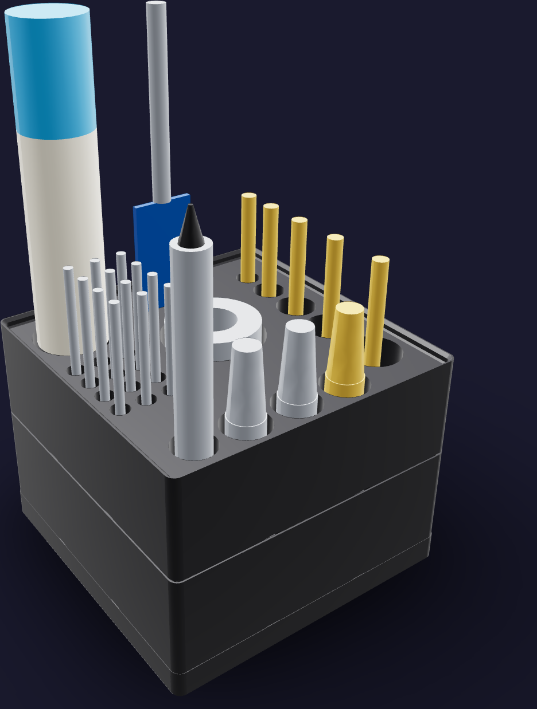
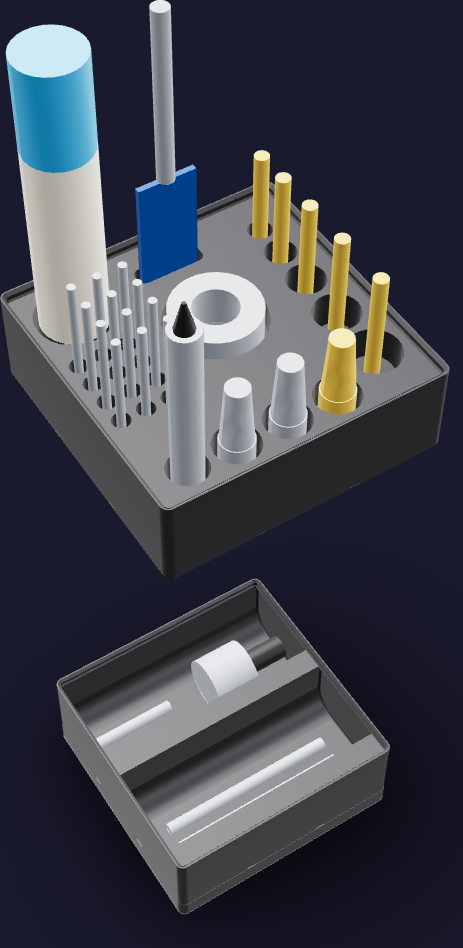

# Drill-press job kit



A job stack, because the end-plate work at the WEN 4208T runs as a campaign — both
316L plates take all three operations in one sitting, so the storeys come off the dock
and stand open beside the press while the chuck changes three times.

The footprint is [126 mm x 126 mm](FOOTPRINT): one 3 x 3 Gridfinity module. The printed
kit stands [93.6 mm](PRINTED_HEIGHT) on its dock; the deburr tool's grip sets the
populated height at [213.2 mm](POPULATED_HEIGHT).

The job lives in two storeys:

1. **`drill-press-saw`** — an open bin split fore and aft. The Mollom hole saw's arbor
   lies across the aft cell, its two pilot drills across the forward one. The bin is
   six height units deep because the arbor's hub, lying on its side, is the tallest
   thing in the kit that is not standing up.
2. **`drill-press-index`** — the job rack, a lipped blank with
   [24](SOCKET_COUNT) sockets cut from its [120.3 mm x 120.3 mm](RACK_PLATEAU) plateau.
   It reads left to right in the order of the three operations: the five countersinks
   of PV-01 down the left edge, largest at the operator's hand; the three 1/4"-18 NPT
   taps and their spring guide across the front for PV-02; the twelve 9/64" register
   drills in a 3 x 4 index at the right for PV-03. The round die lies flat in the
   middle, the spade bit stands in a slot behind it, and the deburr tool stands in the
   back-right well.

Every socket is [2.0 mm](SOCKET_CLEARANCE) larger than its tool's public envelope on
every side and [32.0 mm](SOCKET_DEPTH) deep, so a tool drops in and lifts out without
being aimed. Nothing is lettered in the plastic; the contents map below is the label,
and the bin carries the library's own ledge for tape.

## Printed parts

| Output | Quantity | Print orientation | Envelope |
|---|---:|---|---:|
| `drill-press-dock.step` | 1 | Flat face on the bed; Gridfinity recesses up | [126.0 x 126.0 x 10.8 mm](DOCK_ENVELOPE) |
| `drill-press-saw.step` | 1 | Gridfinity feet on the bed; cells up | [125.5 x 125.5 x 45.8 mm](SAW_ENVELOPE) |
| `drill-press-index.step` | 1 | Gridfinity feet on the bed; sockets up | [125.5 x 125.5 x 45.8 mm](INDEX_ENVELOPE) |

Both storeys are the same height, so the kit is two equal blocks on its dock. Every
part fits the H2C left-nozzle [325 x 320 x 320 mm](H2C_ENVELOPE) envelope; the rack is
the [45.8 mm](TALLEST_PART) tallest single print. Any 3 x 3 Gridfinity baseplate docks
the kit, so the dock is only printed where the bench has none.



## Contents map


**`drill-press-saw`**, two cells, each [123.5 x 61.1 x 35.0 mm](SAW_CELL):

| Cell | Holds |
|---|---|
| Aft (−Y) | Mollom hole-saw arbor, pilot drill fitted — [30 mm x 115 mm](ARBOR_ENVELOPE) lying along X |
| Forward (+Y) | The set's two pilot drills, [6.5 mm x 95 mm](PILOT_ENVELOPE) each, lying along X |

**`drill-press-index`**, the rack, read from the operator's side:

| Zone | Sockets | Holds |
|---|---:|---|
| Left edge, front to back | 5 | JNB Pro 82° countersinks, [6.35 / 9.52 / 12.70 / 15.88 / 19.05 mm](COUNTERSINK_HEADS) heads down, 1/4" shanks standing — the 3/4" body PV-01 calls for is the one nearest the hand |
| Front row | 3 | LingGan M35, Drill America DWT64006 and the tap-and-die kit's 1/4"-18 NPT taper taps, shanks down, tapers up |
| Front row, right end | 1 | Brown & Sharpe spring tap guide, shank down |
| Centre | 1 | Drill America 1-1/2" OD round adjustable NPT die, lying flat and standing [6.0 mm](DIE_PROUD) proud to be pinched out |
| Back centre | 1 | Bosch DSB1013 spade bit, paddle down in a slot |
| Right, 3 x 4 index | 12 | Drill Hulk 9/64" M35 cobalt jobber drills, points down |
| Back-right well | 1 | Noga NG8150 deburr tool, blade down, grip standing |

The thinnest plastic between any two sockets is [3.0 mm](MIN_SOCKET_WALL).

**What is not in the kit.** The Mollom hole saw's own cup cuts
[123.8 mm](HOLE_SAW_CUT) and a 3 x 3 cell is [123.5 mm](SAW_CELL_WIDTH) across, so it is
[2.3 mm](HOLE_SAW_SHORTFALL) too wide once its clearance is counted: the arbor and
pilots live here and the saw hangs by the press. The Tap Magic EP-Xtra 16 oz bottle is
[69.8 mm x 203.2 mm](TAP_MAGIC_ENVELOPE); a well for it takes
[30 %](TAP_MAGIC_WELL_SHARE) of the rack's plateau, which the index needs, and at
[203.2 mm](TAP_MAGIC_HEIGHT) tall it could stand nowhere but the top storey — the
bottle stays on the press table where every cut reaches for it. The Drill America DWT
tap wrench ([483 mm](TAP_WRENCH_LENGTH)) and the MOTOKU die handle
([315 mm](DIE_HANDLE_LENGTH)) are both longer than the footprint.

The Noga NG8150 has a second home: it also breaks the 316L tube ends at
[`pressure-vessel.md`](../../../assembly/pressure-vessel.md) step 3.

## Geometry sources

The on-hand inventory is [`tools.md`](../../../ledger/tools.md) "Carbonator
fabrication" and [`purchases.md`](../../../ledger/purchases.md); the bench card is
[`dp-drill-press.html`](../../../assembly/cards/tools/dp-drill-press.html) and the
operations are cards PV-01, PV-02 and PV-03 of
[`pressure-vessel.md`](../../../assembly/pressure-vessel.md).

- The 42 x 42 x 7 mm module, the base profile, the stacking lip and the label ledge
  follow the
  [Gridfinity specification](https://github.com/gridfinity-unofficial/specification)
  through the MIT-licensed
  [`cq-gridfinity`](https://github.com/michaelgale/cq-gridfinity) CadQuery library.
- **The three 1/4"-18 NPT taper taps** — LingGan M35
  ([B0D7HM5R3C](https://www.amazon.com/dp/B0D7HM5R3C)), Drill America DWT64006
  ([B01DZD1Y9Y](https://www.amazon.com/dp/B01DZD1Y9Y)) and the tap in the Drill America
  tap-and-die kit ([B0DXN1LDKT](https://www.amazon.com/dp/B0DXN1LDKT)) — are one ANSI
  size. [Haas Tooling 03-0462](https://www.haastooling.com/p/03-0462) publishes it:
  [62.0 mm long on a 14.29 mm shank](TAP_ENVELOPE), 0.421" square, 1.06" of thread,
  4 flutes. The socket clears the square across its corners.
- **The round die** in the same kit is stated 1-1/2" OD. Its thickness is nowhere
  public, so [38.1 mm OD x 18 mm](DIE_ENVELOPE) is a generous envelope — the
  [MOTOKU handle](https://www.amazon.com/dp/B073ZX58PH) the ledger pairs it with states
  a 38 x 14 mm die capacity, and that handle's own [315 mm](DIE_HANDLE_LENGTH) length
  comes off the same listing.
- **The five countersinks**
  ([B09C4X5R8F](https://www.amazon.com/dp/B09C4X5R8F)) carry their head sizes and their
  1/4" shank in the listing title. Body length is nowhere public, so
  [70 mm](COUNTERSINK_LENGTH) is a generous envelope for all five; only the head
  diameter sets the socket, and every head is swallowed by it.
- **The 9/64" register drills**
  ([B07XNNNC5Y](https://www.amazon.com/dp/B07XNNNC5Y)) are M35 cobalt jobber length:
  [3.57 mm x 73.0 mm](DRILL_ENVELOPE) with [44.4 mm](DRILL_FLUTE) of flute, from the
  [jobber-length drill chart](https://drillsandcutters.com/jobber-length-drill-bit-chart/).
- **The spade bit** is Bosch DSB1013,
  [25.4 mm x 152.4 mm](SPADE_ENVELOPE) on a 1/4" hex shank with 3" of paddle, from
  [Bosch's own page](https://www.boschtools.com/us/en/boschtools-ocs/daredevil-standard-spade-bits-dsb1013-34990-p/).
  The paddle's thickness is not published; the slot takes a generous
  [2.5 mm](SPADE_PADDLE).
- **The spring tap guide** is Brown & Sharpe 599-792-30
  ([B005317ZMC](https://www.amazon.com/dp/B005317ZMC)), whose 1/2" case-hardened body
  is published and whose length is not: [12.70 mm x 115 mm](GUIDE_ENVELOPE) is a
  generous envelope.
- **The deburr tool** is the Noga NG8150 promo set, whose handle is the
  [NogaGrip-1 (NG1000)](https://www.noga.com/product/ng-1-handle/) at
  [28 mm x 125 mm](NOGA_ENVELOPE). What the S10 blade holder adds past the handle is
  not published; the model carries a generous [30 mm](NOGA_NOSE) nose, which is what
  sets the populated height.
- **The hole-saw set** ([B0BZQ4J5B1](https://www.amazon.com/dp/B0BZQ4J5B1)) publishes a
  [123.8 mm](HOLE_SAW_CUT) cut, [38 mm](HOLE_SAW_DEPTH) of cut depth and an 11 mm arbor
  shank. The arbor's hub and length and the pilot drills are nowhere public, so both are
  generous envelopes.
- **The Tap Magic EP-Xtra 16 oz spout-top bottle**
  ([B00DHMHSGM](https://www.amazon.com/dp/B00DHMHSGM)) is listed 2.75 x 2.75 x 8 in.
- **The tap wrench** is Drill America DWTTW7
  ([B00DMEYTLW](https://www.amazon.com/dp/B00DMEYTLW)); its 19" overall length is
  published by [Hanes Supply](https://www.hanessupply.com/qualtech-dwttw7).

No caliper measurements are inputs to this model. Every tool witness is a
public-envelope fit reference, not a cosmetic replica.

## Build and print

Generate the STEP parts, the two presentation assemblies and this README's figures from
the repository root:

```sh
tools/cad-venv/bin/python \
  hardware/printed-parts/shop-storage/drill-press/drill_press_kit.py
```

The kit prints in Bambu PETG Basic black from the AMS 2 Pro on the H2C's right hotend,
like every kit in [`shop-storage/`](../README.md). Both storeys print base down with no
supports: every socket opens upward, the bin's scoops and label ledge are the library's
own printable profiles, and the rack has no overhang but the stacking lip the library
draws on every bin.

The rack is a solid blank with its sockets cut out, so the slicer's infill decides its
mass — print it at the same sparse infill as any Gridfinity bin rather than solid.

## CAD status

The generator asserts one solid per printed part, the H2C build envelope, both seated
interfaces of the column, that every rack socket lands inside the plateau a lipped
blank offers, that no socket wall is thinner than [3.0 mm](MIN_SOCKET_WALL), that every
socket floor stands on the rack's own material rather than on the storey below, the
clearance of all [24](SOCKET_COUNT) tool envelopes against the rack, the containment of
the arbor and both pilot drills in their cells, and that the hole saw's cut still
exceeds a 3 x 3 cell. STL tessellations of the dock and the rack return no geometry-lint
findings; the bin returns two [1.2 mm](LIP_SHELF) slivers, which are the top face of
the library's own stacking lip — a stock 3 x 3 labelled bin returns the same face.
Physical fit has not yet been print-verified.

## Sources
[value](NAME) texts are updated by:
- `/hardware/printed-parts/shop-storage/drill-press/drill_press_kit.py`
